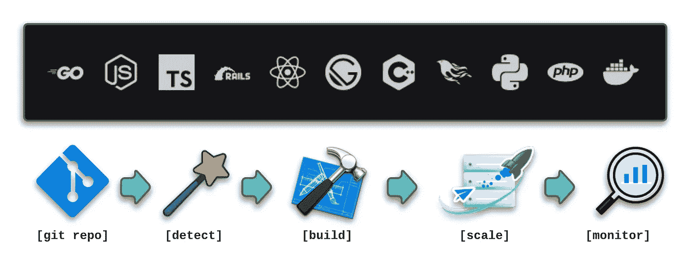
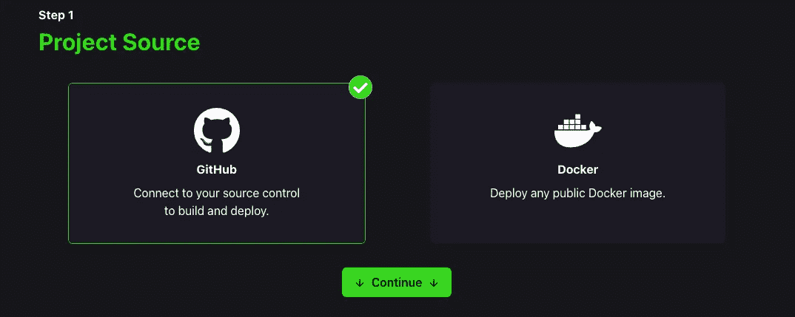
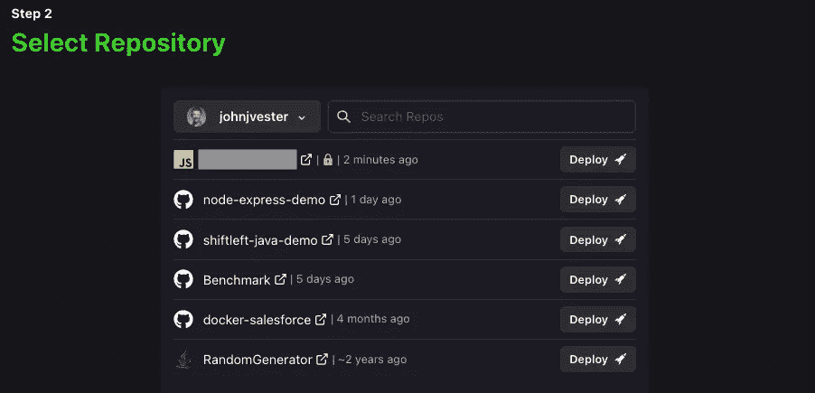
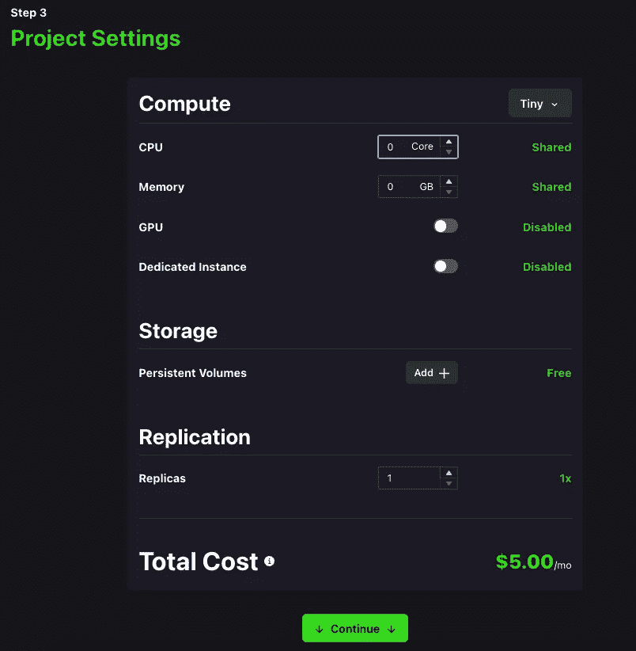
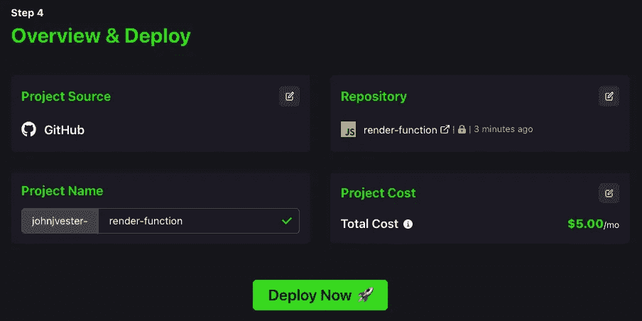
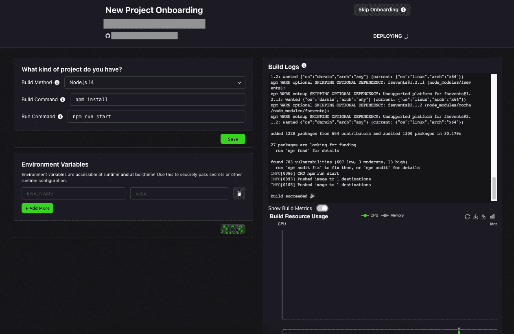
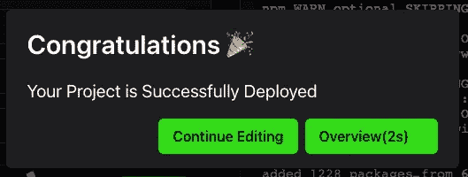
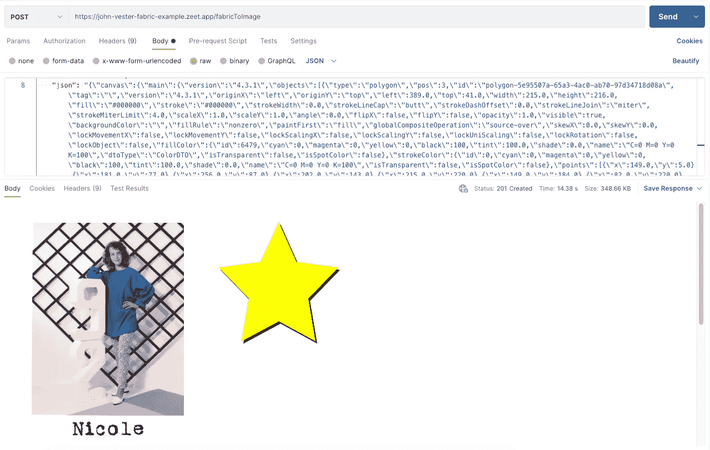

# 使用 Zeet 从 0 到 100 的 DevOps

> 原文：<https://medium.com/nerd-for-tech/0-to-100-your-devops-using-zeet-16ba200a2cb3?source=collection_archive---------3----------------------->

我的妻子(Nicole)陪伴了我好几年，看着我构建、设计和开发应用程序。她见证了从鸡尾酒餐巾纸中产生的想法成为我作为自由作家写的数百篇文章的一部分。当我为 Nicole 的母亲和双胞胎姐姐设计相当成功的应用程序时，她也在。

她也是我们家的装修工。我的桌子上方是她做的一个非常酷的提醒，简单地说“一切从一个想法开始。”为了帮助你想象这幅作品，我用我的智能手机拍了一张照片:

这个标志是我每天都会看到的，它继续激励我更深入地提供最好的解决方案和出版物。

今年早些时候，我有幸和一个叫约翰尼·达拉斯 [(@_johnnydallas_](https://twitter.com/_johnnydallas_) )的家伙聊了聊。我相信你没有听说过他…至少现在还没有。

# 介绍强尼·达拉斯

约翰尼在高中时就开始了他的科技职业生涯。他为 AWS 写了很多 YAML，在那里他是亚马逊最年轻的工程师。虽然他在那段时间里获得了大量的 DevOps 知识，但他被要求花费大部分时间在 YAML 手工创建数据序列化文件。

很快，Johnny 意识到，他的时间用在创建能够自动执行他被要求手动执行的任务的流程上会更好。结合他对 DevOps 行业空间的内在动力和不断增长的热情，一家名为 Zeet 的公司成立了。

# 介绍 Zeet

[Zeet](https://zeet.co/) 旨在自动执行重复性开发任务，因此 Zeet 生态系统的用户可以专注于他们独特解决方案的主要目标。这导致 Zeet 的主要任务是“帮助每个团队像顶级科技公司一样部署。”

这意味着 Zeet 可以处理您需要的一切，从基于代码的存储库到可监控的已部署和可扩展的应用程序，如下图所示，Zeet 自动化了五个步骤:

## 1.带上你的代码

Zeet 提供了对 10 种流行语言的支持，以及 Docker 容器中存在的几乎所有东西——前提是有一个基于 git 的存储库、Dockerhub 映像或任何可以利用的 Helm 图表。代码只需能被 Zeet 服务访问。

## 2.让 MagicDetect 分析您的代码

检测阶段可以是手动的，也可以由称为“MagicDetect”的东西来完成，它分析底层源代码，以确定哪些受支持的代码库将用于剩余的处理。使用“MagicDetect”允许 Zeet 更好地配置构建、缩放和监控方面。

## 3.建设

确定了源应用程序代码并定义了一些基本元素后，Zeet 服务将自动构建您的应用程序，而不必担心设置 CI 工具，如 AWS CodeBuild、CircleCI、Jenkins 和 Travis CI。

## 4.部署和扩展

一旦建立，应用程序可以部署和扩展到云计算服务提供商，如 AWS，GCP 和数字海洋。该应用程序可以自动扩展，利用像 Kubernetes 和 Terraform 这样的可信技术。

## 5.监视

最后，应用程序被配置用于监控，预构建的接口可用于以下技术:AWS CloudWatch、Datadog、Dynatrace、PagerDuty 和 Pingdom。

# 第一次使用 Zeet

现在让我们来看看 Zeet 是如何将我的项目从一个简单的 git repo 转变为一个完全部署、扩展和监控的应用程序的，我不需要付出任何努力。

最初，我使用一个现有的基于 git 的存储库来测试 Zeet。然后，我决定从一个真实的 Node.js 应用程序中取出代码，这个应用程序曾经是 AWS 中的 Lambda，以便了解 Zeet 如何处理这种情况。

该应用程序使用一个 [Fabric.js](http://fabricjs.com/) 有效负载，并返回 PNG(图像预览)或专门的 SVG 版本——用于发布目的。因为基于 git 的存储库中的代码不需要任何外部服务，所以使用 Zeet 似乎是一个不错的选择。

代码作为私人项目上传到我的 GitHub 账户:

开始免费试用 Zeet 生态系统只需要一个 GitHub 帐户和以下 URL:

https://zeet.co/new

## 选择项目源

我决定使用我的 GitHub 帐户登录，并选择 GitHub 作为我的项目的源。

## 选择存储库

新建 Zeet 项目的第二步是选择我希望使用的存储库:

将 Zeet 配置设置为访问公共和私有存储库后，我选择了我的 Node.js(私有)存储库——出于保密目的，其名称被隐藏了。

## 配置项目设置

在第三步中，我能够为我的示例应用程序选择最小(例如微小)的环境:

## 部署项目

最后一步是部署应用程序，它出现在以下摘要屏幕中:

点击“Deploy Now”按钮后，Zeet 生态系统就控制了整个过程，执行所有必要的步骤来提供我的定制 Node.js 服务。

在几分钟内(其中大部分时间用于运行 npm install 命令),部署过程就完成了:

Zeet 甚至提供了一个不错的祝酒辞来确认这个过程的成功完成:

## 验证应用程序

随着应用程序的部署，我能够使用 [Postman](https://www.postman.com/) 向服务提交请求:

生成了下面的图像:

就是这样！

当我想到我的项目团队使用主要云服务提供商的原生工具达到这一点所需的时间时，我震惊地意识到 Zeet 允许我(零 DevOps 经验)在 30 分钟内到达相同的目的地。

# 结论

Johnny 践行着“一切从一个想法开始”的口号，这表明了他是如何推动 Zeet 提供强大的解决方案的。事实上，在与他交谈后，我认为他在人生的这一点上真正地“实现了梦想”。拥有一个完整的团队让 Zeet 在这个技术提供商的空间里成为一个值得记住的名字。

我已经写了许多关于技术和模式的出版物，这些技术和模式使软件工程师能够专注于满足他们的业务需求。我一贯指导我的客户问自己“如果我们承担这个责任，这将如何提高我们的底线？”我的问题的要点是确保特性团队忠实于满足业务需求的使命。

Zeet 是一个清晰的例子，说明了如何像苹果、脸书和谷歌一样部署、扩展和监控基于 git 的应用程序，而无需雇佣一群 DevOps 工程师。当然，Zeet 是当今软件工程和开发世界中值得考虑的解决方案。

从定价的角度来看，在发布时，Zeet 有三个基本的服务等级:

*   基本—入门级，允许部署到单个亚马逊/谷歌地区
*   Pro —向多达三个亚马逊/谷歌地区添加 API 访问、个性化支持和部署
*   企业—提供超过 99 个 pop 的多云部署、优先支持和正常运行时间 SLA

有关其他信息，请访问以下 URL:

【https://zeet.co 号

祝你今天过得愉快！