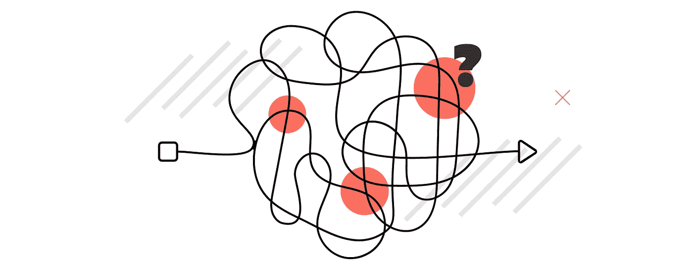

# 每个初学者都应该知道的 10 个 UX 坏例子

> 原文：<https://medium.com/nerd-for-tech/10-bad-ux-examples-every-beginner-should-know-c5eaba8c1a8b?source=collection_archive---------12----------------------->

ver 最终在一个应用的社区支持论坛中寻求答案，却发现其他用户和你一样迷茫？如果是，你很可能是坏 UX 的受害者。你会发现很多糟糕的 UX 设计案例，甚至有些是由知名设计师创作的。你还会发现大多数主流应用的 UX 都很差，不能给用户提供预期的体验。您还会发现其他一些不符合目的的糟糕用户体验的例子。 [Wondershare Mockitt](https://bit.ly/3ewCXuz) 为你提供了 10 个糟糕的 UX 案例，以及它们失败的原因。

# 1.WhatsApp 的删除信息功能

WhatsApp 是顶级聊天应用之一，拥有顶级的 UX 和组织有序的界面。您在使用该应用程序时遇到的一种情况是，您创建了一条要发送给朋友的消息，但不小心发送给了其他人。你可以把它发给一个你不认识的人，甚至是你的同事。这没有问题，因为有一个删除选项。可以删除该消息，并假装您从未发送过该消息。当您删除该邮件时，您会发现一组邮件显示“您已删除此邮件”。

## **为什么是坏 UX？**

通知收件人，你删除了一封邮件，就违背了当初删除它的理由。这使它看起来更可疑，并可能会提示一个回答，如你为什么删除邮件？没有必要让这种事情发生。该消息应该在其他人不知道有消息发送给他们的情况下被删除，但是被删除了。该应用程序所做的就像阻止消息，但不删除它。

# 2.网飞悬停自动播放

这项网飞自动播放功能自 2015 年推出以来一直困扰着用户。如果你碰巧悬停在电影或电视上，缩略图通常会自动播放蒙太奇或循环预告片。这意味着，如果你想看到你悬停或点击的节目的信息或细节，没有响亮的预告片播放你就无法做到这一点。

## **为什么是坏 UX？**

auto-everything 通常表明设计者已经假设了很多关于用户需求的事情。如果你的注意力在别的地方，任何有自动音频的东西都会让人分心。它让你在鼠标停留的地方做很多工作，这样你就不会触发自动播放。UX 的主要问题是音频，默认情况下不应该设置为“开”。这个功能妨碍了网站的可用性，或者阻碍了用户访问重要信息，这意味着它不应该出现在那里。

# 3.瑞安航空的预订平台

如果你是瑞安航空公司的常旅客，你可能对其预订平台有过不愉快的经历。没人想到预订周末外出会引发很多问题。它的预订界面可以说是一个糟糕的 UX。它有 UX 设计策略，使体验更加混乱和复杂，让用户花更多的钱比他们预期的隐藏附加功能。例如，你发现在一个完全不相关的菜单中隐藏着没有保险的选项。这让你很难找到它。

## **为什么是坏的 UX？**

瑞安航空的预订平台是一个糟糕的 UX 例子，因为它误导和混淆用户选择一些选项而不是其他选项。这样做的主要意图是为了帮助公司获得更多的收入。它把用户流变成一个你必须导航的更复杂的过程，而不是一个你喜欢的简单过程。

# 4.苹果的存储管理系统

在需要用相机捕捉的时间敏感的无价时刻，你需要即时存储这些时刻。这样的时刻可能包括你的孩子第一次走路，或者当你在当地酒店看到你最喜欢的名人。然而，当您收到一条即时消息，告诉您您的存储空间已满，无法拍照时，您会感到失望。这是你从苹果的存储管理系统得到的。

## **为什么是坏 UX？**

这里没有任何迹象表明你/用户有什么选择。最重要的是，系统应该告诉你有多少照片需要删除，以便你可以在那个时候制作新的。它还应该显示需要清除的存储量。没有快照信息，您不太可能去设置进行必要的更改。

# 5.超长下拉

有时你可能会发现从一个无限的下拉列表中选择你的国籍，没有搜索栏的洞察力。如果你来自像英国这样有几个名字的国家，比如大不列颠、联合王国或不列颠，这会造成更多的不便。穿过许多国家去寻找你的是很累的。

## **为什么是坏 UX？**

没有过滤器或副标题的长下拉菜单会消耗你/用户大量的时间，尤其是当你不确定你在找什么的时候。它缺少一个带有自动完成和过滤选项的文本输入字段，这些选项有助于首先缩小列表范围。因为它有十多个选项，所以必须避免下拉。

# 6.这个经典的密码混乱

没有什么比不必要的复杂密码要求更令人沮丧的了。很难记住复杂的密码。这意味着您最终会浪费大量时间来创建新密码来替换旧密码。

## **为什么是坏 UX？**

创建您的密码需要满足一长串要求，这意味着您要花费不必要的时间，白白经历许多麻烦。用户很难回忆起新的长密码。发生的情况是，用户最终将密码写下来或粘贴到 word 文档中。与要求他们创建简单的个人密码相比，这是不安全的。注册账户时输入两次密码也是一种糟糕的体验。总的来说，复杂的密码是不好的 UX。

# 7.02 的实时聊天系统

o2 鼓励其用户利用实时聊天框立即与他们的客户代表聊天。但是，它没有考虑响应每个客户端的数量。这使得客户被放在一个队列中，而不是像宣传的那样能够与客户代表即时聊天。

## **为什么是坏的 UX？**

鼓励客户去做一些你做不到的事情会适得其反。他们在做广告时没有考虑到的是，要让这个系统运转起来需要很多人。在 Chabot 能够处理一个愤怒的客户之前，一家公司坚持他们可以雇佣的人是有好处的。要为客户设定正确的期望，电子邮件可以做到。

# 8.这个 Hulu 应用标签

现在有大量用户使用应用程序而不是传统网站。这意味着他们无法获得网站或产品的完整数字体验。Hulu 将人们重定向到一个站点，以便管理 Hulu 计划。所以，应用程序中不需要有标签页。

## **为什么是坏 UX？**

对于应用程序，在菜单选项上只设置关键按钮是一个好习惯。这有助于避免不必要的像素数量。应用程序的设计者失败了，因为他们添加了一个除了显示副本之外没有其他功能的页面。设计者未能保持功能需求尽可能的小。

# 9.Fiverr 的 5 开始显示

Fiverr 没有以明确的方式显示星级，而是违反了标准的 UX 惯例，决定用一颗星代表五星评级。

## **为什么是坏 UX？**

习惯于显示评级的明确星级数的近乎标准化的用户可能会认为有问题的项目只得到一星评级。数字旁边有一个星是不好的。对用户来说，这是直观的，可能不会被他们注册为评级。即使这意味着试图节省空间，这也不是很好。这使得用户更加努力地试图解读设计师做事的方式。

# 10.Juicero 榨汁机

这是一个不好的 UX，因为太复杂了。这种 UX 设计最大的错误是你需要一个强大的互联网连接来使用它。如果你真的想知道如何制作果汁，你还应该在安卓或苹果手机上下载该应用程序。

## **为什么是坏 UX？**

这是一个糟糕的 UX，因为它更注重美观，而不是实用性和功能性。许多条件，如强大的 Wi-Fi，使用特定的手机，以及其他条件，使其对用户不友好。在设计变得对用户有价值之前，有太多的需求。

# 结论

UX 设计师的最终目标应该是创造美观和直观的界面。它必须产生信任，导致更多的转换。最好记住以上所有导致 UX 失败的错误，以创造出对最终用户有价值的设计。考虑有一个不是用户友好的设计，而是能经得起时间考验的设计。确保你关注的是重要的小细节，而不是对最终用户来说无关紧要的大事情。

*最初发表于*[*【https://mockitt.wondershare.com】*](https://mockitt.wondershare.com/ui-ux-design/bad-ux.html)*。*