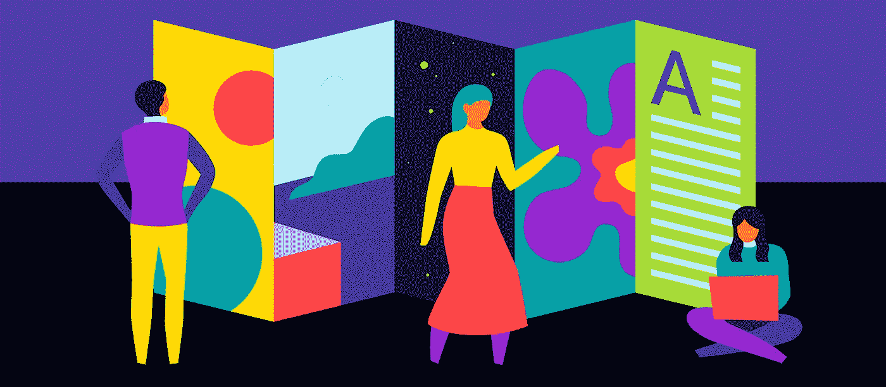

# 每个初学者都应该看到的 10 个 UX 好例子

> 原文：<https://medium.com/nerd-for-tech/10-good-ux-examples-for-beginners-d48cfe5bc2d0?source=collection_archive---------13----------------------->

与生活中的其他探险一样，种植 UX 产品需要资源和时间。你需要做的一些事情包括提高你的每用户收入，扩大你的客户群，减少客户流失。在你涉足 UX 设计之前，最好先看看一些顶级的 UX 作品，从中获得一些灵感。有许多一流的用户体验例子，你可以看看它们是如何实现的，也可以将一些技术和原则应用到你的设计中。 [Wondershare Mockitt](https://bit.ly/3ewCXuz) 精心挑选了以下 10 个优秀的 UX 设计案例来说明优秀的 UX 设计的具体原则，从简单到游戏化。

# 1.巴塔哥尼亚的反馈精度

巴塔哥尼亚是一家完善了 UX 设计的服装公司。从他们网站的拷贝到所提供产品的所有拉链，他们都与公司的目标和价值观保持一致。在网站上有不具体的反馈是没有帮助的。例如，“不起作用”是没有用的，如果你在用户提交反馈时丢失了用户位置的上下文，拥有漂亮的图像也是没有用的。Patagonia 解决了这个问题，它允许用户在网站的区域部分点击他们的位置来设置评论的上下文。元素和注释被发送到公司数据库。

通过这样做，巴塔哥尼亚以正确的方式诠释了洞察力，以帮助他们在公司做出正确的改进。

# 2.Topshop 的谈话策略

Topshop 在竞争激烈的时尚行业工作，这使得他们必须提供流畅的体验。随着女性时装业的激烈竞争，获得竞争优势可能会很困难。大多数时尚服装网站通常坚持高设计标准，以避免不必要的 UI 教育迷惑买家。这样做让买家很难区分。Topshop 是一个很好的 UX 例子，因为该公司进行了彻底的研究，以找出什么可以为其用户增加更多价值。该设计有一个标签，“嘿，你，让我们一起购物，”这是一个诱人而有趣的信息，有助于公司拥有尽可能多的用户。有一个大胆的请求“我们很乐意在您今天在线购物时给您打电话。”当用户同意时，会发送 skype 请求，请求屏幕共享，然后会话开始。这是一种强有力的方式来与他们设计的 UX 设计的用户产生共鸣。

# 3.Google sheets 的多方面签到

尽管谷歌很受欢迎，但它仍然与用户交谈，以改善他们正在进行的优化。公司这样做是为了确定事情背后的原因。为了确保它不会被定性数据所取代，该公司仔细选择问题以获得所需的具体答案。该公司应用几个选择题和开放式问题来加强其研究。问题的特殊性有助于他们更专注于重要的事情。公司询问用户为什么使用他们的产品，这有助于了解他们的具体需求，从而帮助公司提供正确的解决方案。谷歌还询问用户对其产品的想法、期望和需求。这有助于公司迅速获得正确的洞察力。

# 4.ClassPass 井次反馈模型

ClassPass 可以访问各种健身工作室的全球网络，以实现他们的健身目标。有几种方法和选择来保持健康。ClassPass 有一个 UX 设计，对初学者来说很友好。它确保快速获得所有类的正确反馈，以确保它们提供用户可以信任的体验。ClassPass 获取特定事件反馈的另一种方式是用户登录他们的帐户。为了利用这一时刻，ClassPass 有一个模型来获取用户对该类的评论，更重要的是他们认为的能力水平。有了用户提供的这些集体知识，公司可以准确地对他们的类别进行分类，而不是依赖他们自己的解释。

# 5.山仓最后的机会请求

当用户点击你网站主页上的推广面板时，他们可能会发现一些引起他们兴趣的东西。他们通常采取想要的行动，然后到达一个转换点。在大多数情况下，漏斗容易泄漏，这使得大多数网站在这个关键点上失去用户，尽管网站运行良好。专注于户外装备的 Mountain warehouse 有一个完美的定时反馈小工具。这个策略在洞察力消失之前抓住了它。这个小部件并不特别，但是这个问题是开放的，简短的，可以捕捉到所有的观点和想法。时机是一个关键因素。山仓并没有打扰到已经很开心很好的用户转化。该公司使用一种针对特定目标标准的小工具。如果用户花费的时间比正常情况下长，它会自动返回，找出是什么阻止了他们。

# 6.Gmail 的简洁签到

一个好的 UX 设计不应该仅仅关注于知道顾客是快乐的，还应该允许批评去知道哪里出了问题。大多数网站使用一揽子的方法来收集反馈，这使得他们得不到正确的反馈。当 Gmail 收件箱推出时，谷歌为用户提供了转移到新界面的选项，如果他们对新界面不满意，可以回到旧界面。如果用户回到旧的选项，他们有理由这样做。谷歌借此机会通过询问“告诉我们什么对你不起作用”来了解原因。这有助于他们对新界面做出正确的改进。

# 7.工具 NPS 调查中的客户. io

NPS 分数在用户体验结束时收集。这是用户成功完成预期任务的时间。用户正处于给予重要反馈的恰当位置。好的 UX 设计范例包括仔细考虑如何以及何时从目标用户那里寻求 NPS 反馈。io 有一个很好的 UX 设计，工具提示和模态不会分散用户的注意力，时间也很合适。Customer.io 在其活动的概览页面上有一个模式，因为它是用户开始、结束或介于两者之间的旅程的一部分。此时，用户可能有更多的机会回答所有问题。该网站也很少提问，也不会打扰他们。

# 8.Quip 的温柔签到

作为一名 UX 设计师，如果你没有在其他地方收集数据，你希望用户给出一个数字答案以外的详细说明，以便更好地理解正在发生的事情。这使你有可能发现主题和模式，为什么你的项目有时得分为 1，而其他时候得分为 9。Quip bolts 询问相关问题，可以帮助他们更深入地了解用户的 NPS 得分。问题，“Quip 中最大的改进是什么？”有助于量化产品中的某些关注领域。这个问题有助于您了解应该关注哪些功能来提供更好的用户体验。UX 设计有助于找到发现问题和解决问题的方法。

# 9.GmodStore 的 Trello 协作

这是一个很好的 UX 设计的例子，因为设计师透露了他们的路线图，以了解他们的用户对他们未来计划的想法。用户可以查看他们正在进行的工作和他们刚刚发布的内容。他们只需点击卡片，为他们更喜欢的功能投票。所使用的 UX 设计方法不仅有助于验证未来的计划，还允许用户更深入地参与产品。这会带来更多的忠诚、信任和更有价值的反馈。这对 UX 设计团队来说也是一个巨大的激励因素，因为他们发现用户喜欢他们所做的事情。

# 10.埃隆·马斯克的全耳式方法

作为一名 UX 设计师，你不必等待用户通过在线工具提供关于你产品的反馈。有必要走出去，通过对话。社交媒体为你提供了一个空间，在这里你可以非正式地倾听和学习你的客户。这需要时间，但是你得到的反馈的质量值得你花时间。埃隆·马斯克的全耳式方法利用社交媒体从用户那里获得反馈。他们认真对待通过推文给出的反馈，并做出正确的改进。这是一个很好的 UX 的例子，用户充分支持。

# 结论

UX 很简单，要成功你不必把它复杂化。大多数设计师认为复杂的设计看起来更专业，这是一个很大的错误。它要求你倾听，然后根据你所学到的知识做出正确的改进。要听，你要有足够的时间，这是行业内的稀缺资源。通过看上面的 UX 好例子，你可以找到一些简单的技巧和见解来帮助你。

感谢您花时间阅读这篇文章。[了解更多关于 Mockitt 的信息](https://bit.ly/3ewCXuz)

我们为 UX 初学者创建了一个[终极指南](https://bit.ly/2OLPPlW)，它收集了来自多个 UXers 的知识、经验和建议。

订阅我们的 [YouTube](https://www.youtube.com/channel/UCESxamaRS8nOGpWYvP1VSqA) [脸书](https://www.facebook.com/mockitt) [Instagram](https://www.instagram.com/wondershare.mockitt/)

*原载于*[*https://mockitt.wondershare.com*](https://mockitt.wondershare.com/ui-ux-design/ux-examples.html)*。*