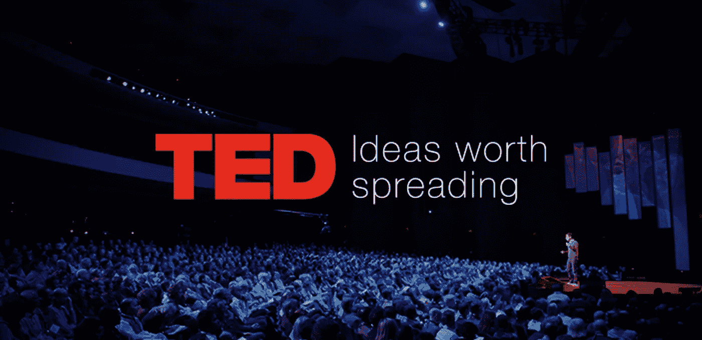

# UX 设计师必看的 10 个 TED 演讲

> 原文：<https://medium.com/nerd-for-tech/10-must-watch-ted-talks-for-ux-designers-1c4c3dc033f?source=collection_archive---------24----------------------->

技术、教育和设计，或 TED，是一个全球性的平台，激励和激发观众更多地了解世界和我们自己。这个始于 1984 年的会议如今已经成为关于其三个核心领域的最关键和最活跃的平台之一。在这三个方面，设计与全球平台一起成长和发展。

因此，有许多 UX 会谈在全球观众中获得了惊人的反响，因为它们具有连贯和无所不包的吸引力。听 TED 演讲 UX 设计的美妙之处在于，即使对于一个非设计师来说，它们也很容易理解，而且这十大视频中所谈论的一切都适用于现实世界。

因此，这里是每个 UXer 必须观看的由 TED 平台支持的 10 大 UX 设计讲座。

# UX 设计顶级 TED 演讲

## [1。如何变得更简单—希娜·艾扬格](https://www.youtube.com/watch?v=1pq5jnM1C-A)

我们通过选择时间来做出选择。通过这个 UX 的 TED 演讲，希娜·艾扬格带领观众踏上了一段非凡的旅程，了解了在我们的日常生活中做出选择的重要性。她还提出了选择过多的问题，以及如何成功解决这些问题。

在她的演讲中，她引用了一些研究和调查，其中作者询问了普通美国人和首席执行官关于他们每天所做的选择。研究发现，普通美国人一天大约有 70 个选择，而首席执行官有 139 个选择。

在 UX 设计中，知道如何让选择更容易的重要性直接关系到 UX 设计师理解最终用户的能力。每个产品都需要一个有效的设计，为客户创造流畅的用户体验。

因此，通过了解一个人如何做出他/她的选择，一个 UX 设计师更适合创造相关的设计。

## [2。简单是卖点——大卫·波格](https://www.ted.com/talks/david_pogue_simplicity_sells)

大卫·波格在这个 TED 演讲中触及了我们生活中非常美丽和重要的一面，那就是简单。他带领观众经历操作系统的演变，并展示它们是如何变得越来越复杂的。David Pogue 帮助观众理解软件狂怒是一个真实的日常问题。

所以，把这个 TED 演讲列在我们的清单上的目的是，作为一个 UX 设计师，你也需要理解简单的重要性。系统和软件可能会变得更小、更智能、更高效。但是用户不能以同样的速度前进。

举个例子，你可以缩小手机屏幕上按钮的尺寸，但是人的手指不能缩小。因此，为了使我们的系统更高效和最小化，我们可能会使它的使用变得复杂和具有挑战性。

## [3。设计的第一个秘密是…注意](https://www.ted.com/talks/tony_fadell_the_first_secret_of_design_is_noticing)

托尼·法德尔利用他作为产品设计师的经验和专业知识来帮助他的观众理解设计领域中那些几乎不引人注意的小东西的影响。在他的 UX 演讲中，他谈到了像驾驶汽车这样的活动，以及第一次和第一百次驾驶汽车的体验。

这个 UX 设计的 TED 演讲对初学者来说是一个很好的资源，因为他们计划进入这个令人惊叹的领域，并且必须了解设计的每个方面都有多么小的事情。托尼，谁也创造了 iPod 的概念，并共同创立了巢实验室，希望年轻设计师了解设计的核心。

他说我们需要看到事物的本来面目，而不是我们喜欢的样子。最根本的区别在于，当我们按照自己的意愿看待事物时，解决方案不会起作用，因为我们的版本与其他所有人看待同一事物并制定正确解决方案的方式不同。

## [4。巨型网站如何为你设计——玛格丽特·古尔德·斯图尔特](https://www.ted.com/talks/margaret_gould_stewart_how_giant_websites_design_for_you_and_a_billion_others_too)

Margaret Gould Stewart 是团队中的一员，为谷歌、YouTube 和脸书赋予了形象、面孔和意义。她一直在设计与这些平台和技术相关的方面。理解他们深不可测的规模和结构是一个人的苦心。

通过 UX 在 TED 上的演讲，作者帮助观众确定了设计的两个核心概念。这就是无畏和谦逊。无畏意味着从事具有全球吸引力的项目的能力和潜力，谦逊指的是“我创造的设计具有全球用途”的情绪。

这些东西在 UX 设计中很重要，因为当你在建造一个被超过 10 亿人使用的东西时，每一件小事都可能变成一场灾难或改进。

## [5。设计师们，胸怀大志！—蒂姆·布朗](https://www.ted.com/talks/tim_brown_designers_think_big)

几个世纪以来，设计师们一直在创造新的东西，并实现他们对优秀设计的理解。蒂姆·布朗就是其中之一，他创造了许多设计，承认他一直从不同的角度看待设计，这种角度不断变得过时，因为他错过了设计背后的“思考”。

在这个 UX 的 TED 演讲中，Tim 帮助他的听众理解了设计思维或整合思维的三个原则。这些原则是可取性，生存能力和可行性。

通过积累这些方面，设计师需要在他/她的设计思维上下功夫。设计思维必须用来融合相互冲突的约束，并创造一个新的解决方案，提供一种新的用户体验，一种影响和参与的体验。

## [6。重塑用户体验— Kes Sampanthar](https://www.youtube.com/watch?v=k0wK9MX6cRA)

Kes Sampanthar 来到 UX TED 演讲的讲台上来分享一些非凡的见解，他的一些想法可能会改变你对设计的思考方式。

他说，我们需要走出设计师一直使用的两种思想流派，一种是让事物变得美丽，另一种是让设计游戏化。

然而，Kes 说，这些东西对创造引人注目的用户体验都没有用。作为一名设计师，理解用户的真正动机和促使他们做出决定的因素是很重要的。

Kes 讲的是喜欢和想要这两个概念，是不同的、个体的方面。动机设计是喜欢和想要的混合，设计师应该理解它来创造有影响力的产品和解决方案。

## [7。设计的四大超能力——凯文·白求恩](https://www.ted.com/talks/kevin_bethune_the_4_superpowers_of_design)

UX 设计师是超级英雄。它有很好的权利，不是吗？凯文·白求恩在 ted 的 UX 演讲中深入阐述了观众对什么是设计，谁是设计师的理解。

凯文分享说，每个设计师都有四种超能力，从 x 光视觉开始。他们能够理解他们的用户，而不需要问任何问题。第二，设计师是变形人。

是的，他们知道如何感同身受，但这种将用户的感受转化为有形的最终产品的理解是一个设计超人的东西。

设计师可以通过激励其他人或用户，让他们处于持续流动的状态，从而让他们成为超人。设计者可以想象、创造和制造产品，确保最终用户在使用时不会失去流量。最后，设计师也有超感官知觉。想知道怎么做吗？看完整视频，你会明白你最后的超能力。

## [8。数据与设计在 UX 的复杂关系——罗谢尔·金](https://www.ted.com/talks/rochelle_king_the_complex_relationship_between_data_and_design_in_ux)

Rochelle King 是 Spotify 和网飞设计团队的一员，她强调了数据在设计中的重要性。在这个 UX 设计的 TED 演讲中，她帮助观众理解在物理世界和数字世界中提供用户体验的区别。

作为一名设计师，你可以更好地获取数据和洞察用户的偏好，这让事情变得更容易。同时也要求你肩负更高程度的责任。这是因为，在数字设计中，所有的变量都在你的控制之下，你可以借助可操作的洞察力来控制它们。

Rochelle 指导观众将数据视为持续的对话，帮助设计师随着时间的推移完善客户的直觉。

## [9。最好的电脑界面？也许……你的手——詹姆斯·彭定康](https://www.ted.com/talks/james_patten_the_best_computer_interface_maybe_your_hands)

詹姆斯·帕滕(James Patten)是一名机器人专家设计师，他利用自己在动力学方面的专业知识在现实世界而不是数字世界中创造东西。这种 UX 的 Ted 演讲将观众带入一个新的和创新的思路，迫使他们以不同的方式思考。

作为一名 UX 设计师，你可能会觉得这个 TED 演讲很有趣，因为它谈到了用户的手是最好的界面类型。詹姆斯通过他的项目帮助人们用他们的双手和头脑创造更好的体验。

他希望设计师用类似的方法思考，并重新定义设计师必须如何思考他们的最终用户使用他们的手和脑来创造新类型的体验的能力。

## [10。所有 5 种感官的设计](https://www.ted.com/talks/jinsop_lee_design_for_all_5_senses)

Jinsop Lee 是优秀设计的热心支持者，他希望 UX 的最终用户设计师能够为人类的五种感官而不是两种感官创造解决方案和产品设计。这五种感官是视觉、触觉、嗅觉、听觉和味觉。

作为一种理解用户的新方法，UX 设计师需要想象最终用户在使用产品时利用他/她的五种感官。如果不是全部五种，即使产品的设计让用户在通常的两种感觉(触觉和视觉)之外再使用一种感觉，也能增强用户体验。

# 结论

所有这些 UX TED 演讲就其本身而言都是革命性的。如果你仔细观察，这些 UX 的演讲提供了一种新的思考、想象和构思 UX 设计的方式。不管你的 UX 设计水平如何，你都必须观看这些 UX 设计讲座，因为它们只会增加你现有的知识基础，让你成为更好的设计师。

感谢您花时间阅读这篇文章。[了解更多关于摩奇特的信息](https://bit.ly/3ewCXuz)

我们为 UX 初学者创建了一个[终极指南](https://bit.ly/2OLPPlW)，它收集了来自多个 UXers 的知识、经验和建议。

订阅我们的 [YouTube](https://www.youtube.com/channel/UCESxamaRS8nOGpWYvP1VSqA) [脸书](https://www.facebook.com/mockitt) [Instagram](https://www.instagram.com/wondershare.mockitt/)

*原载于*[*https://mockitt.wondershare.com*](https://mockitt.wondershare.com/ui-ux-design/ux-talks.html?utm_source=other_media_sites&utm_medium=social&utm_campaign=md&utm_term=medium_post&utm_content=post_md_md_en_20087918_2021-03-11)*。*