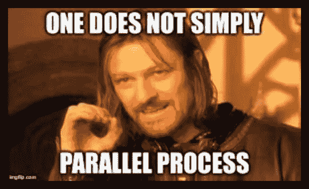

# 设计并行化时要问的 10 个问题

> 原文：<https://medium.com/nerd-for-tech/10-questions-to-ask-while-designing-for-parallelization-f1c1974eebc9?source=collection_archive---------11----------------------->

软件中的并行化允许结构化问题以暴露可利用的并发性，并且结构化算法以利用同时偏序。

并行化似乎是解决效率和吞吐量问题并提高软件性能的答案。然而，它伴随着许多警告。并不是所有的并行化都会带来速度的提升，或者说瓶颈会从根本上消除任何优势，或者至少降低实际效率。

以下是在设计具有并行功能的系统时，您应该自问的 10 个问题:

1.  问题的关键特征和问题中的数据元素是否得到了很好的理解？
2.  问题是否大到足以证明并行化的努力是值得的？
3.  问题的哪些部分计算量最大？
4.  如何将一个问题分解成可以并发执行的(几乎)独立的任务？
5.  任务分解设计是否足够灵活，能够处理任意数量的流程？每个任务都包含足够的工作来补偿“生成”任务和管理它们的依赖关系的开销吗？
6.  如何对(小)任务进行分组以简化依赖关系的管理，从而使调试和维护变得容易？
7.  问题的数据如何分解成可以(相对)独立操作的单元？
8.  在数据块的大小和数量(粒度)方面，**数据分解**灵活吗？数据块是否足够大，以至于处理它们的工作量可以补偿管理依赖关系的工作量？
9.  任务之间如何共享数据？共享数据结构的定义是什么？
10.  并行性如何影响任务的排序？任务是真正独立的(微小的并行性)还是具有时间依赖性(对一组任务执行顺序的约束)？

> 感谢您的阅读！如果您觉得这很有帮助，以下是您可以采取的一些后续步骤:

1.  给我点掌声！
2.  在 Medium & Twitter 上关注我，获取更多技术博客！
3.  在 LinkedIn 上与我联系！