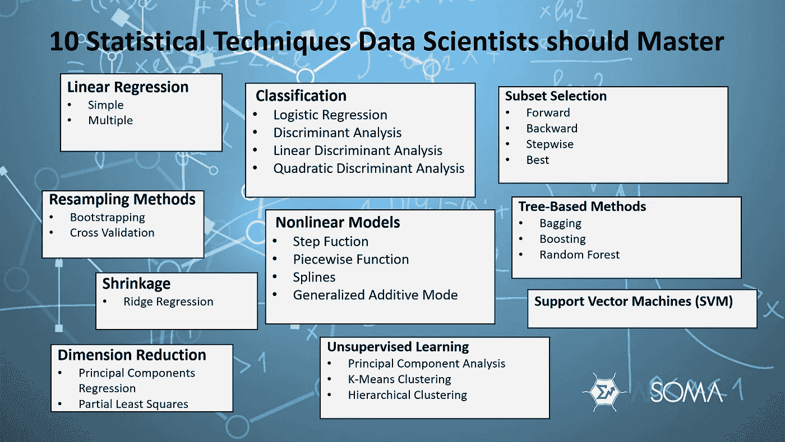
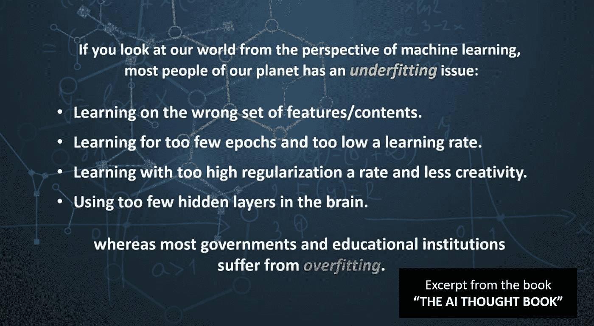
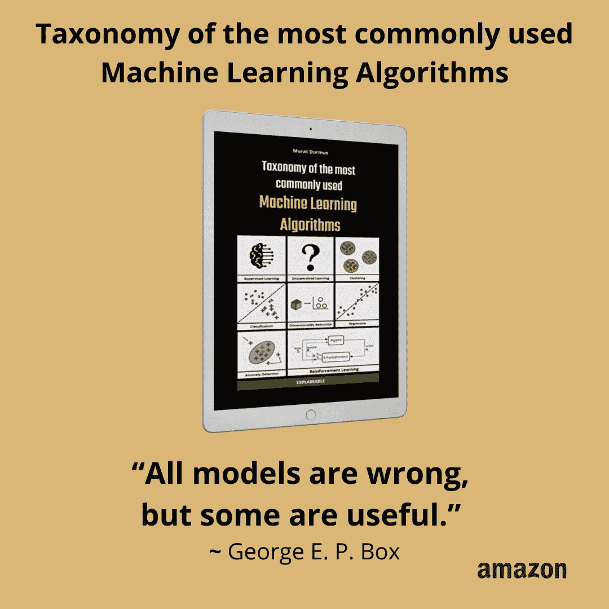

# 数据科学家应该掌握的 10 项统计技术

> 原文：<https://medium.com/nerd-for-tech/10-statistical-techniques-data-scientists-should-master-c52772f8e1cc?source=collection_archive---------0----------------------->

穆拉特·杜马斯([艾索玛](https://www.aisoma.de/)

数据科学家掌握的统计技术越多，结果就越好。在这篇博客文章中，我想向您介绍数据科学家必备的十项常用技术。

# 1.线性回归

在统计学中，线性回归是一种建模标量响应(或因变量)与一个或多个解释变量(或自变量)之间关系的线性方法。只有一个解释变量的情况称为简单线性回归。对于一个以上的解释变量，这个过程被称为多元线性回归。这个术语不同于多元线性回归，多元线性回归预测多个相关的因变量，而不是单个标量变量。([更多信息](https://en.wikipedia.org/wiki/Linear_regression)

# 2.分类

在机器学习和统计学中，分类是基于包含已知类别成员的观察值(或实例)的训练数据集，识别新观察值属于一组类别(子群体)中的哪一个的问题。例子是将给定的电子邮件分配到“垃圾邮件”或“非垃圾邮件”类别，以及基于观察到的患者特征(性别、血压、某些症状的存在或不存在等)给给定的患者分配诊断。).分类是模式识别的一个例子。([更多信息](https://en.wikipedia.org/wiki/Statistical_classification))

# 3.重采样

在统计学中，重采样是执行以下操作的各种方法之一:

*   通过使用可用数据的子集(刀切法)或从一组数据点中随机抽取替换值(自举法)来估计样本统计数据的精度(中位数、方差、百分位数)
*   执行显著性检验(置换检验，也称为精确检验、随机化检验或重新随机化检验)时，交换数据点上的标签
*   通过使用随机子集验证模型(引导，交叉验证)

([更多信息](https://en.wikipedia.org/wiki/Resampling_(statistics)))

# 4.收缩

在统计学中，收缩有两种含义:

*   一般认为，在回归分析中，拟合关系在新数据集上的表现不如用于拟合的数据集。特别是决定系数的值“缩小”。这一思想是对过度拟合的补充，也是对决定系数中的标准调整的补充，以补偿进一步采样的虚拟效应，如控制新的解释性术语偶然改进模型的可能性:也就是说，调整公式本身提供了“收缩”。但是，与第一个定义相反，调整公式产生了人为的收缩。
*   描述一般类型的估计量，或某些类型的估计量的效果，通过将原始估计量与其他信息相结合来改进原始估计量(见收缩估计量)。该术语涉及的概念是，与原始估计相比，改进的估计与“其他信息”提供的值的距离更小。在这个意义上，收缩被用来正则化不适定的推理问题。

([更多信息](https://en.wikipedia.org/wiki/Shrinkage_(statistics)))

# 5.降维

在统计学、机器学习和信息论中，降维或降维是通过获得一组主变量来减少所考虑的随机变量的数量的过程。可以分为特征选择和特征提取。

([更多信息](https://en.wikipedia.org/wiki/Dimensionality_reduction))

# 6.非线性模型

从 20 世纪下半叶开始，计算能力的快速和持续增长对统计科学的实践产生了重大影响。早期的统计模型几乎总是来自线性模型，但是功能强大的计算机，加上合适的数值算法，引起了对非线性模型(如神经网络)的兴趣，以及新类型的创建，如广义线性模型和多级模型。

([更多信息](https://en.wikipedia.org/wiki/Nonlinear_modelling))

# 7.无监督学习

无监督学习是机器学习的一个分支，它从没有被标记、分类或归类的测试数据中学习。无监督学习不是对反馈做出反应，而是识别数据中的共性，并根据每个新数据中是否存在这种共性做出反应。替代方法包括监督学习和强化学习。

([更多信息](https://en.wikipedia.org/wiki/Unsupervised_learning))

# 8.支持向量机(SVM)

在机器学习中，支持向量机(SVM，也称为支持向量网络)是具有相关学习算法的监督学习模型，这些算法分析用于分类和回归分析的数据。给定一组训练样本，每个样本被标记为属于两个类别中的一个或另一个，SVM 训练算法建立一个模型，将新样本分配给一个类别或另一个类别，使其成为非概率二进制线性分类器(尽管存在诸如普拉特标度的方法，以在概率分类设置中使用 SVM)。

SVM 模型是将示例表示为空间中的点，通过映射，各个类别的示例被尽可能宽的间隙分开。然后，新的例子被映射到相同的空间，并根据它们落在差距的哪一边来预测属于哪个类别。

([更多信息](https://en.wikipedia.org/wiki/Support-vector_machine))

# 9.子集选择

n 机器学习与统计特征选择，也称为变量选择、属性选择或变量子集选择，是选择相关特征(变量、预测器)的子集用于模型构建的过程。使用特征选择技术有四个原因:

*   简化模型，使其更容易被研究人员/用户解释，
*   更短的训练时间，
*   为了避免维数灾难，
*   通过减少过度拟合(形式上，减少方差)来增强泛化能力

使用特征选择技术的中心前提是，数据包含一些冗余或不相关的特征，因此可以在不导致大量信息损失的情况下将其删除。冗余和不相关是两个不同的概念，因为一个相关特征在存在与其强相关的另一个相关特征的情况下可能是冗余的。

([更多信息](https://en.wikipedia.org/wiki/Feature_selection)

# 10.基于树的方法

在计算机科学中，决策树学习使用决策树(作为预测模型)从对某个项目的观察(用树枝表示)到对该项目的目标值的结论(用树叶表示)。它是统计学、数据挖掘和机器学习中使用的预测建模方法之一。目标变量可以取一组离散值的树模型称为分类树；在这些树结构中，树叶代表类别标签，树枝代表通向这些类别标签的特征的合取。目标变量可以取连续值(通常是实数)的决策树称为回归树。

([更多信息](https://en.wikipedia.org/wiki/Decision_tree_learning))

[人工智能思想书](https://www.amazon.com/dp/B08Z4BWN1X)

推荐书籍:**[**最常用的机器学习算法分类**](https://www.amazon.com/dp/B09WR36STL)**

********

****[最常用的机器学习算法分类](https://www.amazon.com/dp/B09WR36STL)****