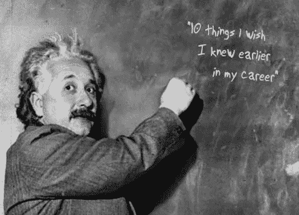

# 我希望在成为 UX 设计师的第一份工作之前就知道的 10 件事

> 原文：<https://medium.com/nerd-for-tech/10-things-i-wish-i-knew-before-my-first-job-as-a-ux-designer-66190d8f3401?source=collection_archive---------32----------------------->

每天，成千上万的人从事新的工作。他们都很担心，很担心自己是否适应新的地方。职业专家阿曼达·奥古斯丁说:“新职位的头三个月基本上是面试的延续。”。在[的第一份工作](https://bit.ly/38r5AWo)总是一个严峻的挑战。你想给你的同事留下好印象，正确设定你的优先事项，避免错误。

根据心理学家的说法，对一个人的第一印象极其重要，正是这一印象为未来的关系奠定了基础。在你作为一名 UX 设计师的职业生涯之初，你可能不会得到很多钱。但是照顾好自己的物质生活是你能为自己做的最好的事情。在这篇文章中， [Wondershare Mockitt](https://bit.ly/3ewCXuz) 为开始 UX 设计师生涯提供了一些最重要的建议。

# **我希望在**之前知道的 10 件事

## ***做一些研究***

做一些背景研究，更好地了解该组织。阅读材料，如年度报告、给员工的服务信、发展战略演示等。你从新领导那里得到的或者在公共领域网上找到的。这将在你的第一次谈话中增加自信和知识，并帮助你提出更严肃和具体的问题。

## 做你自己

想办法放松，展示你自己。努力成为另一个人压力很大，何苦呢？你需要在第一天和第 31 天保持自我的一致性。如果你感到紧张，假装你在商务聚会上或者在你自己舒适的家里与人见面，这些都是互相认识的朋友。这与事实相差不远；你将与他们密切合作，享受建立关系的过程，所以为什么不现在就开始呢？

## 耐心点。

一开始会很难。你会吸收和理解新的信息，比平时更少的精力会留在工作上。在问同事问题之前，害羞和犹豫是正常的。再问也没关系。开玩笑是可以的。感觉很累，即使你看起来一整天都没做什么，也是正常的。这些是暂时的困难，我们在文本一开始就同意接受。再过几个月，那种繁琐的尴尬就会被你平时的生产力所取代。好吧，好吧，不是替代——你不太可能变成一个无忧无虑、热爱乐趣、喜欢成为焦点的人。但是你肯定会感觉好一点，上班不再给你压力。

## 不要猜，但要问

在你工作的第一天问问题是有好处的，因为这表明你对你的新工作真正感兴趣，并准备好学习。如果你发现你什么都不知道，先问问你的同事，而不是猜测。如果你犯了一个错误，这将是一个更尴尬的谈话，如果这个错误可以通过提前提问来避免的话。

## 不要离开团队

由于你最初展示了自己，你在团队中与人的关系将会发展。你可能会错误地认为，用头脑去参与商业会更好。但是你在同事的枪口下，他们在等你的第一步。忽视情况不是最好的解决办法。问候每一个人，开诚布公，提出问题。

## 了解你的老板对你的期望/设定期望

和你的老板谈谈。当你们第一次见面时，试着准确理解在一个新地方的第一周、第一个月、第一个季度对你的期望。请记住，你在第一周的行为和沟通方式将为整个工作定下基调。挑战自己，展示你之前在招聘面试中谈到的优势。

## 不要让金钱影响你的工作

让你的工作充满乐趣。最好确保大部分时间是愉快的。对许多员工来说，压力贯穿了整个工作日。如果不能从自己的工作中获得乐趣，你就不可能在工作中取得成功。另一方面，还有一个问题:真的值得吗？归根结底，金钱并不是生活中的一切，只有当你不仅把工作做好，而且乐在其中，你才会真正成功。

## 做你最擅长的

试着了解你的同事是如何工作的，并遵循所有的工作要点。你必须用这种方式在你的同事面前展示你的能力。如果你是第一次做某事，你不应该说你已经知道怎么做了。这样，你会给自己留下负面印象，并给某些人留下持久的坏印象。

## 做决定

众所周知，决定总是要做出的。无论是你，还是其他人。要想在你的 UX 设计工作或任何其他工作中取得成功，你需要学会把事情掌握在自己手中。对重要的事情来说，这可能是困难的，但绝不能导致恐惧麻木。许多员工没有攀登公司的阶梯，因为他们根本不敢攀登下一个级别和处理相关的变化。但是如果你不自己塑造你的道路，别人会决定它。

## 确保公司里有资深设计师

高级设计师指导初级设计师的概念通常被认为对初级设计师有利。然而，将高级设计师与初级设计师配对不仅对初级设计师有利。这实际上对有意将两个设计师配对的公司非常有利。好的设计需要诚实的反馈、协作和支持。

曾参与多个项目的资深 UX 设计师对如何将创意转化为非凡的设计有着更深刻的理解。显然，他对哪些项目值得做有很好的判断力，并能帮助管理利益相关者的期望。这一切都影响着公司的底线和朱尼尔的工作。

## 适应变化

UX 设计领域一直在变化，而且变化非常快。如果你有机会和一个在这个领域工作了 5 年以上的设计师交谈，他会告诉你在过去的 5 年里发生了多大的变化。所以我的建议是不要太依赖工具。据我所知，过去许多设计师使用 Adobe Illustrator 来创建他们的 UX 设计和屏幕设计，但现在许多设计师使用草图。因此，事情总是在变化，你必须能够适应这种变化。所以我的建议是，看看和研究大多数公司，甚至是你真正想成为 UX 设计师的公司都在使用什么。看看他们的工作描述里有什么。

## 学会说不

不，目前我不能承担任何进一步的任务”。或者“不，很遗憾，我们不能在周末换班”。拒绝看似与成功关系不大，但实际上，指出极限是重要的成功秘诀。那些不知道自己的负荷极限或没有设法遵守它们的人让自己不断地被利用，系统地压倒自己，直到他们达到事情不能再进一步的地步。

## 发展自己

设计界发展非常迅速。要想在 UX 的设计工作中取得成功，你必须跟上几乎所有行业的时代。完成培训后，不要停留在你已经获得了所有重要资格的事实上。对员工和经理的要求可能会快速变化。因此，观察哪些新的资格在你的职位上是重要的，并在这个方向上进一步发展自己。继续教育和培训在这方面也有帮助。

## 晚上列一个待办事项清单

早上起床面对堆积如山的任务令人沮丧，通常意味着一天还没开始就结束了。相反，每晚睡前给自己列一个第二天的待办事项清单。写下三到五个你第二天真正想做的重要任务。这有几个好处:晚上你会睡得更好，因为你没有那些在你脑海中浮动的任务，第二天开始时会更放松和有条理，完成待办事项后，满足感就会产生。

# 结论

成为 UX 设计师的道路并不容易。一旦你被录用，你仍然要不断地练习和学习新技能。请记住，UX 设计师是一份改变生活的非常有趣的工作。尤其是那些热爱持续发展的人。在最初几天，你很可能会感到不舒服——没关系！然而，克服你的害羞并向每个人介绍你自己是非常重要的。你将证明自己是自信开朗的，这将有助于你正确地开始！

感谢您花时间阅读这篇文章。[了解更多关于 Mockitt 的信息](https://bit.ly/3ewCXuz)

我们为 UX 初学者创建了一个[终极指南](https://bit.ly/2OLPPlW)，它收集了来自多个 UXers 的知识、经验和建议。

订阅我们的 [YouTube](https://www.youtube.com/channel/UCESxamaRS8nOGpWYvP1VSqA) [脸书](https://www.facebook.com/mockitt) [Instagram](https://www.instagram.com/wondershare.mockitt/)

*原载于*[*https://mockitt.wondershare.com*](https://mockitt.wondershare.com/ui-ux-design/first-job.html)*。*