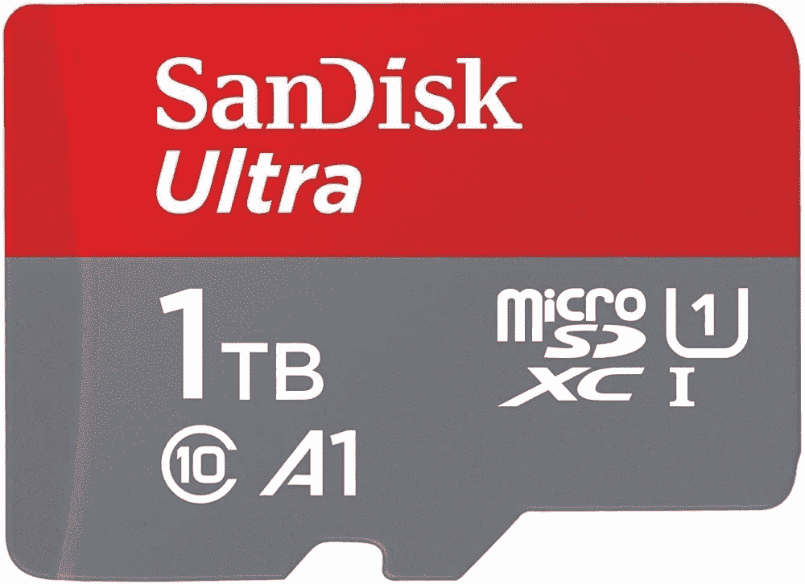
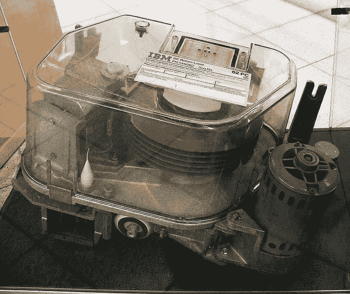

# 100 不是复制，而是缓存

> 原文：<https://medium.com/nerd-for-tech/100-terabytes-isnt-duplication-its-caching-15658a1523a0?source=collection_archive---------4----------------------->

我在企业中看到的一个常见错误是，当涉及到事务性数据时,“害怕复制”。因此，你最终会发现人们完全遵守数据只存储在一个地方的规则。然后，他们使用虚拟化技术连接两个不同的数据存储，然后他们发现物理定律不是他们的朋友。

随着 2022 年的到来，是时候停止认为商店之间的企业数据复制是应该避免的事情了。我可以去好市多花 499 美元买 4 TB 的固态硬盘，你可以得到一个 T2 1TB 的微型 SD 卡，甚至是我的手机。一款 [144TB 家用 NAS](https://eshop.macsales.com/item/OWC/TB38SRT144/?utm_source=google&utm_medium=shoppingengine&utm_campaign=googlebase&gclid=Cj0KCQiAtJeNBhCVARIsANJUJ2HBZpB2lOrQR77NGlaaF29a5nmZ1qNJIC1FvB-vwLicI19kqRoutQUaAvG8EALw_wcB) 售价不到 5000 美元。

> 在 2022 年，1 TB 的存储不算什么

[1TB microSD 卡](https://www.amazon.com/Lexar-Professional-633x-SDXC-UHS-I/dp/B07N6YBB9S/ref=sr_1_20?crid=3OY76M47QCOXE&keywords=2tb%2Bsd%2Bcard&qid=1638305132&refinements=p_n_feature_two_browse-bin%3A13203835011&rnid=6518301011&s=pc&sprefix=2%2BTB%2BSD%2Caps%2C205&sr=1-20&th=1)

在 S3，每月 23 美元；在 T2，每月 20 美元；在 T4，每月 18.40 美元。我之前说过[数据是云的肮脏小秘密](https://blog.metamirror.io/clouds-dirty-little-secret-becomes-the-hyperscalers-biggest-opportunity-dc1030b2c841)，然而人们似乎并不想利用这一点。所以让我们明确一点:

> 如果您有多个存储，并且可以在它们之间复制数据，您应该

这里的“可以”是指没有法律、法规或其他原因不能做。**默认**应该是在商店之间复制数据。“哦，不”我听到人们尖叫，但这意味着重复，这意味着安全问题，“如果”场景开始被创建。

这就是为什么 [CDC 对强大的内部数据生态系统如此重要](https://blog.metamirror.io/how-cdc-adds-data-resilience-to-data-platforms-c3c4c7ad88a2)。CDC 需要表达的不仅仅是变化的传播，还有安全模型和撤销的传播。如果我将这些机制构建到我的数据市场(我的[内部协作数据生态系统](https://www.capgemini.com/service/perform-ai/collaborative-data-ecosystems/)的核心部分)中，那么我将这些机制构建为组织中标准设施的一部分。我不得不将安全性和撤销视为架构的基础部分。如果我假装数据不会被复制，我会欺骗自己，我已经通过隔离处理了安全问题。

我说“反对”的原因是，在某个阶段，你会发现你需要把数据放在一起，或者你需要做一个[联合学习](/collaborative-data-ecosystems/federated-learning-a-business-explainer-e3a5cb92d65e)的解决方案，虽然我喜欢联合学习，但如果你可以复制数据，我不会推荐它作为一种“正常”的方法，因为联合学习很难，而表连接则不是。因此，在这个阶段，您最终会做最糟糕的事情:复制数据，或者更糟糕的是使用批处理进行一次性复制。当需要出现时，您可能会忘记所有不复制它的借口，并且您不会有自动化安全和撤销机制的基础设施。

这里的一个关键是，我说的是**事务性**数据，我说的不是日志、物联网流、视频馈送或其他可以快速达到数 Pb 并且基本上可以从中提取价值的元素，我说的是事务性数据，这些数据通常以 Parquet 等格式进行了[非常好的压缩，因此 100TB 的数据可能占用不到 10TB 的实际存储空间。如果您随后添加存储分层，您可以进一步降低成本。即使 100TB 的“整体”成本为 200 美元，您在第一次 Zoom 电话会议上讨论是否可以将数据放入另一个环境时可能会花费更多。这意味着每月只需 2000 美元就可以缓存 1PB 的数据，24000 美元并不算什么，但是当需要这些数据时，您在会议上的花费将会超过这个数字，并且批量上传 1PB 的数据将会比您将数据分散到多个月的时间里花费更多的费用。](https://blog.cloudera.com/benchmarking-apache-parquet-the-allstate-experience/#:~:text=The%20final%20test%2C%20disk%20space,91.24%25%20compression%20ratio%20for%20Avro.)

我在这里的观点是，在一个数据共享和数据协作的世界里，更多的是关于获得正确的**共享和安全**模型，而不是原始存储的成本。然后，如果有人请求访问“客户运输信息”,他们就是在请求订阅其环境中的信息，如果您已经完成了工程设计，以确保数据在那里，安全性是自动的，撤销是建立的，并且历史拷贝(就传输时间和带宽而言是成本最高的)不需要完成，那么价值实现的速度就会大大压缩。

因此，在构建现代数据基础设施时，不仅不应该将“只有一个副本”作为一个口号，还应该积极地将其视为先发制人的缓存策略的一部分。在这种情况下，您将重点放在安全性和撤销挑战上，并使资源调配成为问题中最简单的部分，而不是最复杂的部分。如果你需要供应一家新商店，例如你获得物联网数据并需要将它与运输数据进行匹配，那么你已经有了实现这一点的机制。

通过关注**实现**共享，而不是认为这是应该避免的事情，你可以构建一个能够更好地协作的内部生态系统。这为您与外部合作做好了准备，在外部合作中，安全和技术挑战将需要这些基础，并会增加复杂性。

这不是你的数据存储[原件](https://commons.wikimedia.org/wiki/File:IBM_old_hdd_mod.jpg)