# 2.5D 游戏开发:动画:第 3 部分——壁架抓取系统

> 原文：<https://medium.com/nerd-for-tech/2-5d-game-development-animations-part-3-ledge-grab-system-1557d7f05604?source=collection_archive---------14----------------------->

在这篇文章中，我将介绍如何设置一个壁架抓取系统。

首先，我需要一个简单的悬挂在壁架上的动画。

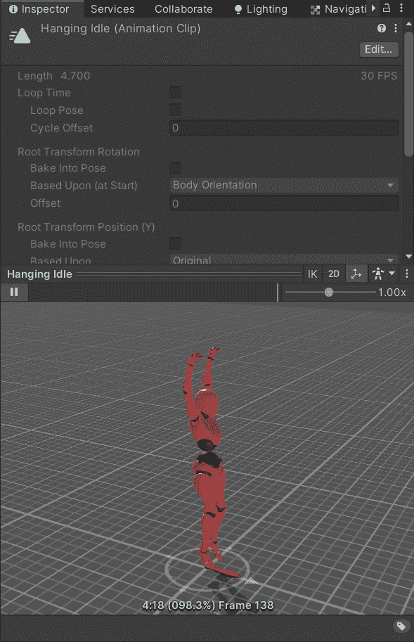

当我把这些都设置好之后，我需要决定我最有可能从哪部动画开始过渡。跑跳是最有可能的地方，所以我在从跑跳过渡到悬空的时候设置了一些条件。

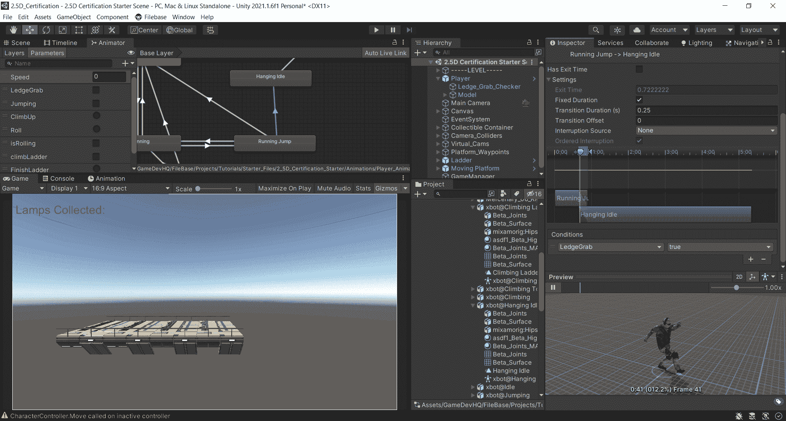

正如您在这里看到的，我将名为“LedgeGrab”的条件设置为 true，以启动转换。所以现在的问题是:我什么时候在代码中将它设置为 true？

我实际上设置了几个触发碰撞器。一个在实际的壁架上，另一个就在玩家的头顶上方。我实际上是把它放在玩家的上方，这样玩家的手就能碰到它。

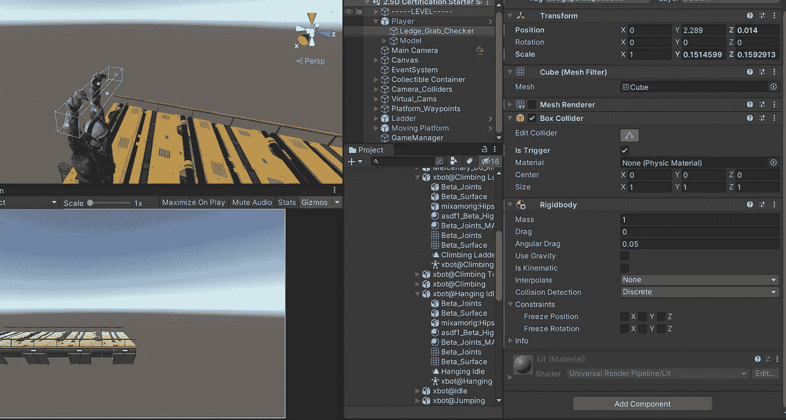

玩家及其属性上的碰撞器

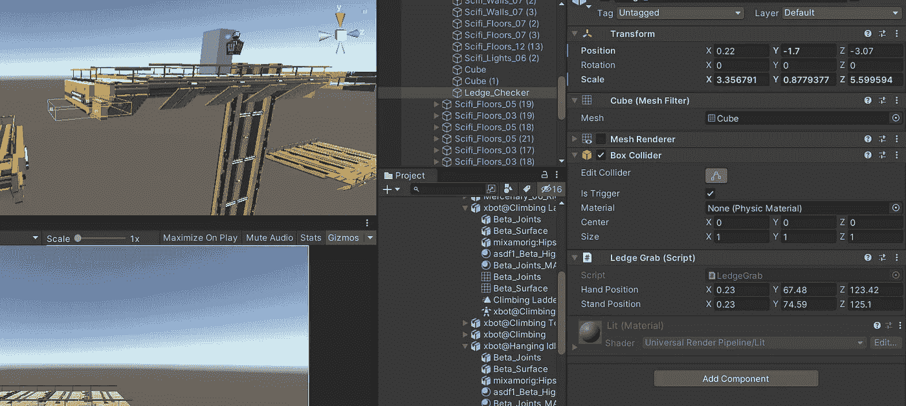

壁架对撞机及其特性

正如你所看到的，我做了一个新的脚本，并把它附加到壁架碰撞器上。我们去看看。

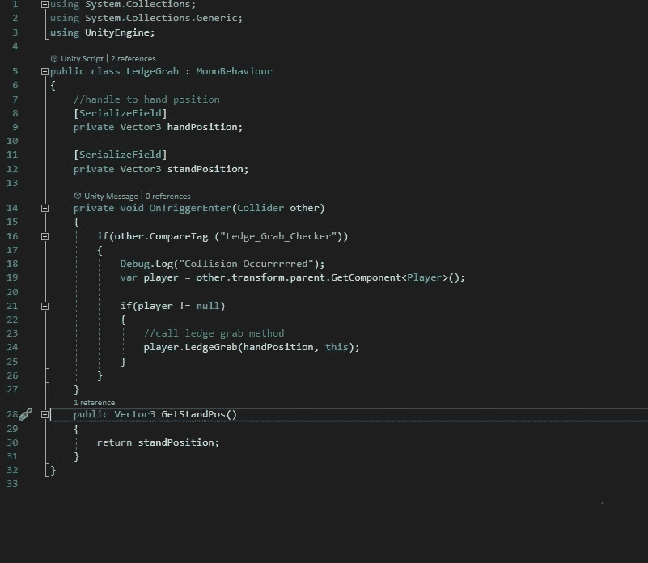

我一会儿会谈到手的位置和站立的位置变量。现在我想检查与 Ledge_Grab_Checker 的冲突，并调用播放器脚本中的辅助方法 create。

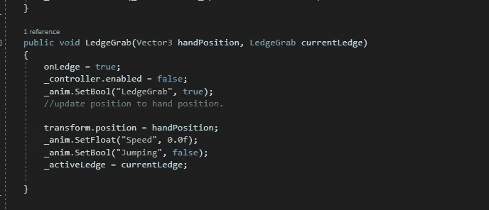

该方法将 onLedge 设置为 true，禁用控制器，并将我们在 animator 中创建的 bool 设置为 true，从而触发动画。我想把位置更新为手的位置。因此，我需要在动画触发后暂停游戏，然后将玩家移动到靠近壁架的边缘，以便玩家的位置与壁架对齐。

我给出了 handPosition 和 standPosition serializefield 属性，这样我可以在检查器中调整它们。

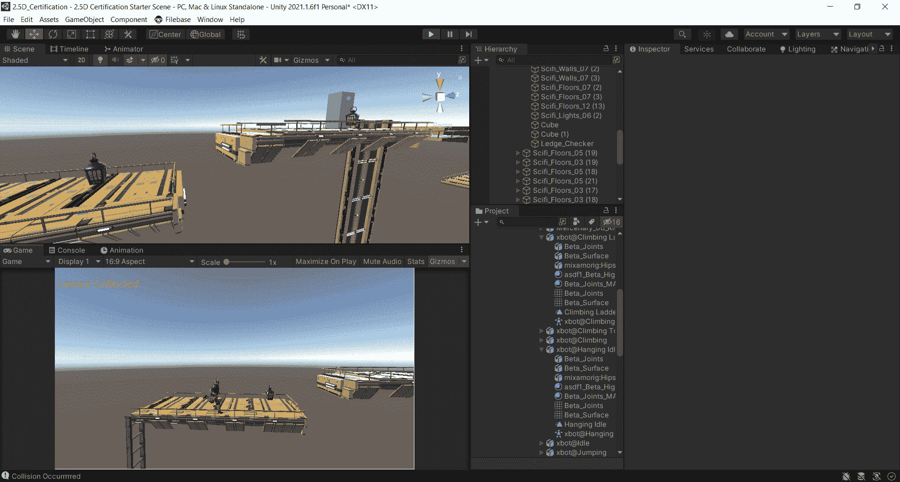

然后我需要让玩家能够通过按 e 键把自己拉上来，这相当简单直接。

找到一个向上爬的动画，添加到动画师。显然，您只需要在退出悬挂空闲动画时使用向上攀爬动画，因此从那里创建一个过渡。

我为此设置了一个触发条件。

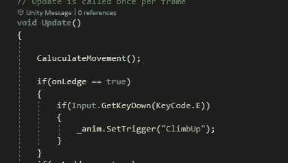

很简单。但是当玩家向上爬时，角色控制器仍然从悬挂设置为真时起被禁用。所以我需要在玩家站起来的时候在他们的位置重新激活它。

我在播放器脚本中设置了一个 ClimbComplete 函数。

这将使用 GetStandPos() helper 方法将玩家的位置设置为我们在 LedgeGrab 脚本中确定的 standPosition，该方法只返回 standPosition。

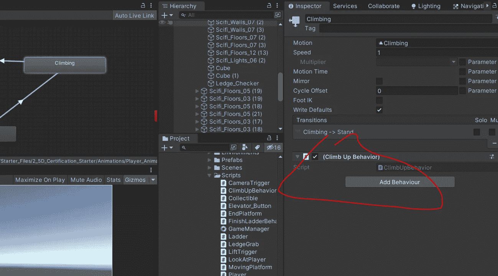

在攀爬动画上，我添加了一个行为脚本。这个脚本在动画的特定部分处理特定的事情。我想让角色控制器保持停用状态，但移动到玩家的新位置，所以下面的脚本对此有所帮助。

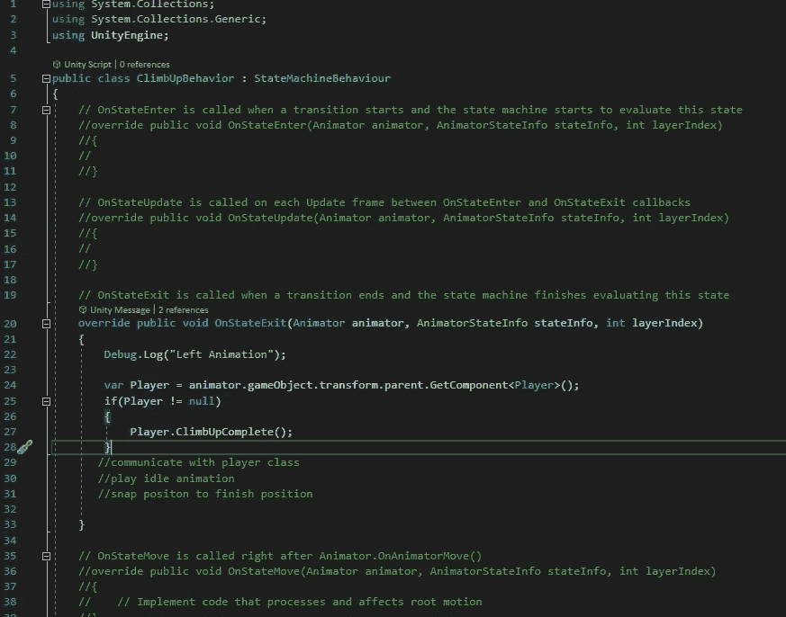

因此，一旦动画完成，它将调用播放器脚本中的 ClimbUpComplete()方法。

然后我从那过渡到站立的动画。一旦它完成，角色控制器通过玩家脚本中的 StandUpComplete()方法被重新激活。

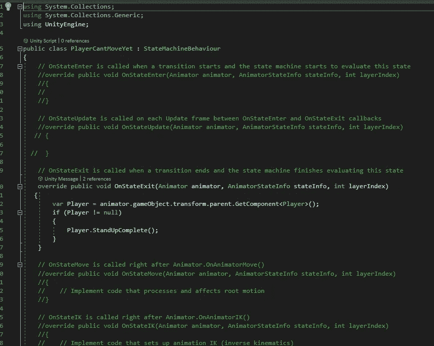

所以现在我可以跑，跳，抓住窗台，按 E，爬上来，站起来，然后再开始移动！

在下一篇文章中，我将介绍如何设置当你按下左 Shift 键时的滚动动画。

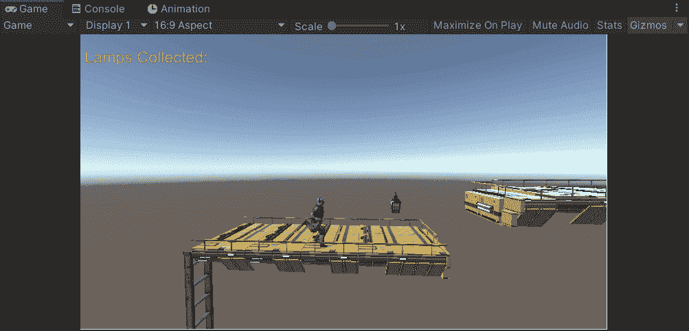