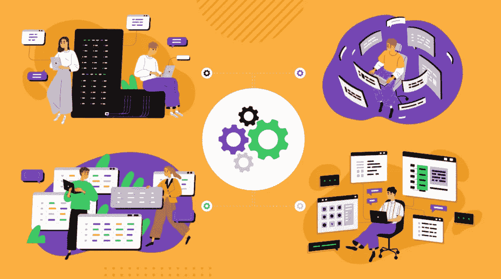
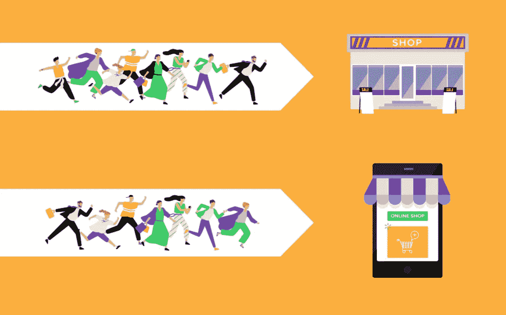
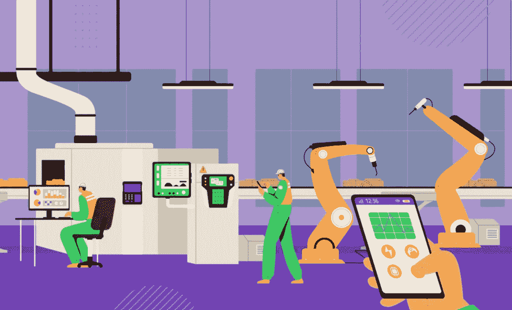

# 2022 年技术趋势推动您的业务发展

> 原文：<https://medium.com/nerd-for-tech/2022-technology-trends-to-step-up-your-business-4ee7f94b7fdd?source=collection_archive---------6----------------------->

技术专家正继续致力于开发和推广新的改良技术。当世界正在经历巨大的变化和动荡时，这一点尤其明显，就像冠状病毒疫情的爆发一样。

疫情和随之而来的封锁让所有行业都变得面目全非。停产、供应链中断、线下商店关闭以及其他因素影响着任何行业中大型企业和中小型企业的利润。

但是硬币也有反面。冠状病毒疫情不仅加速了企业的数字化转型，因为许多企业不得不将几乎所有流程转移到网上，还迫使科学家开发新的解决方案，并找到新的方法来为企业使用创新技术。

# 2022 年的主要战略性行业趋势

专门从事信息技术的研究和咨询公司 Gartner 的专家分析并[宣布了【2022 年的顶级战略技术趋势。让我们来看看这些技术是什么，工业如何从中获得最大利益。](https://www.gartner.com/en/newsroom/press-releases/2021-10-18-gartner-identifies-the-top-strategic-technology-trends-for-2022)

## 总经验

总体体验(TX)是一种战略，通过将客户体验(CX)、员工体验(EX)、用户体验(UX)和多重体验(MX)联系起来，创造卓越的共享体验。这种方法的目标是增加客户和员工的信任、满意度、忠诚度和支持。据 Gartner 称，组织将通过建立响应迅速且持续的 TX 业务成果来提高销售额和利润。

## 生成人工智能

生成式人工智能是一种机器学习技术，能够使用文本、音频文件或图像等现有内容来创建内容。换句话说，生成式人工智能使计算机能够抽象出与输入相关的底层模式，然后利用它来生成类似的内容。

这个工具的可能性是无限的。生殖人工智能用于创建软件代码，用于药物开发和有针对性的营销。根据 Gartner 专家的说法，到 2025 年，生殖人工智能将占所有数据的 10%，高于目前的不到 1%。

## 隐私增强计算

Gartner 预测，到 2025 年，60%的大型公司将使用 PEC 方法，该方法在数据、软件或硬件级别保护个人和机密信息，并确保这些数据的安全交换和分析。

## 可组合的应用程序

在危机和不确定性期间，公司需要能够快速调整业务以适应新的现实。为了使适应过程更容易，他们需要一种技术架构，允许应用程序快速、安全、高效地改变。

应用程序的复合架构增强了这种适应性。正如 Gartner 分析师所言，遵循复合方法的公司将比其竞争对手增长快 80%。

## 决策智能

决策智能是一门工程学科，它用来自社会科学、决策理论和管理科学的理论来扩充数据科学。这种技术为大规模机器学习应用奠定了基础。

正如 Gartner 预测的那样，在未来两年内，三分之一的大型组织将使用这种方法进行战略决策，以提高其竞争优势。

## 分布式企业

分布式企业是指在世界范围内拥有多个地点或分支机构的企业。这种开发方法对于正在或已经转向远程工作的组织来说是最适用和有益的。

Gartner 预测，到 2023 年，75%拥有分布式企业战略的企业将比其竞争对手增长快 25%。随着远程和混合模型变得越来越流行，分布式企业也越来越受欢迎。

## 数据结构

Gartner 将数据结构定义为跨平台和业务用户的灵活、弹性的数据集成。数据结构利用对现有的、可发现的和推断的元数据资产的连续分析来支持跨所有环境的集成和可重用数据的设计、部署和利用。

随着近年来不同数据中心和应用程序的数量显著增长，同时员工数量保持不变甚至减少，对数据结构的需求只会越来越大。在他们的帮助下，您可以通过内置分析提高信息处理的准确性，同时减少数据管理工作。

# 企业如何利用技术趋势？

事实上，It 技术可以大大加快几乎所有业务的发展。然而，没有多少公司可以夸耀几个 IT 解决方案的实际结果和公司 IT 结构开发的集成方法。

Emerline 愿意分享其实施 [IT 项目](https://emerline.com/portfolio)的经验，以及其对使用 [IT 技术](https://emerline.com/technologies)进行业务发展的优势和前景的理解。

## [零售业](https://emerline.com/industries/retail)的全体验战略

新冠肺炎危机继续迫使零售商寻求新的创造性方法来吸引顾客。企业需要向客户提供的不仅仅是产品，这一观点由来已久。

整体体验战略意味着将 UX 设计、营销内容和战略以及客户和员工体验结合起来，为您的品牌提供无缝、一致的体验。能够将人类与公司的所有交互点视为一个统一整体的公司，将能够更好地在远程工作条件下运营，并能够通过为客户创造有益的体验来扩大其数字收入流。

让我们以一家既有实体店又有网店的大衣店为例。如果该公司在其营销和业务战略中采用了全面体验的方法，客户将能够在该公司的网站上订购产品，然后通过其他媒体渠道接收订单状态的自动更新。同时，可以根据导致客户首次选择产品的体验，向客户提供经过微调的额外营销 CTA。

## 用于电子商务的可组合应用程序

可组合商务允许[电子商务](https://emerline.com/industries/e-commerce)组织选择和组装最佳的商务解决方案，并组合它们以满足其独特的业务需求。

可组合商务不是采用一刀切的电子商务功能来满足公司需求，而是利用 MACH(微服务、API、云、Headless)和 JAMstack (JavaScript、API 和标记)等创新技术和方法来适应当今和未来不断变化的市场动态。利用以业务为中心、模块化架构和开放生态系统等可组合的商业原则，公司可以实现以下结果:

*   更敏捷的交付。
*   更快上市。
*   改善所有接触点的体验。
*   实施新的商业模式。
*   创造独特的体验。

## 制造业的超自动化

超自动化允许制造商自动化每一个可以自动化的过程和任务。

通过将这些工具和技术结合在一起，超自动化可以用来提高工人的生产力，并自动执行他们执行的几乎任何重复任务，包括以前需要异常处理和人工干预的更复杂和长期运行的任务。超自动化技术可以用来保持对后台办公室和操作过程的控制，也可以支持工业过程的核心功能。

由于超自动化，配电板的生产商成功地创造了准备文件的自动化，这将工人从例行和乏味的工作中解放出来，使他们能够专注于其他更有价值的任务。

## 医疗保健中增强隐私的计算

对现代 [EMR 和 EHR 系统](https://emerline.com/solutions/emr-ehr)的需求不断增长，这些系统允许医生远程监控患者的健康状况，并允许人们更轻松地管理他们的健康数据，这使得确保电子记录中包含的数据的安全性和机密性变得非常重要。

现代隐私增强计算技术可以帮助解决这个问题。借助先进的隐私增强新技术，医疗保健公司可以提高客户数据的安全性，从而赢得并加强客户的信任。

电子学习行业是生成式人工智能可以得到最积极、最高效利用的行业之一。

教材的创作就是一个很好的例子。传统上，对于主题专家和教学设计专业人员来说，创建课程是最耗时的任务之一。幸运的是，在电子学习中利用生成式人工智能有助于在不牺牲质量的情况下，使课程创建过程更加简单、快速和灵活。

自动翻译和本地化功能是人工智能如何增强电子学习开发过程的一个很好的例子，提供了更高的速度和效率。

**Emerline 专家始终与新技术的发展保持同步，并随时准备在您的业务流程中实施创新解决方案。因此，如果您正在寻找通过创新技术解决方案在现代市场中脱颖而出的方法，我们将随时为您提供帮助。** [**随时联系我们**](https://emerline.com/contact-us) **进行免费咨询。**

最初发表于[https://emerline.com](https://emerline.com)。