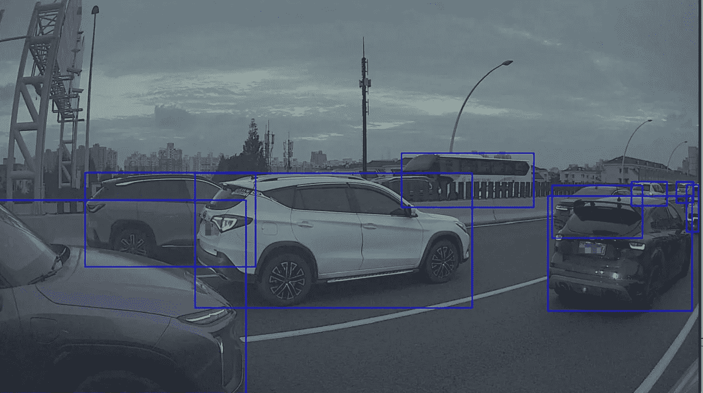

# 2D 对象检测和 2D 跟踪注释案例研究

> 原文：<https://medium.com/nerd-for-tech/2d-object-detection-2d-tracking-annotation-case-study-58956ed072b8?source=collection_archive---------1----------------------->

字节桥 2D 对象检测注释

## 什么是物体检测？

扫描和搜索图像和视频(一系列图像)中的物体，即定位和识别场景中的物体。

## 什么是对象跟踪？

我们在图像或视频中跟踪目标的移动方式、去向以及移动速度，以实时“锁定”特定的移动目标。就像你在跟踪一个人。

**目标跟踪有两种**

1.密集跟踪

2.稀疏跟踪

**现在让我们来看一个 2D 物体探测& 2D 跟踪标注项目。**

**1。项目基本情况**

项目的标注类型包括以下 **:**

(1)人类:行人、骑自行车的人和其他人类。

(2)车辆:小型汽车、卡车、公共汽车等。

(3)障碍物:路障、石墩、警示牌等。

(4)其他可移动物体:轮椅、滑板车、平衡车等。

**2。标签要求**

(1)盒子应适合目标，像素误差应小于 5px，特别注意盒子的高度。

(2)障碍物被遮挡时，需要根据想象标注完整的方框。

想象一下头部被遮挡且不完整的行人的实际尺寸。由于行人是在地面上行走的，所以盒子应该从头部一直延伸到地面。

(3)如果原始数据的质量较差，则不需要对图像进行标记。

**3。目标检测和目标跟踪的应用领域**

**物体检测的应用**

(1)人脸检测:主要应用于支付、刑事鉴定、电话人脸识别、身份盗用等商业活动中。

(2)车辆检测:用于智能交通、交通预测、自动驾驶等。

(3)行人检测:交通信号的判断和行人的反应。

(4)自动驾驶:自动驾驶系统的应用，交通状况的判断，以及响应。

(5)安全系统

(6)医学领域:医学检测和医学图像识别

**目标跟踪的应用**

(1)自动检测:监控场景以检测可疑行为。

(2)交通监控:实时收集交通数据，以指挥交通流量。

(3)人机交互:计算机具有识别人的姿势、动作、手势等能力。

(4)机器人视觉导航:在智能机器人中，跟踪技术可以拍摄物体的轨迹。

(5)虚拟现实:虚拟环境中的 3D 虚拟角色动作模拟可以直接受益于视频中人体运动分析的结果。

## 您可以手动配置和 ByteBridge 注释

**只差三步**

*   使用您的电子邮件登录
*   上传样本
*   告诉我们要贴什么标签:告诉我们最小标签尺寸和您需要的精度。

您可以将需求发送给我们，我们将处理配置工作。

那就轮到我们了。

演示和报价将在工作日不到 24 小时内准备就绪。

## 结束

将你的数据标注任务外包给[字节桥](https://tinyurl.com/42b33ccd)，你可以更便宜更快的获得高质量的 ML 训练数据集！

*   无需信用卡的免费试用:您可以快速获得样品结果，检查输出，并直接向我们的项目经理反馈。
*   100%人工验证
*   透明标准定价:[有明确定价](https://www.bytebridge.io/#/?module=price)(含人工成本)

## 为什么不试一试？