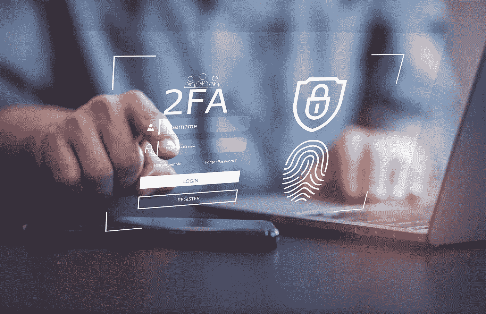

# 2FA 可以让安全的方式变得简单——如果我们愿意的话

> 原文：<https://medium.com/nerd-for-tech/2fa-could-make-the-secure-way-the-easy-way-if-wed-let-it-43b8673c9f47?source=collection_archive---------0----------------------->

至少十年来，网络安全会议上一直流传着一句口头禅:如果你想帮助人们确保网络安全，就让安全的方式变得简单。

根据国家网络安全联盟(NCSA)和网络安全和基础设施安全局(CISA)的说法，这一天就要到了，他们负责监督[网络安全意识月](https://www.cisa.gov/cybersecurity-awareness-month)(CSAM)——现在是第 19 个年头。CSAM 的“首要主题”是“保持在线安全很容易#BeCyberSmart。”

但这应该有一个警告。鉴于不断有关于猖獗(和成功)的网络犯罪的头条新闻，即[每年给美国经济造成数十亿美元的损失——估计数字到处都是，但其中两家估计在 35 亿至 90 亿美元之间——“容易”是一种愿望，而不是现实。如果保持安全真的那么容易，为什么仍有那么多人和组织遭到黑客攻击？](https://www.cobalt.io/blog/business-cost-of-cybercrime)

可能很大程度上是因为有时让事情变得简单很难。在数字世界里，这可能非常困难。人性就是这样，即使有更好的安全性的诱惑，也很难改变人们的习惯。

但有希望的消息是，虽然保持网络安全可能还不容易，但它正在朝着那个方向发展。

CSAM 第一周的主题是敦促使用双因素身份认证(2FA)，也称为多因素身份认证(MFA)，用于登录在线帐户，这是证据 a。现在通过两种方式验证你是你更容易、更快，这使得黑客更难声称他们是你。

但 2FA 仍远未成为主流。它越来越容易获得，但并不普遍。新思软件完整性小组的高级安全工程师鲍里斯·西波特(Boris Cipot)说，问题的一部分是网络世界仍然有许多不同形式的认证。

“我仍然看到已经有 2FA 可用多年的网络平台要求他们的用户启用它。两分钟就能启用？”他说。“另一方面，一些平台刚刚采用这项技术，而其他平台甚至没有某种程度的用户名和密码安全输入。”

**不等选项**

除此之外，所有 2FA 选项并不都是平等的。你让黑客难到什么程度取决于你用的是什么类型的 2FA。都聊胜于无，只是有些比其他的好。

只要密码是 2FA 组合的一部分，这也是 CSAM 网站所推荐的，在线“保持安全”将仍然是更多的梦想而不是现实。因为密码一直以来都是一种糟糕、过时的保护网络安全的方式。

这个早就知道了。大约二十年前，在 2004 年的 RSA 会议上，微软董事长比尔·盖茨[承诺密码](https://www.cnet.com/news/gates-predicts-death-of-the-password/)的消亡，因为“它们无法应对任何你真正想要保护的东西的挑战。”

即使它们很长、很复杂、很独特，它们也不够好，因为罪犯有太多的方法可以窃取它们。[今年早些时候](https://www.zdnet.com/article/better-than-the-best-password-how-to-use-2fa-to-improve-your-security/)在 ZDNet 上的一篇帖子指出，“你可以创建一个又长又复杂的密码，你只需花五分钟就能输入，如果你使用该密码的服务存储不当，然后其服务器被攻破，它将无法保护你。这是常有的事。”

[FIDO(快速身份在线)联盟](https://fidoalliance.org/)自 2012 年成立以来，一直致力于用其所谓的“一套开放、可扩展、可互操作的机制”来取代密码，以实现安全认证。对 FIDO 认证的支持现在已经内置于苹果、谷歌和微软的操作系统中。

这是令人鼓舞的，但仍远未达到目标。密码现在应该被扔进安全历史的垃圾箱了。然而，它们仍然是在线认证的主要手段。

这意味着对他们的规劝，现在应该很熟悉了，仍然是相关的。使它们又长又复杂。混合使用字母、符号和标点符号。永远不要——永远不要！—对多个帐户使用相同的密码。

是的，如果我们使用密码，我们应该做所有这些事情。但是相关不代表推荐。大多数人有 90 个或更多的密码。遵循上述建议不仅会让用户更难、更慢地访问他们的在线账户(这也是大多数人忽视它们的原因)，它们甚至没有提供多少保护。

然而，我们现在是在 2022 年，CSAM 对 2FA 的描述是“第一步是*给出你的密码或短语*。第二步是提供一种额外的方式来证明你是你，比如输入 PIN 码或向你的移动设备发送短信/电子邮件代码，或者访问认证器应用程序。”

NCSA 和 CISA 宣称，这“使得犯罪分子访问在线账户的难度增加了一倍。”

**难不了多少**

嗯，也许吧。更难，但不太可能加倍。

是的，如前所述，任何一种 2FA 都可以提高安全性，最多只需要几秒钟。但是如果 2FA 取消了密码，安全性会提高很多。

首先，正如不断被证明的那样，人们可能会被所谓的网络钓鱼攻击所欺骗，从而泄露他们的密码。其次，用户名/密码组合是一个“共享秘密”，因为它不仅存在于用户的设备上，也存在于提供商的服务器上，众所周知，这些服务器可能会被黑客攻击。

前 FIDO 执行董事、现 Hedera Hashgraph 执行董事布雷特·麦克道尔(Brett McDowell)多年前曾将“强密码”一词称为矛盾修饰法，不管当你创建一个密码时，从红到黄再到绿的小条是否会让你感觉更好。

麦克道尔说，ZDNet 最近重复了一句话——复杂的密码比简单的密码好不了多少，因为“只要密码是让我们进入账户的关键，用户就会被骗，把密码给了错误的人。”

Synopsys 网络安全研究中心的首席安全策略师蒂姆·麦基(Tim Mackey)指出，2FA“致力于改善这种情况，直到你认识到单点故障对身份认证安全并没有太大帮助。”

那么，既然有更好的选择，为什么还要将密码作为 2FA 的一个有价值的组件来推广呢？

**现实占上风**

FIDO 联盟的高级营销总监梅根·沙马斯(Megan Shamas)表示，CSAM 只是按照世界的现状——密码仍然盛行——而不是按照 FIDO 希望的那样很快应对。“任何形式的 2FA，包括一个密码和另一个因素，如文本代码，都将比仅仅一个密码更能提高在线账户的安全性，”她说，并补充说，“这也是当今最常见的 2FA 形式，所以 CSAM 的活动鼓励人们甚至打开基本的 2FA，这是一件好事。”

“教育难题是，目前消费者的 2FA 选项并不一致，FIDO 也不是到处都有，所以你不会希望消费者说，‘哦，他们不提供 FIDO，我什么都不用，’”她说。

确实如此。有总比没有好。但是网络世界越早发展到比现在更好的东西，就越好。尤其是在黄金时间更好的东西已经准备好了。

如上所述，FIDO 机制和其他一些 2FA 模型旨在消除“你知道的东西”(密码)，而是依赖于“你拥有的东西”(令牌或可佩戴的东西)和“你是什么东西”(指纹、声音、面部、虹膜)。

与密码不同，这些识别机制要么是用户身份的一部分，要么只存储在用户的设备上。

为了破坏这些认证，攻击者必须攻击该人或获得该设备的物理所有权。这是可能的，但对黑客来说，这比坐在世界任何地方的电脑前使用偷来的密码入侵你的生活或你的组织要困难得多。

SANS 研究所的主任 Lance Spitzner 几十年来一直是一名安全意识培训师，他在最近的一条推文中指出，最重要的不是 MFA 本身，而是什么样的 MFA。“请记住，MFA 有许多不同的版本，有些版本比其他版本更安全。他写道:“苹果、谷歌和微软采用 FIDO/生物识别技术是长期的解决方案。

Shamas 说，FIDO 的目标是“教育在线服务提供商，他们应该像 FIDO 一样提供或计划提供防钓鱼的多因素身份认证选项。”

**不是防弹的，但是……**

抵制的一个主要因素是 FIDO 使用了加密技术。Shamas 说，由于任何人都可能被诱骗透露一次性密码，“使用加密技术意味着用户在攻击中没有任何东西可以泄露——成功的网络钓鱼攻击的威胁被消除了”。

然而，即使这样也应该有一个警告。没有什么是完美的，包括最好的 2FA。正如许多专家指出的，[一些网络钓鱼攻击可以绕过 2FA](https://corneacristian.medium.com/how-to-bypass-2fa-mfa-with-phishing-64fe3b05cbee) 。

斯皮茨纳在随后的一条推文中指出了这一点，他写道，重要的是要意识到“抵制”网络钓鱼并不意味着防网络钓鱼。虽然他自称是“FIDO 的超级粉丝”，但他指出，“采用 FIDO 并不意味着您的组织可以安全抵御网络钓鱼攻击。大量的钓鱼攻击与密码无关。”

尽管如此，FIDO 版本的 2FA 比包含密码的 2FA 更接近完美，考虑到被黑客攻击可能导致的灾难性的大量麻烦，从被盗的身份到知识产权的损害，采用它应该是显而易见的。

但正如西波特指出的，逻辑并不总是占上风。他说，这可能需要政府监管的手来迫使市场可能永远不会自己完成的变化。

“不幸的是，仅仅制造安全技术是不够的。它必须以某种方式被要求，”他说。“汽车中的安全带比法律规定的使用时间要长得多。摆脱密码也是如此。在它们被禁止之前，将使用密码，更好的认证技术不会被广泛接受。”