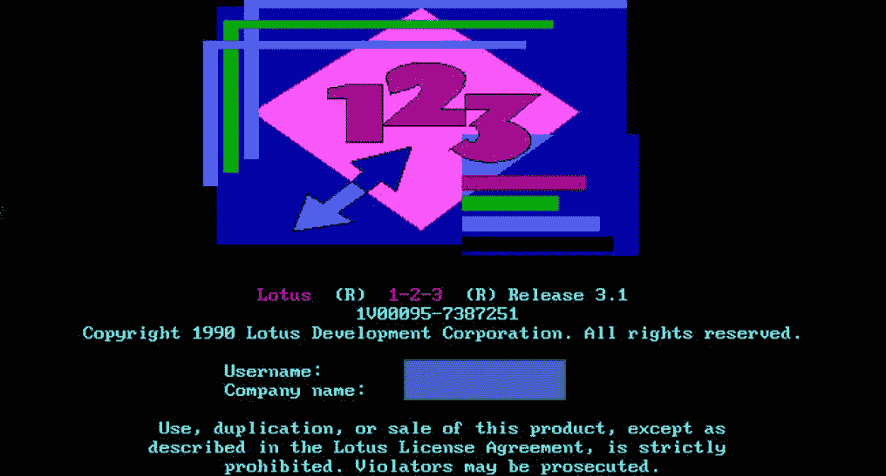

# 技术 30 年:我的第一个“数据仓库”

> 原文：<https://medium.com/nerd-for-tech/30-years-in-tech-my-first-data-warehouse-f696754ae482?source=collection_archive---------8----------------------->

今年标志着我在数据和分析领域的三十年，这似乎是一个有效的理由来反思这些年来我所看到的所有愚蠢，以及自我职业生涯开始以来事情是否有所改善(剧透:不一定)。

回到 1991 年，我是信息科学专业的四年级学生，有太多的空闲时间，渴望做一些真正的工作。赚点外快也无妨，所以我报名参加了 [Integrand](https://www.integrand.nl/en) (学生实习中介)，很快就接到了附近一家中小企业的面试电话。该客户原来是一家雄心勃勃的控股公司，正在寻找一种更好的方法来整合和报告来自不同公司的财务信息，每个公司都有自己的财务应用程序。他们当时的“系统”由一堆不相关的电子表格和系统导出文件组成，这些文件被发送到软盘驱动器上。然后，他们每个月又要花大约一周的时间来完成他们的月度管理报告。总的来说，这个过程每个月要花 2 到 2.5 周的时间，这是非常不理想的。所以我的任务很简单:找出如何加速和改善这个过程。目标？在每月结算的一周内准备好他们的数字。

我成功了吗？好吧，让我从吹嘘最终结果开始:我在一天内完成了整个事情(在每个人都按时提交数据的罕见情况下)，但通常需要大约两天。不用说，他们非常开心，因为我喜欢开心的顾客(顺便说一句，我现在也是)，所以我也很开心。

当然，这个项目并非没有挑战。那是 1991 年。各个办公室之间没有网络，所以数据交换是非常物理的:将数据存储在软盘驱动器上，然后发送出去，甚至:把它带进来。所有的公司都有自己的财务系统，自己的 KPI 和不同的市场。然而，他们需要了解公司整体的表现。幸运的是，雇佣我的人是一位经验丰富的财务总监，有一些 IT 技能，我有数据和 IT 背景，有基本的财务知识。我们一起组成了一个很好的团队。这就引出了我想分享的第一个“最佳实践”:确保你的团队中有领域专业知识，并且(甚至更重要的)与业务和业务目标保持一致。

我们最终定义的是所有公司共有的一组 60 多个数据点，涵盖了他们需要的报告和 KPI 所需的一切。为了收集这些数据，我开发了一个数据输入应用程序，每个公司只需打开当前月份，开始输入所需的数字。为了存储和整合这些数据，我开发了一个多维数据库，作为 KPI、趋势和详细报告的来源，这些报告也包含在同一个应用程序中。所有这些都没有任何数据仓库或商业智能的知识，这些术语我是几年后才知道的。我们只是一路想出办法，做看起来有意义的事情。显然，我们似乎已经找到了使项目成功的正确方法。

但是等等。多维数据库，KPI 报告，1991 年？是的，所有这些都是由最新版本的 Lotus 1–2–3:3.1 实现的！版本 3 是第一个有多个工作表的电子表格应用程序(“3D 电子表格”，这正是我们所需要的)，版本 3.1 增加了所见即所得的功能，使整个事情更加用户友好。加上基本的数据库操作、强大的宏语言和集成的图表/图形，您就有了一个非常强大的工作台来完成手头的任务。解决方案和工作流程非常简单:每个子公司都有自己的软盘和数据输入应用程序。每个月，每个人都输入所需的数字并提交结果，之后数据被导入中央“数据库”。当时剩下的就是按下按钮启动宏来完成剩下的魔法。

这让我想到了这篇文章的最后一个“最佳实践”或见解:技术是一个伟大的推动者(甚至可能是必不可少的)，但真正的成功只能通过正确的设计、流程和业务一致性来实现。所有这些都与最新的 IT 小发明关系不大。