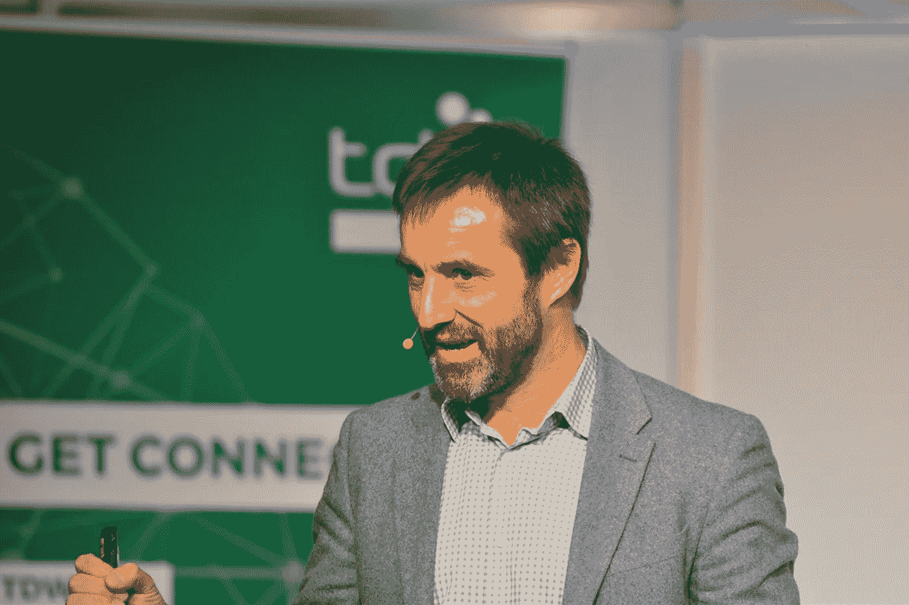

# 技术领域 30 年:培训和公开演讲

> 原文：<https://medium.com/nerd-for-tech/30-years-in-tech-training-public-speaking-76f3ec7cc559?source=collection_archive---------5----------------------->

虽然 2021 年已经过去，我的“30 年”也正式过去了，但仍然有很多话题要谈。其中之一就是我如何开始向观众展示，并使之成为我科技职业生涯的一部分。这不是一夜之间发生的，坦率地说，对于我的第一次演讲，我非常紧张！但让我们回到一切开始的地方:作为一名技术培训师。这为我后来在裁谈会的努力奠定了坚实的基础。

2017 年 TDWI 欧洲主题演讲

这一切始于 1998 年，当时我作为独立顾问加入了一个团队，为一家著名的荷兰食品公司实施 ERP(Baan IV)。不知不觉中，我领导了数据管理团队，建立新的报告解决方案是团队的职责之一。该公司选择了 Business Objects 作为他们的报告工具，因为这对我们所有人来说都是新的，所以我们被派去参加培训。正如你可能已经在我的[上一篇文章](/nerd-for-tech/30-years-in-tech-these-are-my-favorite-things-6f86626940d7)中读到的，我很快就爱上了 BO。我非常喜欢它，项目结束后，我参加了认证课程，并成为了一名认证业务对象顾问。不一会儿，有熟人打电话问我有没有兴趣送博记者培训。

于是我的生活开始了一个新的阶段，那就是兼职(BO)培训师。我真的很喜欢(现在仍然喜欢)教人们一些新东西，让他们热衷于用手头的工具做一些很酷的事情。在接下来的几年里，我培训了数百名来自不同背景的人。这不仅仅是关于报道，而是关于迅速扩张的整个 BO 世界。与此同时，我继续在不同的项目中担任顾问，巩固我的产品知识，这反过来可以转化为新的培训材料。

所有这些在培训室的经历帮助我适应在不同的人群中发言，如果你想迈向“大”的舞台，这真的很有帮助。但是，仍然有些事情你不能做好准备……2006 年，我开始为荷兰贸易出版物“数据库杂志”撰写文章，并撰写了一系列关于开源 BI 的文章。该系列的第一个项目是关于开源数据库的，我被邀请在 Database Systems 2007 上谈论这个话题(顺便说一句，仍然作为 [DW & BI 峰会运行)。这将是我有史以来的第一次公开展示，这当然让我兴奋(他们甚至考虑我，我感到很荣幸)，当然我想做好充分准备。](https://www.dwbisummit.com/eventpage/datawarehousing-business-intelligence-summit/sprekers?lang=en)

幸运的是，我可以在一些当地的聚会上练习几次。对于有抱负的演讲者:这是你准备工作的重要部分！它帮助我改进了我的时机和流程，为观众澄清了材料，并为人们可能提出的问题做好了准备。

然后，重要的一天来了。我把一切都安排好了，休息后走进房间，看到谁坐在第一排。首先是著名的作家和数据库大师 Rick van der Lans，他旁边是 T2 的 Martin Kersten 教授，他创造了 T4 的 Monet db T5，这是我报道的产品之一。

我读到过一些人宁愿死也不愿在公共场合讲话，在那一刻，我肯定是其中之一。我仍然不知道我是如何从我的嘴里得到任何一致的句子，但显然我做到了。更重要的是:令我欣慰的是，里克和马丁都喜欢我的演讲！事实上，瑞克非常喜欢它，邀请我在其他会议上发言，比如在伦敦举行的 IRM-英国 DW 会议。

我对开源商业智能的兴趣还带我去了慕尼黑的 [TDWI 欧洲](https://www.tdwi-konferenz.de/tdwi-2022/startpage-englisch)，这是欧洲最大的商业智能会议之一。在我作为与会者的第一次访问中，我遇到了马克·马德森。事实证明，我们有如此多的共同兴趣，以至于我们开始就不同主题的联合演示进行合作，其中开源 BI 是 2008 年的第一个。从那以后，我成了常客，2017 年，也就是我在 TDWI 当老师十周年的时候，我被邀请为大约 1200 名观众做[周三主题演讲](https://www.tdwi-konferenz.de/fileadmin/user_upload/3.0_TDWI/TDWI_2017/Downloads/TDWI_2017_EKFP_Web.pdf)。

我紧张吗？嗯，当然有一点。在开始的时候总会有一点健康的紧张，但是我已经知道当我熬过第一分钟，我会好起来的。那句话的关键词是“学会了”。每一次演讲或培训都是一次学习经历，将帮助你成为更好的演讲者和/或培训师。这同样适用于客户演示、内部团队演示，甚至是与朋友交谈。这是我从 Rick van der Lans 那里学到的最好的演讲技巧之一:就像你和你的朋友坐在酒吧里一样说话。如果你的故事吸引了他们，那么对其他观众来说也是如此。

我有没有像 2007 年第一次演讲时那样紧张过？你打赌！2010 年，我受邀在伦敦由艾瑞克·希格尔组织的预测分析世界上发表演讲。不仅他在那里；除此之外，还有[约翰·艾尔德](https://www.elderresearch.com/people/john-f-elder-iv-ph-d/)和[乌萨马·法耶兹](https://en.wikipedia.org/wiki/Usama_Fayyad)。我仍然记得 Usama 质问我开源数据挖掘工具是否已经准备好用于企业。根据我自己的经验，我当时并不完全信服，所以我以“这要看情况而定”结束了讨论。尽管如此，他和其他人都很友好。

这就是问题所在:包括专家在内的听众将会立即发现你是否准备充分，做了研究，并努力用一个像样的幻灯片来支持你的演讲。他们总是非常友好和热情，即使你相对来说是这个领域的局外人或新手。如果你做了功课，就没有理由紧张。但是如果你认为你的观众是理所当然的？哦，孩子，我已经为你感到紧张了。