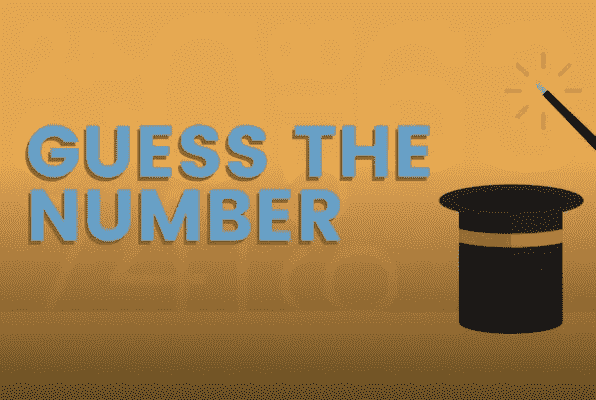

# 用 Python 制作数字猜谜游戏的 4 个简单步骤

> 原文：<https://medium.com/nerd-for-tech/4-easy-steps-to-make-a-number-guessing-game-in-python-d877932c7ed6?source=collection_archive---------1----------------------->



资料来源:funbrain.com

我发现大多数可以在网上找到的用 Python 制作数字猜谜游戏的项目都非常麻烦，并且使用了大量的函数。(可以在线玩猜数字游戏[这里](https://www.funbrain.com/games/guess-the-number))。

在本文中，我用一个简单的函数实现了同一个游戏的逻辑，这个函数便于理解，同时也易于编码。

**游戏目标-:**

1.  包括 ASCII 艺术标志。
2.  用户提交他对 1 到 100 之间的数字的猜测。
3.  对照实际答案检查用户的猜测。打印“太高”或者“太低了。”取决于用户的回答。
4.  如果他们的答案是正确的，向玩家展示真实的答案。
5.  跟踪剩余的圈数。
6.  如果他们轮次用完，向玩家提供反馈。
7.  包括两个不同的难度级别(例如，在简单模式下猜 10 次，在困难模式下只猜 5 次)。

让我们直接开始吧！

**第一步:包括一个 ASCII 艺术标志**

ASCII 生成器的文本可以在这里找到。只需输入要转换的文本，该工具就会生成文本的 ASCII 艺术形式。

**步骤 2:用户输入设置**

```
import random
MY_GUESS = random.randint(1,100)
print(logo)
print("Welcome to the Number Guessing Game!\nI'm thinking of a number between 1 and 100.\n")
difficulty = str(input("Choose a difficulty. Type 'easy' or 'hard': ")).lower()
```

我们为 MY_GUESS 变量导入了一个随机库，它使用 randint 方法 random 获取一个从 1 到 100 的随机整数值。

```
difficulty = str(input("Choose a difficulty. Type 'easy' or 'hard': ")).lower()
```

可变难度是一个字符串变量，让用户决定游戏的设置，如果他们想玩简单或困难的设置。

**第三步:定义计数函数**

```
def count(counts, attempts):
  print(f"The correct answer is {MY_GUESS}")
  no_of_guesses = False
  count = 1 
  print("You have 10 attempts remaining to guess the number.\n")
  while no_of_guesses == False and count <= counts:
    guess = int(input("Make a guess: "))
    if guess == MY_GUESS:
      print(f"You got it! The answer was {MY_GUESS}")
      no_of_guesses = True
    elif guess < MY_GUESS:
      print(f"Too Low.\nGuess Again.\n")
      count += 1
      attempts -= 1
      print(f"You have {attempts} attempts remaining")
    elif guess > MY_GUESS:
      print(f"Too High.\nGuess Again.\n")
      count += 1
      attempts -= 1
      print(f"You have {attempts} attempts remaining")
```

count 函数接受两个参数“计数”和“尝试”。count 变量不同于“counts”变量，因为每当猜测错误时它就递增，而“attempts”变量在每次尝试后递减。

**定义布尔变量‘猜测次数’:**

```
no_of_guesses = False
```

猜测次数跟踪 while 循环以及何时应该停止它。

**while 循环的条件:**

```
while no_of_guesses == False and count <= counts:
    guess = int(input("Make a guess: "))
    if guess == MY_GUESS:
      print(f"You got it! The answer was {MY_GUESS}")
      no_of_guesses = True
```

如果猜测的次数是假的，并且计数小于计数(参数),我们要求用户进行猜测。我们用 MY_GUESS 变量检查相等性，这是随机进行的初始猜测。

```
elif guess < MY_GUESS:
      print(f"Too Low.\nGuess Again.\n")
      count += 1
      attempts -= 1
      print(f"You have {attempts} attempts remaining")
elif guess > MY_GUESS:
      print(f"Too High.\nGuess Again.\n")
      count += 1
      attempts -= 1
      print(f"You have {attempts} attempts remaining")
```

然而，如果用户的猜测是错误的，我们将计数变量增加 1，并将尝试次数减少 1。这里，如果猜测值与 MY_GUESS 值相比较小。我们输出一个值“太低”的提示。再猜。”同时，提醒用户他已经尝试的次数。

类似地，如果猜测值比 MY_GUESS 值高。我们输出一个值“太高”的提示。再猜。”再次提醒用户他已经尝试的次数。

第四步:调用“计数”函数。

```
if difficulty == 'easy':
  count(10, 10)
elif difficulty == 'hard':
  count(5, 5)
```

我们传递参数 10，10:计数，尝试简单模式，传递参数 5，5 用于困难模式，如目标中所述。

> print(MY _ GUESS)——→Psst，你可以用这个来检查电脑猜测的数字

我希望这一个坚持马丁的古老格言，

*“任何傻瓜都能写出计算机能理解的代码。优秀的程序员会写出人类能理解的代码。”—马丁·福勒*

你喜欢我的努力吗？如果是的话，请跟我来获取我的最新帖子和更新，或者更好的是，请我喝杯咖啡！☕

[](https://www.buymeacoffee.com/ayushdixit)[](https://www.buymeacoffee.com/ayushdixit) [## ayushdixit 正在编码、部署项目和写博客

### 嘿👋我刚刚在这里创建了一个页面。你现在可以给我买杯咖啡了！

www.buymeacoffee.com](https://www.buymeacoffee.com/ayushdixit)