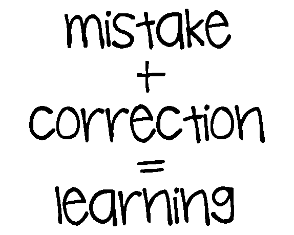

# 我从创业中学到的 4 个教训

> 原文：<https://medium.com/nerd-for-tech/4-lessons-i-learnt-at-a-startup-4baa8c4768c?source=collection_archive---------7----------------------->

“成长、学习、令人兴奋、严谨、富有挑战性、志同道合的人”，“创业 1 年的经验相当于 10 年朝九晚五的工作经验”。你一定听说过很多关于在创业公司工作的说法；至少我做到了，而且是真的！

当然，在初创公司工作是令人惊奇的。你可以学到很多东西，与不同的人群互动，有时还有机会制定规则。我得到了一个在初创公司工作的机会，我是第一个员工(是的，我对此很感激)。

我相信我有一个很好的机会，不仅可以领导一家公司，还可以为它打下基础。但是这种过山车之旅是我余生都要拥抱的。

在这篇文章中，我分享了我作为一名大一新生在创业公司工作的经历:我犯了哪些错误，我学到了什么，我是如何改正的。

> 关于我自己:我是一名电子和电信工程师。不久之后，我完成了数据科学的研究生证书，并在疫情期间找到了一份数据科学家的工作。我有使用 Kaggle 和其他类似公共资源的公共数据集进行数据科学项目的经验。除此之外，我之前没有任何行业经验。

照片由[懂事的中国人](https://learnchinesecharacters.academy/wp-content/uploads/2015/03/asic_equation-copy.png)拍摄

# 错误#1:全面

最初，当我们开始时，我们讨论了产品是什么，它将做什么以及技术要求是什么。基于此，我设计了一个构建基础设施的策略。显然，我非常兴奋地实现了我的第一个真实项目。因此，我做了一个演示，有一个基础设施计划(产品应该如何工作)和我们需要做什么。我想“哦，哇！这太棒了。来呈现一下吧。我们可以做到这一点。”

不久之后，我意识到我做得过火了，提出了一些我不知道如何去做的事情。当我的经理问“看起来不错，但你打算如何实施？”我一无所知。“我还没有学会实现这些”，我对自己说。**该死的**！我为自己的胡言乱语感到羞愧，有点失去信心。

教训:当你对此毫无头绪时，不要说“这是我们应该做的”。要分析，不要感情用事。

> PS。这是我在创业公司的第一周

# 错误 2:“我认为这是不可能的”

记住:一般来说，你的经理比你更有经验。所以，如果他/她提出了一个策略或想法，不要未经研究就说“不，这是不可能的”而立即拒绝。你可能会受到他们的冷遇。因为想想看，你愿意听到一个直接的“不”的回答吗？谢天谢地，我的经理理解我，知道如何挑战并完成工作(以一种文雅的方式)。

是的，在某些情况下，他们所建议的可能实际上是不可能的。但是现在不要忽视它。带着这些观点，思考它们，在网上研究，或者问你的熟人，然后告诉他们为什么那些想法是可能的/不可能的。还有，你永远不知道；你还是想办法解决吧！

照片由 [Pexels](https://www.pexels.com/photo/impossible-text-5238695/?utm_content=attributionCopyText&utm_medium=referral&utm_source=pexels) 的 [Olya Kobruseva](https://www.pexels.com/@olyakobruseva?utm_content=attributionCopyText&utm_medium=referral&utm_source=pexels) 拍摄

**教训:**在拒绝他们的建议之前要等待。搜索一下，让他们知道为什么可能或者不可能。很多时候，**总有解决的办法。**

# 错误 3:假设别人知道你在做什么

科技行业是一个不断变化的行业。每个月、每周或每天你都会有新的发现。数据科学也是如此。不是每个人都知道数据科学生命周期是什么；我们数据分析师、数据工程师、ML 工程师和数据科学家为了实施数据科学项目而遵循的步骤。在更广泛的意义上，数据科学对人们来说仍然是一个相当新的概念(截至 2021 年)；无论是客户、有经验的专业人士，甚至是我们的经理。

您可能会遇到不知道如何有效使用数据的客户。我们的工作是帮助他们理解“他们的数据”和潜在的商业机会(是的，你没看错！)

有时你的经理可能没有扎实的技术背景。对于他们来说，理解预处理步骤可能非常具有挑战性！帮助他们了解实际情况是我们的工作，也是我们的责任。

照片由[this is 工程](https://www.pexels.com/@thisisengineering?utm_content=attributionCopyText&utm_medium=referral&utm_source=pexels)从[像素](https://www.pexels.com/photo/engineers-planning-structure-3862370/?utm_content=attributionCopyText&utm_medium=referral&utm_source=pexels)拍摄

教训:对他们温柔点。花些时间帮助他们理解为什么需要采取一些措施，其意义何在。他们可能不完全理解，但这将帮助他们获得信心，加深对你所做的一切的信心。要有*互信*！

# 错误 4:没有有效地管理你的观点

想象一个团队正在讨论计划和下一步的策略的情况。您可能会发现某个步骤应该以不同的方式执行，但是您不会当场传达，因为您认为“我们可以稍后处理这个问题。”不要这样。你在浪费公司和你的时间和努力。

创业公司有快节奏的环境。要做出的决定应该是迅速的，但又是无可挑剔的。跨职能团队在一天内会召开一系列会议。没有时间浪费在一次又一次地重新制定计划上。进行中的改进是不可避免的，但是那是在选择的步骤上，而不是在整个项目计划上。

当然可以！你也可以与队友就通话进行辩论或激烈的争论。**就这样吧！**有时候你是对的，团队会改变计划。也会有你错了的情况，这绝对没问题。拥有它，接受它，继续前进！

照片由[迈克尔·布隆维斯特](https://www.pexels.com/@mikael-blomkvist?utm_content=attributionCopyText&utm_medium=referral&utm_source=pexels)从[派克斯](https://www.pexels.com/photo/team-having-a-meeting-6476254/?utm_content=attributionCopyText&utm_medium=referral&utm_source=pexels)拍摄

教训:坦率而清晰地表达你的想法，但要巧妙。你的一个建议可以优化项目的生命周期。

包括你在内的每个人都在努力创建一个成功的公司，无论是初创公司还是成熟的组织。没有人在帮助任何人。**你的公司需要你，你需要你的公司**；协作并不断进步。

> “在这个过程中会犯一些错误。这很好，因为至少有些决定是在这个过程中做出的”
> 
> ——史蒂夫·乔布斯， [1997 年全球开发者大会。](https://www.youtube.com/watch?v=oeqPrUmVz-o)

# 最后的话

犯错误，从中吸取教训，愿意向前失败，并和你的同事一起喝啤酒！[🍻](https://emojipedia.org/clinking-beer-mugs/#:~:text=Two%20frosty%20mugs%20of%20beer,lines%20to%20mark%20the%20clinking.&text=Clinking%20Beer%20Mugs%20was%20approved,to%20Emoji%201.0%20in%202015.)

如果你喜欢这篇文章，请一定要喜欢它，并在下面的评论区分享你的观点！