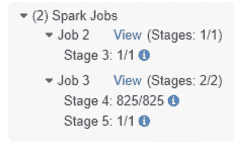
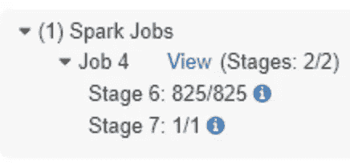

# 5 个最常见的火花性能问题

> 原文：<https://medium.com/nerd-for-tech/5-most-common-spark-performance-problems-9924b863421f?source=collection_archive---------0----------------------->

在这篇文章中，我将讨论 5 个最常见的 spark 性能问题。这些都是很常见的，而且大多被忽视了，或者人们经常弄不清去哪里找。

我们通常会对从哪里开始感到困惑🤔，我应该调查 Spark UI 吗？或者我的集群配置？还有 Spark UI 下到底找什么？Spark UI 提供了很多很多信息，但是有几个选项卡/部分我们应该主要寻找,“至少”不要成为这些常见问题的受害者。

这篇文章将被分成 6 篇，每篇都有一个引发问题的讨论和详细的缓解(这里的想法是不要用一篇长文让读者昏昏欲睡😅).这是这个系列的第一篇关于基本问题讨论和热身的文章(是的，你没看错，这是热身😉).

坚持家伙的。让我确定指出。这些不会那么令人困惑或难以进入。此外，我敢打赌，你一定会觉得这个博客很有趣。因此，请耐心等待，让我们一起完成这一 Spark 优化之旅。“缓慢而稳定地”😁

特别要提到那些给了我这些知识的人，在这里我可以为你们写下来。

> 多亏了 Databrick 的
> 
> [**优化 Apache Spark On databricks**](https://academy.databricks.com/instructor-led-training/optimizing-apache-spark-on-databricks)**课程**

**让我们通过理解下面的 spark 代码做一点热身，并尝试回答下面的问题。**

```
Step1:spark.read.parquet(file_path).count()execution time: ~28 sec.Step2:spark.read.parquet(file_path).count()execution time: ~13 sec.
```

****

**Q1:为什么第二步比第一步花的时间少？**

```
Step3:spark.read.schema(data_schema).parquet(file_path).count()execution time: ~13 sec.
```

****

**Q2:为什么第三步比第二步少了一项工作？**

```
Step4:spark.read.schema(data_schema).parquet(file_path).foreach(_=>())execution time: ~13 mins.
```

**Q3:为什么 foreach()比 count()操作花费的时间多得多？**

```
Step5:spark.read.schema(data_schema).parquet(file_path).foreach(lambda x: None)execution time: ~2 hrs.
```

**Q4:为什么第 5 步(Python 代码)比第 4 步(Scala 代码)花费的时间多得多？**

**慢慢来，试着分析代码片段并回答上述问题。完成后，向下滚动，让我们一起走，了解以上 mistrys 背后的原因。**

**让我们回顾一下:**

**A1:如果我们注意到步骤 1 和步骤 2 的代码是相同的，这意味着我们正在尝试再次读取相同的数据。此外，如果我们注意到给定的作业图像，我们可以看到有两个作业触发了作业 2 和作业 3。Job2 的目的是读取模式，从而创建具有 1 个任务的阶段，Job3 的目的是读取实际数据，从而创建具有 825 个任务的另一个阶段。**

**在步骤 2 中，由于模式已经读取，spark 再次跳过读取模式，因此我们只有一个包含 825 个任务的阶段。**

**因此，看起来我们可能会在多次运行相同的代码时遇到性能问题(很有趣吧？)**

**A2:我们现在已经知道这个问题的答案了。从我们的 A1 开始，由于在后续运行中跳过了模式重新读取。**

**A3:所以 count()操作在操作方面有所优化。这意味着使用列存储格式(如 Parquet)可以在不读取所有数据的情况下识别记录的数量。相反，foreach()遍历所有记录来执行操作，从而导致更多的性能时间。**

**答 4:首先，python 并不慢，事实上，在某些情况下，我们可能会看到 Python 比 Scala 快得多。在这个特定的场景中，如果我们更仔细地看代码，会发现有一个 lambda 函数，在 python 的情况下，它需要被提取并发送给执行器，执行器也需要有 Python 解释器来执行代码。因此，即使 lambda 在技术上什么都不做，序列化的成本也是巨大的(别急，我们将在最后一节详细讨论序列化，这只是给出一个想法)。**

**所以，这是我们这个系列的第一篇博客，我希望你能找到一些关于 w . r . t . Spark 的有趣的观点，我个人也发现这些观点很有趣，所以想与大家分享。**

**我们将很快推出下一篇博客。敬请关注🤞。只是为了让你一窥究竟，我们将讨论 Spark 的 [**【歪斜问题】**](/@adityasahu188/sparks-skew-problem-does-it-impact-performance-257cdef53680) **【现已上市】**。在那之前继续冲浪😛。**