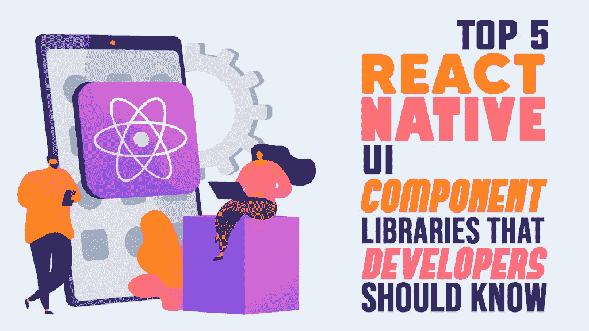
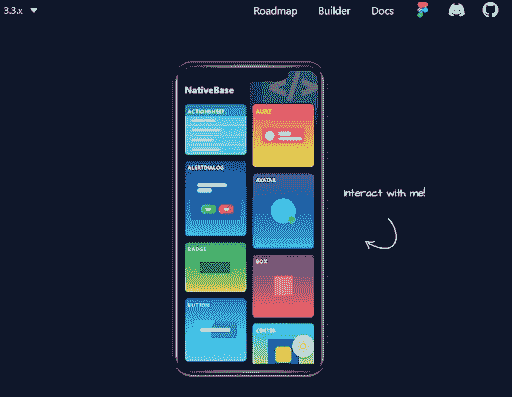
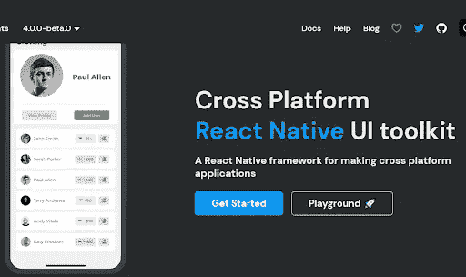
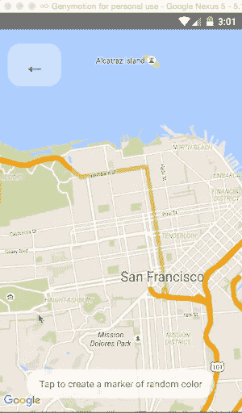
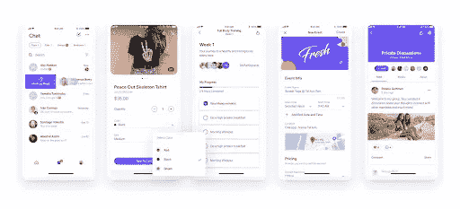

# 开发人员应该知道的 5 大 React 原生 UI 组件库

> 原文：<https://medium.com/nerd-for-tech/5-react-native-ui-component-libraries-d145dbdc98d2?source=collection_archive---------0----------------------->

也许你知道，React Native 是一个开源的 UI 框架，用于构建在线移动应用。毫不奇怪(考虑到移动应用的流行)，React Native 近年来变得非常受欢迎。它允许开发人员使用一行代码为许多平台(如 Android、Windows 和 iOS)创建应用程序。

因为 React Native UI 组件库通过其直观的特性节省了大量的时间和精力，React Native 每天都在社区中获得越来越多的认可，吸引着世界各地的开发人员。

你有没有考虑过 React 本地库是如何在它们的进程中如此高效的？您想知道如何在您的应用中使用它们的组件吗？如果是这样，这篇文章是给你的。我给你看几个 [**最好的 React 原生 UI 组件库**](https://blog.logrocket.com/react-native-component-libraries/) ，可以在你接下来的 React 原生 app 开发项目中帮到你。

> ***什么是 React Native？***

React Native 是一个由 Meta platforms，Inc .开发的开源 UI 框架，其使用的一个例子是 Oculus，React Native 帮助开发虚拟现实应用程序。它允许开发人员使用 React 框架和原生平台特性来创建适用于 Android、iOS、macOS、Web、Windows 等的应用程序。

全世界有数百家公司成功地采用了这种模式，包括微软、优步和脸书等知名公司。Instagram、脸书和 Skype 都是世界上最受欢迎的 React 本地应用。

在相对较短的时间内，React Native 已经上升到移动开发选项列表的顶部。

> ***顶级 React 原生组件库***

通常，当 [**创建 React 组件**](https://www.amazon.com/React-Components-Christopher-Pitt-ebook/dp/B01BSTEDJ0/) 时，您需要根据您将要使用的平台规则调整它们并设置样式。这就是 React Native 使用其特定框架创建移动应用程序的便利之处，因为它同时使用 React 和自己独特的原生功能。以下是一些可以与 React Native 一起使用的最佳 UI 库的列表:

*   本地基地
*   本土元素
*   戏弄者
*   反应原生地图视图
*   反应本机用户界面库

上面提到的 React 本地组件库由于其独特的功能理所当然地获得了巨大的流行。现在，让我们具体了解一下这些库都提供了什么。

## 本地基地

使用原生基础库作为构建块是 [**开始构建您的应用**](https://simpleprogrammer.com/mobile-app-development-process-guide-2022/) 的一种极好的方式，因为它为您提供了许多跨平台的 React 原生组件和其他工具，帮助您构建有创意的应用。这包括使用 React Native 和 JavaScript 功能制作的组件，能够定制一些特性。

这是一个很大的优势，一个人可以得到一个原生的基础库。您可以简单地利用任何具有原生基础的原生第三方工具，这有助于您构建智能应用。为了让你的应用程序吸引人，你甚至可以使用初学者工具包和可配置的主题布局。

随着更多的功能和显示被添加到应用程序中，主题变得更加昂贵。不过，通过使用相同的 JavaScript 代码库，您可以获得原生外观并增强应用程序的功能。你甚至可以为 iOS 和 Android 应用应用不同的、特定于平台的设计。

## 反应本地元素

这个跨平台的 UI 工具包集成了材质设计和 React Native。它是最简单、最容易开始的框架之一，GitHub 上有超过 100k 个 stars。这个工具包库没有遵循显式的设计方法，而是使用标准化的固有组件提供了更基本的结构。这意味着您可以更加灵活地个性化组件。

应用中使用的任何组件都可以使用自定义属性和 React 本机核心 API 功能的组合进行自定义。头像、定价、徽章、覆盖图、分隔线、社交图标按钮等都包含在这个库中，以帮助开发者构建出色的应用。React Native Elements 完全用 JavaScript 开发，提供了高度的可定制性。

## 戏弄者

Teaset 是一个 React 原生 UI 框架，拥有 20 多个 JS(ES6)组件，专注于内容呈现和动作控制。这是一个很小的组件库，包括你需要 [**制作一个完全可操作的 React 本地应用**](https://www.xongolab.com/blog/why-consider-react-native-framework-for-mobile-app-development/) 的一切。Teaset 的组件具有传统的 Android 应用程序外观，这增加了它在开发者中的价值。

Teaset 本身是一个非常简单且功能强大的 React 原生库。这个库的目的是保持对应用程序内容的关注，而不是它的外观。

## 反应原生 Mapview

React Native Mapview 是一个独特的库，可用于创建具有 iOS 和 Android 功能的惊人应用程序。React 本地地图组件允许用户定制组件，提供简单的、类似 React 的 API 来调整地图功能。“Mapview”组件的设计使得普通地图元素(如标记和多边形)可以轻松通过。通过这样做，可以通过 API 以声明方式直观地控制地图功能。

更改地图查看区域、在地图上放置组件以及修改标记和地图设计只是可用功能的一部分。如果需要，你可以放大坐标，甚至制作动画。

Mapview 可以使用动画 API 来操纵地图的中心和焦点。这有助于检查并为道具赋值。通过为其提供动画区域，除非指定了自定义标记，否则将显示默认标记。

## 反应本机用户界面库

Wix 产生了 React 原生 UI Lib 组件库，它包含了你在其他库中找不到的不同的异常特性。这个 UI Lib 包括相同的特性，比如主题和其他相关组件。

其中包括 20 多个定制组件，其中一些组件，如抽屉，可以轻松整合，提供无缝体验。它还支持之前和最近的 [**React Native 0.65 版本**](https://reactnative.dev/blog/2021/08/17/version-065) ，甚至包括定制的动画元素，如图形卡扫描仪和移动图片。

这是另一个用户界面框架，支持从右到左授权，并提供其工具的完全可访问性。

> ***挑选反应最好的原生库***

所有 React 本地库都有独特的特性，使它们彼此不同。这些库可以帮助您更快、更有效地开发应用程序，消除重新构建的需求并减少出错的机会。有了这些库，你可以 [**简单地构建 React 原生应用**](https://www.amazon.com/Fullstack-React-Native-beautiful-JavaScript/dp/1728995558/) 。

在本文中，我介绍了可以在很大程度上增强用户体验的五大库。在考虑任何 UI 库之前，您必须拥有与 React 原生项目相关的所有必要信息。

不过，值得一提的是，React 原生环境是巨大的，随着社区继续发布新工具来改善开发人员的体验，它只会变得更大。你可以咨询[**React Native app development**](https://www.xongolab.com/react-native-app-development/)公司获取更多信息，帮助选择最好的 React 原生库。

***文章来源:***[simpleprogrammer.com](https://simpleprogrammer.com/react-native-ui-component-libraries/)