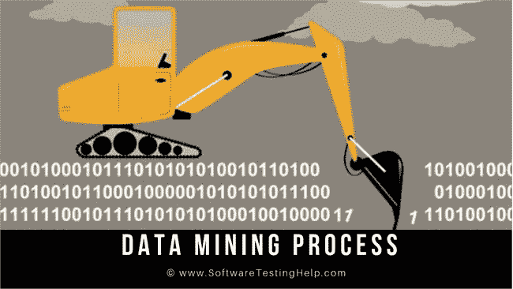
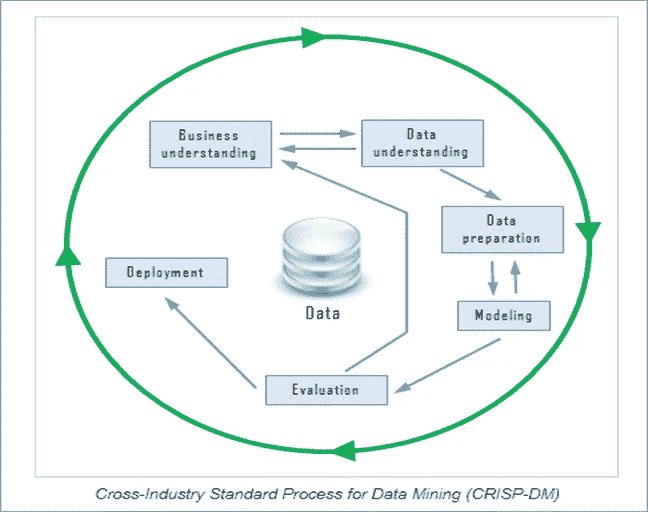
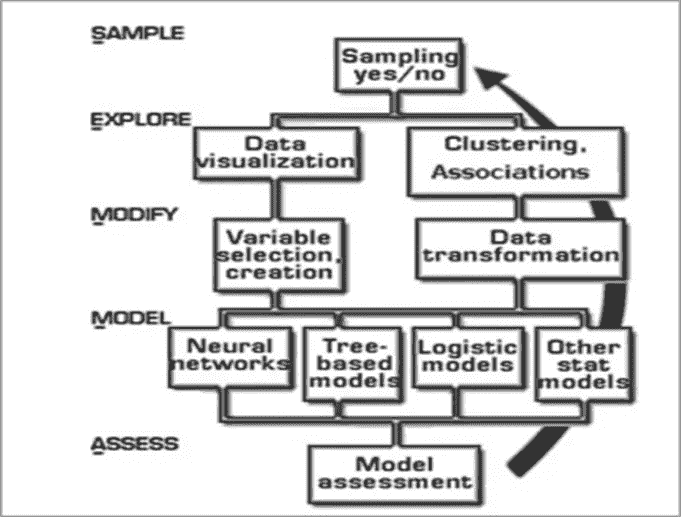

# 关于数据挖掘，你可能不知道的 5 件事

> 原文：<https://medium.com/nerd-for-tech/5-things-you-probably-dont-know-about-data-mining-b0bdff351582?source=collection_archive---------1----------------------->

数据挖掘是数据科学中的核心领域之一，在这个领域中，许多人没有注意到或试图弄清楚正在发生什么。许多人在选择数据科学职业时，他们关注的是构建机器学习模型等。

数据挖掘包括从数据存储库和/或数据仓库中提取有用的数据，对其进行集成、处理，然后构建一个有用的洞察模型。数据挖掘是一个多学科领域:计算机科学、数据科学、统计学、商业管理等。这意味着，如果没有这个领域，数据将毫无用处，也无法建立任何建模或人工智能概念。

在这里，我将列出我认为你需要知道的关于数据挖掘的五件事，以便你能很好地掌握这个概念。

1.  数据挖掘有许多不同专业人员使用的名称(不要忘记，它是一个多学科领域)。有些人认为这个名字是用词不当。经常与数据挖掘相关的其他名称有:数据库中的知识发现(1989):由 AI、机器学习社区、数据钓鱼、数据挖掘(1960):由统计学家、数据考古、信息收获、信息发现、知识提取等。
2.  如此流行的 Web 报废是数据挖掘的一个方面，因为你从 web 中提取有用的数据来分析它，并获得有意义的见解，然后导致解决业务案例问题。
3.  数据挖掘过程包括七个相互关联的步骤。我们有:数据清洗，数据集成，数据简化，数据转换，数据挖掘，模式评估，知识表示。

谷歌搜索

4.有两种类型的数据挖掘模型:

a.跨行业数据挖掘的标准流程，也可以称为 **(CRISP-DM):** 这张图片解释了这个流程。从名字可以推断出它的性质是循环的。

b.SEMMA **(采样、探索、修改、建模、评估):**这是数据挖掘中的五步模型，被总结为 SEMMA。

5.由于数据挖掘涉及从特定数据中获取模式，因此它可以用于多种方式也就不足为奇了，例如数据库营销、信用风险管理、[欺诈检测](https://www.investopedia.com/financial-edge/0512/the-most-common-types-of-consumer-fraud.aspx)、垃圾邮件过滤，甚至可以用于辨别用户的情绪或观点。([https://www.investopedia.com/terms/d/datamining.asp](https://www.investopedia.com/terms/d/datamining.asp))

至此，我希望您现在对数据挖掘有了一个基本的了解。

如果你从这里收获了一两件事，亲切的点赞，鼓掌，掉个评论，分享以利他人。在 Twitter 上关注我[这里](https://twitter.com/AbideenMuhamme2)，在 LinkedIn 上关注我[这里](https://www.linkedin.com/in/abideen-muhammed-782088136/)，电子邮件:abideenmuhammed2018@gmail.com