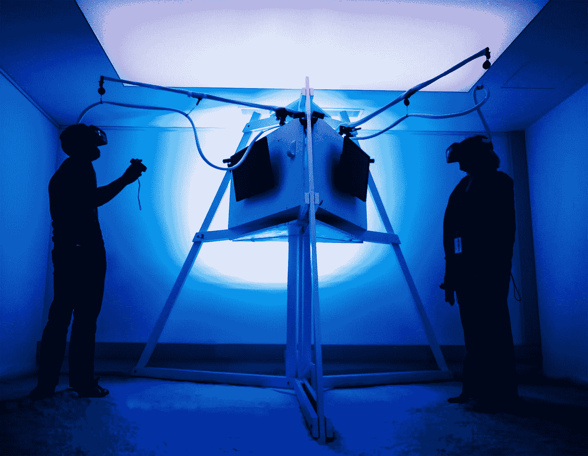
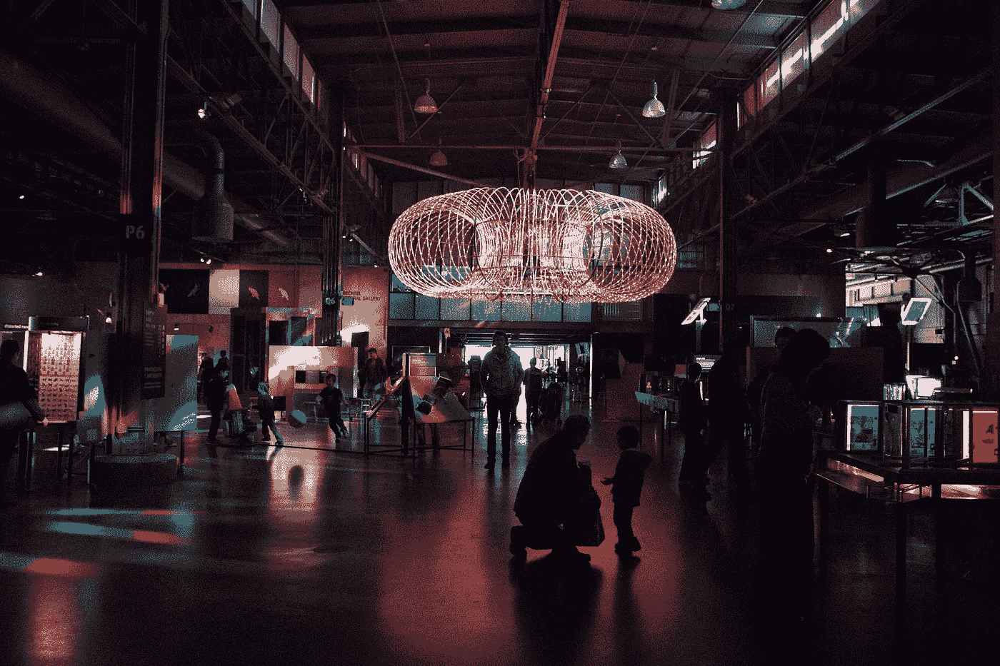
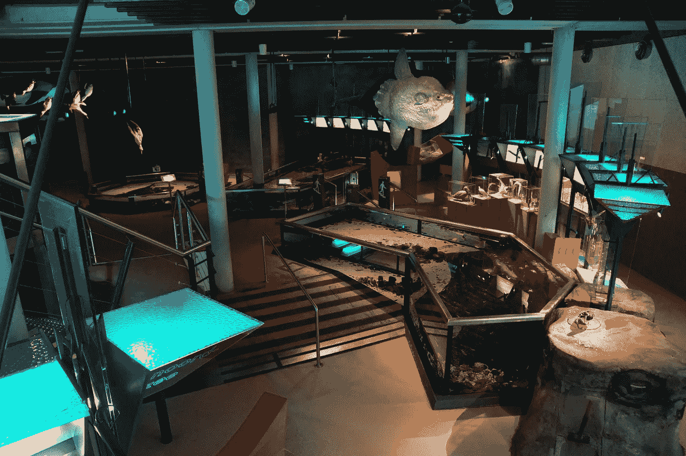
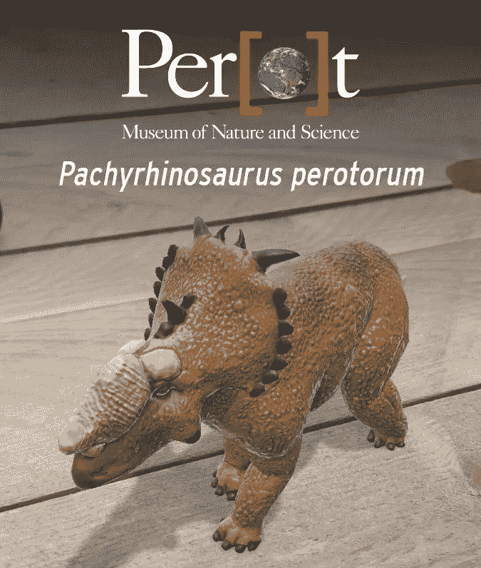
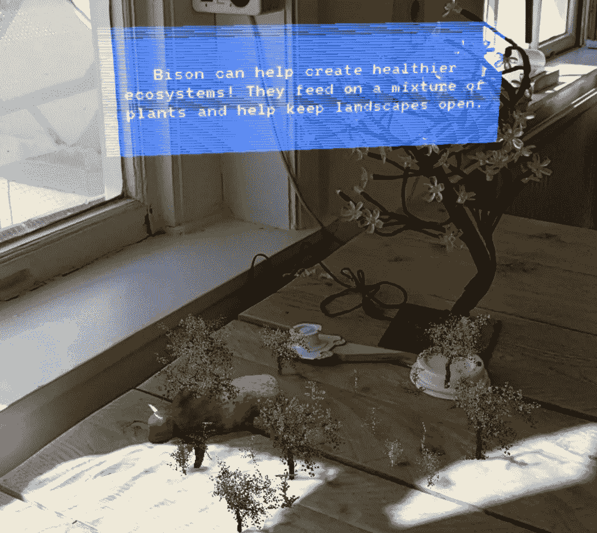
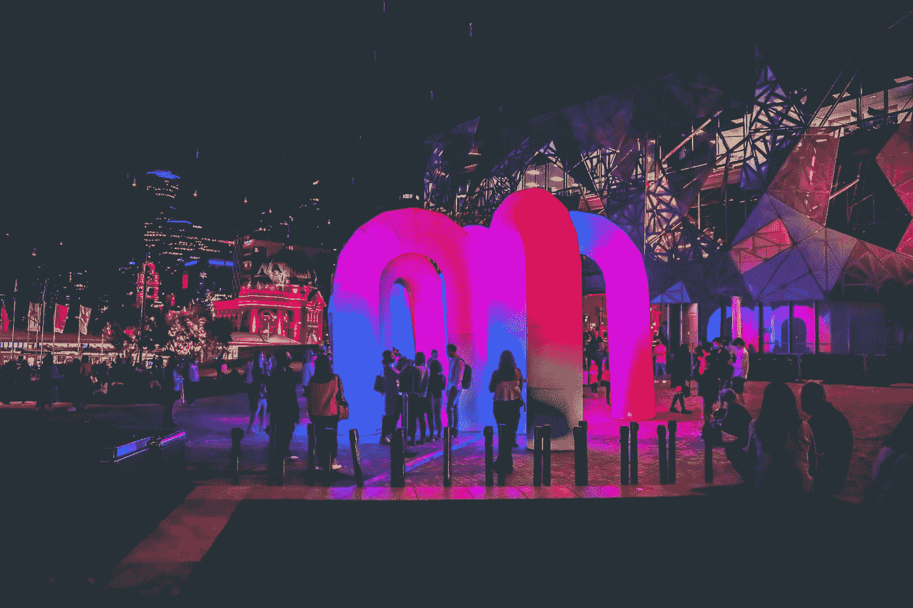

# 在科学教育中使用互动媒体的 4 种方式

> 原文：<https://medium.com/nerd-for-tech/6-ideas-for-using-interactive-media-for-education-eba38382654d?source=collection_archive---------19----------------------->

在 [Unsplash](https://unsplash.com?utm_source=medium&utm_medium=referral) 上由 [Stella Jacob](https://unsplash.com/@stella_jacob?utm_source=medium&utm_medium=referral) 拍照

当我还是个孩子的时候，与今天相比，互动媒体是一个相当新奇的事物。也许我们会被允许在学校的一台电脑上玩那些 90 年代教孩子们如何打字的电脑游戏。在家里，我们有游戏机和电脑，但这些方式的互动媒体通常仅限于购买的游戏或免费的在线浏览器游戏(是的，我知道，我听起来像一个千禧年版的辛普森爷爷)。快进到 2021 年，互动媒体已经爆炸了。人们正在使用 Snapchat 和 Instagram 的左右和中间增强现实效果。计算能力和屏幕的可用性带来了前所未有的交流信息的新体验。让我们来看一些最引人注目的！

## 旧金山探索博物馆

探索博物馆，马修·潘，【https://www.flickr.com/photos/_matthew_poon_/11397642024】T4，https://creativecommons.org/licenses/by-nc-nd/2.0/[授权](https://creativecommons.org/licenses/by-nc-nd/2.0/)

一个全是探索和互动的博物馆，还有什么地方比探索博物馆更好呢？从一个所有东西都是相同颜色的房间到数字浮游生物显微镜，再到一个巨大的黑盒子房间，展示艺术和科学交汇处令人难以置信的艺术品，这个博物馆的体验多样性是巨大的。他们也有一堆在线展品，包括你可以在家里尝试的实验，包括用食物残渣种植植物和盐水电池实验！

## 特克塞尔 Ecomare(荷兰)

水族馆 zaal，[https://commons.wikimedia.org/wiki/User:Otter](https://commons.wikimedia.org/wiki/User:Otter)，[https://nl . Wikipedia . org/wiki/eco mare #/media/Bestand:Texel _-_ eco mare _-_ aquarium zaal _ 2020 06 17 . jpg](https://nl.wikipedia.org/wiki/Ecomare#/media/Bestand:Texel_-_Ecomare_-_aquariumzaal_20200617.jpg)，经[https://creativecommons.org/licenses/by-sa/4.0/](https://creativecommons.org/licenses/by-sa/4.0/)许可

生态海洋是荷兰瓦登岛上的一个混合博物馆和海豹保护区。他们最近进行了一次互动大修，他们新的“Wonderlijk Wad”展览以互动地板为特色，在这里你可以控制添加到环境中的土地和水的数量，并查看哪些野生动物将居住在这里！还有互动游戏，你可以发现鸟类的迁徙模式，以及该地区的地质过程。

## 德克萨斯州达拉斯佩罗博物馆

如果你不能来找恐龙，那就让恐龙通过手机 AR 的力量来找你吧！

世界如此之大，国际旅行又如此昂贵，大多数人永远没有机会去参观任何一个特定的博物馆。更不用说疫情正在进行，使得很多博物馆参观变得困难甚至不可能。幸运的是，博物馆越来越多地找到新的方法，通过 AR 与全球各地的人们联系。以得克萨斯州达拉斯[佩罗博物馆](https://www.perotmuseum.org/)的厚鼻龙效果为例。这个 Snapchat 镜头可以让你使用手机将动画恐龙放在任何你想放的地方。这不仅有助于通过提供比简单的视频或照片更难忘的体验来教育人们，还有助于宣传博物馆本身。对于被低估的*厚鼻龙*来说，这是一个获得认可的好方法！

## 欧洲野牛(Snapchat 镜头)

一个互动的博物馆展示，在你自己的家中舒适地进行。

这是我自己制作的 Snapchat 镜头，演示了信息如何在 AR 中显示。我一直对自然和野生动物倡议感兴趣，所以我想帮助推动一些组织，如欧洲野生动物协会和世界野生动物基金会将动物重新引入它们以前灭绝的地区。在这个效果中，用户看到一幅洞穴画在他们眼前栩栩如生，并通过动画野牛和全息地图讲述了野牛重返欧洲的故事！

## 结论:新领域

照片由[帕特·惠伦](https://unsplash.com/@patwhelen?utm_source=medium&utm_medium=referral)在 [Unsplash](https://unsplash.com?utm_source=medium&utm_medium=referral) 上拍摄

互动媒体领域发展非常迅速，部分原因是其中使用的技术(AR、VR、智能手机、人工智能等)也在快速变化。交互性是教育体验中的一个关键因素:它帮助人们更容易理解概念和记住他们所学的内容。本文涵盖的用途只是冰山一角:还有更多创新的显示和应用程序，而且还有更多的正在创建中！你有没有注意到任何看起来特别有创意的特殊经历？请在评论中告诉我！