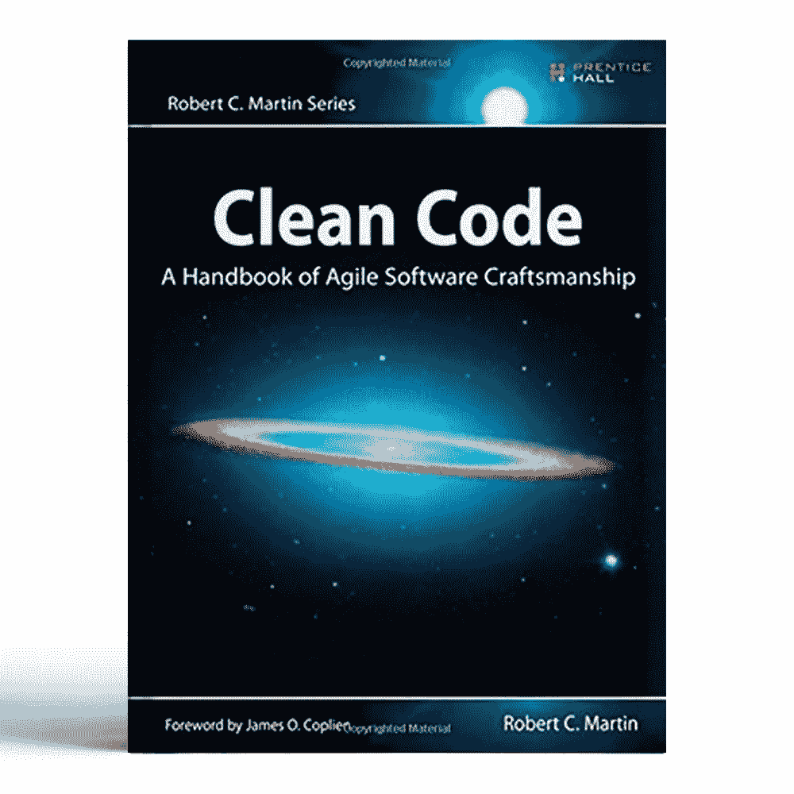

# 软件工程师/开发人员编写产品级代码应该知道的 6 件事

> 原文：<https://medium.com/nerd-for-tech/6-things-a-software-engineer-developer-should-know-to-write-production-level-code-c4a1a45bfd45?source=collection_archive---------6----------------------->

软件开发不仅仅是使用你的编码技能来构建东西。作为一名软件开发人员意味着更多，你要对许多事情负责，比如代码的质量。你的代码是否可伸缩，你的代码是否可理解。

如果你是一个没有进入职业世界的人，你可能会觉得这有什么关系。但是当你写一个产品级的代码时，这就很重要了。我会向你详细解释一切。

阿诺·弗朗西斯卡在 [Unsplash](https://unsplash.com?utm_source=medium&utm_medium=referral) 上的照片

作为一名软件开发人员，你应该知道以下 6 件事来编写产品级代码。

# 1.写一个有意义的名字

每当你声明一个变量或者创建一个函数或者类的时候，总是给它一个有意义的名字。比如，如果你正在创建一个函数，它的工作是将两个值相加，然后将其命名为“**加**”。

## 为什么它很重要？

名字揭示了变量、函数或类的意图。假设我创建了一个将两个数相加的函数，但将其命名为"**减法**或" **rand_123** "，通过阅读"**减法**"您会认为该函数的工作是将两个数相减，而通过阅读" **rand_123** "您将无法理解该函数的任何内容。

没有人会打开那个函数并理解代码的功能来理解那个函数做什么。如果其他开发人员需要这样做，那么编写代码就不是一个好方法。

## 要遵循的规则:

*   **避免心理映射:**使用每个人都能理解的名字。其他人要看名字就明白意图。
*   **类名:**类名应该始终是一个**名词或名词短语**。从类中，我们创建了一个对象，这就是为什么它应该总是一个名词短语。
*   **方法/函数名:**方法名应该是一个**动词或者动词短语**。方法/函数是实现主要功能的方法/函数，是完成工作的方法/函数。这就是需要使用动词短语来命名函数/方法的原因。
*   **可搜索名称:**使用易于搜索的名称。假设你必须调试一个特定函数中的问题，这对每个人都有好处。但是在一千行代码中，你如何找到那个函数呢？如果你开始读每一行，那将会很费时间。可搜索的名称很容易记住，您可以通过查找功能在任何 IDE 中找到该函数。
*   **不要一语双关:**避免将同一个词用于两个目的。如果你为多个目的使用同一个名字，那么它会造成混乱，这会影响开发过程。用同一个术语来表达两种不同的想法，本质上是一种双关语。
*   **使用解决方案域名:**阅读代码的人将是程序员。因此，您可以继续使用 CS 术语、算法名称等。但是如果你像这样对每个名字都这样做，那么对开发者来说就不公平了，因为他/她必须来回跑去客户那里询问概念。
*   **使用问题域名:**当你正在做的事情没有程序员时，使用问题域名。至少另一个维护你代码的开发者可以问领域专家这是什么意思。

# 2.功能

创建一个函数不仅仅是编写你的功能。这个函数应该很小，对于阅读你的代码的开发者来说是可以理解的。如果开发者不能在 3 分钟内理解功能，那么它就不够好。你需要重构它，让它变小。

照片由[卢卡·布拉沃](https://unsplash.com/@lucabravo?utm_source=medium&utm_medium=referral)在 [Unsplash](https://unsplash.com?utm_source=medium&utm_medium=referral) 上拍摄

## 为什么它很重要？

在今天的世界上，没有人想浪费他们的时间。你在理解代码上浪费的时间越多，向客户交付产品的时间就越长。

此外，它使得反复调试和重用函数变得容易。你可能知道编程的基本原则是永远不要重复代码。

## 要遵循的规则:

*   **小:**功能要小到适合屏幕。这是关于 **代码**的**20–30 行** **。屏幕大小有很多变化，所以考虑所有类型的 20-30 行代码将是考虑函数长度的最佳点。**
*   **分块和缩进:**我见过不给分块缩进的人。这使得其他开发人员很难阅读代码。街区的起点和终点。做一个**块式缩进**会让它更容易阅读，事实上也会让你更容易调试(特别是如果是语法错误的话)。
*   **做一件事:**职能要做一件事。他们应该做好这件事，而且应该只做这件事。函数的目的是只做一件事。如果您的函数包含多个具有不同功能的部分，则为该部分的功能创建一个单独的函数并调用该函数。
*   **Switch 语句:**如果你是 switch/if 语句那么就尝试用多态来代替它。你会从 **面向对象编程**中知道**多态** **的概念。您可以通过重写或重载来创建多个方法。**
*   **函数参数:**参数越少越好。如果可能的话，在函数中只传递一个参数。在 **max** **传递** **3 个参数**如果需要传递更多的参数，那么将这些值作为一个**对象或列表中的单个参数**传递。
*   **命令查询分离:**函数要么做某件事，要么回答某件事，但不能两者都做。如前所述，函数应该只做一件事。类似地，函数应该改变对象的状态以返回关于对象的一些信息。

## 如何写出更好的函数？

*   重组/重构
*   使函数变小
*   该函数应该只做一件事
*   函数中的自变量较少

# 3.评论

尽量避免使用注释。注释是糟糕代码的标志。组织代码，这样就不需要注释来解释功能。用代码表达自己。

评论并不总是不好用，所以你必须知道什么时候用它好，什么时候用它不好。

## 好评:

*   **法律注释:**版权和作者声明是必要的，在每个源文件的开头放入注释是合理的。
*   信息丰富的注释:用注释提供基本信息有时很有用。例如在函数中需要发送什么样的日期格式。
*   **意图解释:**有时候你需要解释为什么使用了某个特定的逻辑或条件。那次可以加个**小解说评论** (1 行评论)。
*   有时将一些晦涩的参数或返回值的意思翻译成可读的东西会很有帮助。
*   **TODO 注释:**以 **//TODO** 注释的形式留下“待办事项”注释是合理的。TODO 注释解释了为什么这个函数有一个退化的实现，以及这个函数的未来应该是什么样子。

## 差评:

*   **多余注释:**如果你的代码中注释太多。那么注释可能比代码读起来要长，完全是多余的。
*   **噪音注释:**无用的注释，不提供关于代码的新信息。
*   **日志评论:**有些人无论何时编辑代码都会写日志。早期它是有用的，但是现在我们有一个版本控制系统来跟踪它。
*   **注释掉代码:**保留一个被注释的代码是一件糟糕的事情。你可能认为恢复代码很容易。但是请注意，在发布产品版本时，应该删除这些注释代码。一旦计划了产品发布，保持注释是没有意义的。
*   **信息太多:**不要在评论中保留无关的信息，因为这些信息毫无用处，而且会占用额外的存储空间。

当你可以使用评论和不使用评论时，你可能会有好的和坏的评论的想法。

# 4.对象和数据结构

我们保持变量私有是有原因的。我们不希望其他任何人依赖他们。我们希望保持随心所欲地改变它们的类型或实现的自由。

为什么程序员会自动向他们的对象添加 getters 和 setters，公开他们的私有变量，就好像它们是公共的一样？

## 数据抽象

您可能在面向对象编程中听说过这个术语。这是什么意思？这意味着保持数据和功能的私密性。没有人能在对象之外知道那个对象的功能。这就是主要使用对象的原因。

## 德米特里定律

Demeter 的**法则说，一个模块应该知道它所操作的对象的内部结构。对象不应该通过访问器公开它们的内部结构，因为这样做是公开而不是隐藏它的内部结构。**

更准确地说，德米特法则说，C 类的方法 f 应该只调用这些方法:

*   C
*   由 f 创建的对象
*   作为参数传递给 f 的对象
*   保存在 C 语言变量中的对象

**来自:**

objectA.getObjectB()。do something()；

**至:**

objectB = objecta . getobjectb()；

objectb . do something()；

## 数据传输对象

数据传输对象是用于封装数据并将其从应用程序的一个子系统发送到另一个子系统的对象。dto 通常由 N 层应用程序中的服务层用来在各层之间传输数据。

# 5.错误处理

在编写产品级代码时，错误处理是需要做的最重要的事情。如果由于某种原因出现问题，我们总是会记录错误，这样我们就可以很容易地调试它。但是错误处理也有一些我们应该遵循的规则。

由[视觉效果](https://unsplash.com/@visuals?utm_source=medium&utm_medium=referral)在 [Unsplash](https://unsplash.com?utm_source=medium&utm_medium=referral) 上拍摄的照片

## 要遵循的规则:

*   **使用表达式而不是返回代码:**很多人只是发送错误代码作为回应。但是要理解错误代码，开发人员需要阅读并检查该错误代码的含义。而不是发送错误代码传递消息。这很容易理解。
*   **首先编写你的 Try-Catch-Finally 语句:**每当你创建一个新函数时，首先编写 **Try-Catch-Finally** 语句。在实现功能之前，这是最重要的事情。
*   根据调用者的需求定义异常类:可能有不同类型的错误，如验证错误、编程错误或其他错误。定义基于错误类型的错误抛出。
*   **不返回 null:** 假设您创建了一个函数，您的主条件检查参数是否不为 null，但是如果参数为 null，那么您将返回 null。不返回空值，而是返回 NullPointerException。
*   **不要传递 null:** 永远不要在函数中传递 null，除非函数希望你传递 null。最好尽可能避免这种情况。

# 6.班级

面向对象编程中的类是定义变量和方法(函数)的蓝图或原型。OOPS 中的对象是一个类的样本。软件对象通常用于模拟日常生活中的真实世界对象。

## 班级应该很小

对于班级规模，我们通过计算责任的数量来衡量。责任越多，班级规模越大。

**注:**我们应该能够不用“ **if** ”、“ **and** ”、“ **or** ”或“ **but** ”这样的词，用 25 个字左右写出一个班级的简要描述。

*   **单一存储库原则:**SRP 声明一个类或模块应该有且只有一个*变更理由*。
*   **内聚:**类应该有少量的实例变量。一个类的每个方法应该操作一个或多个变量。一般来说，一个方法操纵的变量越多，这个方法对它的类就越有凝聚力。

## 组织变革

大多数时候变化是持续的。每一个变化都使我们面临着系统的其余部分不再像预期的那样工作的风险。

为了组织变化，我们可以**隔离变化**。通过隔离变更，我的意思是尽可能地减少依赖性。构建一个解耦的系统，这样一个模块中的一个变化就不会影响到另一个模块。

这些是软件工程师/开发人员应该知道的 6 件基本事情，摘自**罗伯特·c·马丁**的书**干净的代码**。在这本书里，你可以学到更高级的主题，比如单元测试、并发性、重构、代码味道等等。