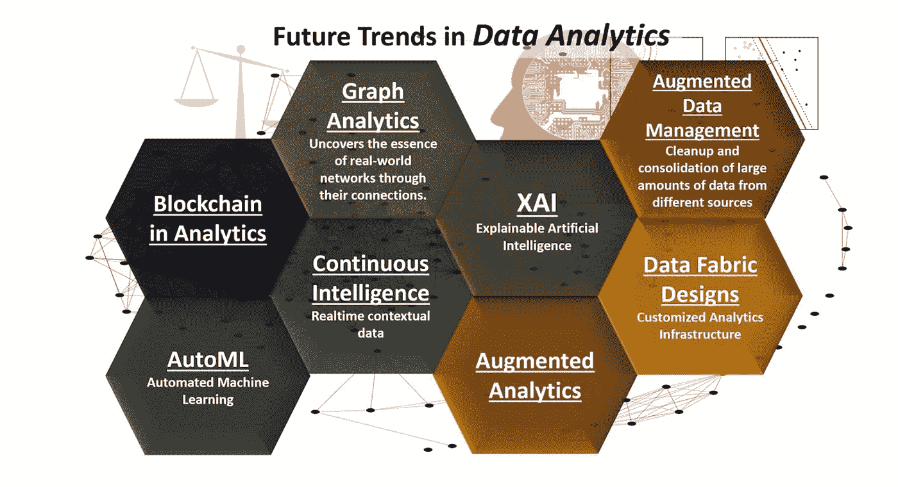

# 数据分析的 8 个未来趋势

> 原文：<https://medium.com/nerd-for-tech/8-future-trends-in-data-analytics-16d1262b2845?source=collection_archive---------2----------------------->

8 数据分析的未来趋势

概述数据分析的当前趋势并不总是容易的:下面简要描述了数据分析的八个有希望的趋势。

**1。** **自动机器学习(AutoML)**

AutoML 越来越受欢迎。尤其是在实践分析中的大量成功的推动下。在一个越来越多的设备产生数据并相互联网的世界里,“产生”的数据不成比例地增长。因此，AutoML 迫切需要从这些快速增长的数据中及时获取知识。我们假设 AutoML 在未来几年变得更加重要，并且分析方法会提供更加精确和快速的结果。数据科学家的活动领域不会消失，相反，他的重点将转移到更具体或更复杂的分析技术上。简而言之:AutoML 节省时间和金钱(你不需要更大的数据科学和机器学习专家团队)。这也是进入人工智能或机器学习世界的最简单、最便宜的方式。

2.**可交代艾(XAI)**

可解释的人工智能(XAI)试图使非线性编程系统的结果的发现透明，以避免所谓的黑盒过程。XAI 的主要任务是使非线性编程系统透明。它提供了解释人工智能模型的实用方法，例如，这些模型符合欧盟数据保护法的规定

3.**区块链分析**

区块链分析是对加密分布式账本(称为区块链)上的数据进行检查、识别、聚类、建模和可视化表示的过程。区块链分析的目标是发现加密货币交易中不同参与者的有用信息。比特币和以太坊等公共区块链的分析通常由私人公司进行。

4.**增强数据管理(ADM)**

增强数据管理(ADM)涉及使用机器学习(ML)和人工智能(AI)引擎来自动化一些与管理数据相关的手动任务。这意味着进行数据质量检查、元数据和主数据管理，以及数据集成的“自我配置”和“自我调整”

5.**图形数据分析**

图形算法或图形分析是用于确定图形中对象之间关系的强度和方向的分析工具。图形分析的重点是两个事物之间的成对关系以及图表作为一个整体的结构特征。

6.**数据结构设计**

简而言之，数据结构是由统一的体系结构和运行在该体系结构上的服务或技术组成的单一环境，可帮助组织管理其数据。data fabric 的最终目标是最大化您的数据价值并加速数字化转型。

7.**持续智能(CI)**

来自所有数据的持续智能(CI)不是描述实时性、速度或吞吐量的另一个词语。这是从所有数据中获取持续商业价值的无摩擦周期时间。这是一种现代的机器驱动的分析方法，使您能够快速获得所有数据并加快所需的分析。不管它有多冷门，不管有多少数据源，也不管数据量有多大。这不是一次就完成的，而是让机器自动完成的，所以它是连续的，没有摩擦的。

8.**增强分析**

增强分析使用人工智能(AI)和机器学习来增强人类在分析生命周期所有阶段的直觉——从数据创建和准备的方式到见解交付和共享的方式。数据科学和人工智能增强分析的结合使更多人可以访问分析，从数据中获取价值，允许他们以简单、对话的方式提出问题并自动生成见解。

这可能也是有趣的(我关于正念人工智能的新书):

(亚马逊):[**《人工智能思想书:励志思想》&人工智能语录**](https://www.amazon.com/dp/B08Z4BWN1X)