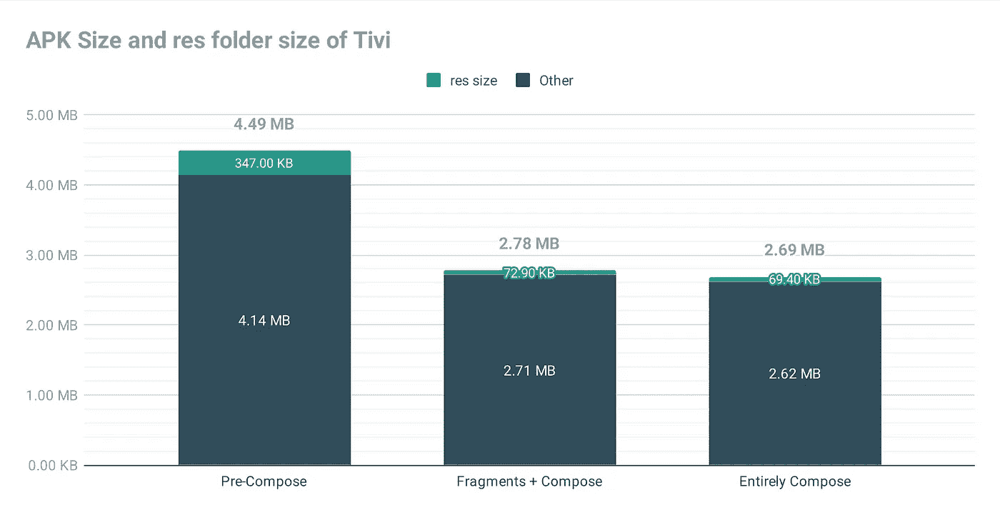
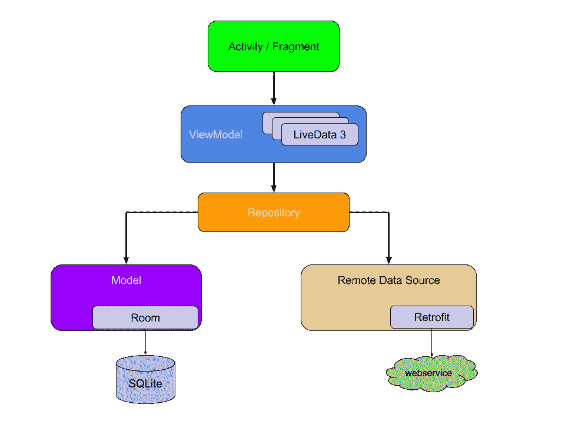
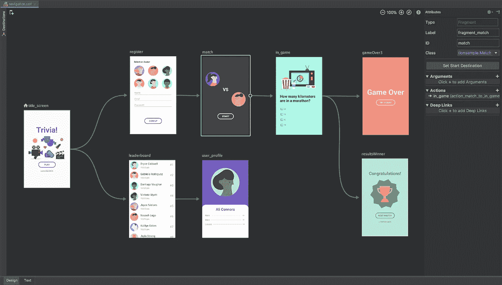

# 新 android 开发架构的 8 大亮点

> 原文：<https://medium.com/nerd-for-tech/8-things-to-love-about-the-new-android-development-architecture-2764962af904?source=collection_archive---------15----------------------->

android 的前景很大程度上让网络开发者感到害怕，因为它太难理解了。我承认我已经尝试过三次了。但是如果你已经是一名网络开发者，开发移动应用程序的复杂性要求你有一个全新的思维模式。

在这篇文章中，我将告诉你我学习 **android jetpack** 的经历——一组库和指南，使开发高质量的 android 应用程序变得更容易。

Android 为你提供了一个全新的平台来接触网络之外的最终用户。网络是一个开放的平台，任何人都可以在网络上开发，但 android 不是这样，在进入谷歌应用商店之前，你必须接受严格的指导。

当我最终决定第四次做一个安卓 app 的时候。和其他 web 开发人员一样，我的第一个首选是 React Native。虽然这很有意义，因为我在 React 开发方面有相当多的经验。

我喜欢基于项目的学习。因此，我坐下来，根据一些 youtube 教程和文档学习 React Native。但很快我意识到用 React Native 构建 android 应用程序并不适合严肃的开发，而且有很多不兼容的地方。

我最终退出 react 的原因是—

*   不太支持原生 android API。
*   React 本机应用程序在幕后运行 javascript 引擎。这比 JVM 慢。这可能会导致糟糕的用户体验。
*   React Native 并不意味着构建可扩展的应用
*   React Native 项目可能会在未来停止，因为天真的 android 开发变得越来越容易。

所以我试着尝试用 Kotlin 开发一个 android 应用。

随着 android 应用程序开发的最新发展，出现了一种更好的开发 android 应用程序的方法。这与 web 应用程序的开发方式密切相关。这叫做**安卓喷气背包。**

Android Jetpack 是一组由 Google 提供和维护的库，有助于开发优雅的 Android 应用程序，并解决了大多数常见的开发人员难题。

## 1.使用 jetpack 撰写的声明性 UI

这是我最喜欢现代 android 开发的地方。编码速度快，简洁优雅。有一些学习曲线，但从长远来看，这都是值得的，因为你的编码经验将大大提高。jetpack compose 目前仍处于测试阶段。但是我第一次涉足它，我可以向你保证，在不久的将来，它肯定会改变我们开发 android 应用程序的方式。

Compose 不是声明式 UI 的第一个概念化，也不是 Android 上唯一的选项 [React](https://reactjs.org/) 、 [Litho](https://fblitho.com/) 、 [Vue](https://vuejs.org/) 、 [Flutter](https://flutter.dev/) 等等。

就像我们如何使用 React 来声明我们的 UI，以及模块化我们如何定义 UI 元素并对数据更改做出反应一样，这里的 Compose 消除了我们对 XML 布局系统(android 的 HTML)的依赖。使用 compose 对我来说是一次很棒的经历。这允许在应用程序的许多不同地方重用同一个组件。Compose 为我们创造新设计系统、Android UI 框架等等的无限可能性铺平了道路。但是 Compose 并不是这个城市的新玩家。其他一些声明式用户界面库，如脸书的 Lithos 和 ___ 的 AsyncUI 库。但是没有一个是可以生产的。

> 我可以用我的钱打赌。Compose 是 android 开发中 UI 的未来。

## 2.室内图书馆的应用内数据存储

Room persistence library 是一个 ORM，用于管理您的持久性(应用程序内)数据存储。Room 持久存储通过在编译时验证 SQL 查询来帮助您。它也有方便的注释来减少样板代码

## 3.更好的性能和更小的应用程序

已经注意到，使用 Compose 显著减小了最终的 apk 大小。

显示 Tivi 的 apk 大小的图表(参考下面的文章)

> 当比较调整后的值与“预合成”时，我们看到使用 Compose 时，APK 大小减少了 **41%** ，方法数量减少了 **17%** 。
> 
> 克里斯·贝恩斯

Chris Banes 的一篇文章讨论了他们使用 jetpack compose 的体验[https://medium . com/Android developers/jetpack-compose-before-and-after-8b 43 ba 0 b 7d 4 f](/androiddevelopers/jetpack-compose-before-and-after-8b43ba0b7d4f)

## 4.与 XML 更好的向后兼容性

Compose 团队已经做了很好的工作，使得它非常容易与现有的 android 代码库集成。这很好，因为如果你有一个现有的 android 项目，并希望从 XML 转换到 Compose。这将是一个平稳的旅程。现在我们可以在应用程序的某些部分使用 XML，在其他部分使用片段，在 UI 的其他部分使用 Jetpack 组件。

## 5.轻松的状态管理和 LiveData

LiveData 并不是一个新概念，只是他们现在改进了很多。当从网络接收到更新的 UI 时，它保存状态并更新 UI 的状态。这些状态是全局管理的，与 react 相反，React 中我们必须使用 redux 和 React，但在实时数据中，所有状态都是全局管理的，因此在 android 中没有 redux 的概念。借鉴 reacts 生态系统，创建了 LiveData。

马库斯·温克勒在 [Unsplash](https://unsplash.com?utm_source=medium&utm_medium=referral) 上的照片

## 6.使用视图模型分离关注点

早期大多数新手 android 开发者习惯于在主活动文件中定义他们所有的前端逻辑。使用 ViewModel，我们可以在代码中实现模块化，并使调试错误变得容易。

图片来自[谷歌安卓](https://developer.android.com/jetpack)

## 7.用副作用渲染的反应

有时在 react 中，当我们的 UI 重新呈现时，我们希望避免调用网络或阻止状态更新，这就是我们在 React 中使用 *shouldStateUpdate()* 的地方。同样，我们可以在 jetpack compose 中使用 *SideEffects{}* 进行网络调用，并确保 *SideEffect{}中的代码只在成功渲染时运行，否则不会运行。*

## 8.易于使用的导航让我们都很高兴

导航是 android 开发的基础部分。历史上，它是使用片段事务来完成的，对于简单的情况来说，这很容易，但如果你想进行复杂的导航，比如底部导航，我们必须处理按下后退按钮的情况，显示正确的片段。

导航库提供了一个直观易用的基于 GUI 的环境，在这个环境中，我们可以轻松地定义我们的片段和活动，并使用导航库将它们连接起来，几乎不需要任何代码。这使得开发更少出错，我们可以更专注于构建应用程序，而不是让导航工作。

由 Jetpack 编写的导航库

## 结论

并不是每种编程语言都可以解决所有问题。这也适用于 Javascript，这对网络来说很好，但在 android 中，Kotlin 是更好的选择。