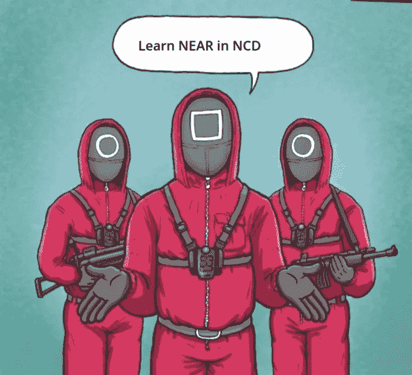

# 当你开始近距离(NCD)旅行时，9 件事会对你有所帮助

> 原文：<https://medium.com/nerd-for-tech/9-things-will-help-you-when-you-start-the-near-ncd-journey-3ddfcb11ecd0?source=collection_archive---------4----------------------->

我加入近区块链社区已经 4 个月了。在这里，我将列出我多么希望以前有人向我介绍过它:

1。 **附近是什么？**

> *NEAR 是一个简单、可扩展且安全的区块链平台，旨在为开发人员和用户提供最佳体验，这是弥合主流分散应用采用差距的必要条件。NEAR 是完全碳中性的，通过了南极认证。*

对于开发者来说，NEAR 有三个基本工具:

*   [NEAR CLI](https://docs.near.org/docs/tools/near-cli) 是 NEAR 与区块链交互的命令行界面。
*   [NEAR-API-JS](https://docs.near.org/docs/api/javascript-library) 是一个 JavaScript 库，用于与 NEAR 上的账户和智能合约进行交互。
*   [NEAR-SDK-RS](https://github.com/near/near-sdk-rs) 和 [NEAR-SDK-AS](https://github.com/near/near-sdk-as) 是用于在 Rust 和汇编脚本中开发智能合约的 SDK。

2。 **是什么让 NEAR 与其他区块链相比如此特别？**

有许多属性使 NEAR 如此特别，例如:

*   它被认为是一个环境友好的协议。
*   与其他区块链相比，交易速度很快。完成一笔交易平均需要 2-3 秒钟。
*   它有一个友好的命名帐户。你的账号可以是`alice.near`而不是其他区块链的长串字符。
*   交易和合同的天然气成本低。
*   开发者可以从智能合同中获得 30%的费用。

3。 **附近有什么可以修建的？**

2 .除此之外，网络还带来了其他可能性。3 .你可以建立一个 Defi、DAO、商店和游戏。要查看到目前为止的现有项目，请访问 [nearawesome](https://awesomenear.com/projects) 网站。您会发现大约 30 个与道相关的项目和 120 个 NFT 项目。其中最著名的是 Paras。

4。有哪些语言可以用来写一份智能合同？

NEAR 提供了用汇编脚本和 Rust 编写智能契约的能力。JavaScript 将很快推出。选择哪一个取决于你的背景。如果您是 JavaScript 开发人员，那么从汇编脚本开始会更容易。如果你懂 C++或者 Python，从 Rust 开始比较容易。

5。 **我需要具备哪些工具？**

您需要在您的环境中安装以下工具:

*   纱线。
*   Node.js 的 14 或更高版本
*   饭桶。
*   代码编辑器喜欢 Visual studio。
*   near-cli 是一个命令行界面，它利用`[near-api-js](https://github.com/near/near-api-js)`与 near 区块链进行交互。

从这个[链接](https://docs.near.org/docs/tools/near-cli#setup)在您的环境中安装`near-cli`有一个文档化的方法。对于 Windows 用户，如果正确设置环境路径，不需要安装`WSL`就可以使用。但是如果你想安装`WSL`，[这篇文章](https://www.freecodecamp.org/news/how-to-install-wsl2-windows-subsystem-for-linux-2-on-windows-10/)将带你完成安装`WSL`和其他工具的全过程。

对于不了解 git、代码编辑器、命令行等等的人来说。你为什么不试着参加[这个快速的免费初学者课程](https://courses.consensys.net/courses/take/bootcamp-basic-training/multimedia/24564917-welcome)然后继续呢？

6。 **从哪里开始？**

*   如果你是一个首先寻找概念的人， [NEAR-Doc](https://docs.near.org/docs/concepts/account) 是一个适合你的地方，在那里你可以阅读和了解区块链附近的每个概念。
*   如果你想看更多的代码，有很多例子可以深入研究。从来自[网站](https://examples.near.org/)的基本例子开始。然后你可以在 [Learn-NEAR](https://github.com/learn-near) 资源库中找到很多已经完成的项目，你可以查看。

在这两种情况下，不要忘记查看这些示例，它们将有助于您理解该过程:

计数器:您可以在这里找到它的代码[。](https://github.com/near-examples/counter)

**样品感谢**:合同代码[这里](https://github.com/Learn-NEAR/NCD.L2.sample--thanks)，前端[这里](https://github.com/Learn-NEAR/NCD.L1.sample--thanks)。

**meme 博物馆**:你可以在这里找到合同代码[。](https://github.com/Learn-NEAR/NCD.L1.sample--meme-museum)

这些例子有许多您将在项目中使用的函数。

您还可以查看附近的[**待办事项示例**](https://docs.near.org/docs/tutorials/apps/todos-crud-app#introduction) 教程。

快速浏览完上面的例子后，你就可以开始你的项目了。为了帮助你，有一个 [Rust](https://github.com/Learn-NEAR/starter--near-sdk-rs) 和 [Assembly Script](https://github.com/Learn-NEAR/starter--near-sdk-as) 的初学者工具包模板可供你使用。如果您使用它们，您将保证您的环境设置正确。模板克隆完成后，就到了你发挥想象力构建自己想要的东西的时候了。

7。 **如何加入附近的节目。**

NEAR 的所有程序都是免费的。你可以从[这个页面](https://near.university/certification)注册任何项目。我加入的是 NCD 的准认证开发者，但是如果你有兴趣申请的话，也有很多项目。

8。 **附近有哪些可供利用的机会？**

你可以为你的想法申请[资助](https://www.near.university/earn/grants)，或者在获得 NCD 的认证后，你可以申请[近驻地开发者](https://www.near.university/earn/fellowship)并成为工作委员会的成员。

9。 **我需要更多的资源来学习:**

*   如果你喜欢视频内容，NCD 有包含许多学生项目的[演示](https://www.youtube.com/playlist?list=PL9tzQn_TEuFW_dlX-LDYGAD87bZzX2CYV)和在视频中解释概念和合同的[。](https://near-in-minutes.com/)
*   [附近教程](https://docs.near.org/docs/tutorials/overview)有一个教程列表，你可以关注和学习。

不止这些，但我认为你会从中获得最大收益。

最后，我希望这篇文章能帮助你更多地了解 NEAR。如果你有任何问题，尽管问。