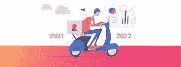

# 2022 年学习数据分析的 22 周课程+免费资源

> 原文：<https://medium.com/nerd-for-tech/a-22-week-curriculum-to-learn-data-analytics-in-2022-free-resources-fe35c1289545?source=collection_archive---------0----------------------->

技术永远是第一天！

当整个世界倒数计时，满怀希望和渴望迎接新年的时候，我坐在笔记本电脑前，为 2022 年提升技能和准备好工作制定路线图。

在这个路线图中，每周讨论一个不同的主题，大约有 4-5 个小时的内容，所以你可以用剩下的时间来构建东西，而不是陷入教程地狱。永远记住，科技不是笔纸行业，弄脏你的手，添加那些项目，建立一个投资组合。

# 第 1 周:SQL

SQL 是数据分析的核心，几乎用于数据行业的所有工作。一个很好的指南是-

 [## 模式 SQL 教程| -模式

### 学会用 SQL 用数据回答问题。不需要编码经验。

mode.com](https://mode.com/sql-tutorial/) 

# 第二周:画面

任何一个数据可视化工具都是必备的。你可以选择任何一个，但我更喜欢 Tableau，因为它很简单。

# 第三周:Excel

Excel 是数据分析师非常重要的工具。请务必与 VBA，宏和学习，同时建设。

# 第 4–6 周:统计

当涉及到数据时，统计学是巨大的和非常有用的，最好知道如何用它在图表中提取所有数据的本质。这是 Udacity 的免费教程:

 [## 乌达城

### 编辑描述

classroom.udacity.com](https://classroom.udacity.com/courses/st095) 

# 第 7–8 周:蟒蛇熊猫

Python 是一个自动化的有用工具，你可以用它庞大的库做几乎所有的事情(可视化、数据清理、争论、建模)。以下是 Udemy 的免费教程:

[https://www . udemy . com/course/master-data-analysis-with-python-intro-to-pandas/](https://www.udemy.com/course/master-data-analysis-with-python-intro-to-pandas/)

# 第 9 周:Power BI

虽然你只需要一个数据 viz 工具，但我认为再多一个基础工具会更好。

# 第 10 周:谷歌分析

谷歌分析是一个伟大的数据收集和分析工具，虽然它不是必须的，我认为这是一个双赢。谷歌有免费的课程和认证。

 [## 谷歌分析学院

### 通过谷歌的免费在线课程提高您的分析技能。

analytics.google.com](https://analytics.google.com/analytics/academy/) 

# 第 11–12 周:销售队伍

这不是必须的，你完全可以跳过它。我读到了它，发现它是为业务分析师生成 CRM 报告的一个很好的工具，所以我把它添加到了列表中。

[https://trail head . sales force . com/en/users/strail head/trail mixes/build-your-business-analyst-career-on-sales force](https://trailhead.salesforce.com/en/users/strailhead/trailmixes/build-your-business-analyst-career-on-salesforce)

# 第 13 周:A/B 测试

几乎所有公司都广泛使用的非常重要和有用的应用程序。我只是觉得它需要额外的关注。这是 Udacity 的免费课程-

 [## 乌达城

### 编辑描述

classroom.udacity.com](https://classroom.udacity.com/courses/ud979) 

# 第 14–16 周:Python 中的 DSA

尽管我们讨厌 DSA，但它仍然是许多组织招聘过程中不可或缺的一部分。最好安全一点，至少用熟悉的语言 Python 练习一下。谷歌为此提供了一个免费课程:

 [## 乌达城

### 编辑描述

classroom.udacity.com](https://classroom.udacity.com/courses/ud513) 

# 第 17 周:网络抓取

既然您已经熟悉了所有的工具，那么有必要了解如何获取数据并使用数据。互联网是最大的数据来源，能够从任何网站获取数据都会让你领先。

# 第 18 周:Numpy

Numpy 是最重要的库之一，它帮助你转换和利用你喜欢的数字数据。

# 第 19 周:Matplotlib

Python 有很多有用的库。matplotlib 是数据分析师的必备工具之一，用于数据可视化。

# 第 20 周:大查询

随着大数据成为下一个大事件，能够利用大数据获得洞察力的分析师将对公司极为有利。以下是谷歌 BigQuery 平台上的免费 SQL 课程:

 [## 学习 SQL 入门教程

### 你可以立即应用的实用数据技能:这就是你将在这些免费的微型课程中学到的东西。他们是…

www.kaggle.com](https://www.kaggle.com/learn/intro-to-sql) 

# 第 21–22 周:机器学习基础

企业不仅希望从现有数据中获得洞察力，还希望预测未知。机器学习在这里发挥了作用，Kaggle 的平台及其微观课程是最好的起点。

 [## 学习机器学习教程简介

### 你可以立即应用的实用数据技能:这就是你将在这些免费的微型课程中学到的东西。他们是…

www.kaggle.com](https://www.kaggle.com/learn/intro-to-machine-learning) 

所有这些都会让你熟悉在数据领域开始职业生涯所需的所有技能。但是所有这些本身是不够的，你需要练习构建项目和网络。新年快乐！

一个关于项目即将下降的博客。敬请期待！