# 实验室里制作牛奶的 5 步指南。

> 原文：<https://medium.com/nerd-for-tech/a-5-step-guide-to-making-milk-in-the-labs-3d0b8ac6f6f1?source=collection_archive---------14----------------------->

## 替代蛋白质与细胞农业

## 牛奶背后的黑暗真相…以及潜在的技术解决方案！

> 推荐阅读(如果你不了解蛋白质产生的基础知识):[https://sayyidaranihashim . medium . com/from-DNA-to-protein-the-basics-of-protein-synthesis-ede 3d 8 fc 3c 0 b](https://sayyidaraniahashim.medium.com/from-dna-to-protein-the-basics-of-protein-synthesis-ede3d8fc3c0b)

完整的食物。均衡的食物。有益健康的食物。

是的，你明白了。我指的是我们称之为牛奶的天赐白色液体。但是有人告诉过你这些名字吗？

黑仔。风暴使者。拷问者。

我也不这么认为。像其他任何东西(包括肉)一样，牛奶也有黑暗的一面。没人想让你看到的一面。偷窃、伤害和疲劳的一方。

# 没人告诉你的黑暗面。

你看，当你喝牛奶的时候，你也在支撑着一堆东西。就像你在其他地方一样跳过条款和条件一样。这正是这里发生的事情。只是，条件要差得多，你真的错过了阅读它。

你支持喝牛奶就是支持肉类行业。支持肉类工业也意味着支持一系列其他的东西，这些你可能从我以前的文章中了解到……除非你没有读过它们，🥺

在这种情况下，这里有一个快速 TL；博士:

> 气候变化，低效率→资源浪费，虐待动物，世界饥饿

除此之外，我们还有一系列乳制品独有的东西，比如…

## 资源的浪费

对于 1 升牛奶:

1.  **用水**:为了生产 1L 牛奶，我们使用了……1093 L 水！相当于 18 个月的水量😮现在，这是一个混乱的比率。
2.  **土地使用**:更乱的比例:6 个足球场的土地。[2.97 公顷土地]
3.  **能量:** 1.3 -6.2 MJ 的能量。哎呀。

## 虐待动物

奶牛(和其他[工业]产奶动物)需要怀孕才能产奶。像我们人类一样，他们对为什么产奶(为了他们的后代)非常具体。哦，他们也有非常特殊的母性本能。

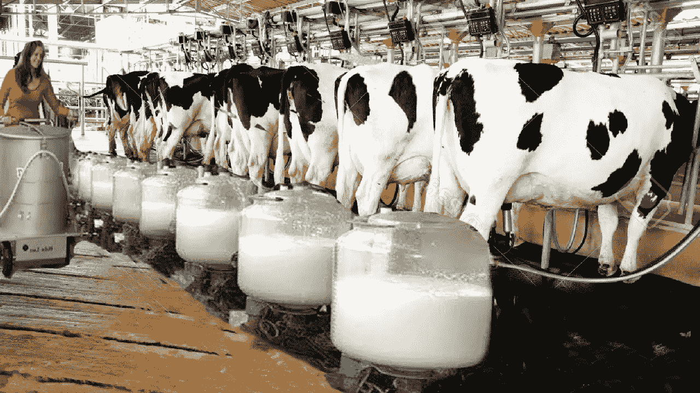

来源:Noal 农场

这意味着，为了获得乳汁，它们每年都要被迫受孕，但这一切都是徒劳。小牛出生后不久就被从它们身边拖走(这样它们就不会喝妈妈的奶，给双方都造成情绪压力)。公牛犊要么饿死，要么被送去屠宰。

用了很多战术来缓解他们的压力(不，他们不关心动物——快乐的母牛=更多的牛奶=快乐的农夫)不让他们用稻草塞死小牛。

这种折磨在她生命中的每一年都会重复。

不是这个——他们的交通、命运和条件都很糟糕！点击阅读更多[。](https://animalequality.in/issues/dairy/)

目前的解决方案是植物奶，如杏仁奶、豆奶等等。不幸的是，所有这些从未抓住牛奶的真正本质，因此导致不愿转换。最近的事件表明，在我们的星球上，大规模的行为改变是绝对不可能的。

如果说我从这一切中学到了什么，那就是始终阅读条款和条件。不幸的是，在牛奶这件事上，每个人都(不知不觉地)对大屠杀、毁灭的星球和饥饿的人们说了“是”。

哎呀，我们真的搞砸了。

好吧，系好安全带，因为是时候清理我们用指数技术制造的混乱了！(嘘…这涉及到实验室和微生物👀)

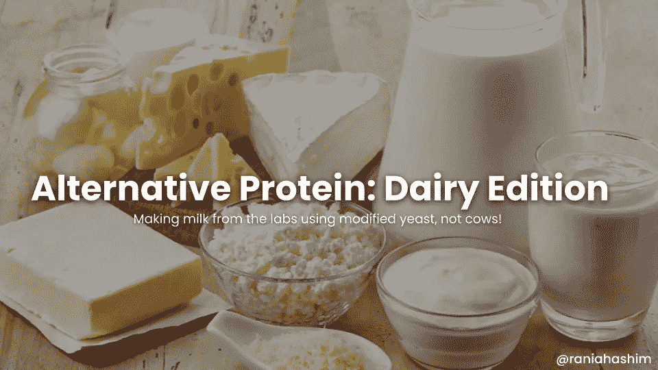

喔喔喔！

# 在实验室里制作牛奶的逐步指南

## 第一步:牛奶到底是什么？

是什么让牛奶成为完全健康的食物？

是什么赋予了它的味道和质感？

在我们能够在实验室再造牛奶之前，你需要有一个第一原理(科学家的)思维模式。要做到这一点，你需要停止把牛奶看做一种随意的“白色液体”,就好像它是基本的东西一样。

> 在这种情况下，牛奶到底是什么？

简单回答， ***牛奶是水、脂肪等成分的混合物。***

更准确地说，牛奶是 87.4% **水**，其余(12.6%)是**固体**。

放大这些固体，我们会遇到两大类固体→含有脂肪的(3.7%)和不含脂肪的(8.9%)。

非脂肪固体基本上是大量的蛋白质、乳糖、矿物质和矿物质。

它最突出的蛋白质(以及牛奶的所有化合物)是κ-酪蛋白和乳清。与其他化合物不同，这些化合物仅由奶牛产生😢这也意味着，这些将是我们需要在实验室生产的。

你从喝牛奶中得到的许多味道来自这些关键蛋白质，所以…

> 如果我们能够在实验室制造这些常量营养素，那就意味着
> 
> ❌强力浸渍
> 
> ❌生态破坏
> 
> ❌低效奶牛技术
> 
> 但与此同时…
> 
> ✅同样的味道
> 
> ✅同样的营养价值
> 
> ✅同款牛奶

我不知道你怎么想，但我认为这是一个双赢的局面！所以，让我们来看看如何酿造这些！

## 第二步:酿造乳清和酪蛋白？—潜入质粒！

要生产乳清和酪蛋白，有 3 个主要步骤。我们将深入探讨其中的每一项，但现在，请看一看:

1.  所有生物都有一种交流语言:**遗传密码**。我们将指导牛奶生产的 DNA 植入另一种微生物——在我们的例子中，是酵母！
2.  我们给酵母一些时间来凝固和复制，以制造更多的转基因酵母。
3.  当喂食正确的东西时，酵母将发挥其新的超级酵母能力，将它们发酵成乳清和酪蛋白。

然后…瞧！你现在有了你需要的蛋白质。

如果你想留下来了解更多，请继续阅读…

**为什么酵母+都是关于质粒的！**

读完小介绍后，你可能想知道，“为什么是酵母？”这是有意义的，因为我们可以接触到许多其他微生物，我们可能会对细菌或其他东西有所帮助，对吗？

也许吧——但不是最好的体验。

好奇为什么？请继续阅读！

这是一个质粒。

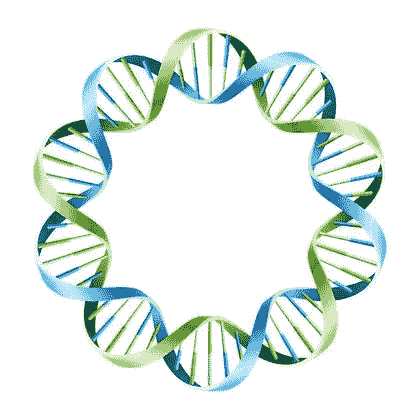

图片来自 Bio-Tek

一个质粒基本上是封闭的——(孤独的)——环状的自我复制的 DNA 分子。

你可能在想，为什么我要给你看这个圆形的东西，但是你要保持警惕，因为这对我们获取 lil 蛋白质是非常关键的。

你看，光靠 DNA 是不够的。科学家会做各种疯狂的事情，但很多事情只有在有点鬼鬼祟祟的情况下才有可能…

通过给细胞额外的信息！

他们使用工具(称为**载体**)将其偷偷放入，结果质粒成了最常用的载体！

细胞呢。他们照着说明做，好像这没什么！

相对较小、稳定且易于操作使它们成为实验室的理想选择😈

你可能正在想办法(在黑暗中发光的鼻子会是一个很好的补充…)但是先慢下来，这样我可以帮助你设计你自己的质粒(是的:star _ stricked:—设计你自己的！)

在此之前，我们先了解一下质粒部分的基础知识:

## 1.复制子

我们要研究的第一部分是复制子——有趣的名字，不是吗？

复制子包括 ORI(不是视频游戏！)，或者说复制的原点+它所有的控制元素。

像所有其他生命形式一样，质粒也需要复制。复制子本质上提供了使我们的质粒能够做到这一点的机制和元件。让我们潜入更深的地方。

复制起点(ORI)，顾名思义，是 DNA 复制开始的地方。虽然质粒独立于染色体 DNA 复制，但它们依赖宿主酶来催化它们的复制。

它还使用主机的复制机制来做到这一点。本质上，这个序列被它们读取，并告诉它们在哪里绑定，以便它们可以开始绑定！

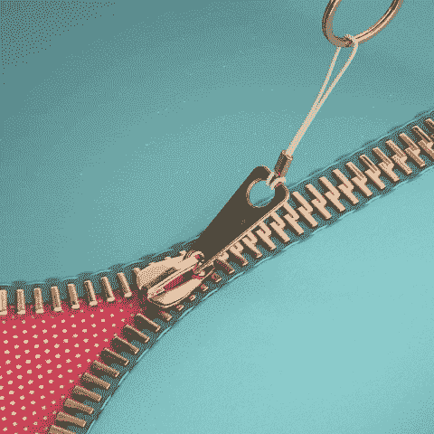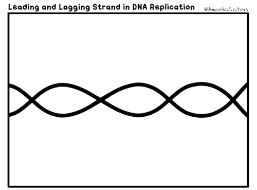

差不多吧？除了创造一个新的拉链，一点胶水和一些酶的帮助！

它的工作原理就像拉链一样！**解旋酶**解开 DNA 并打破所有的氢键，好像它们什么都不是，而 **DNA 聚合酶**为拉链建立了一个新的末端！为了确保拉链(又名 DNA)的两侧不会接合回来，存在 **SSB** (单链结合)蛋白质。

不幸的是， **DNA 聚合酶**在构建新的一半时需要一点帮助。这就是 Primase 的用武之地，它制造了一个引子，本质上是引导它，告诉它“从这里开始！”

另一种发挥作用的酶是**连接酶**，它将整个“创造新拉链”过程中的缝隙粘合在一起。有一个很长的解释为什么会有这些差距，这就是为什么我会推荐你看阿米巴姐妹的这个非常吸引人的视频！

赞美诗关于这一点还有很多——我只介绍了对本文来说重要的内容，但是如果你有兴趣了解更多，可以看看这个[博客](https://blog.addgene.org/plasmid-101-origin-of-replication)。

## 2.营养缺陷型选择标记

好吧，这个词很拗口，不是吗？我们分手吧，这样对我们俩都简单。

现在，让我们忘记“营养缺陷型”这个词，只关注“选择标记”

从这个术语本身，我们推断选择标记的意思是一个指标，尖叫'我是特别的！'

…但是我们为什么首先需要这样的东西呢？

还记得我提到过我们在酵母中加入正确的基因吗？嗯，并不是所有的人最终都会获得这种基因——并不总是这样。

这让我们进退两难——我们有很多酵母，但我们不知道哪些有我们需要的基因。

最好的渗透方式是…杀死他们。

是的，我们在拯救奶牛的过程中杀死了酵母。

营养缺陷型选择标记从本质上帮助我们做到这一点。我们首先改造宿主细胞，使其丧失合成一种必需物质的能力。

然后，我们赋予质粒合成完全相同物质的能力。

最后，我们看着没有摄取质粒(包含基因)的宿主细胞死亡。

参考消息——营养缺陷型→生物体不能产生重要的东西。

> 这里需要注意的重要一点是，营养缺陷型选择标记只在真核生物中使用。原核生物使用抗生素抗性标记。

## 3.限制性位点

限制性位点是大约 6-8 个碱基对的 DNA 序列。这对想要插入另一个基因的科学家来说非常重要。

你看，被称为限制性内切酶的分子剪刀结合在这些位点上，并在这些位点上剪切。这给了我们添加插入片段的空间(也就是我们想要添加的牛奶蛋白基因)！

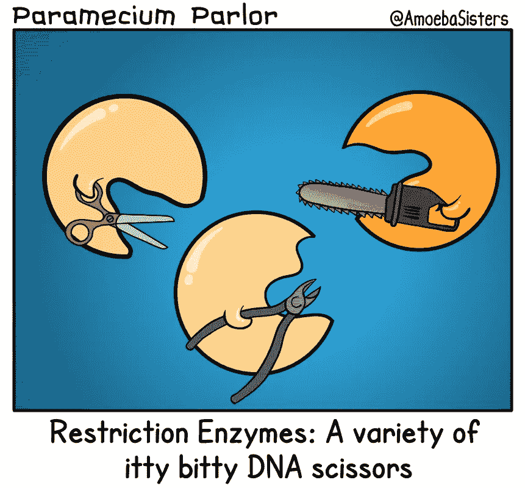

分子电锯…？

需要注意的一点是，每种限制酶都有一个独特的限制位点，所以如果你看到一个科学家使用了 1 个以上的限制位点，不要感到惊讶！

然而，你经常在实验室和研究中看到的质粒结构，包含多个克隆位点。顾名思义，它在一小段 DNA 中包含多个限制性位点。这个片段对于添加基因插入是安全的，因为你没有破坏质粒的其余部分。

但是为什么我们需要多个限制性位点呢？

这可能有多种原因，包括酶的成本和可用性。这也使得研究人员更容易根据他们已经拥有的酶添加基因插入。

不管是什么，确保你的质粒只有一种限制性位点。有多个将意味着酶进行多次切割。相信我，那不会让你的工作更容易。

## 4.发起人

启动子是启动转录的基因的特定序列。转录因子和 RNA 聚合酶与该序列结合。这是必要的，因为没有它，我们的质粒实际上是无用的！

## 5.终结者

启动子决定了转录的开始，而终止子决定了这个过程的结束。这启动了从新合成的 RNA 释放出转录机器的过程。

在处理真核生物时需要注意的一点是，与原核生物不同，它们有三种 RNA 聚合酶(聚合酶 I、II 和 III)，每种负责转录不同类型的 RNA。例如，RNA 聚合酶 1 负责 rRNA。

这意味着它们依赖不同的终止子序列！他们做了大量的打磨和修改，使其成为成熟的 mRNA。

还有…就是这样！现在您已经准备好设计质粒了！

> PS。还有更多的内容，但是因为我在本文中主要关注 acell-ag，所以我将在这里停下来。如果你想更深入地研究质粒，看看这个概念，博士。李冠仪有一篇关于这个的精彩文章，看看吧！

对于我们生产酪蛋白和乳清来生产牛奶的应用，我们将使用酵母细胞。我们将使用酵母细胞而不是原核细胞的原因是因为它们和我们在处理原核生物时一样容易使用，但同时，它们也有 SUPERPOWER‼

由于其内部结构错综复杂，它们可以翻译后修饰蛋白质。

如你所见，使用酵母载体=原核生物的相同好处+一些特殊能力。

好多了，不是吗？

## 第三步:为生产这些蛋白质创造重组 DNA！

好了，现在你知道什么是质粒+它的结构了。现在是技术层面的时候了。在这一节中，我们将介绍 DNA 克隆的步骤，特别是生产这些蛋白质的步骤。

准备好学习了吗？我们开始吧！

你是你的基因，毫不夸张地说；棕色眼睛？归咎于基因。你身体里漂浮的所有氨基酸？基因。

这意味着如果我们能够复制奶牛基因构成中产生蛋白质的部分，我们就可以得到完全相同的牛奶。！！)

我们在这里的主要目的是将牛的蛋白质导向基因转移到酵母细胞中，这样它就能煮出一些甜乳清和酪蛋白。

至于酵母细胞，**酿酒酵母**似乎是我们目的的理想候选者。自古以来，它就被用于酿酒和烘焙。它也被用来为糖尿病患者生产人体胰岛素。

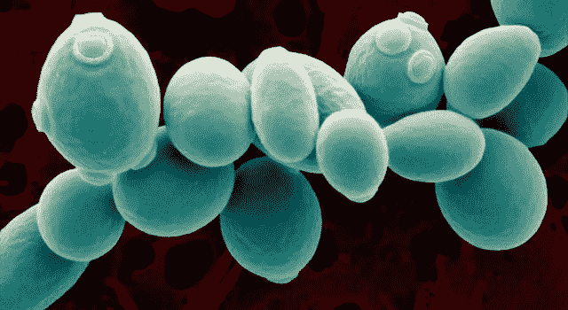

见见我们的酵母！

你可能已经猜到了，我们通过使用质粒来做到这一点。

我将具体描述我们如何生产κ-酪蛋白，但这是同样的过程，所以不要害怕！

我们首先要做的是决定一个质粒。确保选择合适的质粒→质粒也有偏好。这主要是因为 ori 序列的差异。在我们的上下文中，合适的质粒将能够结合酵母 DNA 聚合酶(用 2u ori 表示)。

但是我们的质粒还需要满足其他一些标准！也有几种类型的酵母质粒。科学家考察的主要参数包括限制性位点的可用性、成本以及他们所做的任何事情的具体情况。然而，在我们的例子中，我们不需要担心这个，因为我们正在复习理论部分。

好了，我们得到了质粒，现在我们需要做两件事:

1.  通过 DNA 克隆编辑它
2.  将其转移到酵母上

先说#1: **DNA 克隆**。

当我说“克隆”这个词时，你可能会想到克隆羊多利或克隆其他生物。但我实际上指的是分子尺度的克隆。

与创造完整的有机体不同，DNA 克隆的主要目的是创造一段 DNA(基因)的完全相同的副本。在我们的例子中，它是乳清和酪蛋白。

这是一个关于 DNA 克隆如何工作的视频:

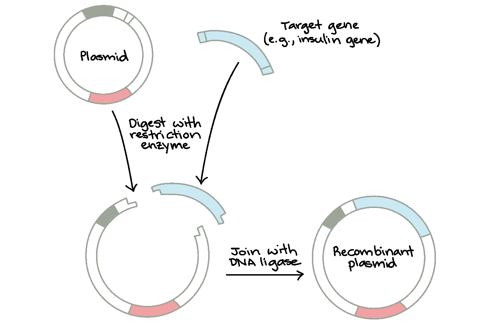

来自可汗学院

我们从质粒开始。有一个我们想要插入的基因。

我们可以从动物或网上数据库中获得这种基因，但现在我们先把它放在一边。我们首先要关注的实际上是**剪切和粘贴 DNA。**

如上所述，我们在 DNA 上有称为限制性位点的位点和在特定限制性位点切割的分子剪刀(称为限制性酶)。你可以猜到限制性内切酶在我们的例子中非常重要。

但不是这样。为此我们还需要一种重要的酶。我们来看看为什么。

所以你是一个科学家，一生都在研究质粒，做一些超酷的拯救世界的事情。你的实验进行得非常顺利，现在是时候开始你的质粒的剪切-粘贴过程了。

你命令你精心选择的限制酶去做它的事情(既获得基因+在质粒的正确位点切割)。事情就是这样。

直到你意识到在你的 DNA 主链中有 ***缺口*** 是因为**单链突出端**(它们大部分时间都是它们——几个核苷酸只是无伴侣地坐在一起)。

呀！我们现在该怎么办？

很简单，我们用 **DNA 连接酶**来封闭缺口。DNA 连接酶是非常酷的，当它成为你的邻居胶水酶时。

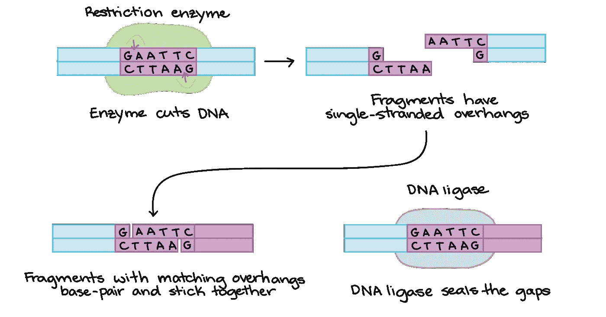

注意:不是所有的片段都有单链突出端。||出发地:可汗学院

> 有趣的是:有突出端的片段被称为粘性末端，而没有突出端的片段被称为平端。点击了解更多[。](https://en.wikipedia.org/wiki/Sticky_and_blunt_ends)

将所有这些结合在一起，我们就得到了科学家所说的**重组 DNA！**耶！我们这一阶段的工作已经完成…

嗯，不。我们需要把这个质粒带到酵母里，记得吗？请继续阅读下一部分，看看我们如何做到这一点！

## 第三步:陷入转型！

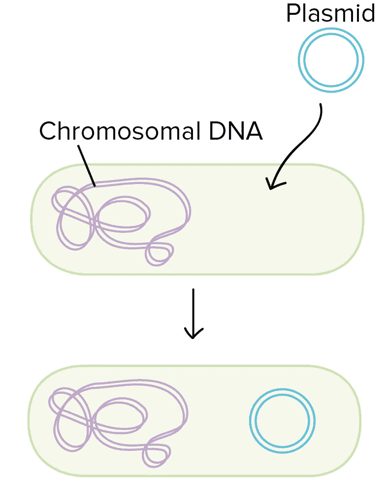

转型||鸣谢:可汗学院

为了让质粒进入酵母，我们使用一种叫做转化的过程。其正式定义将其描述为"*,即通过细胞膜直接吸收和掺入来自周围环境的外源遗传物质而导致的细胞遗传改变。*(来自维基百科)

但是，我们究竟如何促使细胞获取外源(外部)遗传物质，比如我们的质粒？

现在，有两种类型的转变:**天然的和人工的。**

自然发生…嗯，自然发生，而人工发生是当我们必须诱导我们的质粒的整合。

为了我们的克隆目的，使用了人工方法。一种方法是进行热冲击。尚不清楚这到底是如何工作的，但有人说它打开了细胞膜上的孔，使其能够吸收质粒。不管它是什么——它在实践中起作用，所以，这就是我们所做的。

另一种方法是**电穿孔**。这是当我们向细胞引入电场时，增加细胞膜的渗透性。

然而，使用这些方法并不能保证所有的细胞都摄取质粒。这意味着我们也会有很多不需要的细胞！我们现在要干嘛？！继续前进，你会看到。

## 第四步:取出无用的细胞:让我们有选择性！

你可能已经知道我们不会使用这些细胞，需要处理掉它们。如果你在想我们是如何做到的，回想一下我们说过的营养缺陷型选择标记…

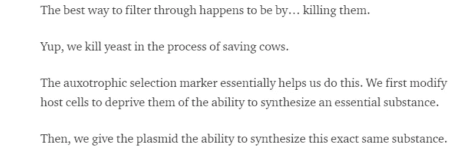

来源->来自我的文章本身

在我深入讨论这个问题之前，让我们用一个很好的老式 FB 迷因来营造气氛:

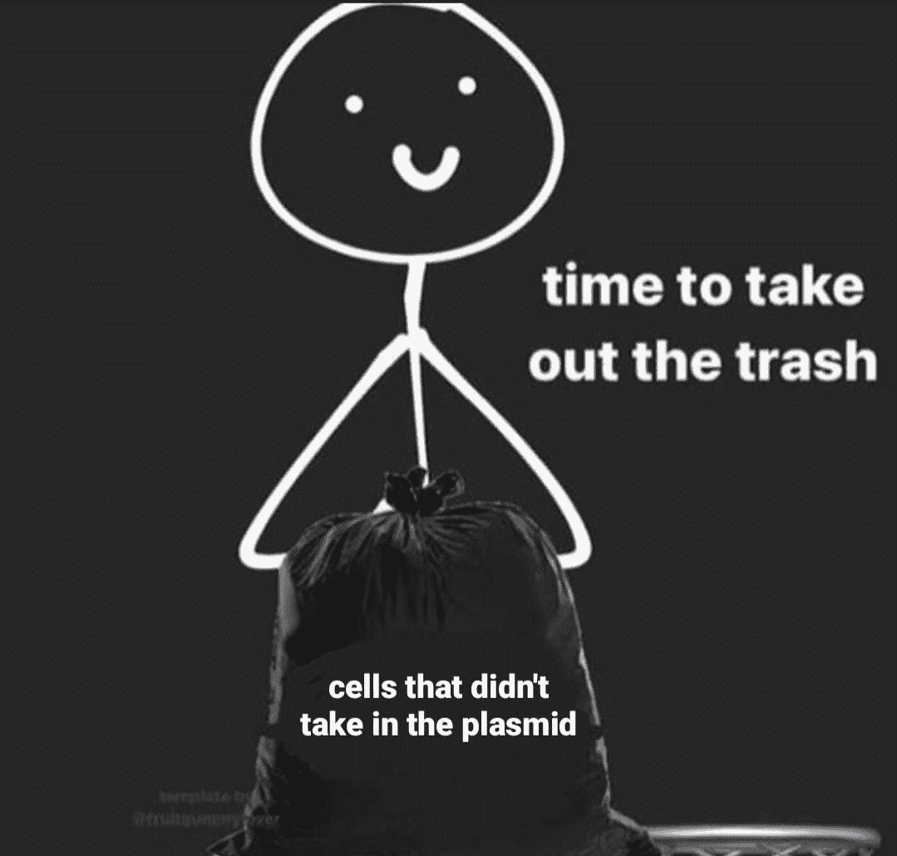

(抱歉)||来源:本人编辑(但图中是模板主人的轮廓！)

总之，回到营养缺陷型选择标记。如前所述，我们将剥夺酵母生产一种非常重要的物质。我们将授予我们的质粒通过营养缺陷型选择标记创造这种完全相同的物质的权利。

所以在酵母吸收了质粒后，它仍然能够完成生命所必需的物质。没有的将会灭绝。

这将为我们提供携带相同质粒的相同酵母菌落。然而，重要的是要注意，不是所有的酵母都有正确的质粒，因为 DNA 也可能以意想不到的方式粘贴。

科学家从各种菌落中提取 DNA，并通过 PCR 或限制性酶消化来检查它们。这些方法可以帮助我们正确地识别它。如果你想了解更多，我已经把它包含在我的想法文档里了(你可以在最后找到它！).

## 第五步:酵母如何变成蛋白质搅拌工厂。

我们使用精确发酵来生产蛋白质。

**精准发酵**顾名思义，是一种更进化的发酵形式。当我们将微生物转化为真正的蛋白质搅拌工厂时。

我们让细胞复制并增加数量，形成一个大的培养物。当给它们喂食特定的食物时，这些蛋白质就会被吐出来…

瞧啊。这就是你要的——实验室新鲜制备的乳清和酪蛋白。现在，把牛奶的所有成分放在一起，你会得到…牛奶！

当我们扩大规模时，我们会使用生物反应器。你知道，所有活动都发生在巨大的水箱里。

有了这个，我们会得到…

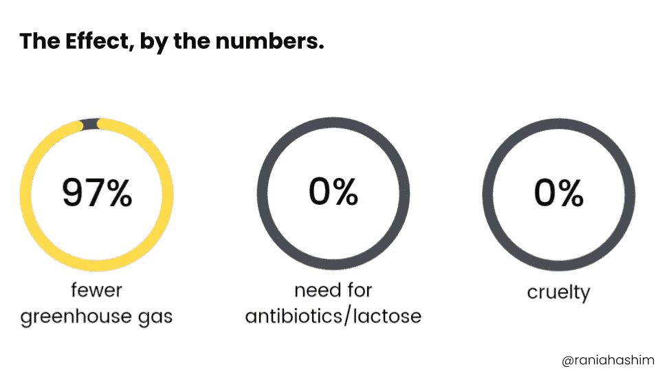

听起来对我来说是双赢！

# 试试你的手！

是的，现在你已经知道了基础知识——是时候把它付诸实践，挑战自己，最终成长了🌱

## 模拟这个过程！

我通过一个名为 **Benchling** 的 RND 平台模拟了完全相同的过程(除了我为蛋白质 eGFP 编码)！这非常有趣，令人紧张，但给了我很多启示。

关于一些背景:Benchling 是一个基于生命科学的研究和设计平台，在这里你可以设计质粒和做各种各样的事情。

在我的项目中，我模拟了科学家在实验室生产蛋白质的过程！

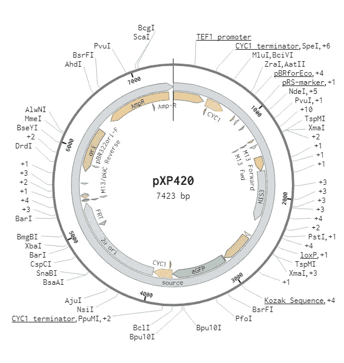

我的质粒！！

你也可以做到这一点——我想帮助你做到这一点。这就是我写这篇文章的原因:

[待插入]

是的，在这篇文章中，我描述了如何从零开始制作你自己的质粒！检查一下，并告诉我是否有帮助！

## 玩虚拟实验室！

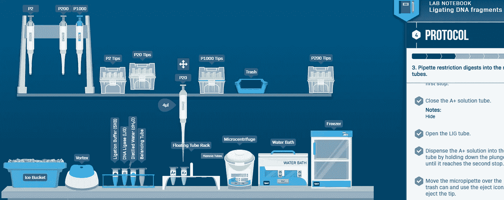

虚拟实验室:||来自可汗学院

如果你对类似实验室的环境更感兴趣，并且想经历科学家经历的所有复杂程序，那么试试虚拟实验室。可汗学院推荐 LabXChange.org。

以下是他们的一些更具体的建议:

*   通过虚拟实验室了解更多关于限制性内切酶的信息——点击这里！
*   了解更多关于 DNA 连接酶在 DNA 克隆中的作用——点击这里！
*   了解更多关于细菌转化的信息——点击这里！

# 参考资料+资源！

是的，这是承诺的参考资料和来源列表。你可以在[这个](https://www.notion.so/Let-s-talk-Protein-Synthesis-85f055ec51af4a61a539aa3879350652)概念文档中找到它。

如果你想和我一起玩，或者只是做朋友(非常感谢)，请在我的社交网站上联系我——[Linkedin](https://www.linkedin.com/in/rania-hashim-49184b1b2/)|[Twitter](https://twitter.com/RaniaHashim12)|[insta gram](https://www.instagram.com/raniahashim__/)|[Youtube](https://www.youtube.com/channel/UCeZ6srn-8wb7hMMt_s1y3cw)。哦，当你这么做的时候，通过订阅我的个人[时事通讯](https://fjsgkyhtm24.typeform.com/to/dAXmupOo)来了解我的疯狂冒险吧！再见:)

哦，这里有一点关于我的:

*嘿嘿👋，我是 Rania，知识社会的 14 y/o 创新者。我目前正在研究替代蛋白质、扩展现实和其他指数级技术。我很乐意联系；在我的任何社交媒体上联系我，让我们成为朋友吧！*