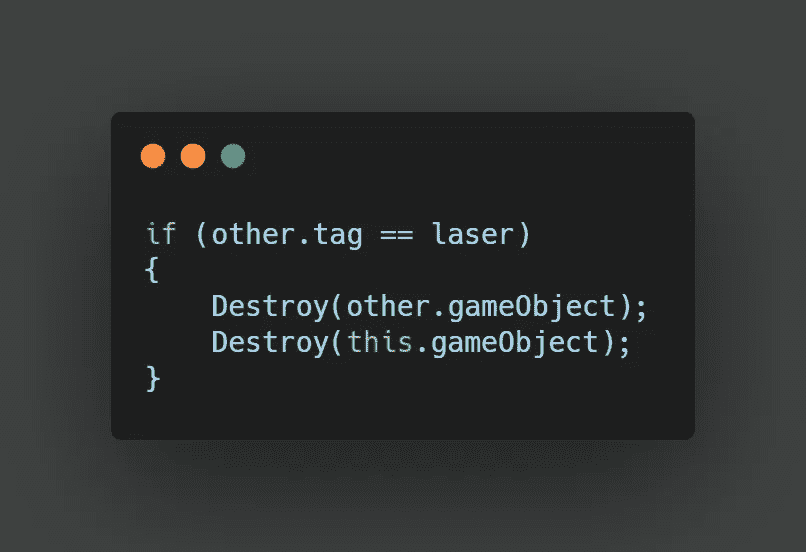
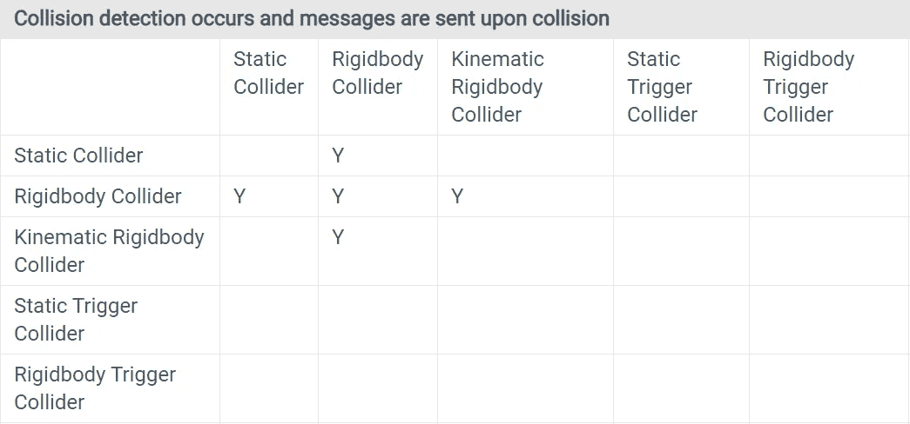
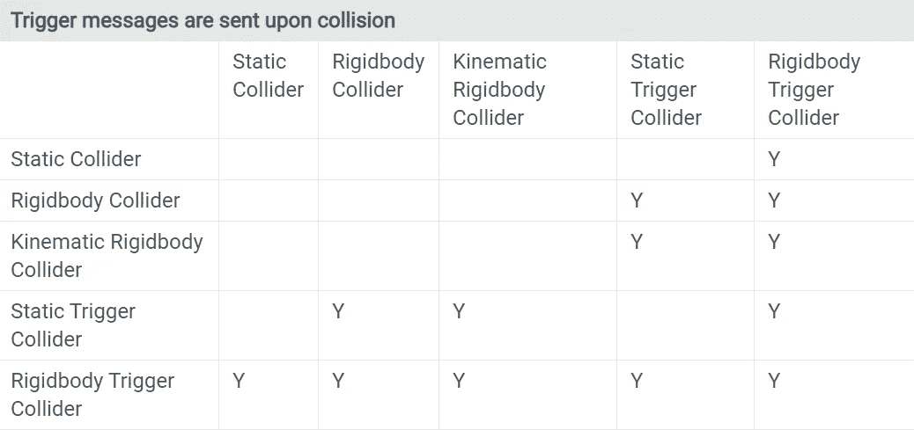

# Unity 中的物理学简介

> 原文：<https://medium.com/nerd-for-tech/a-brief-introduction-to-physics-in-unity-when-to-use-ontrigger-vs-oncollider-875f33a9d526?source=collection_archive---------22----------------------->

物理学是伟大的，它们是许多工程的基础部分，游戏开发也不例外。对于我们的游戏对象，我们希望能够调整物理属性。Unity 内置了 2D 和 3D 物理引擎。这些各自系统的两个最基本的元素是**对撞机**和**刚体**。

**碰撞器**定义了我们游戏物体的形状，这就是通常所说的 hitbox。最简单的是，我们可以使用静态碰撞器来充当像墙一样的物体。有一个带 R **igidbody** 的**碰撞器**将允许玩家在墙不动的情况下撞击墙，而玩家可以施加力。**碰撞器**允许我们围绕碰撞调用特殊的 Unity 函数来编写进一步的行为或启用某些事件。然而，如果我们将碰撞器上的 Is **Trigger** 函数设置为 true，这反而允许碰撞器相互通过，并附带一个 R **igidbody** ，在 Unity 中调用 T **rigger** 函数。

**刚体**允许我们使用力对我们的游戏对象施加运动。现在，我们将坚持移动我们的玩家变换位置，但有更先进的情况下，基于物理的角色控制器可能更适合。有了这些力，就有了重力，幸运的是，重力可以很容易地打开和关闭。对于我们的太空射手来说，我们希望我们的玩家能够自由移动，而不会跌落到屏幕底部。

如果我们不使用基于物理的角色控制器，为什么我们需要一个机器人？如果一个或多个游戏对象连接了碰撞器并发生碰撞。**刚体**允许我们为碰撞产生适当的力，并相应地移动我们的游戏对象。

再说一次，这不是我们在当前游戏中想要达到的目标。但是如果我们将碰撞器的 is 触发器组件设置为活动的，我们就可以让 R **igidbody** 调用一个函数而不是一个碰撞。

在我们的游戏中，我们可以创造一个敌人。如果敌人和我们的激光发生碰撞，我们希望敌人和激光被摧毁。有了这个简单的物理系统，我们就可以检测到这种碰撞，并在代码中触发一个方法。

我们想要使用的方法是 private void**OnTriggerEnter(Collider other)**

现在当我们敌人的 R **igidbody** 对撞机与另一个物体发生碰撞时，它会调用我们输入的代码。但是我们想定义什么对象做什么动作。因此，我们需要在游戏对象上启用标签。有了玩家、激光和敌人标签，我们就可以使用 **if 语句**来定义这些碰撞。

现在当我们的激光击中我们的敌人时，两个游戏对象都被摧毁。我们的**销毁**函数的顺序也很重要。我们的激光器需要首先被摧毁，因为如果我们首先摧毁敌人，要求摧毁激光器的代码行将不复存在。

为了演示碰撞和触发之间的区别，让我们解释一下使用 **OnCollisionEnter** 会对我们当前的机制产生什么影响。如果我们的游戏对象没有一个是触发器。我们的激光和敌人将会产生碰撞，相互撞击偏离轨道。如果我们希望游戏中有一个小行星特征可以充当物理对象，并在我们的 **OnCollisionEnter** 方法中简单地摧毁激光对象，这可能是有用的，但是对于调用没有应用物理的函数，应该使用 **OnTriggerEnter** 。

如果你意识到你希望你的对象如何交互，只要稍加思考，就能做出正确的选择。如果没有，就随便玩玩！搞乱物理引擎，找到感觉最好的。

Unity 中的物理可以被模拟成和现实生活中一样强大。因此，在我们的游戏中，我们可以控制更多的东西。但是知道 C **碰撞器**和**刚体**的使用对于在你的游戏中创建一些最基本的功能是必不可少的。