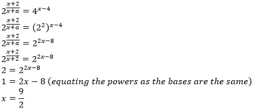
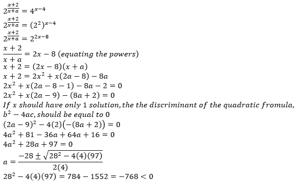
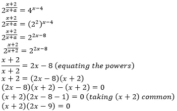
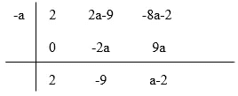

# 看似困难的问题

> 原文：<https://medium.com/nerd-for-tech/a-deceptively-difficult-problem-6dd014f99eb3?source=collection_archive---------8----------------------->

页（page 的缩写）上校:乌马斯·洛厄尔

## 你在问题中会错过什么

嘿伙计们！最近，我收到朋友的一个问题，我觉得应该和大家分享一下:

从表面上看，这是一个非常简单的问题。当他把这个给我时，我的即时反应是 a=2，因为 2 的指数会抵消掉，只给出 x 的 1 个解。然而，他的即时反应是，“怎么做？”然后我向他展示了这个作品:

这似乎是正确的，但他想让我用更长的方法，而不是用 a 的随机值来代替，所以我这样做了，这是我得到的结果:

在这里，当判别式小于 0 时，a 没有实根！然而，我们刚刚证明了 a=2 是 a 的一个解，它只给出 x 的一个解，即 9/2。这难倒了我们俩。考虑到这一点，我试图证明 a=2 给出了 x 的不止一个解。这就是我所做的:

注意这里，我们得到了两个关于 a=2 时 x 的等式:x+2=0 和 2x-9=0。但是，而且这也是我们之前没有得到解的主要原因，x+2 **不可能**等于 0。这是因为问题中 2 的指数(分母为 x+a)不能等于 0，因为我们不能将任何数除以 0！当我们取 a=2 时，x+2 现在不可能是 0。因此，x+2=0 是无效方程，x=9/2 是唯一解。在 long 方法中，我们只是在寻找 a 的值，它对 x 产生 1 个解，没有任何限制。现在这给我们带来了一个新的问题，我们如何在没有随机替换的情况下解决这个问题？

使用 long 方法后，我们看到 x 无解，但现在我们有一个限制，x-a 不能等于 0。再次从 long 方法中，我们看到我们在 x 中获得了一个二次项，其中 a 在一些项中，即 2x +x(2a-9)-(8a+2)。通过使用我们使用的方法，我们知道二次曲线将**永远不会**分解成一个正方形，因为不可能只获得 x 的一个解。结果是，二次曲线**不是**完全可因子分解的，只能用(nx+y)(mx+z)+R(a)的形式表示。这就是二次方程的分解方式，但是为了得到这个问题的解，我们需要**假设**x+a 是二次方程的一个因子。所以，我们可以重新写成(x+a)(mx+z)+R(a)，其中 R(a)等于 0。有了这个武器，我们可以用两种不同的方法来解决这个问题。

方法 1:

正如我们所知，其中一个因素是 x+a，要得到 x 的单一解，在二次方程中代入 x=-a 必须得到 0。有了这个，我们就可以解出一个:

这只给了我们 a=2 的正确解。

您还可以注意到，a-2 实际上是我们将二次曲线除以 x+a 得到的余数 R(a)，这是因为根据简化形式，即(x+a)(mx+z)+R(a)，如果我们将 x=-a 代入其中，我们将只剩下余数，因为 x+a 在 x=-a 处等于 0。这表明 R(a)等于 a-2。我们实际上是从余数定理得到这个:P(-b/a)，这里 P(-a)，是 ax+b，这里 x+a，是除数时的余数。这一点的重要性将在下一个方法中阐述。

方法二:

我们知道其中一个因子是 x+a，为了得到 x 的一个解，我们可以用合成除法求出 x 的值:

*注:我写过一篇关于合成除法的文章。如果你不知道合成除法是如何工作的，看看它。点击* [*此处*](https://srivishnuvusirikala.medium.com/synthetic-division-with-a-monic-factorizable-quadratic-divisor-f6cca12cb93e) *查看。*

这里，我们看到余数是 a-2。从合成除法出发，我们可以把二次型改写为(x+a)(2x-9)+a-2。这是方程式(x+a)(mx+z)+R(a)的简化版，其中 m=2，z=-9，R(a)=a-2。由于 x+a 是一个因子，R(a)必须等于 0。所以，a-2 应该等于 0。这最终得到 a=2，这是我们之前得到的。如果我们把 a 的这个值代入上面的等式，我们将得到(x+2)(2x-9)。这也正确地显示了我们应该接收的分解二次型。

这给了我们这个问题的最终解，a=2。虽然简单的看问题就能给你这个值，但是你现在知道如何实际获取这个值了。那个简单的问题结果证明是非常值得麻烦的，你不这样认为吗？