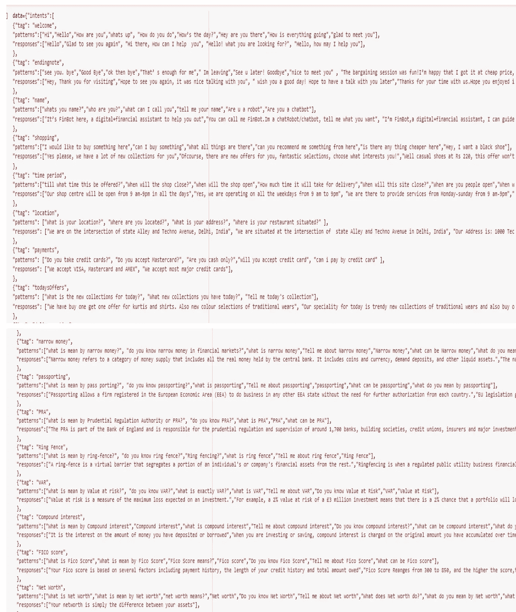
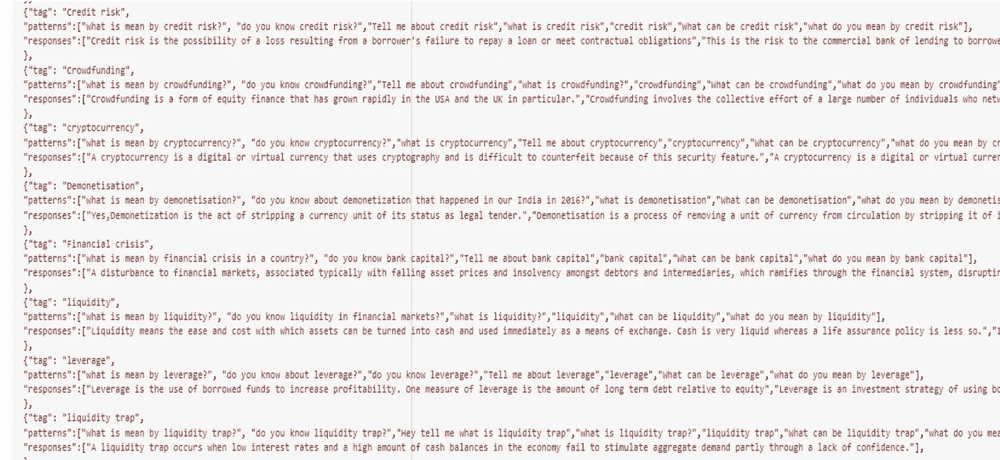
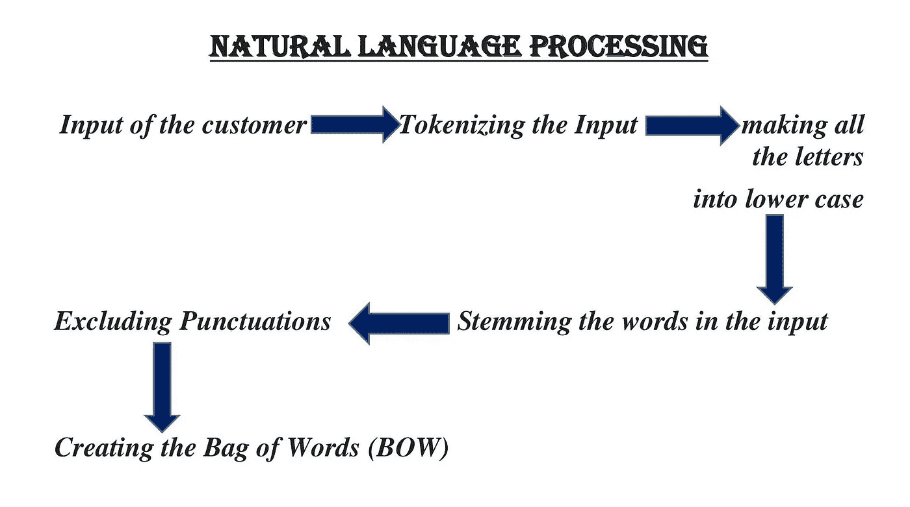
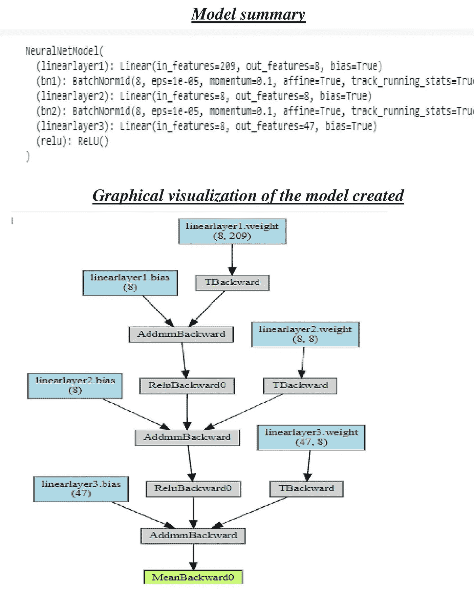
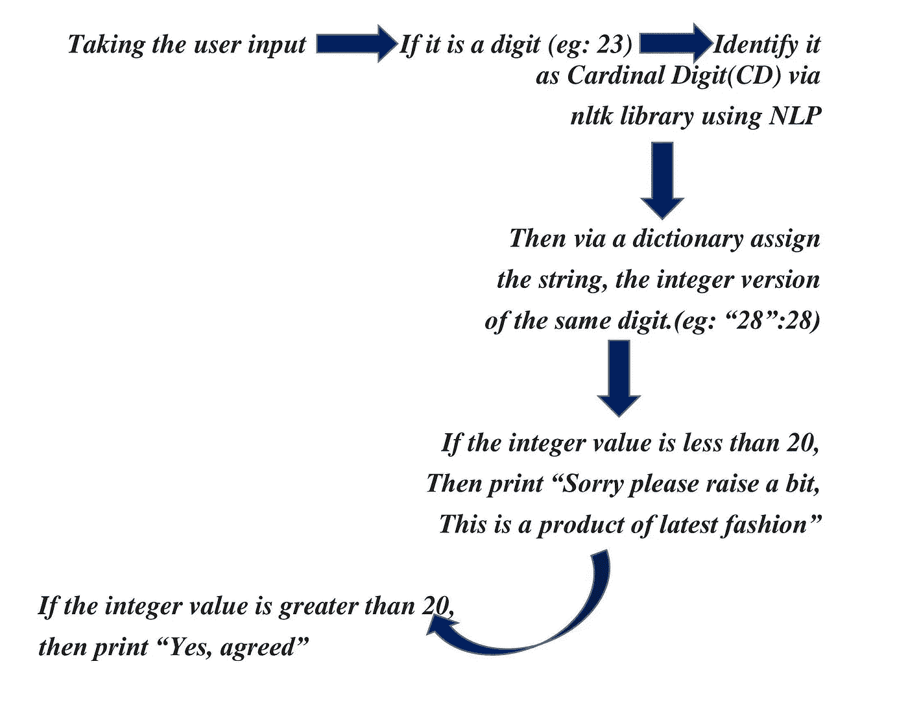
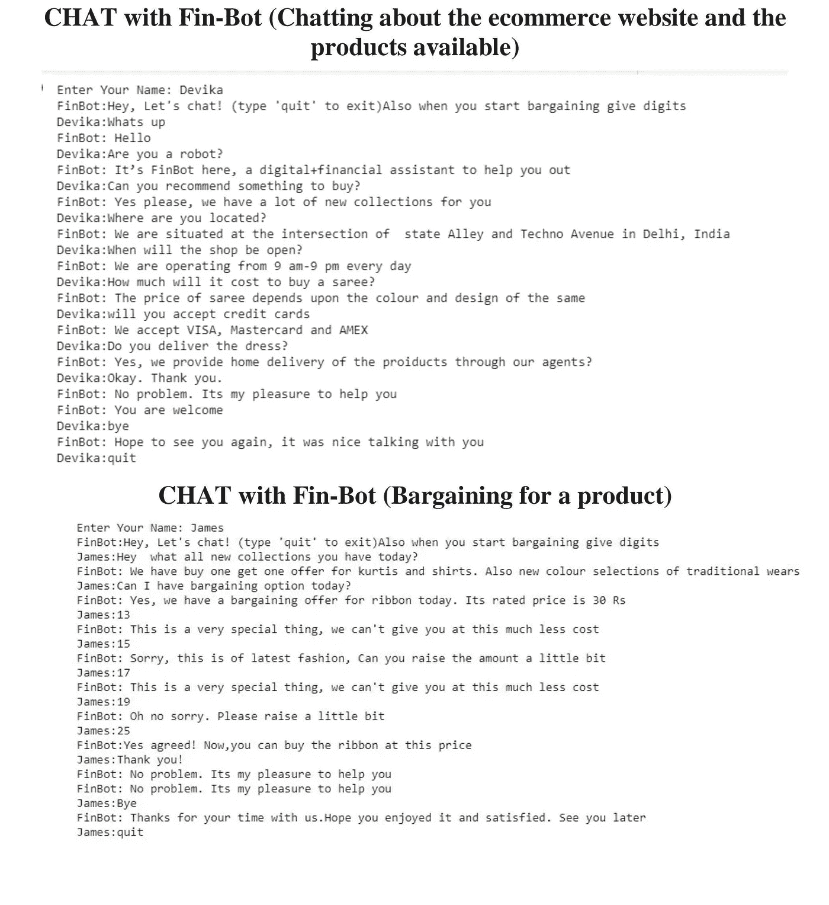
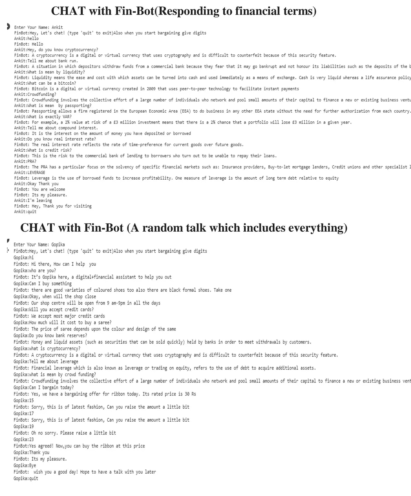

# 利用深度学习和自然语言处理构建金融+数字助理聊天机器人

> 原文：<https://medium.com/nerd-for-tech/a-financial-digital-assistant-chatbot-fin-bot-using-deep-learning-natural-language-processing-16b19c624541?source=collection_archive---------0----------------------->

欧文·比尔德在 [Unsplash](https://unsplash.com?utm_source=medium&utm_medium=referral) 上的照片

**简介**

这是一个聊天机器人的建设，可以作为一个金融+数字助理聊天机器人，这是使用深度学习和自然语言处理技术。我称这个聊天机器人为“Fin-Bot”。

(i) **数字助手-** 聊天机器人是电子商务网站中完美的数字助手，通过告诉你可获得的产品、商店的位置、产品的价格等来引导你浏览我们的商店——它的主要特点是**“这个聊天机器人将为公司的产品与顾客讨价还价”。**

(二)**金融助手-** 如果你问一些金融市场术语，聊天机器人也可以回答你，这将使你得到中肯的答案。我已经培训了大约 40 个在金融和经济市场中经常使用但非常相关的术语。(例如:比特币、银行、众筹、实际利率、流动性等)

该数据是手动创建的，因为该项目是一个特定于上下文的聊天机器人。数据准备的方法如下。首先使用自然语言处理来获取用户的输入并对其进行转换。然后，使用 nltk 工具包进行自然语言处理。出于模型构建的目的，使用 Pytorch，因为当尝试在 Tensorflow 中使用 Keras 时，准确性比 PyTorch 低。

为什么要建造这个鳍状机器人？它如何有助于经济和财务上有效的营销策略？

人类的行为令人困惑，同时行为也在急剧变化。但在现实经济中，每个人都有这样或那样的相似之处。以一家商店为例。大多数来商店的人都希望买到尽可能便宜的商品，除了那些在紧急情况下或匆忙中接近商店的人，或者那些不愿意对别人做出这种行为的人。以大多数人为例。大多数作为商店的在线电子商务网站不会提供太多的议价设施。因此，一个高效的聊天机器人，它有最好的能力与客户讨价还价，并相应地处理他们，使公司不发生损失，可以创造巨大的机会。

所以，我的主要想法是让我的 Finbot 在电子商务网站上工作，这个想法肯定可以提出一个伟大的营销策略来获得更多的客户。

**如何？**

→当一些人知道有一个值得信赖的电子商务网站现在也推出了议价工具时，他们会尝试先去该网站试试。一个好的策略是——这个网站每天只为一种产品提供讨价还价的机会。因此，人们将登录该网站并尝试 FinBot，看看它今天可以讨价还价并以便宜的价格买到什么产品。如果那个产品在那个特定的日子吸引了顾客，那么顾客就会购买它。否则，同一顾客购买其他东西的可能性很高，因为他现在在网站上，新的时尚系列可能会吸引他。

→讨价还价本身是以成本最小化为目的的经济学工具。每个人心里都有这样或那样的讨价还价的想法。因为这不是面对面的交流，顾客不会对讨价还价感到不情愿。这也将导致网站聚集更多的客户。

→现在，Fin-Bot 还将通过给出金融术语的定义来帮助客户。在这个高度数字化的当今世界，一些人从事网上交易。此外，金融交易和金融市场中运作的事物需求量很大，每个人都有兴趣知道经济学/金融市场中某个特定术语的确切含义。这款 Fin-Bot 不会像浏览谷歌那样将你引向大量额外信息，而是以你想要的方式给你清晰的答案，尤其是关注金融市场。

了解这些术语的人也可以到网站上和鱼鳍机器人聊天。它肯定会非常愉快地回答，因为它受过这样的训练。现在，再一次，因为金融术语而访问网站的人可能不是电子商务网站的普通客户。但是，当他们来到网站时，他们也会遇到网站提供的新品种产品，所以他们也有可能购买。！

因此，作为一个讨价还价的助手，同时也作为一个金融助手，这个 Fin-Bot 将带来一个完美的营销策略以及一个高度经济的步骤。

这种鱼鳍机器人对电子商务网站来说是经济的，因为鱼鳍机器人已经学会了讨价还价的方法。假设一个新产品的价格是 15 卢比，那么公司销售同样的产品需要 5 卢比的利润。所以，现在成本是 20 卢比。现在，网站显示的价格是 30 卢比。我们训练聊天机器人接受所有大于 20 卢比的交易，拒绝所有小于 20 卢比的交易。(销售者的正常定价策略——在给出高价后给予折扣——类似的策略，但在这里采用了不同的方式)。因此，用户购买该产品的可能性很高，而且由于这种讨价还价的特点和金融术语教学的特殊性，客户会不断来访，因此公司很有可能从网站以及交易中获得更高的生产率。

# **数据**

数据集是手动创建的。对于构建聊天机器人来说，意图识别是重要的事情之一。聊天机器人应该理解客户或人在说什么，并且应该将其与相应的标签正确匹配，该标签具有对客户所说的问题或评论的可能响应。使用字典格式并将其命名为数据，起始大字典是“意图”，其中在字典格式本身中添加了 4 个子部分，即“标签”、“模式”、“响应”和“上下文集”。标签基本上是用来识别意图的。所以，如果顾客问“商店什么时候开门？”，聊天机器人会将其连接到标签上:“时间”。这个标签在标签内的响应中包含了几个可能的答案。识别标签后，聊天机器人会从相应“标签”中的“回复”中随机选择任意一个回复。所以，这就是我们的想法，我们也准备了相应的数据。

下面是一小部分数据，让你了解它的样子。

*作者图片*

作者图片

在上述格式中，手动创建了 47 个标签，每个标签有 4 或 5 个模式和响应。如上图所示，在模式中，根据前面定义的标签，添加了客户可能会问的问题。在响应中，可能的答案或评论已经被放入，因此聊天机器人将根据响应中的标签对客户做出响应。

# **遵循的战略/方法**

该战略如下:

## **(i)使用自然语言处理(NLP)的预处理**

一旦 Fin-Bot 从客户那里获得输入。它首先将句子标记化。记号化帮助我们将大句子分解成小记号/单个有意义的单词。所以，如果输入是“嘿，你是谁？”，那么经过标记化后就变成[“嘿”、“谁”、“是”、“你”了？”].

下一步是将标记化单词中的所有字母变成小写。因此，在上面给出的句子中，将 all 变成小写后，它就变成了["嘿"，"谁"，"是"，"你"，"你？"].

下一步，我们需要词干。下一步是把单词变成小写，然后做词干。词干意味着找到词根。假设我们有两个独立的词“吃”和“被吃”，那么词干化后它们都是“吃”。所以，上面的句子在词干之后也，给出[“嘿”、“谁”、“你”、“呢？”]既然这些话没有太多的梗。

下一步是从数组中删除标点符号。那么上面的数组就变成了["嘿"，"谁"，"是"，"你"]。

现在，我们把这个句子转换成一个单词包(BOW)。包字(弓)法如下。这是自然语言处理中一个著名的简化给定句子的方法。这个句子被描绘成它的单词袋。在这里，语法和词序不会被考虑在内。所以，BOW 是一个单词的集合/组，用单词计数来表示一个特定的句子。

我们可以这样来论证:-假设我们定义的所有可能词的数组是["嘿"，"谁"，"是"，"你"，"再见"，"希望"，"到"，"看见"，"以后"]。

然后，标记化序列[“嘿”、“谁”、“是”、“你”]可以相对于所有单词是一个包[1，1，1，1，0，0，0，0]来表示。(如果该单词出现在所有单词的特定位置，则给 1，否则给 0。)

作者图片

## **(二)型号**

使用的深度学习模型是 PyTorch。正在建立的神经网络是具有两个隐藏层的前馈神经网络。这个神经网络将把我们上面创建的单词包作为输入。然后有 3 个完全连接的线性层(FC)，其中第一个层具有不同模式的数量作为输入大小。

其他的是两个隐藏层。然后是输出层，其中输出大小与不同类别的数量相同。然后，对输出应用 softmax 函数，给出每个类别的概率。为了更准确，我还在各层之间添加了批量标准化。

输入大小=209，隐藏大小=8，输出大小= 47[类别数/标签数]。模型总结如下。

作者图片

## **(二)培训**

模型中的参数数量为 2207，可以使用权重和偏差从模型中轻松计算出来(考虑其他图层的批量归一化)。使用 NLP 预处理后的输入序列将使用上述 PyTorch 模型进行训练。使用的优化器是 Adam，损失函数是交叉熵损失。训练后的最终准确率约为 96%，我跑了 1000 个纪元。(也许使用批量标准化是获得良好准确性和更多数据的原因)。

## **(三)合并议价任务**

在电子商务网站中，只允许对一个 30 卢比的产品进行议价。很明显，可以以类似的方式让聊天机器人为其他几个产品讨价还价，这种为一个产品讨价还价的任务也包括在内。

作者图片

# **最终结果**

聊天机器人工作得非常好。训练准确率约为 96 %，变化范围为 94%-96%。此外，它的工作非常完美。因为我为它训练了大约 42 个标签，并且我已经将金融市场中使用的术语包含到聊天机器人中。因此，当我向它询问一些术语时，它会在使用 NLP 进行预处理并使用 PyTorch 神经网络进行训练后，从“响应”中随机选择一个响应进行回答。下面是聊天机器人与客户的一些对话截图。

作者图片

作者图片

# **结束语**

## 条件适用于聊天机器人

1.如果我们只输入数字，例如:28，它才会讨价还价。此外，只有一个产品有讨价还价的报价。这实际上是一种吸引更多顾客的技巧。(他们会通过认为可以在自己认为的钱里得到一个产品，从而进入网站进行议价。但是，事实是，当他们访问网站时，他们会看到新的集合。因此，按照正常的人类行为，很有可能同一位顾客还会购买另一种产品。)

2.这个聊天机器人是一个专门销售服装的商店的电子商务网站的数字助理。目前，我已经提供了非常有限的数据实现。但当我使用“成本”、“价格”等关键词时，它会给出很好的结果。因此，这些数据可以很容易地被修改，然后这个聊天机器人可以根据你提供给它的数据按照你的兴趣工作。

3.它还会谈到购物时间，送货，付款，商店的位置等。聊天机器人没有被训练成无所不谈。而是接受了金融市场中一些相关的、重要的和困难的术语的训练。例如:加密货币、比特币、众筹、杠杆、银行等等，这些也可以被训练成更多的术语。仅仅在数据集中赋值就可以很好地工作，因为所有其他预处理和训练部分都会相应地工作。

# **有关上述项目工作的全部代码和所有细节如下-**

 [## gopikasr/聊天机器人-金融-数字助理

### 一个聊天机器人，可以作为一个金融+数字助理聊天机器人使用深度学习和自然语言处理…

github.com](https://github.com/gopikasr/Chat-Bot---Financial-digital-Assistant) 

# **本项目访问的参考资料如下-**

[//servis bot . com/chatbot-strategy/](https://servisbot.com/chatbot-strategy/)

 [## 神经网络- PyTorch 教程 1.7.1 文档

### 可以使用该软件包构建神经网络。既然你已经有了一个大概的了解，就要看定义模型和…

pytorch.org](https://pytorch.org/tutorials/beginner/blitz/neural_networks_tutorial.html)  [## hellohaptik/chatbot_ner

### 以下 csv 文件已经包含在位于 data/entity_data/的存储库中。这些包含实体值…

github.com](https://github.com/hellohaptik/chatbot_ner/blob/master/docs/adding_entities.md)  [## 1.语言处理和 Python

### 我们很容易获得数百万字的文本。我们能用它做什么，假设我们能写一些简单的…

www.nltk.org](https://www.nltk.org/book/ch01.html)  [## 创建成功聊天机器人策略的 7 个关键

### 使用聊天机器人来发展你的业务——无论是获得客户，帮助现有客户，还是…

发现. bot](https://discover.bot/bot-talk/7-keys-chatbot-strategy/)  [## 构建您的第一个 Python 聊天机器人项目——DZone AI

### 聊天机器人对商业组织和客户都非常有帮助。大多数人更喜欢交谈…

dzone.com](https://dzone.com/articles/python-chatbot-project-build-your-first-python-pro)