# 10 本免费的“施普林格”书籍，主题包括人工智能、伦理、机器学习、机器人、网络安全、哲学、科学和创新

> 原文：<https://medium.com/nerd-for-tech/a-great-collection-of-10-free-springer-books-on-the-topics-of-ai-ethics-machine-learning-ce500bf304da?source=collection_archive---------7----------------------->

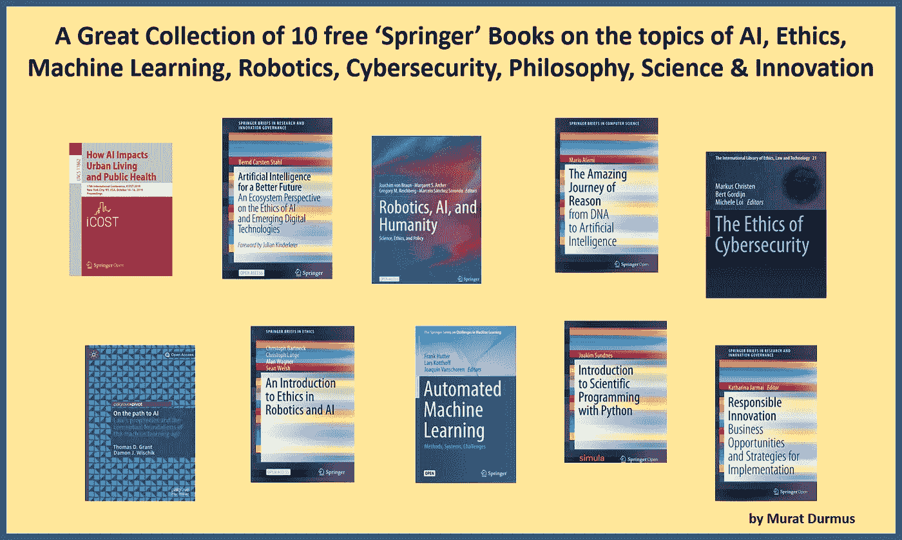

Murat Durmus(封面图片来源 Springer)

内容:

1.  机器人学、人工智能和人文科学
2.  人工智能创造更美好的未来——从生态系统角度看人工智能和新兴数字技术的伦理
3.  Python 科学编程简介
4.  在通往人工智能定律的预言和机器学习时代的概念基础的道路上
5.  机器人和人工智能中的伦理学导论
6.  自动机器学习方法、系统、挑战
7.  人工智能如何影响城市生活和公共健康
8.  负责任的创新——商业机会和实施战略
9.  理性的奇妙旅程
10.  网络安全伦理
11.  (奖金)艾伦图灵内部:报价和沉思

# **机器人学、人工智能和人文科学**

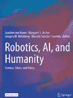

来源[斯普林格](https://link.springer.com/)

非常翔实:机器人，人工智能，人文科学-伦理，政策

这本开放存取的书考察了人工智能(AI)和机器人技术的最新进展，这些进展如何引发了关于它们对人类的利弊的广泛辩论。例如，新兴技术对医疗保健、就业、运输、制造、农业和武装冲突都有影响。虽然在这些领域中的每一个领域都有相当多的注意力投入到机器人/人工智能应用中，但似乎需要更全面地了解它们的联系以及对我们共同的人类可能产生的后果。这本书涵盖了多学科研究，考察了人工智能/机器人学的当前研究前沿，以及对社会福祉、人类-机器人关系的可能影响，以及可持续发展与和平的机遇和风险。这些技术的伴随的伦理和宗教方面被处理，并且对人工智能/机器人技术的使用和未来发展的管理政策的影响被阐述。

编辑:约阿希姆·冯·布劳恩·玛格丽特·阿彻·格雷戈里·赖希伯格·马塞洛·桑切斯·索隆多

下载(pdf): [机器人学、人工智能和人文科学](https://link.springer.com/book/10.1007%2F978-3-030-54173-6)

# **人工智能创造更美好的未来——从生态系统的角度看人工智能和新兴数字技术的伦理**

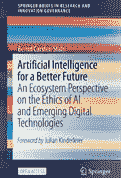

来源[施普林格](https://link.springer.com/)

强烈推荐:人工智能创造更美好的未来——从生态系统角度看人工智能和新兴数字技术的伦理

作者:贝恩德·卡斯滕·斯塔尔

这本书通过对人工智能及其伦理后果提出不同的观点，对这个问题提出了一个创新的答案。我们可以将人工智能理解为一个生态系统，由无数相互依赖的技术、应用和利益相关者组成，而不是看单个的人工智能技术、应用或伦理问题。发展这个想法，这本书探索了人工智能生态系统如何被塑造以促进人类的繁荣。利用丰富的经验主义见解和详细的概念分析，它提出了切实可行的措施，以确保人工智能被用来使世界变得更美好。

下载(pdf): [人工智能为了更好的未来](https://link.springer.com/book/10.1007/978-3-030-69978-9)

# **Python 科学编程入门**

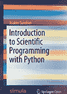

来源[斯普林格](https://link.springer.com/)

如果你也能像科学家一样做一些编码工作，这是一个很大的优势。

本书最初是作为 Hans Petter Langtangen 的《Python 科学编程入门》一书的一套讲义编写的，可以作为该书的补充，也可以单独作为科学编程的简明介绍。朗坦根的书和这些课堂讲稿构成了奥斯陆大学科学程序设计入门课程的核心(INF 1100/1900，10 ETCS 学分)。

下载(pdf):[Python 科学编程简介](https://link.springer.com/book/10.1007/978-3-030-50356-7)

# **走向人工智能定律的预言和机器学习时代的概念基础**

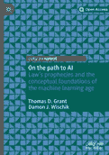

来源[施普林格](https://link.springer.com/)

作者:托马斯·d·格兰特和达蒙·j·维斯奇克

“作者在小奥利弗·温德尔·霍姆斯(Oliver Wendell Holmes Jr .)的法律哲学中找到了相似之处，对人工智能进行了深入细致的研究，这是一种丰富而前瞻性的方法，应该能够抑制夸大的说法，并指导对人工智能前景的现实评估。”~弗雷德里克·r·凯洛格，《小奥利弗·温德尔·霍姆斯与法律逻辑》的作者

下载(pdf): [关于人工智能定律的预言和机器学习时代的概念基础](https://link.springer.com/book/10.1007/978-3-030-43582-0)

# **机器人和人工智能中的伦理介绍**

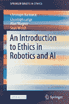

来源[斯普林格](https://link.springer.com/)

克里斯托弗·吕特格、克里斯托弗·巴特内克、艾伦·瓦格纳和肖恩·威尔士

“这本书介绍了机器人和人工智能的伦理。这本书是为大学生、政策制定者和专业人士编写的，但大多数成年人也应该能看得懂。这本书旨在通过伦理学的视角提供关于人工智能利弊的平衡的，有时是矛盾的观点。正如在接下来的章节中所讨论的，伦理问题通常不是一成不变的。国家、社区和个人在这些问题上可能有独特和重要的观点，应该被倾听和考虑。虽然组成这本书的声音是我们自己的，但我们试图代表更广泛的人工智能、机器人和伦理社区的观点。”

下载(pdf): [机器人和人工智能伦理介绍](https://link.springer.com/book/10.1007/978-3-030-51110-4)

# **自动化机器学习方法、系统、挑战**

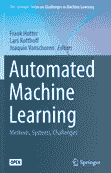

来源[斯普林格](https://link.springer.com/)

作者:弗兰克·哈特拉尔斯·科特霍夫华金·范肖伦

“我想用机器学习，但我不能投入太多时间。”这是你在工业界和其他学科的研究人员那里经常听到的事情。由此产生的对机器学习的免提解决方案的需求最近催生了自动机器学习(AutoML)领域，我很高兴通过这本书，现在有了这个领域的第一个全面的指南。"

下载(pdf): [自动机器学习方法、系统、挑战](https://link.springer.com/book/10.1007/978-3-030-05318-5)

# **人工智能如何影响城市生活和公共健康**

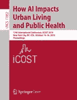

来源[施普林格](https://link.springer.com/)

何塞·帕甘·穆尼尔·莫赫塔里·哈姆迪·阿劳卢·贝萨姆·阿卜杜勒拉扎克·玛丽亚·费尔南达·卡夫雷拉(编辑。)

内容:

*   电子健康技术设计
*   福祉技术
*   生物医学和健康信息学
*   智能环境技术
*   短期捐款

下载(pdf): [人工智能如何影响城市生活和公共健康](https://link.springer.com/book/10.1007/978-3-030-32785-9)

# **负责任的创新——商业机会和实施策略**

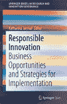

来源[斯普林格](https://link.springer.com/)

卡塔琳娜·贾尔迈

“负责任的研究和创新(RRI)的概念源于对有争议的创新领域(如纳米技术或地球工程)中的新兴技术和研究伦理的论述，并在过去 10 年中主要受到欧洲研究和创新政策的推动。这一概念最初是由政策制定者和社会科学家提出的，但最近的研究旨在阐明商业中负责任的研究和创新实践的实施。本书收集的稿件是欧洲资助的 Horizon 2020 项目“COMPASS——中小企业负责任创新的证据和机遇”中七个伙伴组织的工作成果。

下载(pdf): [负责任的创新-商业机会和实施策略](https://link.springer.com/book/10.1007%2F978-94-024-1720-3)

# **神奇的理性之旅**

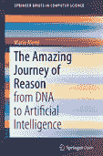

来源[斯普林格](https://link.springer.com/)

作者马里奥·阿莱米

《神奇之旅》从智力的进化角度分析了化学、生物学、神经科学、人类学和社会学的最新成果，智力被视为处理信息的能力。

这本书的主要优点是使用物理学中使用的两个概念——信息和能量——来解释:
生命的出现和进化:原核生物、真核生物和复杂生物

*   大脑的出现和进化
*   社会的出现和演变(人类和非人类)
*   我们“互联网社会”的可能演变以及人工智能正在扮演的角色

下载(pdf): [神奇的理性之旅](https://link.springer.com/book/10.1007%2F978-3-030-25962-4)

# **网络安全伦理**

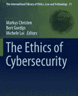

来源[斯普林格](https://link.springer.com/)

编辑:马库斯·克里斯滕、伯特·戈迪金、米歇尔·洛伊

这篇引言简要介绍了《网络安全伦理》一书。该卷解释了网络安全、道德和法律的基础，概述了该领域的各种问题，如道德黑客和网络战，并为在各种应用领域工作的网络安全专业人员列出了建议和最佳做法。此外，导言概述了欧洲画布项目的背景，从这一卷出现

下载(pdf): [网络安全伦理](https://link.springer.com/book/10.1007%2F978-3-030-29053-5)

## 艾伦·图灵:引语和沉思

[艾伦·图灵内部](https://www.amazon.com/dp/B09K25RTQ6)(平装)

艾伦·图灵通常被认为是计算机科学和人工智能之父。他还是一名理论生物学家，作为业余爱好，他开发了用简单输入和随机波动来解释复杂模式的算法。不幸的是，他的生命在 1954 年悲惨地以自杀告终，因为他因同性恋“犯罪”行为而被化学阉割作为惩罚(而不是监禁)。

我们欠艾伦·图灵太多了。他的作品激励了很多人，现在依然如此。

这本小书是献给艾伦·图灵的，里面有他最鼓舞人心的名言和沉思。

艾伦·m·图灵

下载(pdf): [艾伦·图灵:引语与沉思](https://www.aisoma.de/free-ebook-inside-alan-turing-quotes-contemplations/)

穆拉特·杜尔穆斯

著有《[**——人工智能思考**](https://www.amazon.com/dp/B0BKMK6HLJ) 》和《[**42 种最常用机器学习算法入门(附代码示例)**](https://www.amazon.com/dp/B0BT911HDM) 》等书

新书发布:“[42 种最常用的机器学习算法入门(附代码示例)](https://www.amazon.com/dp/B0BT8LP2YW)”

在[亚马逊](https://www.amazon.com/dp/B0BT8LP2YW)和 [Leanpub](https://leanpub.com/42_most_commonly_used_machine_learning_algorithms_with_codesamples) 上有售

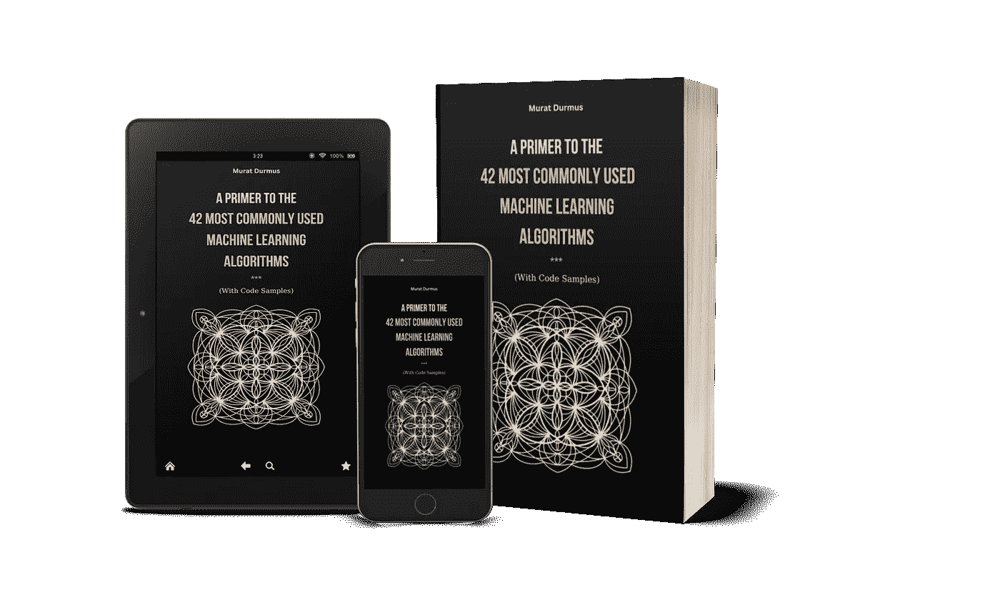

[42 种最常用的机器学习算法入门(带代码示例)](https://www.amazon.com/dp/B0BT8LP2YW)