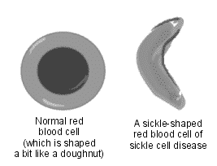
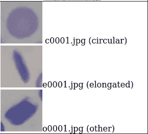
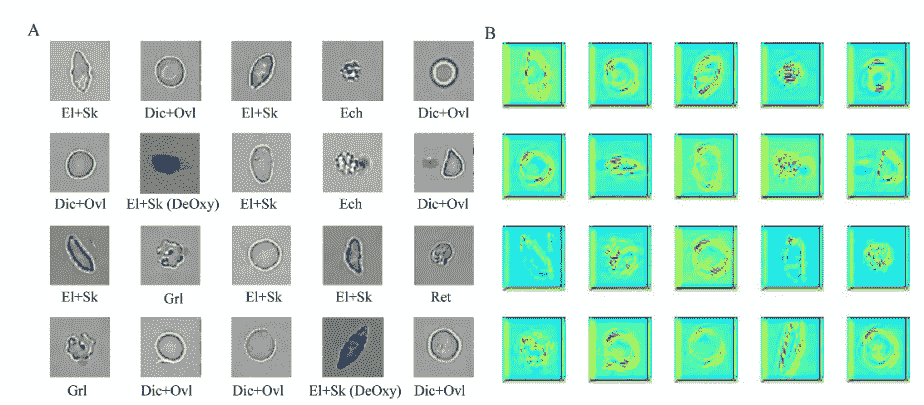

# 使用医学成像数据识别镰状细胞病指南

> 原文：<https://medium.com/nerd-for-tech/a-guide-to-sickle-cell-disease-identification-using-medical-imaging-data-e7fb9a0b5b96?source=collection_archive---------15----------------------->

Pawel Czerwinski 在 [Unsplash](https://unsplash.com?utm_source=medium&utm_medium=referral) 上的照片

W 在为我最后一年的研究项目查阅文献时，我遇到了一种有趣的疾病，名叫**镰状细胞病**，这是一种应用了大量计算方法的疾病。我一直想深入研究它的文献，寻找更多可以用计算方法探索的途径。

镰状细胞病(SCD)是一组与红细胞形成不精确有关的疾病，红细胞负责将氧气运送到全身。这种疾病因红细胞形成镰刀形而不是其标志性的双凹圆盘形而得名。由于其异常的形状，这些红细胞不能像正常红细胞一样穿过身体，导致血液流动受阻，不能像正常红细胞一样容易弯曲或穿过。由于这种血流量减少，血液中含有镰状细胞往往会导致心脏问题，急性胸部综合症和眼睛问题。

红细胞的异常形成[[https://patient . info/allergies-blood-immune/镰状细胞病-镰状细胞病-贫血](https://patient.info/allergies-blood-immune/sickle-cell-disease-sickle-cell-anaemia) ]

根据最近的世卫组织监测，全世界有 440 万人被诊断患有 SCD，而每年有 40 万婴儿被诊断患有 SCD[1]。科学家[2]发现这种疾病的原因是β珠蛋白基因突变，导致血红蛋白异常。SCD 的早期和精确诊断是正确治疗和评估 SCD 危险水平的关键。由于人工识别可能由于不同类型的突变而导致错误，这在诊断过程中是至关重要的，因此计算方法已被广泛考虑用于 SCD 诊断过程。

在这篇文章中，我将主要关注医学成像数据，其中镰状细胞病也可以用基因组数据进行研究，这打开了新的探索之门。

由机器学习和深度学习驱动的现代计算技术已经被证明提供了图像识别和计算机视觉问题的新维度。传统的计算技术使用定义的一组特征，例如细胞大小、颜色、形状复杂性，已经在一定程度上执行得足够好，使得这些特征组必定是非常特定于样本的。因此，轻量级、高性能的现代深度学习技术可以很容易地应用于区分血液样本中发现的不同细胞种类，包括圆形细胞、镰状细胞和其他血液成分。

作为起点，我们可以使用血液样本的图像探索用于 SCD 识别的可用数据集，然后转向可应用的方法，第三，我们可以如何微调模型性能。

血液中发现的细胞类型[[http://erythrocytesidb.uib.es/](http://erythrocytesidb.uib.es/)

# **数据集**

关于 SCD 的成像数据列表可以在各种医学数据库中找到。列举几个供大家参考。

【http://erythrocytesidb.uib.es/】

**包含古巴圣地亚哥总医院特殊血液科“Juan Bruno Zayas Alfonso 医生”的镰状细胞病外周血涂片样本图像。在应用不同类型的遮罩时，有三种不同的图像集合可用。**

****【b】**[https://github . com/dhruvp/WBC-class ification/tree/master/Original _ Images](https://github.com/dhruvp/wbc-classification/tree/master/Original_Images)**

** [## dhr uvp/WBC-分类

### 用 CNN 对白细胞进行分类。通过在…上创建帐户，为 dhruvp/wbc 分类的发展做出贡献

github.com](https://github.com/dhruvp/wbc-classification/tree/master/Original_Images) 

包含四种类型的白细胞和其他血液成分的图像。该数据集可用于增强数据整理和扩展数据范围。

**【c】**[https://www.wadsworth.org/](https://www.wadsworth.org/)

白细胞和其他血液成分的图像采集。

**【d】**[http://sicklecellanaemia.org/](http://sicklecellanaemia.org/)

红细胞涂片样本收集自不同的网站。该数据集包含正常红细胞、镰状细胞和其他血液成分的图像。

# **方法**

包括 **VGG、AlexNet、Inception V3、GoogleNet、ResNet** 在内的现代高性能神经网络已经得到应用，并取得了最先进的性能。

使用 **keras.application** 库，可以将这些预训练的模型及其权重图用于迁移学习。可以在[这里](https://keras.io/api/applications/)找到用于迁移学习的潜在模型架构列表。

深度学习算法可直接用于辅助识别过程，也可用于从给定数据集中提取特征。 **VGG16，CapsuleNet** 是识别从给定数据集提取的特征图的一些突出的架构。因此，在你要选择的数据集中增加更多的多样性和动态性是很重要的。

此外，如果我们要使用深度学习技术来提取特征，传统的机器学习方法能够辅助分类过程。这些方法可能包括支持向量机(SVM)、朴素贝叶斯、K-最近邻(KNN)、随机森林等。

使用深度学习方法创建的特征地图[引用自[4]]

# **微调方法**

由于这些深度学习和机器学习技术依赖于我们强加的数据集，因此在数据中纳入更多种类总是更好的。这可以使用**数据扩充**通过应用不同的图像处理技术来实现，如旋转、移动、翻转、剪切等。

此外，对于轻量级神经架构，使用**GPU**可以实现快速训练。

**集成方法的应用**是另一种强大的技术，用于合并不同神经架构中发现的特征。

# **最终想法**

当需要帮助使人们的生活变得更容易时，技术就在那里被使用。我们在技术中发现的缺陷只有在我们继续使用它们来解决真实环境中的真实问题时才能减轻。因此，它在医学诊断过程中特别提供的简明和精确的答案应该被结合以进一步辅助临床医生的决策。这样，我们就可以拯救更多的生命，并改进这一领域的研究，最终致力于不可治愈的疾病。

> 哪里有对医学艺术的热爱，哪里就有对人性的热爱~希波克拉底

希望你喜欢这个博客。

研究愉快！** 

# ****参考文献****

**[1] Ambrose，E. E .，Smart，L. R .，Charles，m .，Hernandez，A. G .，Latham，t .，Hokororo，a .，… & Ware，R. E. (2020)。坦桑尼亚联合共和国镰状细胞病监测。*世界卫生组织公报*， *98* (12)，859。**

**[2]哥伦比亚特区里斯、T. N .威廉姆斯和麻省理工学院格拉德温(2010 年)。镰状细胞病。*柳叶刀*， *376* (9757)，2018–2031。**

**[3]Al-zubaidi，l .、Fadhel，M. A .、o .、张、j .、段、Y. (2020)。深度学习模型对显微镜图像中的红细胞进行分类，以帮助诊断镰状细胞贫血。*电子学*， *9* (3)，427。**

**[4]徐，m .，Papageorgiou，D. P .，Abidi，S. Z .，道，m .，赵，h .，& Karniadakis，G. E. (2017)。用于镰状细胞性贫血红细胞分类的深度卷积神经网络。 *PLoS 计算生物学*， *13* (10)，e1005746。**

**[5]n . Praljak，b . Shipley，b . Gonzales，a .，Goreke，u .，Iram，s .，Singh，g .，… & Hinczewski，M. (2020 年 11 月)。镰状细胞病微流控生物标志物检测的深度学习框架。在*血*(第 136 卷)。2021 L 街西北，900 套房，华盛顿州，DC 20036 美国:AMER SOC 血液学。**

**[https://www.nhlbi.nih.gov/health-topics/sickle-cell-disease](https://www.nhlbi.nih.gov/health-topics/sickle-cell-disease)**

**[7][https://patient . info/过敏症-血液-免疫/镰状细胞病-镰状细胞病-贫血](https://patient.info/allergies-blood-immune/sickle-cell-disease-sickle-cell-anaemia)**

**[https://www.cdc.gov/ncbddd/sicklecell/data.html](https://www.cdc.gov/ncbddd/sicklecell/data.html)**