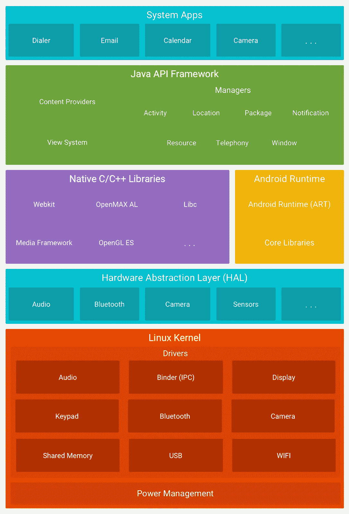
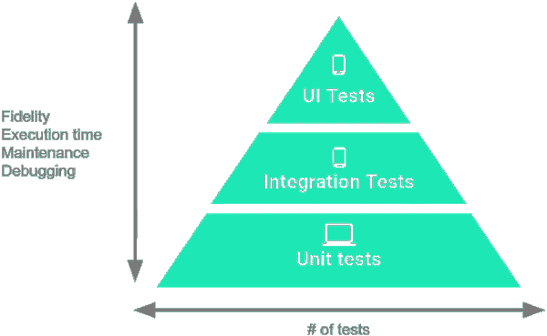

# 为你的 Android 应用编写测试的指南

> 原文：<https://medium.com/nerd-for-tech/a-guide-to-write-your-tests-for-your-android-apps-d4272424cb23?source=collection_archive---------14----------------------->

**注:文章原载于** [**Bitrise 博客**](https://blog.bitrise.io/post/a-guide-to-write-your-tests-for-your-android-apps) **。本文是关于 Android 测试的系列文章的一部分，请在这里找到该系列文章的完整列表:** [1。为你的 Android 应用编写测试的指南。为你的 Android 库和 Gradle 插件编写你的测试。CI 上的测试](https://richrdbogdn.medium.com/a-guide-to-write-your-tests-for-your-android-apps-d4272424cb23)
[4。在 CI 上处理模拟器问题和 Android UI 测试失败](https://richrdbogdn.medium.com/dealing-with-emulator-issues-and-android-ui-test-failures-on-ci-7895694d58c8)

了解如何为您的 Android 应用程序编写测试！在这一系列文章中，您将学习如何在您的 Android 应用程序和库上进行测试。我们将为您提供关于测试和发现应用程序问题的最有价值和最关键的知识，并展示如何编写您的测试用例以及如何在 CI 中运行它们。

在这一部分，我将向你介绍如何为你的 Android 应用程序编写测试。虽然这部分的一些内容不仅仅适用于 Android 应用，也适用于其他平台，比如 iOS，或者一般来说适用于软件测试，为了我一直提到的简单性，并为 Android 举例。

# 关于测试 Android 应用

可能会出现的第一个问题是，我们如何对 Android 的测试进行分类？我认为可以从以下两个方面进行分类:

1.  测试所需的资源。
2.  测试的规模。

这是某种模糊的措辞，让我们弄清楚它们的意思。

# 根据测试所需的资源进行分类

我觉得这是不需要解释的:我们只是简单地根据测试需要的不同资源对它们进行分组。在这种情况下，我会说有两个主要群体:

1.  不需要设备(物理的或虚拟的) :我们称之为本地单元测试。
2.  一种需要设备的测试:我们称之为仪器测试。

简单吧？这样看事情就容易多了。

你可能会问，为什么要这样分组？这背后的原因是 Android 框架。简单来说， **Android 框架是 Android APIs 和特性**的总和。让我们从 Android 平台架构开始理解这一点:

如你所见，**在 Android 平台**中有等级层次。现在对我们来说重要的是，Android API 调用依赖于包含“核心库”的 [Android 运行时(ART)](https://source.android.com/devices/tech/dalvik) 。“核心库”(也称为“核心运行时库”)包含并提供了大多数 Java 编程功能。**这意味着我们需要能够执行 Android API 调用的东西，这就是为什么我们需要 Android 设备(物理或虚拟)来进行这些测试。**注:ART 的前身是 Dalvik，老一点的 Android 平台用那个。

如果你对细节感兴趣，推荐你去看看 Android 的[平台架构。](https://developer.android.com/guide/platform)

你们中的一些人可能已经质疑了我的最后一句话，因为编写使用 Android API 调用的测试而不需要工具(Android 设备)是可能的。是的，使用 Android APIs 编写测试而不需要插装是可能的，但是有一些限制:在这种情况下，您必须

*   模仿你的 Android API 调用(例如用 [Mockito](https://site.mockito.org/) )。
*   使用一个模仿的 Android 框架，例如 [Robolectric](http://robolectric.org/) 。请注意，您可以使用 AndroidX 测试库，它提供了 Robolectric 工件。

为了保持这篇文章的范围，我不会深入什么是嘲讽，或者如何使用 Robolectric 的细节，我认为[官方文档](https://developer.android.com/training/testing/unit-testing/local-unit-tests#include-framework-dependencies)解释得很好，如果你需要进一步阅读，可以看看它。

好的，希望现在你能理解我为什么描述这两个群体。但是从我们的角度来看，它们意味着什么呢？

**本地单元测试**:这些测试将在主机上执行，不需要设备，所以它们执行得很快，您可以立即启动它们。原因是这些测试可以在您的机器上运行，因为它们包含:

*   只有纯 Java 调用。
*   被嘲讽的安卓通话。
*   利用一个模拟的 Android 框架。

本地单元测试的一个典型例子是纯 [JUnit](https://junit.org/junit4/) 测试。

仪器测试:这些测试确实需要一个设备来运行测试。测试通常比本地单元测试运行得慢。此外，仪表化测试可以分为两个子组:

1.  **仪表化单元测试**:在设备上执行，但是不显示/不需要任何用户界面(UI)。当您想要测试需要 Android 框架的东西，并且您想要在设备上测试它，但是不需要 UI 时使用。
2.  **UI 测试**:也在设备上执行，并显示用户界面。适合测试与用户界面相关的需求。这些需要大量的资源，所以通常它们甚至比插装单元测试更慢(因为例如它们也必须呈现 UI，听起来可以理解，对吗？).我推荐使用 [Espresso](https://developer.android.com/training/testing/espresso) 和 [UiAutomator](https://developer.android.com/training/testing/ui-automator) 进行这类测试，因为它们有很好的文档，并且由谷歌维护。

‍

‍ **接管**

我们有快速本地单元测试、中速仪表化单元测试和缓慢执行的 UI 测试。

# 根据测试规模进行分类

首先，我想描述我在术语“规模”下的意思:给一个非常简短的描述，规模是给定测试注定要覆盖的不同组件的数量。通常，我们将测试分为三种规模:

1.  **小测试**:验证单个类的行为。实际上**单元测试**弥补了这一点，通常是本地单元测试，因为在大多数情况下测试单个类/方法不需要插装(如果需要，你可以很容易地模仿)。
2.  **介质测试**:验证应用程序的一个或多个组件的行为。在实践中，这包括一些**单元**，但主要是**集成** **测试**(取决于一个或多个被测试的组件)，因为这涉及到更复杂的场景，在这些场景中，你经常需要仪表或高水平的模拟。
3.  **大型测试**:从**端到端**的角度验证应用程序的行为，涵盖不同的用户旅程。通常这涉及到 **UI 测试**。

官方 Android 指南上的[测试基础](https://developer.android.com/training/testing/fundamentals)提供了很好的例子，我推荐你去看看。此外，一个方便的工具是测试大小的不同注释。不仅仅是这些注释的用法会对你有所帮助，而且在我看来，它们的文档完全符合它们的定义，也符合我上面写的内容，所以我希望你原谅我在这里复制了一些内容:

*   [@SmallTest](https://developer.android.com/reference/androidx/test/filters/SmallTest) (执行时间<200 ms):“*小测试要非常频繁的运行。关注代码单元以验证特定的逻辑条件。这些测试应该在隔离的环境中运行，并使用模拟对象作为外部依赖。不允许资源访问(如文件系统、网络或数据库)。与硬件交互、进行绑定调用或促进 android 工具的测试不应该使用此注释。”*
*   [@MediumTest](https://developer.android.com/reference/androidx/test/filters/MediumTest) (执行时间< 1000 ms): *“中型测试应该集中在非常有限的组件子集或者单个组件上。允许通过定义良好的接口(如数据库、内容提供者或上下文)对文件系统进行资源访问。应该限制网络访问，应该避免(长时间运行的)阻塞操作，而应该使用模拟对象。”*
*   [@LargeTest](https://developer.android.com/reference/androidx/test/filters/LargeTest) (执行时间> 1000 ms): " *大型测试应该专注于测试所有应用组件的集成。这些测试完全参与到系统中，并且可以利用所有资源，例如数据库、文件系统和网络。根据经验，大多数功能性 UI 测试都是大型测试。”*

注:复制自[https://developer . Android . com/reference/androidx/test/filters/package-summary](https://developer.android.com/reference/androidx/test/filters/package-summary)

**接管**

我们有小型单元测试、中型集成测试和大型功能 UI 测试。

# 如何编写您的测试？

如果你停下来想一想我上面描述的两种分类，你可能会意识到我们是非常幸运的，**因为快速测试很容易编写(因为它们很小)，中速测试需要适度的努力和资源，慢速测试需要大量的资源和努力**。

**由此，你可以很容易地得出结论，单元测试是最容易的**

*   改变(因为它们很小)
*   执行(因为它们需要最少的资源)
*   维护(因为它们很小，您可以更快地检查更新)
*   调试(因为它们需要最少的资源，而且它们很小，所以很容易被监督)

虽然同样的事情对于集成测试来说有点困难，UI 测试在这些方面甚至更困难，但是不要忘记集成和 UI 测试的优势是测试单元测试无法测试的东西，因此我们不能避免它们。

有效的测试写作的关键是每种测试类型的平衡。目标是拥有尽可能多的单元测试，更少的集成测试，以及最少的 UI 测试。**我们在这里，在古老的测试金字塔:**

来源:https://developer.android.com/training/testing/fundamentals

# 摘要

对于在这个话题上已经有一些经验的读者来说，我想这并不奇怪，但是我必须强调这一点:**使用测试金字塔作为你的测试写作策略**。我真的希望至少我写了一篇小文章，把为什么写得更清楚。

如果您还有任何问题或想分享您的观点，请不要害怕联系我。如果你喜欢这个，请加入我的下一部分，在那里我将写关于如何测试你的库和插件 。希望你喜欢它，任何鼓掌非常感谢，这将使我的一天！

