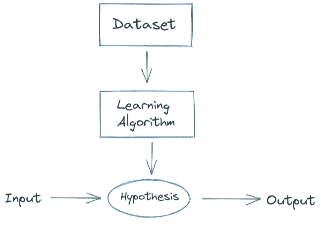
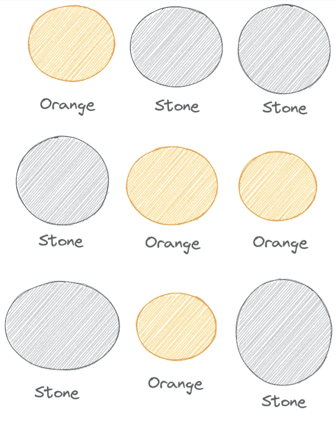
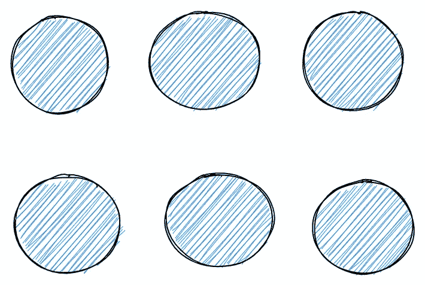

# 像人类一样思考的机器

> 原文：<https://medium.com/nerd-for-tech/a-machine-that-think-like-a-human-e710e95ead00?source=collection_archive---------20----------------------->

## 机器学习导论

图片由[附身摄影](https://unsplash.com/photos/U3sOwViXhkY)在 [unsplash](https://unsplash.com) 上拍摄

> “机器会思考吗？”

这是过去许多科学家都想过的问题。这个问题也划过了后来创造了 Bombe 机器的艾伦·图灵的脑海，成为了现代计算机和人工智能技术的先行者。

经过很长时间，这个问题终于用各种人工智能(AI)产品得到了回答，其中一个产品是深蓝，这是一台由 IBM 制造的计算机，它在一场国际象棋比赛中赢了一位世界冠军。

人工智能的课题之一是机器学习。所以，在人工智能领域，有很多东西被讨论，其中之一就是机器学习。你可以说机器学习是人工智能的一部分。什么是机器学习？根据亚瑟·塞缪尔的说法，机器学习是:

> “无需明确编程即可赋予计算机学习能力的研究领域”

机器学习可以这样描述:你希望计算机做一些事情，但不是直接给计算机编程来做它的工作，你给计算机编程来学习，然后来自计算机的学习结果使工作完成。假设你想让计算机区分橘子和石头。使用机器学习算法，你不会创建一个代码来直接向计算机显示哪个是橙子，哪个是石头，但你只会创建代码，以便计算机可以学习区分橙子和石头。

类比是这样的:

> 假设你看到一个正在挨饿的孩子。然后，你不是给他一条鱼，而是给他一根鱼竿，教他如何钓鱼，这样他就可以吃他想吃的鱼了。嗯，那也是机器学习的算法。

因为机器学习&人工智能的灵感来源于人脑，所以把思维方式做得和人类尽可能的相似，虽然可能会有细微的差别。如果人类从经验和周围环境中学习，那么计算机也是如此。在机器学习中，这些经验和环境被称为训练数据或数据集。所以，计算机上的机器学习就是通过这个数据集来学习的。

机器学习的结果被称为**假设**。为什么叫假设？我不知道。可能它被称为假设，因为这个机器学习的结果可以根据可用的数据集而改变。

机器学习工作原理图(图片由作者提供)

有 2 种最常见的机器学习类型，即**监督学习**和**非监督学习**。

# 监督学习

在监督学习算法中，我们告诉数据集“正确答案”。让我们回到前面的例子，关于计算机区分橙子和石头的任务。这里的“正确答案”是指，在数据集中，你可以分辨出哪个物体是橙子，哪个物体是石头。然后，从包含正确答案的数据集中，计算机进行学习。这种方法和你学习的方式一模一样。试着回忆一下，你小时候是否被告知橙子是一种橙色的水果，有甜味？当然不是。你只是听到你的父母说橙色这个词，然后你看到你的父母指着一个物体。经过反复观察，你得出结论，这个物体是一个“橘子”。监督学习类型的机器学习也以这种方式工作。

监督学习数据集图解。看到有一个标签“橙色”和“石头”(作者图片)

监督学习应用的一个例子是诸如 Google Mail (GMail)之类的电子邮件服务区分垃圾邮件和非垃圾邮件的能力。在来自 google mail 的这个数据集中，数据以哪些邮件是垃圾邮件，哪些邮件不是垃圾邮件的形式给出。通过这种方式，谷歌可以了解这两封邮件之间的差异，然后能够以相当高的准确度对你的邮件进行分类(如果我错了，请纠正我)。你可能还记得，在谷歌邮件中，你可以将收到的邮件标记为垃圾邮件。嗯，你在标记垃圾短信方面的行动也帮助 Google Mail 的监督学习算法变得更加优秀(当然 Google 算法比这复杂得多)。

# 无监督学习

与监督学习相反，在无监督学习中，数据集没有被标上“正确答案”。所以数据集没有被标注。因为没有标注“正确答案”，所以计算机无法将数据集中的对象标注为“橙子”或“石头”。换句话说，该模型没有提示如何对每一段数据进行分类，必须推断出自己的分类规则。打个比方可能是这样的:你可能见过两种不同的动物，但你不知道它们的名字。你只知道第一组动物和第二组动物是不同的动物。你可以得出结论，因为你已经观察了这两种动物，也许你已经观察了它们的身体形态，或者它们运动的方式，以及你发现的其他差异。嗯，那也是无监督学习的算法。这种无监督学习算法通常用于分类功能，我将在下一篇文章中进一步解释。

无监督学习数据集图解。看到没有标签“橙”或“石头”(作者图片)

这次到此为止，接下来几年我会继续写一个关于机器学习的系列。

***参考*** :

*   [https://developers . Google . com/machine-learning/problem-frameing/cases](https://developers.google.com/machine-learning/problem-framing/cases)
*   [https://bdtechtalks . com/2020/11/30/machine-learning-spam-detection/](https://bdtechtalks.com/2020/11/30/machine-learning-spam-detection/)