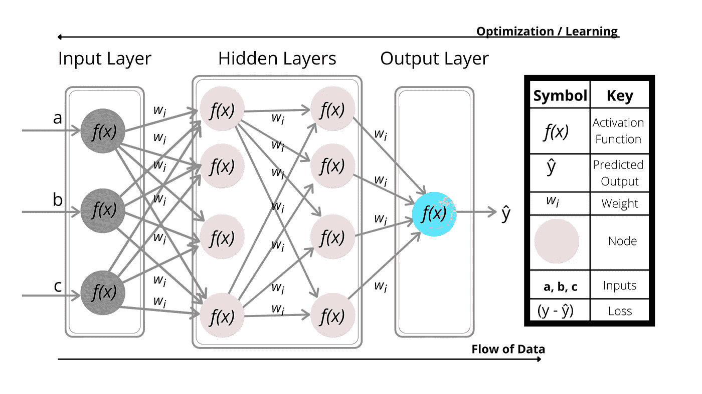
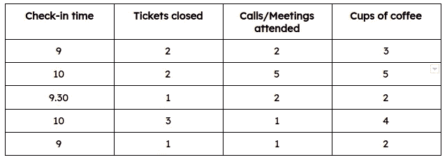

# 神经网络只是一个美化了的数学方程式

> 原文：<https://medium.com/nerd-for-tech/a-neural-network-is-just-a-glorified-math-equation-a13b3b220abb?source=collection_archive---------20----------------------->

我们将讨论损失、权重、保存模型、节点、激活层以及更多简单的术语，以至于你会认为神经网络只是一个美化了的数学方程。

作者图片|神经网络中的基本术语和符号

这里有很多东西要打开。让我们一个一个地看。

让我们假设你在工作中监视了你的“朋友”,并创建了一个他一天喝多少杯咖啡的数据集，以及一些你认为可能影响上述咖啡杯数的其他参数。

作者图片|样本数据集

上面的数据集是五天的，你想知道当他在 10 点签到，关闭两张票，参加三个电话时，他一天会喝多少杯咖啡。你可以根据你收集的 5 个数据点进行有根据的猜测。但是想象一下，如果你有一年的数据(准备打电话给律师)，并且想要预测同样的情况。

人类擅长许多事情，但通过许多数据点得出一个模式不是其中之一。这就是为什么我们有电脑。

所以在上面的数据集中，*， ***门票关闭*** ， ***通话/会议*** 都是你的输入列。又叫 ***X*** 。而 ***杯咖啡*** 则是输出列或者 ***Y*** 。*

*所以如果我们想把这个数据集输入到神经网络中，我们只需要传递 X 行。因此，输入层中的节点数将为 3，每列一个。*

*输入层和输出层以外的层称为**隐藏层**。然后，我们可以有多个隐藏层，其中可以有各种节点。节点的数量和层数可以通过反复试验或遵循一些预定义的准则来决定，这些我们将在后面讨论(当我了解它们时)。*

*一层的数据传递到下一层的每个节点。当把数据从一层发送到另一层时，我们把它乘以任意一个随机数。这个随机数被称为**权重**。*

*最初，我们使用随机权重来生成输出。根据预测值与实际值的差距，我们在优化器的帮助下调整权重。我们再次遵循相同的步骤，使用更新的权重生成输出。我们重新计算损失，并重复这个过程，直到我们达到尽可能低的损失。我们保存权重，这导致了最低的误差。一个*保存的模型*只是一组保留的供以后使用的砝码。*

***损耗**，简单来说就是预测的咖啡杯数和实际的咖啡杯数之差。举个例子，如果模型预测你的朋友只会喝 1 杯，现实中他喝了 3 杯。在这种情况下，误差或损失是 2 杯。损失越低，我们的模型越好。我们可以在优化者的帮助下通过改变重量来减少损失。*

*每个节点都有一个**激活功能**，以某种方式处理数据或者在将数据传递到下一层之前处理数据。每个节点接收来自前一层的 N 个数据点。如果我们采用当前示例中的第一个隐藏层，我们将获得最后一层中所有三个节点的数据。我们希望将收到的三个数字转换为一个数字，因为一个节点只允许一个数字。有许多方法可以实现这一点。最简单的方法(不推荐)是全部加起来，传过去。*

*神经网络比我刚才在这里描述的要复杂得多，但这是你在开始深度学习时会遇到的标准术语的简化版本。*

*我希望这能帮助你理解神经网络中最常见的术语是什么意思。如果你在学习神经网络的任何阶段感到不知所措，请记住，神经网络只是一个美化了的数学等式，它可以帮助我们找到如果我们的同事一天要参加四个会议，他会喝多少杯咖啡。*

**注意:输入层没有激活功能。**

*(编辑):对于这个故事的第二部分，[点击这里](/nerd-for-tech/four-topics-to-learn-neural-networks-faster-a261220d9234)。*

*另外，我正努力养成每周发布一篇文章的习惯。这篇文章将包含我在接下来的一周里学到的所有东西。我还要感谢斯里哈尔和阿斯利萨，他们帮我校对了这篇文章。*