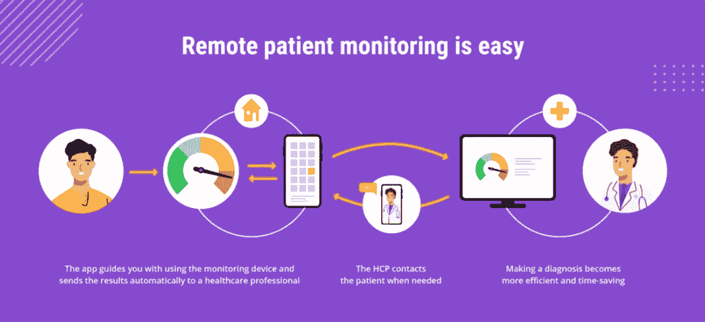
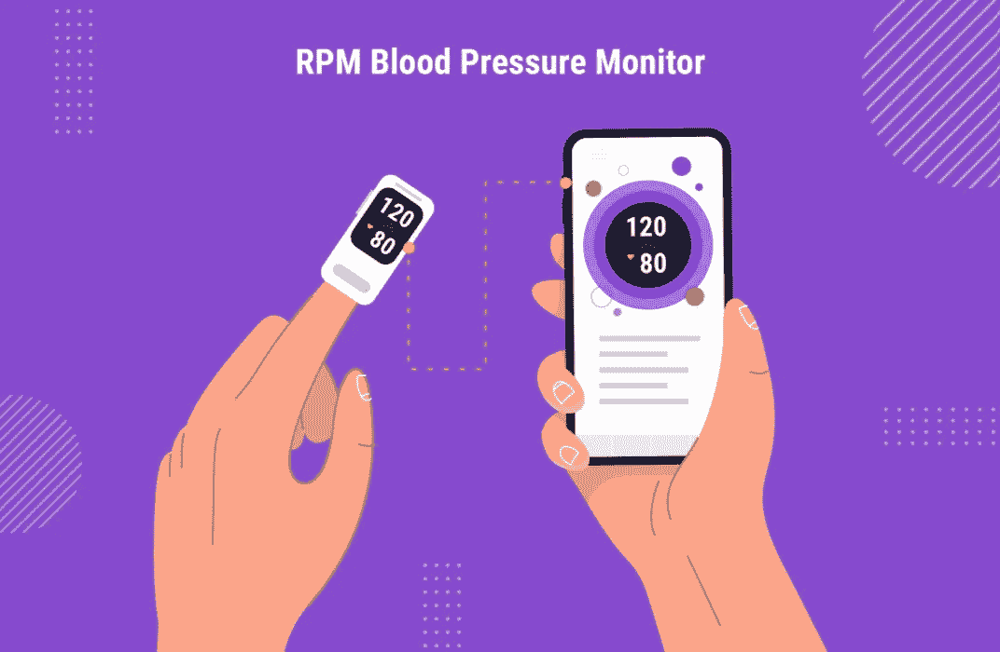
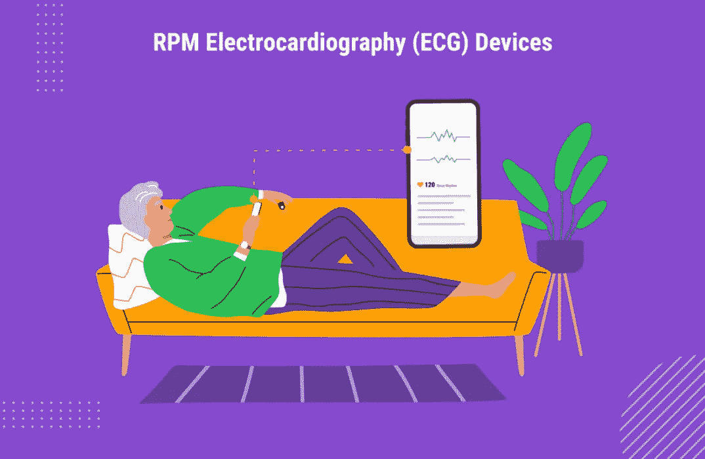
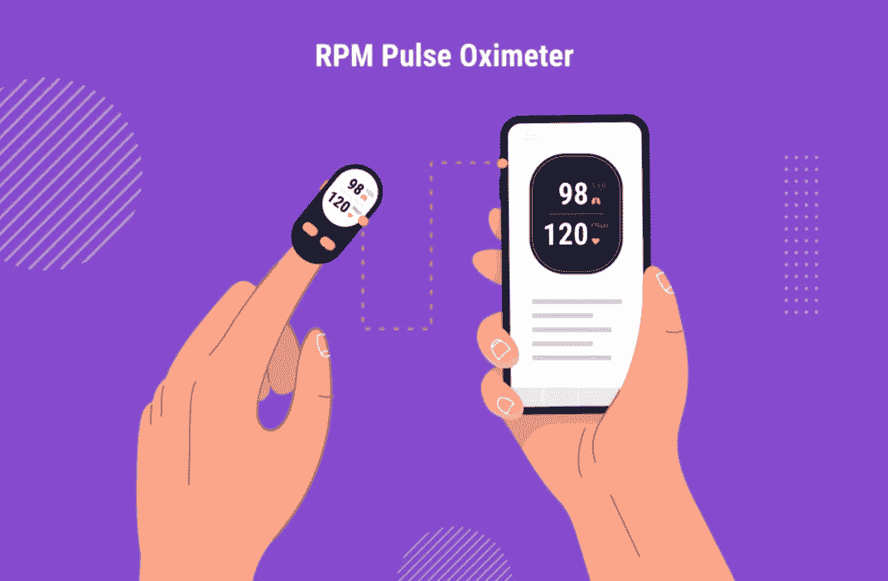
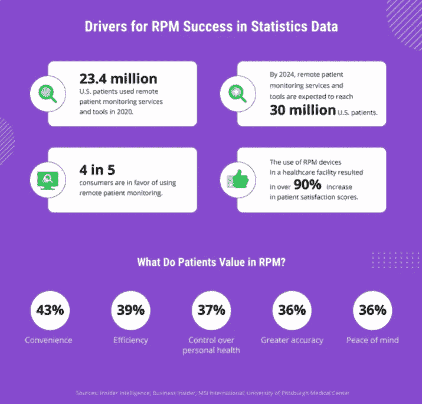

# 新常态——远程患者监护(RPM ):真实设备类型和当前统计数据

> 原文：<https://medium.com/nerd-for-tech/a-new-normal-remote-patient-monitoring-rpm-types-of-real-world-devices-and-current-statistics-2154082b6410?source=collection_archive---------9----------------------->

医疗系统和医院正在转向的改善结果和降低成本的工具之一是远程患者监护(RPM)技术。这种类型的患者护理扩展了医生的覆盖范围，使患者和护理人员之间能够保持稳定的关系，并为提供者提供连续的实时健康数据流。

现在，RPM 设备变得越来越智能，越来越便宜。此外，考虑到新冠肺炎的影响，支持远程监控的解决方案的价值和需求都在增长。因此，让我们一步一步地探索这项技术，从 RPM 的定义开始，重点介绍现有设备的类型，以及当前的市场统计数据和新冠肺炎影响的结果。

# 什么是远程患者监护(RPM)？

远程患者监护(RPM)是一种医疗保健提供方法，它使用技术在传统临床环境之外监测患者健康。RPM 是指用于在患者和医生之间以电子方式传输信息的特定技术，它是在家中对患者进行监控的强大工具。

# 远程病人监护是如何工作的？

与其他远程医疗提供方法不同，PRM 不需要交互式音频视频和虚拟访问。它只需要收集和解释生理数据的技术，而且实际上非常容易使用。

# RPM 设备的类型

无论是可穿戴式心脏监护仪、蓝牙体重秤、血糖监测仪、皮肤贴片、鞋子还是腰带，RPM 非侵入式设备都可以采集、传输、处理和存储患者数据。以下是一些最有价值的创新:

**血压监视器**

一些血压监测器采用多个读数来报告日平均值。家庭监测可以帮助早期诊断糖尿病或肾功能障碍等导致高血压的疾病。它还可以减轻医疗保健的压力。

**连续血糖监测仪**

有效管理糖尿病需要持续的血糖监测，这就是血糖监测设备发挥作用的地方，它可以让您:

*   监控药物效果
*   追踪饮食和锻炼如何影响血糖水平
*   演示压力或疾病如何影响血糖水平

**医疗警报系统**

根据疾病预防控制中心的数据，每年，美国每四个老年人中就有一个经历过痛苦的跌倒。其中大约 20%会导致骨折、头部创伤或其他破坏性伤害，使未来再次跌倒的可能性增加一倍。

跌倒后的及时护理至关重要，这也是远程病人监护设备对老年人如此重要的原因。这些可穿戴设备甚至有助于防止跌倒后死亡，因为它们可以通过提醒穿戴者的临床医生、急救人员以及最近的护理人员或家庭成员发生了什么来进行即时干预。

**产妇护理监控**

调查一致显示，低风险怀孕的妇女更喜欢尽可能减少妇科门诊的次数，远程监控可以实现这一点，同时提供对怀孕的高度控制。

**心电图仪**

无论是手持、可穿戴还是贴片形式，这些设备都可以帮助检测威胁生命的情况。心电图可以捕捉心律不齐、心肌缺血和 ST 段压低的症状。

这些设备记录来自患者心脏的电脉冲，并实时传输给临床医生，使他们能够在患者超出心脏极限之前及时调整护理计划。

**用药监测**

根据《消费者报告》,超过一半的美国成年人服用处方药。另一项研究发现 60%的美国老年人没有按照处方服药。

因此，药物监测可以提示患者在一天中的正确时间并按照处方剂量服药。这对心理学家尤其有帮助，他们的病人经常需要持续的处方监控和调整。

**心率监测器**

便携式心率监护仪可自动记录和传输患者在运动、压力事件甚至睡眠期间的心跳数据，帮助临床医生检测有症状和无症状的心律失常，以及心脏消融后的房颤。

**智能秤**

对于患有充血性心力衰竭的患者来说，体重仅仅增加几公斤就可能是水潴留的信号。当临床医生在他们的远程患者监护设备上接收到这些信息时，他们能够迅速采取行动:开利尿剂、增加当前的药物剂量或打电话给患者进行访问。

**脉搏血氧仪**

这些非侵入性夹子通常被附在手指或耳垂上，以便测量确定血氧水平的光波长。它们被患有慢性心脏病或肺病的人使用，在检测肺功能下降方面非常有帮助，这些天来，肺功能下降可能意味着新冠肺炎。

如您所见，远程患者监护设备减轻了医疗保健的压力，可以帮助各种专家更有效地开展工作。但是现在让我们深入统计数据，看看这项技术是否有需求，是否值得投资。

# RPM 市场概述:它将走向何方？

根据 [Alltheresearch](https://www.alltheresearch.com/report/714/remote-patient-monitoring-market) 的数据，2020 年全球远程患者监护市场价值为 9.75 亿美元，预计到 2027 年将达到 32.449 亿美元，预测期内 CAGR 为 18.9%。但是这种充满希望的预测的原因是什么呢？让我们看看从各种关于 RPM 使用的研究中收集的数据，看看它有什么不同。

虽然患者对 RPM 设备的信任和使用意愿可以被认为是采用该技术的一个非常好的理由，但我们不能忽视房间里的大象，避免提及新冠肺炎的影响。

# 新冠肺炎对市场的影响:当前远程病人监护趋势

新冠肺炎大大增加了医生和病人有效使用 RPM 的基础。以下是疫情带来的 RPM 成功的两个关键驱动因素:

*   在新冠肺炎疫情期间，为了适应患者的需求，医生们面临着重新发明他们的做法的挑战，使得 rpm 成为非常受欢迎的解决方案。
*   众所周知，由于恐惧和感染新冠肺炎患者的威胁，人们开始因为非新冠肺炎健康问题而避开急诊室和医生办公室。这是加速远程患者监护市场增长的另一个驱动因素。

就后者而言，RPM 设备使患者能够更好地管理其慢性疾病，并了解其特定病理的影响因素。患者可以使用 RPM 来了解他们健康的各个方面，并寻求特定的护理，这反过来减少了医疗费用。

但是 RPM 的使用更进一步，使企业主采用该技术来评估他们工人的健康，更好地衡量他们的安全。此外，考虑到大多数新冠肺炎患者是无症状的，公司已经开始投资 RPM 设备，以调整他们在疫情期间随时准备工作的协议。所有这些导致了一个新的 RPM 趋势:与医疗保健无关的企业使用技术。

例如，星巴克实施了一个新冠肺炎清单，让员工填写，并要求员工在每班开始前使用手持临床电子体温计记录体温。

您的同事 Emerline 也参与了与新冠肺炎疫情相关的医疗保健应用程序开发项目。虽然最初有客户联系我们，希望将优步计划用于医疗应用程序，但疫情导致了最初想法的一些重大变化。如果你想知道我们如何根据世界形势调整解决方案，欢迎你阅读我们产品组合中的一款类似于优步的医生应用程序的开发。

我们在医疗保健解决方案的交付方面拥有丰富的专业知识，我们很乐意回答您关于 RPM 系统、应用程序中包含的功能以确保其现代性、开发时间表和成本的所有问题。因此，无论你是在餐巾纸上有想法，还是想澄清一些关于你项目的具体细节，请随时[联系我们](https://emerline.com/contact-us)。

*最初发表于*[*https://emerline.com。*](https://emerline.com/)