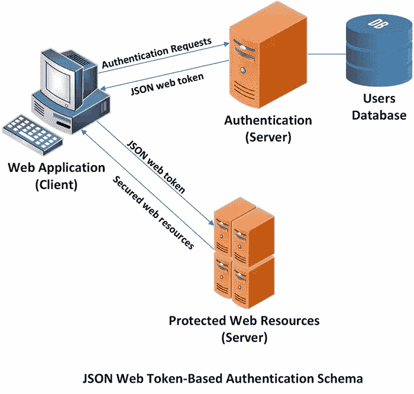
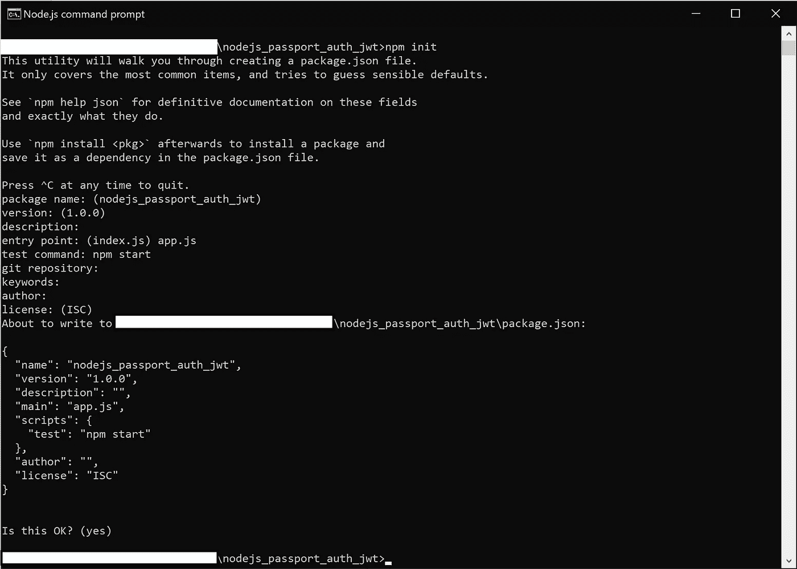
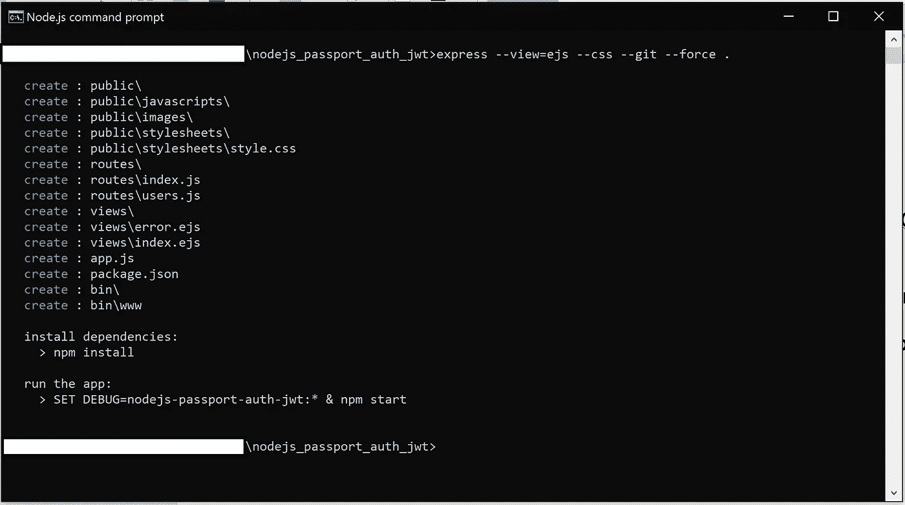
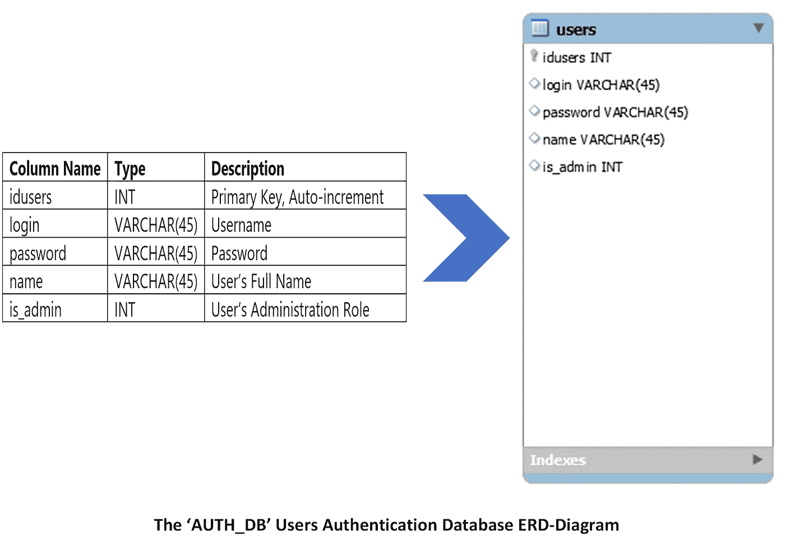
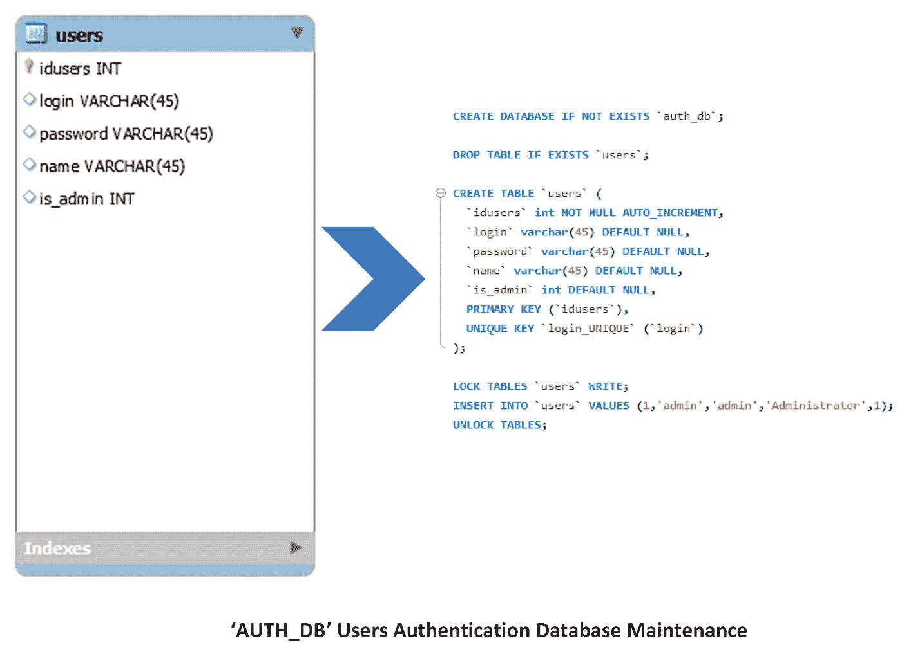
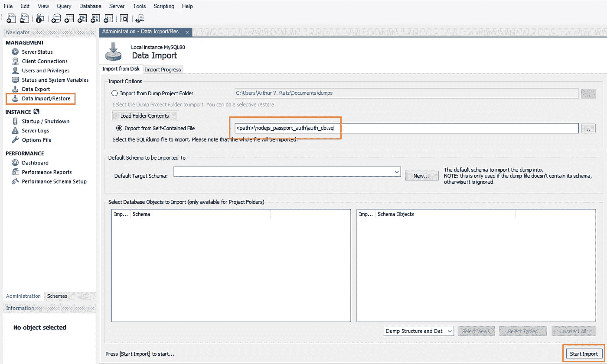
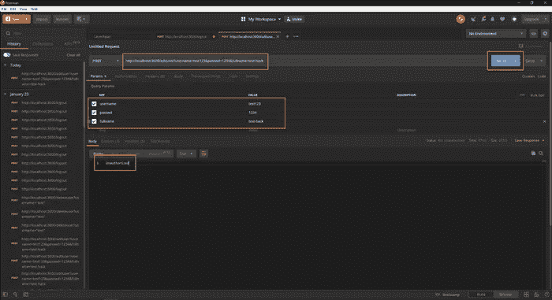

# Node.js 中使用 Passport、Express-Sessions、JSON Web Tokens、Angular.js 和 MySQL 的 Web 应用程序的安全性

> 原文：<https://medium.com/nerd-for-tech/a-node-js-web-application-security-using-passport-express-sessions-json-web-tokens-angular-js-63877cdc07a3?source=collection_archive---------0----------------------->


Arthur V. Ratz 摄于 Vecteezy

## 使用 JSON Web 令牌(JWT)、Passport、Express-Sessions Angular.js 和 MySQL 维护 Node.js web 应用程序的身份验证安全特性的实用指南…

完整的 Node.js Web 应用安全项目可以通过访问[https://github.com/arthurratz/nodejs_password_auth_jwt](https://github.com/arthurratz/nodejs_password_auth_jwt)下载

# 介绍

*“对一个系统、公司或应用程序最重要的投资之一就是你的安全和身份基础设施。”—张克帆·勒布朗*

在过去的十年里，万维网彻底改变了人们获取和使用信息的方式。如今，全球超过一半的人主要将 Web 作为一种永久的信息资源。不知不觉中，web 已经从一个纯静态的信息资源发展成为完全动态的、功能强大的 Web 应用程序，用于完成广泛的现实世界任务。

新时代的 web 开发技术和工具提供了创建高级 Web 应用程序的能力，这些应用程序与用户进行交互，以在 Web 或云中存储他们的个人信息和私人内容，并根据他们的个性化偏好访问和使用信息。

今天的 web 并不是一个安全的地方，这使大多数用户面临着这样的风险:存储在他们个人资料下的私有或敏感数据可能会被使用同一 Web 应用程序的其他用户随时非法访问。

安全漏洞是发布在网络上的任何现有 web 应用程序的核心问题。针对 web 应用程序的黑客攻击通常会对部署 web 应用程序的组织以及访问这些应用程序的用户造成严重威胁。由于用户向 web 应用服务器提交的任意输入数据，与 web 应用的交互变得恶意。这包括任何提交伪造凭证来访问用户配置文件的尝试，以及对 web 应用服务器中间件端点的各种攻击。

跨站点请求伪造(CSRF)是最丑陋的 web 应用程序攻击之一，它发起数十亿个伪造请求，向 web 应用程序的服务器端点提交任何类型的恶意或伪造用户数据。例如，当用户点击提交按钮时，我们可以很容易地伪造由 web 应用程序发起的请求，通过试图劫持用户名和密码将各种恶意数据发送到 web 应用程序的服务器。这就是所谓的“点击劫持”攻击。

为了非法通过用户认证，黑客使用所谓的 web 应用程序的“后门”。几乎任何 web 应用程序中都存在后门，比如向应用程序的服务器中间件发起任意请求的能力。

“后门为我们提供了一种绕过给定系统的正常身份验证过程的方法。后门可以由应用程序开发人员或后来的攻击者包含在应用程序中，它们可以是它们自己的独立应用程序，例如在 [*僵尸网络*](https://www.sciencedirect.com/topics/computer-science/botnets) *的节点中使用的命令和* [*控制接口*](https://www.sciencedirect.com/topics/computer-science/control-interface) *，或者它们可以在实际设备的硬件或固件中实现”——“Thomas Wilhelm，Jason Andress，在*[*Ninja Hacking*](https://www.sciencedirect.com/book/9781597495882)

*从一开始，web 安全问题就没有得到大规模的解决。这个问题的解决方案不仅仅是使用 web 应用程序防火墙。对于正在创建的任何应用程序，开发人员都必须实现特定的 web 安全特性，这些特性允许对用户访问存储在其配置文件中的私有和敏感数据进行身份验证，并保护 web 应用程序的前端和服务器中间件交互。*

# *什么是认证*

**“一个认证(已定义)是* [*证明*](https://en.wikipedia.org/wiki/Proof_(truth))*[*断言*](https://en.wikipedia.org/wiki/Logical_assertion) *的行为，如 web 应用用户的* [*身份*](https://en.wikipedia.org/wiki/Digital_identity) *。与* [*相对照的是*](https://en.wikipedia.org/wiki/Identity_(philosophy)) *识别，即表明用户身份的行为，认证则是验证该身份的过程。它可能涉及验证个人* [*身份*](https://en.wikipedia.org/wiki/Identity_document) *，根据用户名和密码验证用户的真实性，颁发给用户的数字证书，或任何其他次要方法”——维基百科，(*[【https://en.wikipedia.org/wiki/Authentication](https://en.wikipedia.org/wiki/Authentication)*)。***

**目前，用户身份验证是保护 web 应用程序及其组成部分免受上述各种威胁的唯一可能的安全解决方案。为了应对安全漏洞，现有的 web 平台有大量不同的开发库、模块和框架，如 Node.js 或 ASP.NET，它们允许有效地维护几乎任何设计的 web 应用程序的安全特性。这些框架非常模块化，可以作为 web 应用服务器中间件的插件使用。此外，还有许多 HTTP 协议和加密模块，如 JSON web tokens (JWT ),通过提供对 web 应用程序前端和其服务器中间件之间发送的数据进行加密的能力，并以特定的格式存储这些数据，可以用来提高 web 安全特性的强度。**

**在本文中，我们将重点讨论为基于 Node.js Express 的示例 web 应用程序维护可靠和健壮的安全特性的几个方面，包括如何有效地实现以下安全特性。**

# **文章的想法…**

**本文的主要思想是帮助开发人员理解为 Node.js web 应用程序创建 web 安全特性的基本概念，根据每个用户的个性化设置提供对用户私人信息和个人内容的访问。**

**在本文中，我们将创建一个简单的基于 Node.js Express 的 web 应用程序，并演示如何使用 Passport.js 模块以及“passport-local”和“passport-jwt”策略来提供一个健壮可靠的安全特性，该特性允许执行基于密码的策略身份验证。此外，我们将实现管理用户帐户的功能，可供认证用户使用。**

**这篇文章的读者将学会如何快速而轻松地:**

*   **生成简单的基于 Node.js Express 的 web 应用程序；**
*   **设计用户认证前端 HTML 视图；**
*   **在 MySQL 服务器中创建一个微型认证数据库；**
*   **在 Express 中初始化并使用 Passport.js 模块。基于 js 的服务器中间件；**
*   **在登录时为用户凭证验证配置本地和 jwt 策略。**
*   **将用户身份验证路由添加到应用程序的服务器中间件；**
*   **使用 JSON web 令牌(JWT)身份验证保护其他应用程序的路由；**

**最后，为了确保我们已经为 web 应用程序提供了可靠和健壮的安全性，没有严重的漏洞，我们将通过使用 Postman 应用程序模拟著名的跨站点请求伪造(CSRF)攻击来挑战身份验证过程。**

# **Web 身份验证部署场景**

**在实现 web 应用程序的安全特性之前，让我们花一点时间来看一下我们将在示例应用程序中维护的身份验证模式。身份验证模式是通过使用特定的安全算法来验证用户身份的过程。有多种方法允许我们实现证明用户身份的功能，例如基于密码或基于证书。基于口令策略的认证模式是目前使用的最流行的方法之一。在这种情况下，我们使用以下算法，通过验证用户的用户名和密码凭据，对试图登录应用程序的用户进行身份验证:**

1.  **用户在登录网页中输入他们的用户名和密码凭证，并点击提交按钮；**
2.  **登录网页客户端 JavaScript 代码向特定服务器认证中间件发起包含用户名和密码的请求；**
3.  **认证中间件在后端通过对用户的认证数据库执行一个或多个查询来验证用户的凭证；**
4.  **如果身份验证数据库中存在提交了凭据的用户，则身份验证过程成功，用户登录会话建立。认证中间件以特定状态响应前端 JavaScript 代码，前端 JavaScript 代码又将用户重定向到安全网页；**
5.  **否则，认证失败，用户被重定向到登录网页，显示“认证失败”消息；**
6.  **当向 web 应用程序的受保护中间件发送任何带有任意数据的请求时，它触发认证模式并验证登录会话是否已经建立，以避免跨站伪造攻击；**

**以下架构符合 Auth0 授权标准。**

**但是，上面讨论的身份验证算法是易受攻击的，因为用户的凭证是在请求中发送的，并以明文和未加密的形式存储在用户登录会话中。这反过来又提供了一个“后门”，使其有可能拦截身份验证过程，通过使用 Wireshark 或 Postman 等大型网络应用程序提取特定用户的凭据，从而监控传入或传出的 web 流量。**

**为了应对这个特定的漏洞，在我们的示例 web 应用程序中，我们将使用基于 JSON web 令牌的身份验证模式来加密在 web 应用程序前端和服务器中间件之间发送的数据。**

# **什么是 JSON Web 令牌(JWT)**

***“JSON Web Token(JWT)是一个开放的标准(* ***RFC 7519*** *)，它定义了一种紧凑且独立的方式，以 JSON 对象的形式在各方之间安全地传输信息。该信息可以被验证和信任，因为它是数字签名的。jwt 可以使用秘密(使用 HMAC 算法)或使用 RSA 或 ECDSA 的公钥/私钥对进行签名。***

***虽然 jwt 也可以加密以提供双方之间的保密性，但我们将重点关注签名令牌。签名令牌可以验证其中包含的声明的完整性，而加密令牌则对其他方隐藏这些声明。当使用公钥/私钥对对令牌进行签名时，签名还证明只有持有私钥的一方才是签名者。”— JWT。IO(*[*)https://jwt.io/introduction/*](https://jwt.io/introduction/)*)。***

**要了解更多关于使用 JSON Web 令牌(JWT)的信息，我可以参考 JWT 的原著。IO 指南可在[https://jwt.io/](https://jwt.io/)找到。**

**因为我们计划使用 JSON Web 令牌来维护我们的 Web 应用程序安全性，所以我们必须修改本段开头讨论的认证算法。具体来说，登录网页客户端 JavaScript 代码必须向服务器中间件提交一个额外的请求，以发布一个包含加密的用户凭证的令牌。JSON web 令牌将被附加到对服务器中间件发出的所有后续 Ajax 请求的授权头中，以便进行正确的身份验证。反过来，服务器中间件将从提交的 JWT 令牌中提取用户的凭证，并且通常执行常规的用户验证:**

****

**在接下来的段落中，我们将讨论实现该功能所需的一切，根据上面简要讨论的算法执行用户身份验证。**

# **先决条件**

**为了能够运行、评估和测试本文中讨论的 web 应用程序，请确保您已经成功下载并设置了以下 web 开发工具:**

*   **node . js 12 . 14 . 1 Windows 版 LTS(x64)([https://nodejs.org/en/](https://nodejs.org/en/))；**
*   **jQuery([https://mdbootstrap.com/docs/jquery/](https://mdbootstrap.com/docs/jquery/))的材料设计自举 4；**
*   **MySQL Server 8.0.19 社区版([https://dev.mysql.com/downloads/mysql/](https://dev.mysql.com/downloads/mysql/))；**
*   **Visual Studio 代码 1.41 编辑器稳定构建([https://code.visualstudio.com/](https://code.visualstudio.com/))；**

# **生成一个简单的 Node.js Web 应用程序**

**在本文中，我们将首先创建一个简单的基于 Node.js Express 的 web 应用程序模板。为此，我们必须使用 Node.js express-generator 实用程序，它允许我们快速、轻松地生成基于 express 的 web 应用程序。**

**首先，我们必须在开发机器上创建一个空的`‘<dev_path>/nodejs_passport_auth_jwt’`文件夹，然后运行 Node.js 命令提示符，通过使用 npm init 命令来设置项目:**

****

**这个命令创建一个`package.json`文件，包含项目配置指令。**

**之后，我们必须在 Node.js 命令提示符下使用以下命令全局安装`‘express-generator’`实用程序模块:**

****NPM install-g express-generator @最新****

**要生成应用程序，我们必须在 Node.js 命令提示符下切换到项目的文件夹，并使用以下命令运行 express-generator:**

****express—view = ejs—CSS—git—force。****

****

**使用该命令的结果是，创建了一个简单的 Node.js web 应用程序，包括目录结构。**

**最后，我们必须为 web 应用程序的运行安装 dependency Node.js 模块。这通常通过在项目文件夹中使用以下命令来完成:**

****CD<dev _ path>\ nodejs _ passport _ auth _ jwt&NPM 安装****

**此外，我们还必须设置 npmjs-repository 中的模块数量，以提供用户验证功能和 MySQL 服务器连接，如下所示:**

****NPM install body-parser cookie-parser express-session jsonwebtoken memory session-memory-store MySQL passport passport-http passport-jwt-site passport-local****

**此外，如果我们希望用各种可视化效果来增强应用程序前端网页的外观，我们必须将 MDBootstrap 集成到正在创建的应用程序项目中，方法是从下载到项目文件夹中的 Bootstrap 包中复制所需的文件和文件夹。关于如何做到这一点的更多信息和指南可以在[https://MD bootstrap . com/docs/jquery/getting-started/download/](https://mdbootstrap.com/docs/jquery/getting-started/download/)找到。**

**可以使用以下命令运行创建的 web 应用程序:**

****CD<dev _ path>\ nodejs _ passport _ auth _ jwt&&NPM 开始****

**之后，我们只需在浏览器地址栏中输入以下内容:**

****

**最后，我们必须在 Visual Studio 代码编辑器中打开我们的项目。为此，我们必须在项目目录中使用以下命令:**

****CD<dev _ path>\ nodejs _ passport _ auth _ jwt&&代码。****

**之后，项目在 Visual Studio 代码编辑器中打开，因此我们可以快速轻松地探索、运行和调试正在讨论的 web 应用程序和代码。**

**在本文接下来的段落中，我们将开始为我们的 web 应用程序开发身份验证安全特性。**

# **使用 HTML5 和 Angular.js 框架的“登录”视图**

**既然我们已经使用“express-generator”实用程序成功地生成了 web 应用程序的模板，那么让我们设计“登录”和“用户”视图，并实现特定的前端 JavaScript，它将与 web 应用程序的服务器中间件进行交互，以响应各种事件，例如用户输入。**

**首先，我们需要设计“登录”视图，使用 HTML5，呈现用户登录表单。下面的表单将包含两个输入控件，用于在登录时提交用户名和密码。此外，登录表单将包含一个按钮“登录”。以下按钮控件的“on-click”事件由 Angular.js 控制器事件处理程序之一处理。下面列出了“登录”表单视图的 HTML 文档设计的具体部分:**

****index.ejs:****

**此外，我决定通过使用 MDBootstrap 来改善视图的视觉体验，MD bootstrap 是一个 CSS 框架，用于将各种视觉效果应用到网页设计中。**

**除了用户的登录界面，我们还必须在 JavaScript 中实现前端功能来处理登录事件，作为对用户输入的响应。为此，使用 Angular.js 框架:**

**具体来说，在主网页的 JavaScript 代码中，我们将实例化 Angular.js 应用程序“AuthApp”并创建一个控制器“AuthCtrl ”,其中的事件由特定控制器的回调方法处理。首先，我们将实现$scope.signIn(…)方法，当用户单击“登录”按钮时执行该方法。$scope 变量主要用于声明控制器范围内的函数和变量。**

**在$scope.signIn(…)方法中，我们将实现执行 AJAXRequestWithBearerToken(…)函数的代码，该函数通过在后端与 web 应用程序的服务器交互来启动用户身份验证过程。以下函数有许多参数，如由 HTML 文档的输入控件返回并从 Angular.js 控制器全局范围变量中提取的'/login '路由字符串文字、用户名和密码值，以及在函数范围中调用的回调方法。作为执行以下函数的结果，调用了特定的回调。AJAXRequestWithBearerToken(…)函数传递令牌和响应变量值作为其回调的参数。然后，下面的回调将一个 Ajax 请求发送到“/logon”路由，并附上令牌字符串值。成功后，它会将网页浏览器重定向到另一个“用户”视图。下面列出了实现 AJAXRequestWithBearerToken(…)函数的完整 JavaScript 代码:**

****/public/JavaScript/client . js:****

**下面的函数首先使用$发起一个 Ajax 请求。post(…) jQuery 方法，其主体包括用户名和密码值，用于获取由 web 应用服务器中间件发布的 JSON web 令牌。然后，它使用$将另一个后续请求分派给服务器的中间件。带有授权头的 ajax(…)方法，包含一个有效的 JSON web 令牌。在这种情况下，根据服务器的“/login”路由调度请求，以触发用户身份验证过程。如果请求成功，done(…)异步回调将调用设置了令牌和响应参数值的外部回调。我们特意在一个单独的“client.js”文件中定义了 AJAXRequestWithBearerToken(…)函数，供多个视图脚本使用。**

# **创建用户验证数据库**

**下一个任务是创建一个简单的用户认证数据库。web 应用程序的中间件在后端访问和使用存储在以下数据库中的用户帐户信息，以识别试图登录的特定用户。在这种情况下，首先，我们必须决定关于 web 应用程序用户帐户的哪些特定帐户数据将存储在正在创建的身份验证数据库中。一个微型认证数据库通常只包含关于用户凭证的信息。但是，我们也可以存储各种其他数据，比如电子邮件、邮政地址、web 应用程序用户的管理角色和特权等。**

**作为本文讨论的项目的一部分，我们将创建一个简单的身份验证数据库“auth_db ”,其中包含一个“users”表，我们将在该表中存储关于每个用户的登录名、密码、全名和管理角色的帐户信息。“auth_db”身份验证数据库 ERD 图如下图所示:**

****

**我们可以使用多种方法创建以下数据库，例如，通过执行 CREATE DATABASE 'AUTH_DB' SQL 语句，实现首先创建' auth_db '数据库的 SQL 脚本(如果它不存在)。接下来，它执行 CREATE TABLE 'USERS' … SQL 语句来创建包含上图中列出的列的' USERS '表。最后，下面的脚本执行 INSERT INTO 'USERS' … SQL 语句，将默认的 admin 帐户记录添加到' USERS '表中。以下记录是默认的管理员帐户记录，不能删除或修改。**

**下图显示了用于“auth_db”数据库维护的“users”实体以及特定 SQL 脚本的片段:**

****

**下面列出了执行“auth_db”数据库维护任务的完整 SQL 脚本:**

**与上面显示的 SQL 脚本片段不同，下面的 SQL 脚本还包含数据库引擎、字符集和排序规则指令。**

**由于我们已经成功实现了特定的 SQL 脚本，最后，我们可以在 MySQL 服务器的实例中维护‘auth _ db’数据库。为此，我们必须使用 **MySQL 工作台>数据导入/恢复**向导从‘auth _ db . SQL’文件导入数据库，如下所示:**

****

**在我们使用数据导入向导导入“auth_db.sql”文件后，将成功创建包含默认管理员帐户特定数据的身份验证数据库。**

****一个提示:** *或者，我们可以通过使用****MySQL work bench****来创建相同的‘auth _ db’数据库，而不是实现特定的 SQL 脚本。MySQL Workbench 是一个数据库开发工具，允许使用友好的 GUI 设计各种数据库。***

**另一个基本任务是提供服务器端功能，允许 web 应用程序的中间件使用存储在‘auth _ db’数据库中的帐户数据来验证用户的凭证。首先，我们必须创建一个单独的“mysql.json”文件，该文件将包含 json 格式的 mysql 服务器连接字符串:**

****mysql.json:****

```
**{ "host": "localhost", "user": "root", "password": "nullex", "database": "auth_db" }**
```

**之后，我们必须实现特定的代码，提供 web 应用程序的 MySQL 服务器连接，如下所示:**

****auth.js:****

**在建立到 MySQL 服务器实例的连接之前，我们首先必须使用' mysql' Node.js 模块，方法是在' auth.js '模块的开头添加以下代码行:var mysql = require('mysql ')。**

**通常，上面列出的代码是在范围之外定义的，在 web 应用程序启动时执行。它首先通过调用 require('fs ')从' mysql.json '文件中读取连接字符串。readFileSync('。/mysql.json '，' utf8 ')方法。然后，它使用 JSON.parse(…)方法解析连接字符串，该方法返回一个包含变量数量(主机、用户、密码、数据库)的对象，用作 mysql 的参数。CreateConnection(…)方法，该方法建立到正在运行的 MySQL 服务器实例的远程连接。最后，以下方法如果成功，将返回一个 MySQL 服务器连接句柄对象“MySQL _ conn ”, web 应用程序的中间件将使用该对象从“auth_db”数据库中检索用户帐户数据。**

**上面列出的以下代码是作为单独的“auth.js”模块实现的代码的一部分。变量“mysql_conn”被导出，并可由使用 mysql 服务器连接从“auth_db”数据库检索数据的其他 web 应用程序中间件在其他地方使用。**

# **配置快速会话内存存储**

**为了提供管理会话的能力，我们必须正确配置 Express.js web 服务器会话存储。这通常通过使用 app.use(…)方法来完成，接受作为单个参数传递的会话对象的单个值。会话对象通常通过具有配置对象的单个参数的 auth.session(…)方法来构造，该配置对象的变量用于指定会话对象名称、秘密、正在创建的存储器存储对象以及“重新保存”和“保存未初始化”变量。通过将这些变量的值设置为“true ”,我们可以指定是否必须将会话保存回存储区，并强制存储未初始化的会话。**

**会话内存存储通过实例化其对象来配置，该构造函数接受包含“expire”和“debug”变量的配置对象的单个参数。“过期”变量设置为删除过期会话的时间间隔。反过来,“debug”变量用于内存存储模块调试。向内存存储对象传递会话配置对象的“store”变量值。下面是实现会话内存存储初始化的一段代码:**

****app.js:****

# **了解 Passport.js 策略**

**在开始实现我们的 web 应用程序身份验证功能之前，让我们简要讨论一下 Express.js 的“passport”模块以及为身份验证配置和使用的特定本地和 jwt 策略。**

***“Passport 是 Node.js 的认证中间件，非常灵活和模块化，可以不引人注目地放入任何基于 Express 的 web 应用程序中。一套全面的策略支持使用用户名和密码、脸书、Twitter 等进行身份验证。”——*[](http://www.passportjs.org/)**

***passport 模块通过使用许多不同的策略来验证受保护用户的请求。初始化“passport”模块时，可以同时使用多种策略。例如，在我们的 web 应用程序中，我们将使用 local 或 just 策略。***

***本地策略是最常见的策略，它基于用户名和密码策略提供了非常基本的请求身份验证功能。***

****“通过插入 Passport，本地身份验证可以轻松、低调地集成到任何支持连接式中间件的应用程序或框架中，包括 Express。”——*[*https://www.npmjs.com/package/passport-local*](https://www.npmjs.com/package/passport-local)***

**本地策略的大多数现有实现通常是相同的，提供使用普通用户名和密码执行用户验证的功能，存储在用户会话的一部分中。**

**JSON web token (JWT)是另一种策略，它为整个身份验证过程提供了更多的优势和复杂性。在 Node.js 存储库中，有一个单独的模块‘passport-jwt’，提供 jwt 策略认证模式。**

***“使用 JSON Web 令牌进行身份验证的 Passport 策略。该模块允许您使用 JSON web 令牌对端点进行身份验证。它旨在用于在没有会话的情况下保护 RESTful 端点。——*[*https://www.npmjs.com/package/passport-jwt*](https://www.npmjs.com/package/passport-jwt)**

**然而，通用 passport 模块的 JWT 策略只能用于认证对 RESTful APIs HTTP 端点的请求，而不能用于 web 应用程序。**

**这就是为什么我决定开发另一个版本的“passport-jwt”模块，它允许从任何地方提取 JSON web 令牌，包括授权头，以及请求体或会话变量。通过重新设计的“passport-jwt-site”模块，我们可以使用＄发送身份验证请求。获取(…)和$。post(…) jQuery 方法，由客户端 JavaScript 调用。我们将使用下面的方法来代替$。ajax(…)方法，执行异步 HTTP (Ajax)请求。在这种情况下,“Authorization”变量必须包含在请求体中。此外，我们可以将 JSON web 令牌字符串存储到会话变量‘Authorization’中，这样就可以执行经过身份验证的重定向。关于重新设计的“护照-jwt-网站”模块的更多信息可以在[https://www.npmjs.com/package/passport-jwt-site](https://www.npmjs.com/package/passport-jwt-site)找到。**

# **初始化 Passport.js 并配置策略**

**在这一段中，我们将讨论如何初始化“护照”模块。“passport”模块是一个中间件，它允许基于 Express.js 的 web 应用程序的服务器验证由应用程序的前端 JavaScript 代码发送的 HTTP 请求，向服务器的中间件发起 Ajax 请求。**

**事先，我们必须通过在同一个“auth.js”模块的顶部添加以下行来使用以下模块:**

**在“auth.js”模块中声明的“session”和“passport”对象变量被导出以用于其他模块，例如“app.js”或“index.js ”,在这些模块中实现了 web 应用程序 Express.js 功能以及特定路线。**

**“护照”模块的初始化非常简单。要初始化“passport”模块，我们只需将以下代码行添加到主“app.js”模块，实现 Express web 服务器功能:**

****app.js:****

**“passport”身份验证功能是通过 app.use(…)方法初始化的，该方法接受由 auth.passport.initialize()方法返回的 passport 对象的单个参数，或者接受作为 auth.passport.session()方法执行结果的特定会话对象的单个参数。让我们提醒一下,' passport '对象是在' auth.js '模块中声明的，并通过执行以下行导入到主' app.js '模块中:var auth = require('。/auth . js’)。**

**“护照”功能通过一组可扩展的插件(称为“策略”)来验证请求。这就是为什么我们的下一个重要任务是声明并正确配置执行身份验证所需的策略。**

**这里，我们将设置两种类型的身份验证策略。策略是一种特殊的基于 Express.js 的 web 应用程序中间件功能，当通过调用 passport.authenticate(…)方法对受保护应用程序的路由进行身份验证时，就会触发该功能。策略通常作为应用程序身份验证方案的一部分来实现。通常，passport 模块支持每个应用程序使用多个策略。**

**“passport-local”策略将用于提供与基于会话的身份验证模式的向后兼容性，而“passport-jwt”策略用于使用 JSON web 令牌(jwt)执行无会话身份验证。第二种策略将仅用于请求中提交的用户名和密码验证。**

**首先，让我们回到我们的“auth.js”模块。我们将在同一个“auth.js”模块中提供定义和配置策略的代码，以及前面段落中讨论的 MySQL 服务器连接。此外，我们还将讨论如何在身份验证过程中实现用户登录序列化/反序列化功能。**

**要设置“passport-local”策略，我们所要做的就是使用 passport . use(…)overrided 方法，该方法有两个主要参数，即名称文字“local”和策略对象:**

****auth.js:****

**反过来，“passport-local”策略构造器的第一个参数是用于策略配置的对象。“usernameField”和“passwordField”字段指定存储用户名和密码值的 HTTP-请求头变量的名称，以及“passReqToCallback”变量，在实现自定义策略回调函数的情况下，该变量的值必须设置为“true”。第二个参数是调用 passport.authenticate(…)方法时触发的回调函数。该方法在被调用时，将请求头对象以及“用户名”和“密码”变量的字符串值作为策略回调的参数进行传递。同样，它还传递 done(…)回调函数作为策略回调的最后一个参数。done(…)回调函数在用户名和密码验证过程结束时执行。done(…)回调函数在被调用时将包含用户名和密码值的对象保存到特定的会话变量中。**

**在本例中，我们实现了一个非常简单的本地策略回调，它检查用户名和密码变量的值是否不为空。如果是，包含“用户名”和“密码”变量的对象将作为 done(…)回调函数的第二个参数传递，否则，下面的参数将设置为“false”。最后，本地策略回调函数的执行以返回值结束，该值是调用 done(…)回调函数的结果。**

**除了本地策略，我们将配置另一个“passport-jwt”策略，提供使用 JSON web 令牌验证用户请求的能力。“passport-jwt”策略构造函数接受一个包含“secretOrKey”和“jwtFromRequest”变量的配置对象作为第一个参数。“secretOrKey”变量被分配给用于 web 令牌加密的秘密 salt 的值，而“jwtFromRequest”变量指定用于提取身份验证头的方法。在这种情况下，我们将使用 extract jwt . from authheaderasbearertoken()方法，从承载令牌中提取身份验证头。**

**与本地策略类似，“passport-jwt”的第二个参数是一个回调函数，在执行 passport.authenticate(…)方法时触发。传递给回调函数的参数是 jwt-payload 对象和 done(…)函数。jwt-payload 对象包含用户名和密码变量，这些值是从承载令牌中提取的。**

**在这种情况下，我们将实现 jwt 策略，通过查询 MySQL 服务器的“auth_db”数据库来执行大部分用户名和密码验证:**

****auth.js:****

**上面列出的以下代码基于从 jwt-payload 对象中检索的“username”和“password”值构造了一个查询字符串。然后，它通过对“auth_db.users”表执行来自 string 的查询来获取一行，该行包含与从 jwt-payload 对象检索的“username”和“password”字符串值完全匹配的用户凭据，从而与 MySQL 服务器的运行实例进行交互:**

**在凭据匹配的情况下，通过执行查询获取的行结果集只包含一条记录。否则，将返回一组空行。**

**为了执行查询，调用 mysql_conn.query(…)方法，接受一个查询字符串作为第一个参数，接受一个特定的回调函数作为第二个参数，该回调函数返回查询的结果集。**

**由于行的结果集已经返回给回调，下面的代码最后执行一个检查，看结果集是否不为空。这通常是通过检查结果数组对象的 results.length 变量是否被赋予大于零的值来完成的。如果是这样，就调用 done(…)回调，将一个行对象传递给它的一个参数。否则，参数值被设置为“false”，表示具有特定凭证的用户不存在，并且身份验证过程失败。**

**设置用户序列化/反序列化功能是“passport”策略配置的最后一步。这通常是通过实现特定的回调函数来实现的，一个用于用户序列化，一个用于反序列化过程，并将它们分别作为 passport.serializeUser(…)和 passport.deserializeUser(…)方法的参数进行传递。这些方法也在范围之外定义，并在应用程序启动时执行。反过来，这些回调在执行时由 passport.authenticate(…)方法调用:**

****auth.js:****

**创建特定的用户会话需要序列化/反序列化功能。serializeUser(…)方法用于确定从用户对象中检索的哪些特定数据必须保存到正在创建的会话中。与 serializeUser(…)不同，deserializeUser(…)方法用于将用户对象附加回请求标头。**

**serializeUser(…)方法回调的实现非常简单。在其执行期间，从用户对象中检索“username ”,并将其作为 done(…)函数的参数传递，该函数又将以下值保存到当前活动会话中。**

**另一个任务是实现反序列化用户(…)回调。以下回调中定义的代码执行对“auth_db.users”表的查询，获取一行，该行的“login”列值与序列化过程中从用户对象中提取的用户“id”变量值完全匹配。在执行特定的查询之后，我们传递一个包含用户凭证的 row 对象作为 done(…)函数的参数之一。否则，如果该查询的结果集为空，则传递“false”值。serializeUser(…)和 deserializeUser(…)方法回调分别在本地和 jwt-strategy 身份验证过程中调用。**

# **添加用户验证路由**

**既然我们已经成功地配置了“passport”模块和策略，我们必须提供 web 应用程序的功能来处理用户的身份验证请求。为此，我们必须在 web 应用程序的中间件中实现和添加几个身份验证路径。**

**回想一下，在这个项目中，我们希望使用 JSON web 令牌对用户进行身份验证，这个令牌是为每个用户对象颁发的，包含在由登录网页 JavaScript 代码发送的 Ajax 请求的授权 HTTP-header 中。要对用户进行身份验证，web 应用程序必须使用特定用户对象中包含的“用户名”和“密码”生成 JSON web 令牌字符串。**

**这就是为什么，首先，我们必须实现并将'/token '路由添加到我们的 web 应用程序后端。具体来说，下面的路由将用一个 JSON 对象响应一个客户机，该对象包含正在颁发的 JWT 令牌:**

****index.js:****

**“/token”路由的回调函数在执行时会调用带有自定义回调的 passport.authenticate(…)方法。反过来，本地策略构造一个特定的用户对象，作为 passport.authenticate(…)方法的自定义回调的第二个参数传递。如果传递的用户对象不为空，回调将使用包含的“jsonwebtoken”模块的 jwt.sign(…)方法生成一个 JSON web token。下面的方法接受两个主要参数，要么是用户对象，要么是包含加密密码的字符串文字(默认情况下是“JWT _ 秘密”)。最后，“/token”路由回调用包含特定令牌的 JSON 对象来响应客户端脚本。**

**在从“/token”服务器路由成功返回 JWT-令牌后，客户端 JavaScript 代码调度另一个 Ajax 请求，使用附加到其头的令牌字符串对用户进行身份验证:Authorization: Bearer <token>。</token>**

**为了基于 jwt-strategy 对用户进行身份验证，我们必须实现并添加'/login '路由，该路由同样会调用 passport.authenticate(…)方法，从而触发 jwt-strategy 功能来验证特定用户:**

****index.js:****

**“/login”路由处理程序将使用自定义回调调用 passport.authenticate(…)方法。其范围内的自定义回调将调用用于建立用户登录会话的 req.logIn(…)方法。当登录成功时，jwt-strategy 的功能将向 passport.authenticate(…)方法自定义回调返回一个有效的用户对象和“false”值，除非是其他情况。成功创建会话后，用户对象将包含在请求标头中。为此，如果用户对象既不为空也不等于“false”，则调用 req.logIn(…)方法的回调并设置一系列会话变量。**

**具体来说，如果用户尝试使用默认管理员凭据登录(例如,“is_admin”请求主体变量设置为“true”)，我们将把 req.session.is_admin 变量设置为“true”。此外，如果请求正文包含“Authorization”变量，则其值将被复制到 req.session.Authorization 变量中。否则，将从特定的授权头中复制该值。最后，如果用户对象变量不等于“false”，则相应的 req.session.is_authenticated 变量被设置为“true”。由于设置了特定的 req.session 变量，回调函数用一个用户对象和 200 OK — HTTP 状态代码来响应客户机。**

**一旦“/login”路由成功响应了客户端的 Ajax requestwithtokenbearer('/login '，…，(token，response) => {…})函数的回调，另一个 Ajax 请求将被发送到受保护的“/log in”路由，该路由通过将用户重定向到特定网页来完成成功的身份验证过程。**

**当调用“/logon”路由的回调函数时，它会通过调用 passport.authenticate(…)方法检查用户是否已经过身份验证，并接受其返回值作为第二个参数。如果身份验证成功，则“/logon”路由执行其回调函数，该函数仅用于以 HTTP-status code 200 响应$。post('/logon '，{ " Authorization ":" Bearer "+token }，(response) => {…})方法在客户端的回调，该回调通过执行$(location)立即重定向到' users '网页。attr('href '，'/users ')。authorization 变量被附加到“/logon”路由 Ajax 请求体，以便进行正确的身份验证。authorization 变量被分配给 JSON 令牌字符串，该字符串通常由 JSONRequestWithTokenBearer(…)函数向其回调函数发出并返回:**

****index.js:****

**此外，我们还必须添加“/logout”路由，该回调将简单地调用 req.logOut()和 req.session.destroy(…)方法，以结束用户登录会话并销毁它:**

****index.js:****

**除了上面讨论的身份验证路由之外，我们还必须添加受保护路由的数量，通过使用 MySQL 服务器连接与身份验证数据库进行交互来操作用户帐户凭证。**

# **使用身份验证模式保护路由**

**在这一段中，我们将讨论如何保护路由数量，执行各种用户帐户操作任务。具体来说，读者将学习如何使用单个 passport.authenticate(…)方法，通过我们已经实现的身份验证模式轻松保护这些路由。**

**为了提供管理用户帐户的能力，我们必须添加一系列用于显示用户帐户的路由，以及创建新帐户和删除现有帐户。在处理这些路由时，必须通过调用 passport.authentication(…)方法来保护它们。**

**下面是实现这些路由的服务器端 Node.js 代码片段:**

****index.js:****

**我们为'/users '路由实现了两个不同的处理程序。第一个处理程序的回调，在 HTTP GET-request 启动时触发，执行“用户”网页呈现。当客户端 JavaScript 执行到“用户”网页的重定向时，执行该处理程序的回调。反过来，当发送 HTTP POST 请求时，通常会触发第二个处理程序回调。该处理程序执行对身份验证数据库的查询，以从“users”表中获取所有用户帐户行，并将它们作为响应返回给客户端脚本，在“users”网页中呈现这些数据。还有另外两个路由，比如分别是“/adduser”和“/deleteuser”，执行新用户创建和删除任务。**

**每条路线都必须受到保护。为了保护路由，我们必须调用 passport.authenticate(…)方法，将其返回值作为每个路由句柄的第二个参数传递。具体来说，下面的方法执行基于 JWT 的身份验证，检查身份验证令牌字符串是否由客户端脚本在授权头、请求正文或会话变量中发送。如果令牌有效，那么 passport.authenticate(…)方法返回一个特定的值，表示身份验证成功。否则，它返回一个失败状态值。在这种情况下，路由处理程序回调用 HTTP 401(未授权)响应客户端，并且不执行处理程序回调中实现的特定代码。**

**为了提供有效的 web 身份验证，我们必须使用相同的 passport.authenticate(…)方法来保护所有的 web 应用程序路由，这在上面已经详细讨论过了。**

# **使用邮递员挑战认证**

**在这项伟大工作的最后，我们必须确保我们的身份验证模式没有严重的漏洞。为此，我们将使用 Postman 应用程序模拟跨站点请求伪造攻击。为此，我们将向应用程序的中间件端点发送各种虚假请求，例如:**

**隐藏复制代码**

```
**[http://localhost:3000/adduser?username=test123&passwd=1234&fullname=test-hack](http://localhost:3000/adduser?username=test123&passwd=1234&fullname=test-hack)**
```

****

**我们可以做完全相同的事情来挑战其他应用程序的受保护路由。正如您在上面的截图中看到的，没有一个受保护的路由是易受攻击的，除非用户已经使用应用程序授权机构颁发的 JSON web 令牌正确登录，否则会返回“未授权”消息。**

# **结论**

**在本文中，我们已经彻底讨论并为我们的 web 应用程序提供了一个可靠且健壮的身份验证模式。有趣的是，还实现了 Passport.js 策略的一个变体，执行多因素身份验证，而不是基于密码或社交的身份验证。下面的工作是创建高级用户身份验证商业项目的第一个里程碑，它支持各种 web 应用程序的身份验证策略，提供必须适当保护的信息。**

# **参考**

1.  **张克帆·勒布朗，蒂姆·梅塞施米特，“网络开发中的身份和数据安全。最佳实践”，奥莱利媒体公司，2016 年；**
2.  ***辛姆森·加芬克尔，吉恩·斯帕福德，“网络安全、隐私和商务，第二版”，奥莱利媒体公司，1997-2002；***
3.  ***迈克·谢马，亚当·伊利，“七种最致命的网络应用攻击”，爱思唯尔公司，2010 年；***
4.  **斯维尔·h·胡斯比，“无辜的代码。网络程序员的安全警钟”，John Wiley & Sons，Inc .，2004；**
5.  ***迈克尔·赫曼，《节点、护照与邮政》，2016，(*[](https://mherman.org/blog/node-passport-and-postgres/)**)；****
6.  ***迈克尔·赫尔曼，《基于令牌的带节点认证》，2016，(*[*https://mher man . org/blog/Token-Based-authentic ation-With-Node/*](https://mherman.org/blog/token-based-authentication-with-node/)*)；***
7.  ***迈克尔·赫曼《Passport And Express 4 的用户认证》，2015 年，(*[*https://mher man . org/blog/local-authentic ation-With-Passport-And-Express-4/*](https://mherman.org/blog/local-authentication-with-passport-and-express-4/)*)；***
8.  ***《node . js Passport 用 MySQL 数据库登录脚本》，2017，(*[*https://programmerblog.net/nodejs-passport-login-mysql/*](https://programmerblog.net/nodejs-passport-login-mysql/)*)；***
9.  ***Steve Suehring，Janet Valade，《如何为会员专用网站创建用户数据库》，(*[*https://www . dummies . com/programming/we B- services/How-To-Create-A-User-Database-For-A-Members-Only-Website/*](https://www.dummies.com/programming/web-services/how-to-create-a-user-database-for-a-members-only-website/)*)；***
10.  ***Ka Wai Cheung，《为你的应用构建最优用户数据库模型》，(*[*https://www . donedone . com/Building-The-Optimal-User-Database-Model-For-Your-Application/*](https://www.donedone.com/building-the-optimal-user-database-model-for-your-application/)*)；***
11.  ***凯罗尔·k .，“完整教程:如何在 WordPress 上建立会员网站”(*[*https://www . codeinwp . com/blog/Build-A-Membership-Site-On-WordPress/*](https://www.codeinwp.com/blog/build-a-membership-site-on-wordpress/)*)；***
12.  ***“10 分钟内为你的网页添加认证”，(*[*https://scotch . io/tutorials/Add-authentic ation-To-any-Web-Page-In-10-Minutes # TOC-Add-authentic ation-To-Your-Web-Page*](https://scotch.io/tutorials/add-authentication-to-any-web-page-in-10-minutes#toc-add-authentication-to-your-web-page)*)；***