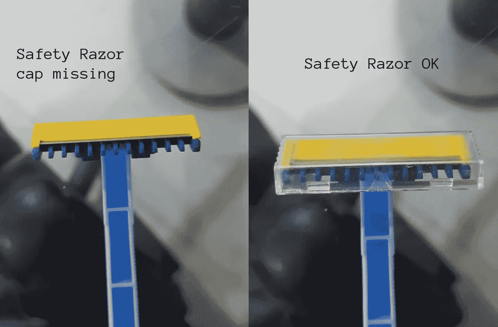
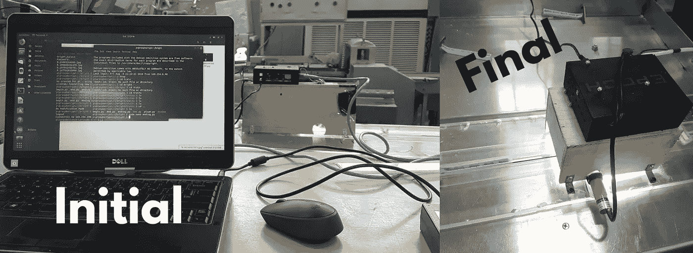

# 适用于初学者的实用计算机视觉/机器学习用例

> 原文：<https://medium.com/nerd-for-tech/a-practical-computer-vision-machine-learning-use-case-for-beginners-55f33ddfb10d?source=collection_archive---------10----------------------->

# 问题是

所以，几年前，我在为我们的一个客户面临的一个问题寻找解决方案。给你一个概念，我们的客户大多是制造公司。这家公司生产安全剃须刀，希望在包装和运送给消费者之前，能够区分带盖和不带盖的剃须刀。老实说，我厌倦了整天坐在办公桌前。所以我开始了这个项目(我当时认为我只是从市场上买一些新玩意儿卖给他们🤦‍♂️)事情是这样的。

问题是安全剃刀将在有三个潜在缺陷的传送带上运行，如果发生，将通过停止机器来消除。条件总是以下之一:

1.安全剃刀丢失

2.安全剃须刀头丢失

3.安全剃刀帽不见了

4.安全剃刀正常

# 基于 ML 的解决方案

我做了研究，并在我有可用的硬件的情况下，采用了一种图像分类方法(基于与一个朋友的一次偶然的讨论，他提到了一些关于分离猫和狗的图片的事情😐).

我阅读了一些论文和文章来熟悉 ML(如果没有开源社区的支持，这是不可能的😊).我现在的目标是使用我自己的图像微调现有的 ML 模型(也称为迁移学习)。捕捉上述每种情况的图像。现在我需要将这些图像输入 ML 模型进行训练。遗憾的是，我的电脑无法应对这一挑战。训练 ML 模型需要高得多的计算能力。我在谷歌上搜索了这句话，然后使用 Amazon EC2 实例在云中训练我的模型。我训练了一个模型，但结果不是很好，所以我放弃了这种方法，坚持在我的系统上训练，通过减少批量大小，这也减少了所需的计算能力😎).模型训练成功。现在的任务是实时捕捉真实的图像。一个传感器被用来定位剃刀，它将信号发送给计算机。计算机程序验证了信号，图像捕获序列开始。简而言之，网络摄像头捕捉到的图像被发送到处理器，并馈入机器学习模型。该程序将输出零件最有可能相似(缺陷或可接受)的百分比。基于该结果，一个信号将操作一个继电器，该继电器将在程序做出有缺陷的结果决定的情况下关闭机器。

所有上述功能的软件部分都是在基于 linux 的操作系统上运行的 python 上处理的

在测试了 100 多个不同的模型后，其中一个模型被实现为每 1000 个剃须刀中大约有 1 个错误分类的准确度。老实说，我对自己很满意，但客户不同意。与合规性有关😒。

# 基于反射率的解决方案

对我来说，这是一个障碍，因为很难追踪错误分类的根本原因，因为模型没有提供清晰的推理来解释为什么选择一个类而不是另一个。我准备放弃了。但是我突然想到一个主意。我正试图想办法在视觉上区分这两个物体(有和没有塑料盖)，这时我想到了塑料的一个非常明显的特征。他们更善于思考。我改变了程序的分析部分来比较图像的亮度值，你猜怎么着，成功了！它具有更好的性能和更低的计算量。经过全面评估后，客户购买了该系统。一个月后，他们又订购了一台😀。下面我添加了产品的前后图片。

对我来说，这个项目的主要收获是在满足需求的同时尽可能保持简单。此外，提供免费学习材料的人也很酷😉