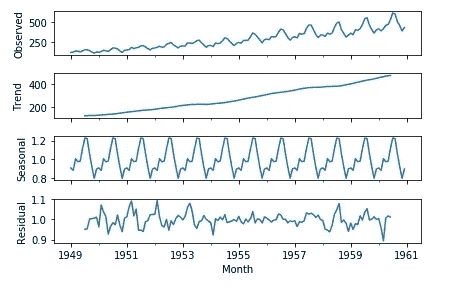
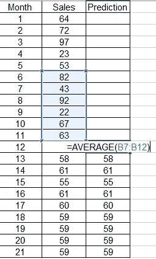
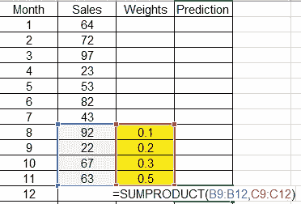

# 时间序列预测入门

> 原文：<https://medium.com/nerd-for-tech/a-primer-to-time-series-forecasting-58bbd91cb3bd?source=collection_archive---------8----------------------->

在 [Unsplash](https://unsplash.com?utm_source=medium&utm_medium=referral) 上由 [Aron 视觉](https://unsplash.com/@aronvisuals?utm_source=medium&utm_medium=referral)拍摄的照片

这篇文章是我的文章[从业务分析师到数据科学家](https://dhirendraddsingh.medium.com/from-a-business-analyst-to-a-data-scientist-4720f536888d)的后续，在这篇文章中，我讨论了在没有任何该领域背景的情况下，成为一名**入门级数据科学家**可以学习的主题和资源。在本文中，我将选择其中一个主题**时间序列预测**并深入探讨它的组成部分。为什么要进行时间序列预测？我申请的大多数公司在面试中都会问 TSF，我目前的工作涉及到大量使用 TSF，当然这很有趣。我写这篇文章的目的不是让你成为时间序列预测专家(没有文章能做到这一点)，而是让你对整个领域有一个大致的了解，这样你就有了一个结构或学习。让我们跳进来吧

> 我看到了未来，它很像现在，只是时间更长。
> 
> Kehlog Albran，*利润*

# **什么是时间序列预测，为什么它很重要？**

首先，什么是时间序列？它只是一组按时间顺序排列的数据点。使用这些点，我们试图预测未来点的值，假设未来趋势与历史趋势相同，简单地说就是 TSF。这有助于我们对未来事件有所了解和确定，以便我们更好地做好准备，一个很好的例子是印度的数学家试图预测什么时候病例会达到高峰，以便医疗保健系统能够更好地配备所有的供应品等。

# **时间序列的基本成分**

1.  级别-它是系列的平均值
2.  趋势-系列中数值的增加或减少
3.  季节性-在一段时间内重复的趋势。例句:每个圣诞节特定商品的销售开始回升
4.  噪声或残差——模型无法定义的时间序列中无法解释的成分

所有这些部分结合在一起，构成了一个时间序列，并形成了预测该序列的任何方法的基本结构。让我们考虑一个时间序列，它代表了从 1949 年到 1961 年每个月的飞行次数，这些是组成部分的样子

图片取自[此处](https://www.udemy.com/course/python-for-time-series-data-analysis/learn/lecture/13773042#overview)

# **时间序列预测的统计方法**

1.  朴素方法 TSF 中最简单的方法，逻辑是时间序列中的下一个点与最后一个观察点相同

2.简单平均值——我们都知道什么是简单平均值，这种方法的前提是下一个值是所有先前值的简单平均值

3.移动平均线——这是之前方法的更新版本。不是取所有以前的值，而是决定一个滑动窗口(假设 n)，下一个值是所有以前的 n 个值的平均值，当然这假定只有最近的值是重要的，不像以前的方法

这里我们有一个 n= 6 的镜头，一直拖着

4.加权移动平均-这是以前方法的更新版本，其中你在滑动窗口下给不同的值分配不同的权重。逻辑呢？假设您必须预测下个月的销售额，并且您有 365 个上一年的值(每天 1 个)，那么您不希望将上个月 12 月的销售额与开始月份 1 月的销售额相比，赋予更多的权重吗

5.单一指数平滑-像以前一样，这是加权移动平均的更新版本，只是我们现在取系列中的所有值。但是我们如何给所有值分配权重，我们将使用α和 1α。这里α或α称为平滑因子。基本上，下一个值是前两个值的加权平均值

α是做什么的？把它想象成一个衰减因子，α的值越高，方法忘记以前的值就越快。

6.双指数平滑-到目前为止，我们所做的是预测水平，现在我们增加了另一个因素-趋势。所以基本上我们是在水平和趋势上应用指数平滑。

7.[三重指数平滑法，又称霍尔特-温特斯法](https://grisha.org/blog/2016/02/17/triple-exponential-smoothing-forecasting-part-iii/) -现在我们再增加一个级别和最后一个组成部分，季节性。想法是对时间序列的所有三个组成部分进行平滑处理

# 通用时间序列预测模型

1.  自回归或 AR——与所有之前讨论的方法一样，该模型的前提是时间序列中的下一个值取决于之前的值。我们使用以前的值建立线性回归方程，然后拟合新值来进行预测。
2.  移动平均线或 MA-不要把它和前面讨论的移动平均线混淆。因此，与使用过去值的自回归模型不同，MA 模型使用过去的误差进行预测
3.  ARIMA——你可能已经猜到了，ARIMA 是前两种模型的混合体，代表自回归综合移动平均线。该方法使用时间序列的过去值和过去误差来预测未来值。ARIMA 模型总是被表示为 ARIMA(p，d，q)。这里 p 代表 AR 项的数量，q 代表 MA 项的数量，d 代表差分。什么是差异？它是将一个时间序列转换成另一个时间序列，其中每个值是前两个值的差。这样做是为了使时间序列平稳。什么是平稳性？当一个时间序列的统计成分如均值、方差等为平稳时，称之为平稳。在一段时间内保持不变。
4.  SARIMA-代表季节性自回归综合移动平均线，SARIMA 是 ARIMA 的扩展，支持季节性因素的时间序列预测。
5.  SARIMAX-这里 X 代表外源因子。什么是外生因素？我们之前讨论的所有模型都用于单变量时间序列预测，这意味着您的时间序列只有一个变量，即时间序列本身。但是，如果我们试图预测下个月的销售额，并且我们想加入额外的变量，如地理位置、营销预算等，该怎么办呢？，这些是独立的外生变量，我们使用 SARIMAX 来合并它们
6.  VARMAX——如果我们使用的变量依赖于时间序列，假设您试图使用需求来预测供应，但我们也知道两者相互依赖，因此我们将使用 var max

# **更多资源和文章**

时间序列的大部分链接你可以在这里找到在我之前的文章中，额外的链接在下面提到

1.  [https://grisha . org/blog/2016/02/16/三重指数平滑-预测-第二部分/](https://grisha.org/blog/2016/02/16/triple-exponential-smoothing-forecasting-part-ii/)
2.  [https://www . machine learning plus . com/time-series/ARIMA-model-time-series-forecasting-python/](https://www.machinelearningplus.com/time-series/arima-model-time-series-forecasting-python/)
3.  [https://www.kaggle.com/raenish/cheatsheet-date-helpers](https://www.kaggle.com/raenish/cheatsheet-date-helpers)

# 摘要

我故意不涉及任何使用神经网络或深度学习进行预测的模型，如 LSTM 等。因为两个原因

1-它们超出了本文的范围

2-没有坚实的基础，跳到复杂的算法是没有意义的

这里提到的所有主题都足以让你对时间序列预测有一个坚实的理解，如果你一个一个地探索每个主题，你就能够并且将会处理任何预测问题。如果你想让我在下一篇文章中强调什么，请在评论中告诉我，也请随时通过 [LinkedIn](https://www.linkedin.com/in/dhirendra-singh-0908/) 联系我。如果你还有任何问题，我会尽力回复。