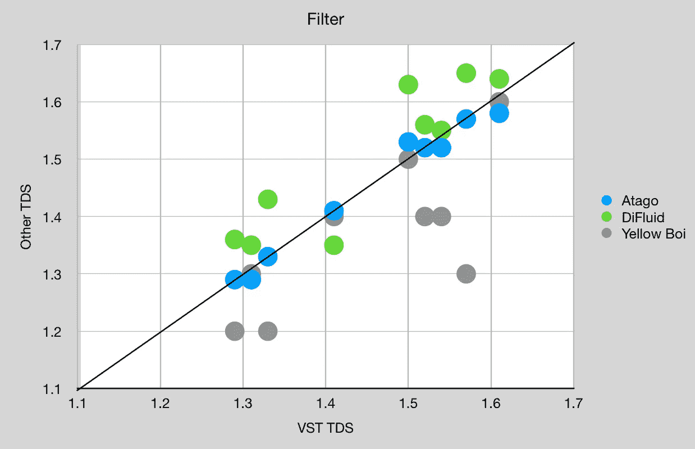
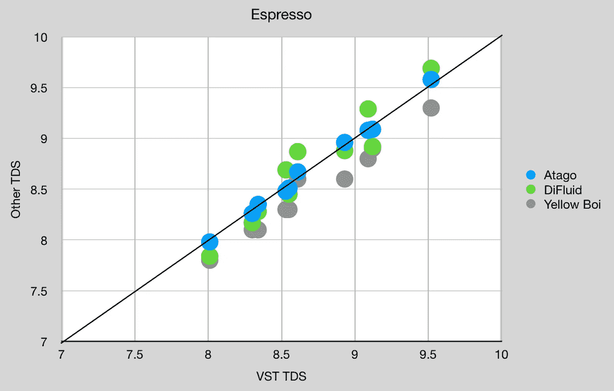
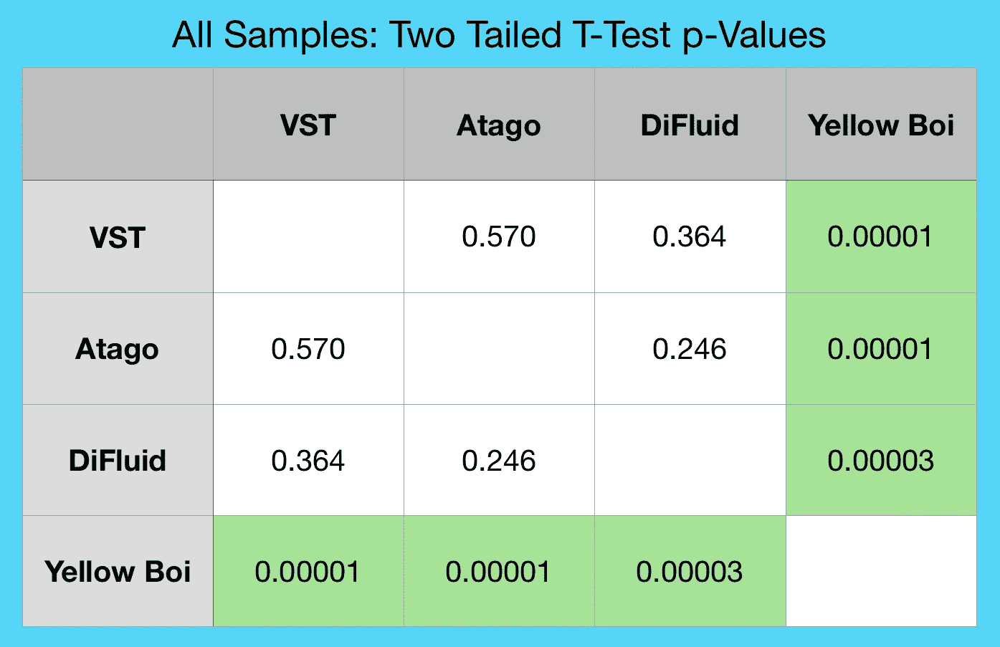

# 对 Lance Hedrick 关于折光仪终极指南的视频的回应

> 原文：<https://medium.com/nerd-for-tech/a-response-to-lance-hedricks-video-on-the-ultimate-guide-to-refractometry-55a793da8488?source=collection_archive---------1----------------------->

## 咖啡数据科学

## 相同数据的不同视图

Lance Hedrick 发布了一个视频[来解释折光仪，然后将四台折光仪相互比较。他用过滤咖啡和浓缩咖啡对它们进行了比较，并在网上公布了数据。他查看了 4 台折光仪:VST、阿塔戈、迪弗卢伊德和黄博伊。我对数据很好奇，我发现他的数据支持了一个与他相反的结论。](https://youtu.be/yF2fIaQS70k)

他制作了多种啤酒，并使用每种折光率仪进行采样。他发现黄色 Boi 是不准确的，假设 VST 是最准确的。他还发现钻井液不准确。此外，他还担心如果采集多个样本时噪音太大，结果会发生变化。

在使用二流体时，他用了两三滴咖啡，他发现如果重复测量，样品的 TDS 会增加。他假设水分蒸发可以忽略不计，但他没有深入了解发生了什么。

# 数据

我[之前使用数据审查了 DiFluid](https://rmckeon.medium.com/difluid-vs-atago-for-total-dissolved-solids-tds-in-espresso-d474614ad66f) ，我发现对于浓缩咖啡，如果样品被冷却，它具有与 Atago 相似的分布。我还提供了一些数据来说明 TDS 的变化是由与温度相关的校准变量引起的。

另一方面，Lance 发现钻井液与 VST 不匹配。他展示结果的主要方式是用方框图。我喜欢方框图，但根据我的经验，对于小数据集，绘制数据越简单越好，尤其是成对数据。

所以我把同样的数据放入散点图。对于过滤咖啡，阿塔哥和 VST 几乎匹配，这与之前由[苏格拉底咖啡](https://towardsdatascience.com/espresso-measurement-solubility-b1f53b91c2b9)的研究相吻合。然而，DiFluid 产生较高的结果，而黄色 Boi 产生较低的结果。二流体似乎有轻微的趋势(R 为 0.81)，但样本太少，无法确定。我的图只有 9 个数据点，尽管 Lance 取了 10 个数据点，但在他分享的数据中只有 9 个数据点。

所有图片均由作者提供，黑线表示样品的读数与 VST 相同。

Espresso 展示了一幅不同的画面，在 Atago 和 VST，DiFluid 趋势非常强劲。黄色 Boi 有偏移。

# t 检验

为了理解这些分布，我们应该进行统计 t 检验。我们可以运行双尾配对 t 检验来评估两个分布没有统计差异的零假设。p 值小于 0.05 表示两个分布不同。在数据像这样成对出现的情况下，这个测试真的很强大，很有帮助。

我们可以分开来看过滤咖啡和浓缩咖啡，也可以一起看。过滤器本身显示了 DiFluid 和 VST/Atago 之间统计上的不同结果。对于浓缩咖啡来说，这是不正确的，因为 VST、阿塔哥和迪 Fluid 的分布在统计学上没有差异。黄色 Boi 在统计上与所有不同。

绿色表示 p 值< 0.05 which indicates the difference in the distributions is statistically different.

The same holds true for the all results where VST, Atago, and DiFluid don’t have distributions with statistically significant differences from each other.

Lance’s original suggestion was to get an Atago or a VST (if you have more disposable income). However, I think when using DiFluid for espresso works fine, at least based on his data. I suspect more data is needed for filter coffee. I would have preferred a larger data set to better understand the differences, and for filter, I’m sure someone is up to the task.

If you get a DiFluid, I suggest using more than a few drops. I fill the resevoir for consistency, and that helps with any evaporation. I would also suggest:

1.  Cooling the sample.
2.  If possible, cover the cooled sample, but don’t cover a hot sample. Water could condensate on a cool surface, thus raising the TDS results.

If you like, follow me on [Twitter](https://mobile.twitter.com/espressofun?source=post_page---------------------------) 、 [YouTube](https://m.youtube.com/channel/UClgcmAtBMTmVVGANjtntXTw?source=post_page---------------------------) 和 [Instagram](https://www.instagram.com/espressofun/) ，我在这里发布不同机器上的浓缩咖啡照片和浓缩咖啡相关的视频。你也可以在 [LinkedIn](https://www.linkedin.com/in/dr-robert-mckeon-aloe-01581595) 上找到我。也可以关注我在[中](https://towardsdatascience.com/@rmckeon/follow)和[订阅](https://rmckeon.medium.com/subscribe)。

# [我的进一步阅读](https://rmckeon.medium.com/story-collection-splash-page-e15025710347):

[我未来的书](https://www.kickstarter.com/projects/espressofun/engineering-better-espresso-data-driven-coffee)

[我的链接](https://rmckeon.medium.com/my-links-5de9eb69c26b?source=your_stories_page----------------------------------------)

[浓缩咖啡系列文章](https://rmckeon.medium.com/a-collection-of-espresso-articles-de8a3abf9917?postPublishedType=repub)

[工作和学校故事集](https://rmckeon.medium.com/a-collection-of-work-and-school-stories-6b7ca5a58318?source=your_stories_page-------------------------------------)