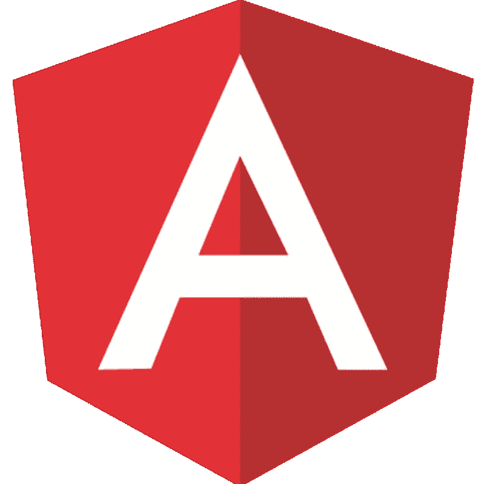

# 智能角度微调器——应用程序和组件级别的范围

> 原文：<https://medium.com/nerd-for-tech/a-smart-angular-spinner-scoping-on-app-as-well-as-component-f9f8dd3e191c?source=collection_archive---------7----------------------->

在 Angular 中创建 spinner 组件在几乎所有的 web 应用程序中都可以完成。第一条经验法则是尽可能避免旋转。有几种聪明的方法可以做到这一点。我将在另一篇文章中讨论这个问题。在这篇文章中，我们将创建相同的老 spinner 的角度，但它的袖子上有一个小技巧。

在我与不同跨国公司的前端开发经验中，我见过 spinner 以几种不同的方式实现。

1.  创建一个单独的**旋转组件**，并在其他组件中需要使用选择器的地方添加选择器。设置`*ngIf`标志以显示和隐藏组件内的微调器。
2.  创建一个全局微调组件，并通过服务不断调用它。通常，它应用于应用程序级别，在加载数据时，整个 UI 都被阻塞。

在我的一个项目中，我遇到了一个应用于应用程序级别的 spinner 组件。每当使用 spinner 服务调用它时，整个 UI 都会被阻塞。这是一个简单的实现。

到目前为止，一切顺利。但是后来，我意识到很少有包含几个小组件来显示数据的屏幕(**例如:**一个仪表板 UI)。因此，应用程序级别的微调器会限制用户交互时间，直到所有组件的全部数据都被加载。这似乎是一个难以管理的问题，因为除非加载全部数据，否则仪表板 UI 将被阻塞。

我决定探索使用一个 Spinner 组件的可能性，它也可以具有应用程序级别和组件级别的范围。我决定重用同一个组件，但是对代码做了一些小小的修改。

我是这样做的:

1.  创造了另一个`div`，里面有造型`position: absolute``spinner.component.html`。我添加了一个模板标签`#componentSpinner`

2.我使用`display:none`将`#componentSpinner`从可见性中移除，因此默认情况下它是不可见的。为了实现这一点，我使用了`AfterViewInit`钩子。一旦我有了`ElementRef`，我就把它保存在`SpinnerService`里面。

3.现在我需要将这个模板添加到我们想要添加范围微调器的目标`Component`中。一旦加载完成，我还需要删除我动态添加的`#componentSpinner`模板。

为了解决这个问题，我创建了:

*   `startLoadingForComponent(component: ElementRef)`
*   `finishLoadingForComponent(component: ElementRef)`

而且，就是这样！

为了在组件内部使用它，我们需要向父 div 添加一个`#template`。这将有助于我们获得整个组件 HTML，并向其中添加我们的小 spinner 代码。

在我们的使用中，我们可以拥有一个带有`DashboardComponent`的应用。**仪表板组件**可以调用几个 API，也可以有几个小组件，比如`OrderCountComponent` & `UserCountComponent`。这些组件可能依赖`DashboardComponent`来获得一些`@Input`数据，或者它们可以独立地在内部进行 API 调用。

我们可以通过将`#userTemplate`添加到其父`div`来使用作用域为`UserCountComponent`的`SpinnerComponent`

并且，使用`ElementRef`在组件级别显示微调器，如下所示:

我增加了一些密集的延迟来模拟缓慢的网络调用。

我知道它可能不适合所有用例，但它扩展了现有`SpinnerComponent`的特性。如果你喜欢这个想法或者想进一步改进，请随时给我留言。对我来说，这是一个有趣而独特的实现。

您可以将 [my github profile](https://github.com/shashankvivek/) 中的最终代码称为 [scoped-spinner](https://github.com/shashankvivek/scoped-spinner) 项目。

> 如果你喜欢你所读的，请👏 👏拍手声👏 👏几次鼓励我🐼写这样的文章。干杯！！