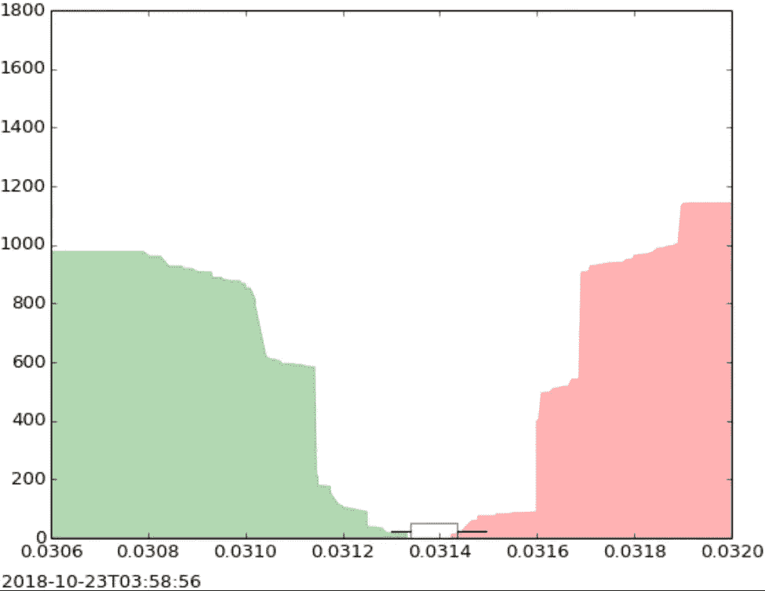
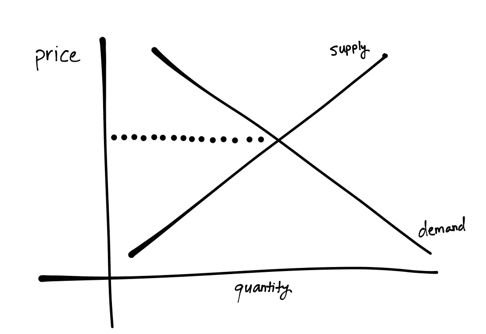
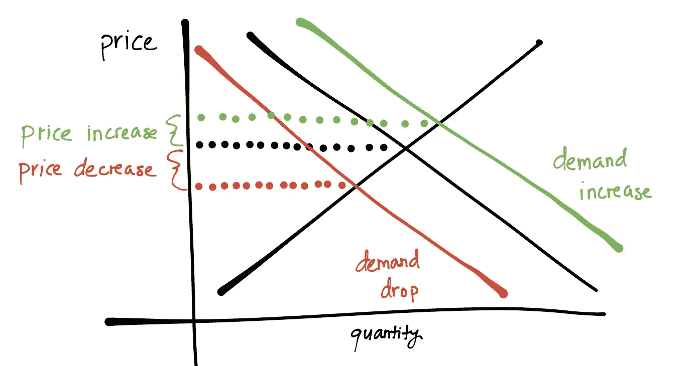
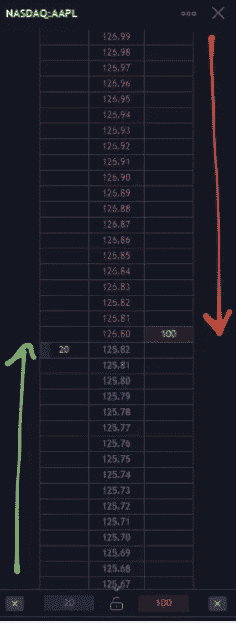
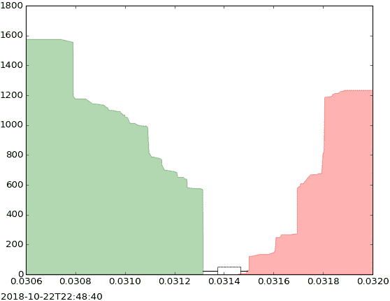
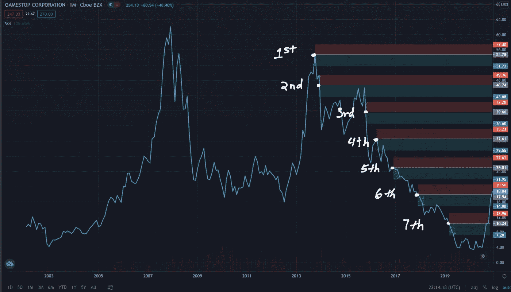
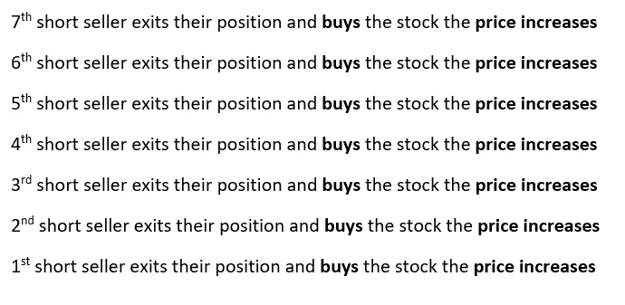
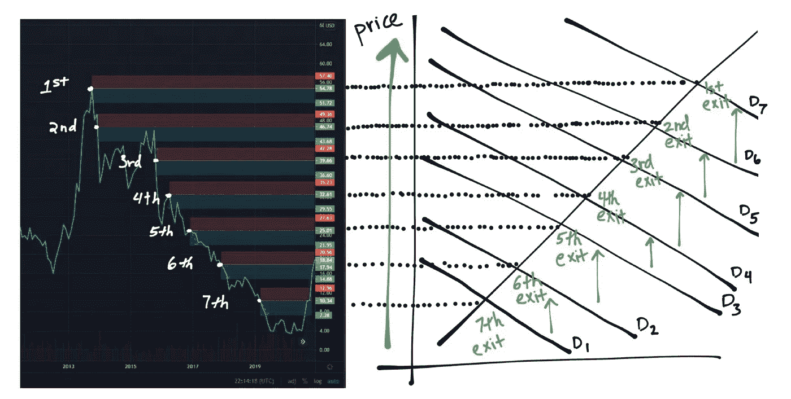
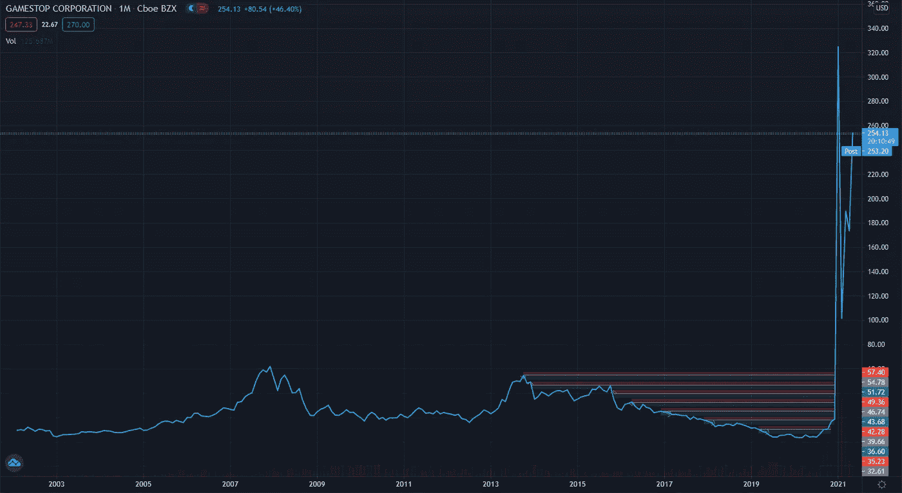

# 短挤压的直观解释

> 原文：<https://medium.com/nerd-for-tech/a-visual-explanation-to-short-squeezes-514222ed95d4?source=collection_archive---------12----------------------->

订单示例(来源: [Kjerish](https://en.wikipedia.org/wiki/User:Kjerish)

2021 年将是充满市场异常的一年，但让市场感到意外的一年是 Gamestop 空头紧缩，这是由从华尔街 Bets subreddit 接受卖空者的反弹推动的。尽管短暂的挤压看似简单，但当你*观察引擎盖下时，它们就有点复杂了。*这份出版物旨在以图表的形式展示短暂挤压是如何发生的，并提供它们发生的机制。

本文还概括了多头、空头、订单分析和价格发现的各个方面。这些现象和位置背后的过程要比本文中介绍的复杂得多，为了解释这个模型，特意对它们进行了简化。本出版物的内容不以任何方式构成投资建议。

**多头和空头背后的机制**

为了理解短挤压，我们必须理解*长*和*短的机制。大多数投资者通常通过做多一只股票来投资。这是指投资者购买股票，然后希望在未来以更高的价格出售。卖空者是指个人想做空一只股票，希望它下跌。但是，他们不是以更高的价格卖出股票来获利，而是想以更低的价格买回股票，如果现在这看起来令人困惑，我们将更多地进入空头头寸。*

卖空者有各种各样的动机，一些卖空者正积极试图搞垮公司(见活动家[卖空者](https://www.hec.edu/en/knowledge/articles/how-activist-short-sellers-police-financial-markets#:~:text=Activist%20short%20sellers%20are%20a,corporate%20frauds%20or%20financial%20misstatements.))，一些卖空者这样做是因为他们认为股票被高估了，还有一些卖空者可能这样做是为了对冲他们的投资组合(见[多头空头](https://www.investopedia.com/terms/l/long-shortequity.asp#:~:text=Long%2Dshort%20equity%20is%20an%20investment%20strategy%20that%20seeks%20to,%2Dvalued%20and%20over%2Dvalued.)策略)。

我们不会深入研究多头和空头，但下面涵盖了相关的材料来理解它们。这里有一个简单的输入多头和空头的过程。

重申这些立场中最重要的部分是

我们可以看到，做多的投资者必须**买入**才能建仓，**卖出，**才能平仓。卖空者必须通过**卖出**才能建仓，通过**买入**才能平仓。(卖空者的专业术语是**卖空、**和**买入回补**)。

**价格发现分析**

为了分析股票的价格，我们将使用价格发现法。我们将从模拟股票价格的标准供求曲线开始。尽管这一解释在理论上行得通，而且这一模型背后的机制也适用于现实生活，但从技术上讲，要知道供需曲线的未来走势是不可能的。要做到这一点，需要了解所有当前和潜在投资者的未来决策，而这些决策很难预测。

在这个简单的表示中，供给保持不变，需求的增加导致更高的价格，需求的减少导致更低的价格。

尽管保持供应恒定**在技术上不准确，**但它提供了更好的视觉解释。一般来说，供给的变化意味着市场上的卖家会变多或变少。

**订单分析**

为了分析股票的变动，我们将检查*订单簿*，它显示了某一价格的订单类型和订单数量。它显示了价格是如何随着买入和卖出而变化的。*出价*是买入股票的指令，而*要价*是卖出股票的指令。在股票交易中，买价和卖价之间通常会有微小的差异(价差)，我们可以看到最高买价(125.82 美元)和最低卖价(126.80 美元)之间的价差。在买卖双方就价格达成一致之前*交易*不会发生(这看起来像价格两边的订单)。因此，在这种情况下，如果你想买股票，你必须满足最低要求，即 126.80 美元。

这是我从 [TradingView](https://www.tradingview.com/) 中找到的一份订单样本。一个活的订单簿将在每一栏中被填充许多出价和要价。如果你能接触到二级市场数据，你可以在你的经纪账户中找到订单信息。我喜欢把秩序册动态想象成相互对抗的力量。例如，如果买方多于卖方，那么绿色向量将大于红色向量，这将推动价格上涨。如果卖方比买方多，那么红色向量会更大，这将推动价格下降。

以下是显示成交量的不同的出价和要价的视觉表示。查看出价(*绿色)*我们可以看到有以较低价格购买股票的偏好。至于问(*红色*)大多数卖家希望以更高的价格出售股票。

来源: [Kjerish](https://en.wikipedia.org/wiki/User:Kjerish)

**Gamestop 示例**

现在让我们进入短挤压背后的机制，在这种情况下，我们将看看最近引起了很大关注的 Gamestop 短挤压。

在本例中，我们将从 7 个空头头寸开始。每个空头头寸来自不同的卖空者。我们可以看到，总的来说，该股在很大程度上呈下降趋势。这符合卖空者的最大利益，他们卖出股票，并希望以更低的价格买回，他们将从差价中获利。我们还可以看到，卖空头寸用绿色的**利润条*表示，低于它们输入的价格。*

**

*现在，我们来谈谈卖空者的头寸可能会如何出现偏差。如果股票价格上涨，这不是卖空者想要的，他们开始亏损，那么他们会想退出他们的位置。记住**退出**空头头寸需要**买回**股票。这就是卖空交易中的缺陷，正是这个小特征创造了卖空交易。假设一个卖空者想退出，他们会回购股票，但也回到我们的价格发现方法，购买股票**会增加需求**，而需求**会增加价格**。*

*这就是挤压发生的地方，每个卖空者退出他们的头寸，推动价格上涨，导致下一个卖空者亏损。*

*交易的时间线应该是这样的。*

**

*从图形上看，价格在左边，供给和需求在右边。我们可以看到，当卖空者回购股票时，他们增加了需求，从而提高了价格。*

**

*我们可以看到，当这一切开始发生时，价格会大幅上涨。*

**

***为什么会发生空头挤压***

*造成空头挤压的主要因素是，寻求退出头寸的卖空者不得不**购买**推动价格上涨的股票，这打击了下一个卖家，以此类推。*

*一些短暂的挤压可能会自然发生，尽管它们很少发生。如果一只股票发布了良好的季度业绩或发布了积极的公告，这种情况就会发生。价格的上涨可能会引发短期紧缩。例如，当著名的激进卖空者安德鲁·莱福特经营的香橼研究(Citron Research)改变了他在特斯拉(Tesla Inc .)的空头头寸时，这就造成了空头挤压。*

*如果卖空者成功压低了股票价格，那么就有可能发生卖空交易。*反向投资者*也就是在投资中采取*反其道而行之*的投资者可能会押注一家股价正在下跌的公司。他们的购买可能会导致空头紧缩，反向投资者通常会试图获得公众支持，从而重振投资者。不断问“*这只股票是被高估还是被低估”的价值投资者*可能看到一只股票因卖空者而下跌，然后说它被低估了，于是买入大量股票，造成卖空。*

*但是最著名的做空研究来自市场操纵。当一个交易者或一群交易者意识到足够大的买单将会推高价格，引发空头挤压时，就会出现这种情况。*

*尽管大众汽车(Volkswagen short squeeze)(2008 年)、AMC (2021 年)、BB (2020 年)、Gamestop (2021 年)、KOSS (2021 年)和其他 *meme 股票*的传闻让人感觉空头挤压已经发生了很多次，但它们实际上并不经常发生。我认为，随着市场的平静，当我们的生活完全恢复正常时(或者无论后疫情时代是什么样的正常)，这类事件将会减少。*