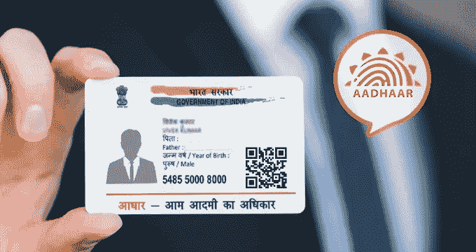

# 使用 Python (OCR)提取 Aadhaar/Pan 信息

> 原文：<https://medium.com/nerd-for-tech/aadhaar-pan-info-extraction-using-python-ocr-5df81b6c66e3?source=collection_archive---------0----------------------->



图片来源-谷歌

# 什么是 Aadhaar

Aadhaar 是一个 12 位的唯一身份号码，可以由印度居民或护照持有人根据他们的生物特征和人口统计数据自愿获得。这些数据由印度唯一身份认证机构(UIDAI)收集，该机构是印度政府于 2009 年 1 月成立的一个法定机构。Aadhaar 是世界上最大的生物识别系统。

Aadhaar 卡由个人的关键信息组成，如姓名、性别、出生日期、明文以及二维码。UIDAI 推出了一种新的安全二维码，其中包含居民的人口统计信息，如姓名、地址、出生日期、性别和隐藏的 Aadhaar 号码，以及 Aadhaar 号码持有者的照片。

# 潘是什么

PAN 代表永久账号。PAN 号是一个由字母和数字组成的十位数字，或“字母数字”术语，由所得税部门分配给所有纳税人，并且对每个人都是唯一的。PAN 号有助于当局跟踪任何个人的金融活动，因为 PAN 是所有支付形式的组成部分。PAN 号通过层压卡分配，称为 PAN 卡。PAN 卡包含 PAN 编号、姓名、出生日期和地址等信息。

> 如你所见，PAN 和 AADHAAR 是印度两种主要的身份识别方式。

# 如何构建 Aadhaar 卡/ PAN 读卡器

有两种方法可以构建自动提取持卡人生物和地理信息的应用程序:

*   使用 OCR 技术来识别印在卡上的字符
*   使用条形码识别技术解码 QR 码，然后将其解析为人类可读的格式

我将逐步介绍第一种方法，即使用 Python 进行 OCR

# 创建 aadhaar_read 和 pan_read 模块

这是至关重要的一步，因为它需要了解文档的设计和模式。这里我们为使用 tesseract 提取的文本定义不同的标签。

> **aadhaar_read.py**

```
import re
def adhaar_read_data(text):
    res=text.split()
    name = None
    dob = None
    adh = None
    sex = None
    nameline = []
    dobline = []
    text0 = []
    text1 = []
    text2 = []
    lines = text.split('\n')
    for lin in lines:
        s = lin.strip()
        s = lin.replace('\n','')
        s = s.rstrip()
        s = s.lstrip()
        text1.append(s)

    if 'female' in text.lower():
        sex = "FEMALE"
    else:
        sex = "MALE"

    text1 = list(filter(None, text1))
    text0 = text1[:]

    try:

        # Cleaning first names
        name = text0[0]
        name = name.rstrip()
        name = name.lstrip()
        name = name.replace("8", "B")
        name = name.replace("0", "D")
        name = name.replace("6", "G")
        name = name.replace("1", "I")
        name = re.sub('[^a-zA-Z] +', ' ', name)

        # Cleaning DOB
        dob = text0[1][-10:]
        dob = dob.rstrip()
        dob = dob.lstrip()
        dob = dob.replace('l', '/')
        dob = dob.replace('L', '/')
        dob = dob.replace('I', '/')
        dob = dob.replace('i', '/')
        dob = dob.replace('|', '/')
        dob = dob.replace('\"', '/1')
        dob = dob.replace(":","")
        dob = dob.replace(" ", "")

        # Cleaning Adhaar number details
        aadhar_number=''
        for word in res:
            if len(word) == 4 and word.isdigit():
                aadhar_number=aadhar_number  + word + ' '
        if len(aadhar_number)>=14:
            print("Aadhar number is :"+ aadhar_number)
        else:
            print("Aadhar number not read")
        adh=aadhar_number except:
        pass

    data = {}
    data['Name'] = name
    data['Date of Birth'] = dob
    data['Adhaar Number'] = adh
    data['Sex'] = sex
    data['ID Type'] = "Adhaar"
    return data def findword(textlist, wordstring):
    lineno = -1
    for wordline in textlist:
        xx = wordline.split( )
        if ([w for w in xx if re.search(wordstring, w)]):
            lineno = textlist.index(wordline)
            textlist = textlist[lineno+1:]
            return textlist
    return textlist
```

> **pan_read.py**

```
 import re
def pan_read_data(text):
    name = None
    fname = None
    dob = None
    pan = None
    nameline = []
    dobline = []
    panline = []
    text0 = []
    text1 = []
    text2 = []
    lines = text.split('\n')
    for lin in lines:
        s = lin.strip()
        s = lin.replace('\n','')
        s = s.rstrip()
        s = s.lstrip()
        text1.append(s)text1 = list(filter(None, text1))
    lineno = 0for wordline in text1:
        xx = wordline.split('\n')
        if ([w for w in xx if re.search('(INCOMETAXDEPARWENT|INCOME|TAX|GOW|GOVT|GOVERNMENT|OVERNMENT|VERNMENT|DEPARTMENT|EPARTMENT|PARTMENT|ARTMENT|INDIA|NDIA)$', w)]):
            text1 = list(text1)
            lineno = text1.index(wordline)
            breaktext0 = text1[lineno+1:]
    try:# Cleaning first names
        name = text0[0]
        name = name.rstrip()
        name = name.lstrip()
        name = name.replace("8", "B")
        name = name.replace("0", "D")
        name = name.replace("6", "G")
        name = name.replace("1", "I")
        name = re.sub('[^a-zA-Z] +', ' ', name)# Cleaning Father's name
        fname = text0[1]
        fname = fname.rstrip()
        fname = fname.lstrip()
        fname = fname.replace("8", "S")
        fname = fname.replace("0", "O")
        fname = fname.replace("6", "G")
        fname = fname.replace("1", "I")
        fname = fname.replace("\"", "A")
        fname = re.sub('[^a-zA-Z] +', ' ', fname)# Cleaning DOB
        dob = text0[2][:10]
        dob = dob.rstrip()
        dob = dob.lstrip()
        dob = dob.replace('l', '/')
        dob = dob.replace('L', '/')
        dob = dob.replace('I', '/')
        dob = dob.replace('i', '/')
        dob = dob.replace('|', '/')
        dob = dob.replace('\"', '/1')
        dob = dob.replace(" ", "")# Cleaning PAN Card details
        text0 = findword(text1, '(Pormanam|Number|umber|Account|ccount|count|Permanent|ermanent|manent|wumm)$')
        panline = text0[0]
        pan = panline.rstrip()
        pan = pan.lstrip()
        pan = pan.replace(" ", "")
        pan = pan.replace("\"", "")
        pan = pan.replace(";", "")
        pan = pan.replace("%", "L")except:
        passdata = {}
    data['Name'] = name
    data['Father Name'] = fname
    data['Date of Birth'] = dob
    data['PAN'] = pan
    data['ID Type'] = "PAN"
    return data def findword(textlist, wordstring):
    lineno = -1
    for wordline in textlist:
        xx = wordline.split( )
        if ([w for w in xx if re.search(wordstring, w)]):
            lineno = textlist.index(wordline)
            textlist = textlist[lineno+1:]
            return textlist
    return textlist
```

# **所需库**

*   **Pytesseract:** 这个库用于使用基于 tesseract 的 OCR 从图像中读取文本。
*   cv2: 这是一个 [OpenCV](https://analyticsindiamag.com/why-is-opencv-gaining-prominence/) 库
*   **ftfy:** 为您修复文本
*   **NumPy:** 数组计算的基础包
*   **os:** 提供与操作系统交互的功能
*   **re:** 用于处理正则表达式。
*   **PIL:** 影像库

```
import json
import pytesseract
import cv2
import numpy as np
import sys
import re
import os
from PIL import Image
import ftfy
import pan_read           
'''module which we made to read the text of the document'''
import aadhaar_read
import io
```

# 1|图像提取

照片提取的预处理包括定义初始变量，将图像转换为灰度以提高可读性，然后定义从图像文件中提取照片的函数。

```
img = cv2.imread("image.jpg")img = cv2.resize(img, None, fx=2, fy=2,interpolation=cv2.INTER_CUBIC)img = cv2.cvtColor(img, cv2.COLOR_BGR2GRAY)var = cv2.Laplacian(img, cv2.CV_64F).var()if var < 50:
    print("Image is Too Blurry....")
    k= input('Press Enter to Exit.')
    exit(1)
```

# **2|使用宇宙魔方提取文本并固定文本**

**Python** - **宇宙魔方**是 **python** 的**光学字符识别** ( **OCR** )工具。也就是说，它将识别并“读取”嵌入图像中的文本。此外，如果用作脚本，**Python**-**tesse ract**将打印识别的文本，而不是将其写入文件。

```
filename = "image.jpg"
text = pytesseract.image_to_string(Image.open(filename), lang = 'eng')

text_output = open('output.txt', 'w', encoding='utf-8')
text_output.write(text)
text_output.close()

file = open('output.txt', 'r', encoding='utf-8')
text = file.read()

text = ftfy.fix_text(text)
text = ftfy.fix_encoding(text)
```

# 3|检查 PAN 或 Aadhaar

这是至关重要的一步，需要你对文件/卡片、其设计和模板有一个概念。因为在这里您将区分文档

```
if "income" in text.lower() or "tax" in text.lower() or "department" in text.lower():
    data = pan_read.pan_read_data(text)
elif "male" in text.lower():
    data = aadhaar_read.adhaar_read_data(text)
```

# 4|为 JSON 编写

将输出写入名为 info.json 的 JSON 文件

```
try:
    to_unicode = unicode
except NameError:
    to_unicode = str
with io.open('info.json', 'w', encoding='utf-8') as outfile:
    data = json.dumps(data, indent=4, sort_keys=True, separators=(',', ': '), ensure_ascii=False)
    outfile.write(to_unicode(data))
```

# 5|读取 JSON 数据

读取 info.json 中存储的数据

```
with open('info.json', encoding = 'utf-8') as data:
    data_loaded = json.load(data)
```

# ***6|打印数据***

```
if data_loaded['ID Type'] == 'PAN':
    print("\n---------- PAN Details ----------")
    print("\nPAN Number: ",data_loaded['PAN'])
    print("\nName: ",data_loaded['Name'])
    print("\nFather's Name: ",data_loaded['Father Name'])
    print("\nDate Of Birth: ",data_loaded['Date of Birth'])
    print("\n---------------------------------")
elif data_loaded['ID Type'] == 'ADHAAR':
    print("\n---------- ADHAAR Details ----------")
    print("\nADHAAR Number: ",data_loaded['Adhaar Number'])
    print("\nName: ",data_loaded['Name'])
    print("\nDate Of Birth: ",data_loaded['Date of Birth'])
    print("\nSex: ",data_loaded['Sex'])
    print("\n------------------------------------")
k = input("\n\nPress Enter To EXIT")
exit(0)
```

# 结果

Aadhaar 和 Pan 信息已成功生成，由于 Aadhaar 的模板不通用，因此存在一些小冲突，但您可以根据您的卡或任何其他文档编辑模块。因为最终它只是使用宇宙魔方光学字符识别的文本识别

# **未来方面**

计划使用各种模板和 Aadhaar 卡的设计训练模型，然后它将能够通过使用机器学习来检测 Aadhaar 卡的任何设计。

> 但是，我从哪里得到我的模型的数据呢？啊！好吧，让我们期待最好的结果。