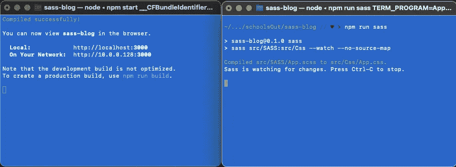

# 2021 年把 Sass 加入你的 React 应用！以下是方法。

> 原文：<https://medium.com/nerd-for-tech/add-sass-to-your-react-app-in-2021-here-is-how-c7260c323a5a?source=collection_archive---------0----------------------->


你好👋🏼我叫奥斯汀。我是一个全栈开发人员，我喜欢在我的 React 应用程序中添加 Sass。

与普通 CSS 相比，使用 Sass 有很多好处。在这个系列中，我将向你介绍所有的方法，语法上很棒的样式表，也就是“Sass”更好。

但是首先，在这篇文章中，我们将在你的 React 应用中设置 Sass。

如果你正在阅读这篇文章，我假设你正在使用 create-react-app，你已经安装了 node，你使用 npm 或 yarn，并且你对你的 package.json / installing 依赖项有一个基本的了解。

让我们制作一个全新的 React 应用程序，名为 sass-blog。(如果您要向现有的 React 应用程序添加 Sass，请跳过这一步！)

```
npx create-react-app sass-blog
```

接下来让我们安装 sass 并保存到我们的 devDependencies 中。

```
npm install --save-dev sass
```

这将安装最新版本的 Sass ( Dart Sass ),并为我们提供对可执行文件和库的访问。现在，我们将在 devDependencies 下的 package.json 文件中看到“sass”版本“^1.32.8”。

接下来我们应该做一些文件夹来保持有序。在 src 文件夹中，添加一个 Sass 文件夹和一个 Css 文件夹。在我们的 Sass 文件夹中，添加一个 App.scss 文件。这是我们将导入所有其他产品的地方。scss 文件。

App.js 中的下一步，导入。/Sass/App.scss '代替'。/App.css。


几乎全部成立！让我们看一下 package.json 文件，我们将在其中添加一个脚本，告诉我们的应用程序将 Sass 文件夹编译到 Css 文件夹中。

将以下脚本添加到 package.json 的“scripts”下

```
"sass" : "sass src/Sass:src/Css --watch --no-source-map"
```

这将允许我们运行命令“npm run sass”。它将“监视”我们所有的 Sass 文件的变化，并将它们实时编译到我们的 Css 文件夹中！“无源映射”标志使我们无法生成显示文件如何映射在一起的文件(不那么混乱)。

最后打开你的终端。您将需要两个选项卡，一个运行“npm 开始”,另一个运行“npm 运行 sass”。



恭喜你，你已经拥有了 Sass 设置的能力，你已经准备好设计你的 React 应用了！

我希望这有所帮助。如果你有更好的方法来做我们刚刚做的事情，请在下面的评论中告诉我。在接下来的系列中，我们将会看到 Sass 的不同特性，以及是什么让它如此棒！祝您愉快，编码愉快！