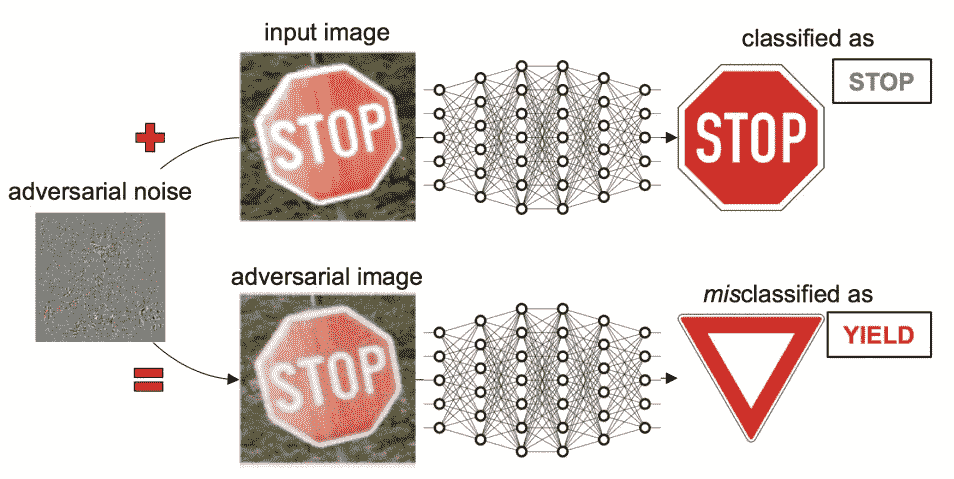
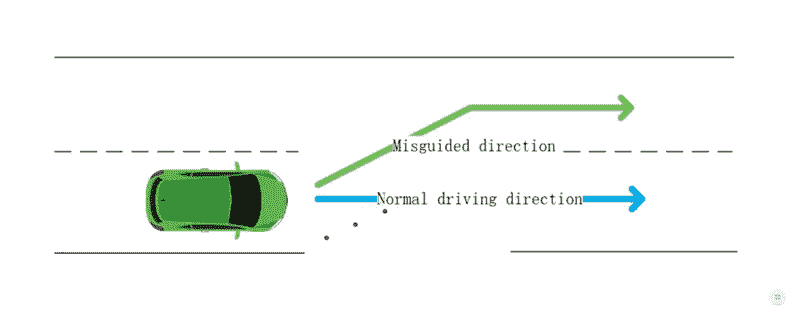

# 对抗性机器学习

> 原文：<https://medium.com/nerd-for-tech/adversarial-machine-learning-2a3b96134b42?source=collection_archive---------33----------------------->

来源:媒体

主要问题源于这样一个本质，即机器学习算法主要不是为了对付雄辩和动态的对手而开发的，因此，在概念上，通过精心篡改原始数据来利用掌握算法的相关安全问题，可以突破整个安全级别。

在这里，对抗性学习可以进入画面！！

A **分布式学习**是一个新颖的研究领域，主要在于机器学习和网络安全的**融合。它专注于允许在不利环境下安全实施机器学习方法，如垃圾邮件过滤数据保护和生物识别。**

## 什么是对抗性机器学习？

对抗性机器学习是机器学习中使用的一种方法，用于欺骗或混淆欺骗性输入模型。虽然对抗性机器学习可以在许多实施中使用**，但这种方法最广泛地用于在机器学习框架中执行入侵或触发故障。攻击的同一个方面将很容易被定制为在各种数据库或框架的几个版本上操作。**

**应使用对抗性机器学习，而不是白盒或黑盒攻击。**在白盒攻击中，入侵者了解正在使用的模型的内部，而在黑盒攻击中，黑客只识别原型的结果。

## **对抗性机器学习攻击的类型:**

对抗性机器学习攻击可以分为**曲解输入或数据污染**。错误分类的输入是攻击者在机器学习算法管道中隐藏恶意材料的最常见类型。这种策略的目的是让设备误识别特定的数据集。**部署设备后，可利用后门特洛伊木马攻击来实现此目的。**

数据污染是指攻击者试图通过将错误信息放入存储库中来改变机器学习过程，从而降低结果的可靠性。这种入侵形式的目的是削弱机器学习机制，使算法的效用最小化。

资料来源:pluribus-one.it

## 对抗机器学习的预防:

这些策略包括**对抗性训练，防守升华。**

对抗性训练是一种机制，在这种机制中，对抗性事件的表现被添加到范式中，并被归类为具有挑战性。这种方法可以有效地减轻更具对抗性的机器学习攻击的发生，但需要相当程度的小心。

防御性蒸馏通过使一个模型预测先前学习的其他模型的性能，有助于使机器学习方法更加通用。这种技术可用于对未知威胁进行分类。这类似于对生成对抗网络(GANs)的思考，它一起建立了两个计算模型来加速机器学习过程——这是两个神经网络同时使用的概念。

## **对抗性学习的现实案例:**

**2019 年，IBM Research、亚马逊和德克萨斯大学的研究人员生成了对抗性的插图，可以欺骗内容分类器机器学习模型，如垃圾邮件检测和情感检测系统。基于文本的对抗性实例，也称为“释义攻击”，改变一条信息中的特征向量，导致机器学习过程中的误诊失败，同时为特定用户保留一致的上下文。**

来源:Keen 安全实验室

**腾讯敏锐的安全中心展示了他们是如何智胜特斯拉 Model S 进入变速车道，从而让它直接驶入迎面而来的车辆。他们需要做的是在车道上放置三个符号，创造一条线的假象。车辆的自动驾驶功能依赖于图像识别，它感应到这些符号，并感知它们以指示道路正在转向。所以汽车转向了那个方向。**