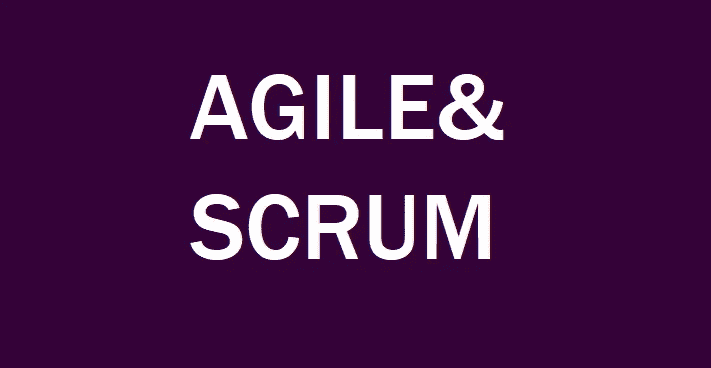
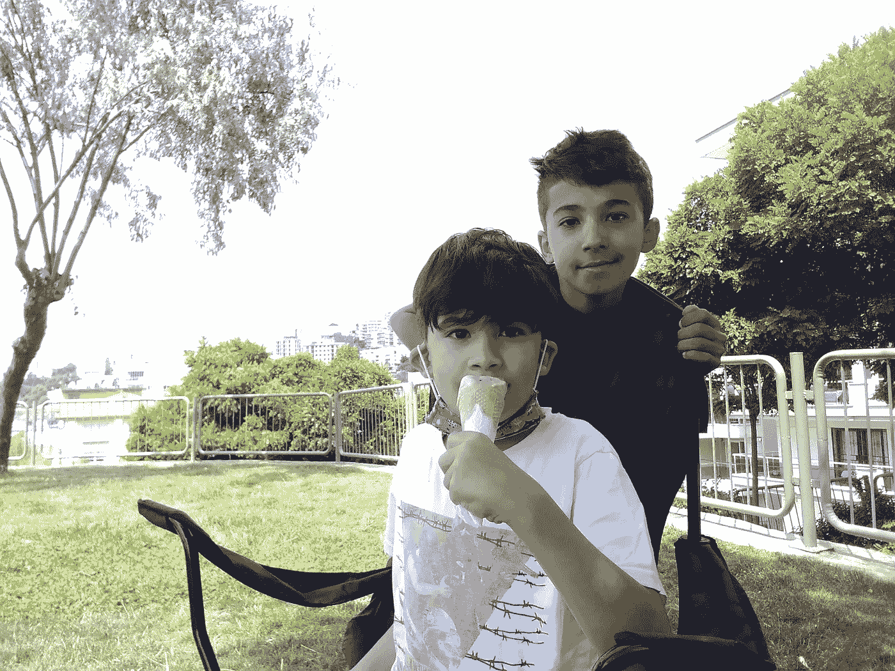

# 敏捷方法和 Scrum 框架/[测试文章系列第 2 部分中的软件开发工程师]

> 原文：<https://medium.com/nerd-for-tech/agile-methodology-and-scrum-framework-software-developer-in-test-article-series-part-2-af5f2dd3e6ac?source=collection_archive---------7----------------------->

警告:由于我的英语不好，文章可能会有语法错误。

**好消息:**无论如何，你会了解我们话题的几乎一切。

这是我的“如何成为一名测试中的软件开发工程师”系列文章的第二篇。所有这些文章都是以问答的形式写的。正如我从我的一些菲律宾朋友那里了解到的，这个方法是苏格拉底为了更好地解释事物而发明的。因此，我希望技术和非技术的家伙将受益于这些文章。

你可以在这里找到第一篇**。强烈推荐在这篇之前先看上一篇。**

**由于我已经做了 11 年多的软件开发人员，我将提供一些真实的和可行的示例代码。这些代码样本源自移动应用程序、桌面应用程序、web 应用程序、web 服务以及各种数据库过程。**

**为了更好地说明问题，我在文章中大量使用了 Q 女士和索比作为例子。**

*****女士 Q:*** 一位女商人，也是索比 app 的客户。她付钱给一家软件开发公司开发索比应用程序。**

*****SorBi:*** 一款用于创建和分享民调的 android 应用。在本系列文章中，以 SorBi 为例。这款应用可在 [**Google Play**](https://play.google.com/store/apps/details?id=com.lespania.sorbi) 上下载，支持英语和土耳其语。**

**让我们开始享受学习敏捷和 Scrum 令人兴奋的东西吧！**

> ****问题**:我一直在期待我们激动人心的话题 man。什么是敏捷和 Scrum？我变得复杂了。**

****回答:**加油哥们。你需要一个与人合作的系统。像在每个社区一样，SDLC 中涉及的员工和阶段也需要一个系统。于是有人聪明的发明了瀑布方法论，并将其应用于制造业。**

> **问:为什么我们要谈论制造业？**

****答:** **瀑布方法论**就像是工厂里的一场革命。随着工业革命，瀑布方法为工厂做出了巨大贡献。它与 SDLC 的步骤相同:(1)需求，(2)设计，(3)实现，(4)测试，(5)部署，(6)维护。**

**因此，其他一些聪明的家伙将瀑布方法应用于 SDLC 过程**，因为它是**。过了一段时间，瀑布方法开始给客户、供应商和开发团队带来同样的问题。**

> ****问:**没有人高兴，哈！为什么？**

****答:**因为 SDLC 流程不同于直线组装汽车。SDLC 有自己的特点。如果您对 SDLC 实施瀑布方法，您将浪费大量时间用于文档编制。每个阶段都是相互严格绑定的。像棉花堡石灰华，水在低水平池不能回到高水平池。正如瀑布方法一样。你没有机会重新安排人员。**

****

**棉花堡石灰华**

**过了一段时间，客户会失去耐心。商业团队做了大量的文书工作。主要概念很容易忘记。在相当晚的时间之后，开发团队最终发布了一个应用程序版本。但客户对整个过程和应用程序本身感到愤怒。因为他们第一次看到自己的 app 为**，可惜，这一次是整个漫长过程**的**终点。****

> ****问:**天啊！你在开玩笑吗？**

****答:**绝对不行。**

> ****问:**摊贩们最后开心吗？**

**答:绝对不行，上一份工作的供应商除外！设身处地为他想想。**

> ****问:**作为一个供应商，如果我的应用程序过时了或者不能满足客户的需求，我该怎么高兴呢？我在管理一个工人。我的公司必须是 IT 行业中受人尊敬的公司。你猜怎么着如果我是 Lady-Q，我会更早地查看我的应用程序，根据我的需求进行测试或评估。可怜的女士-Q。她因为瀑布的事情损失了很多钱吗？**

****答:**由于 SDLC 中的瀑布方法，许多利益相关者损失了数十亿美元。但是不要忘记“瀑布方法仍然很容易适用于小项目，并且它也是受益者”。不要担心 Lady-Q。她的应用程序现在才刚刚开始。好消息是，她的供应商使用敏捷方法的实现 Scrum 框架。**

> ****问:**‘实施’是什么意思？你总是说‘实现这个…，实现那个…’等等。**

****答:** **实现**就是让一个系统/框架/蓝图/模板适应你的需求。例如，你有一个总体规划，解释如何建立一个可移动的房子。您遵循总体规划的原则，同时以灵活的方式应用您的需求。这种总体规划有灵活的部分，因为它们有基本的部分(框架)。所以你用这种方法实现了总体规划。我们也将在测试和编码阶段使用“实现”这个词。**

> ****问:**很好。顺便问一下，这些敏捷和 Scrum 是什么东西？我希望敏捷比瀑布更灵活，相对于客户而言。**

****答:** **敏捷**就像你描述的那样。这是一种心态。敏捷方法价值观**

*   **个人和互动*超过*流程和工具，**
*   **工作软件*超过*综合文档，**
*   **协作*超过*合同谈判，**
*   **严格按照计划响应*到*的变化。**

> ****问:**多迷人啊！不是吗？**

****答:**Scrum 框架**本身也是如此。Scrum 允许我们专注于在最短的时间内交付最高的商业价值。除了 SDLC 过程，还有一个 Scrum 团队。****

**Scrum 团队中有一个**产品负责人** (PO)。PO 主要定义产品的特性，优先化特性，决定发布日期和内容，接受或拒绝工作结果(在 Sprint 结束时)。Scrum 团队中可能有也可能没有 BA。但是如果你的团队中有一个 BA，他很可能会充当 PO 的助手，帮助他。PO 和 BA 组成了 Scrum 团队的业务人员。一般都不是技术人员。阿宝永远是整个团队的老大，比巴高一级。**

**在 Scrum 团队中，我们有一个 Scrum 大师。SM 主要负责制定 Scrum 价值观和实践，以及消除障碍。**

**Scrum 团队的第三个成员是**开发团队**，它由软件开发人员和手工/自动化软件测试人员组成。他们通过编码和测试来开发应用程序。**

> **问:Scrum 团队是如何处理这个 SDLC 过程的？**

****答:**首先，产品负责人从客户那里收集**需求**,(如果存在的话)利益相关者、领域专家、最终用户。PO 也可以检查市场上类似的应用程序。最终，产品所有者基于满足 SMART(在上一篇文章中解释过)标准的有效请求准备软件需求规范(SRS)文档。一个示例需求可能类似于“用户应该能够可视化按类别划分的调查问卷的数量”。PO 还负责创建**用户故事**并对它们进行优先级排序。一个简单的用户故事可以是这样的“作为一个 SORBI poll 应用程序的管理员，我希望能够以折线图的形式显示按类别划分的调查问卷的数量，以便进行分析”。所有的用户故事都被命名为**产品积压** ( *Scrum 神器* ***1/3*** )。**

> ****问:**现在有意义了。我认为团队之间必须要有会议和共同的定义来沟通。产品积压是这些定义之一吗？**

****答:**绝对可以。在创建产品 Backlog 之后，Scrum 团队会召开一个会议，叫做**冲刺计划** ( *Scrum 会议* ***1/4*** )。在这次会议中，为第一个春天选择了一些优先的用户故事。Sprints 通常需要 2 到 4 周的时间来开发选定的用户故事。为 Sprint 选择的用户故事被称为**Sprint Backlog**(*Scrum 工件* ***2/3*** )。**

> ****问:**这么好。当基础设施出现问题时，他们会怎么做？另一个例子可能是。一个人可以等待别人的工作完成，但依赖的工作还没有完成。采取什么步骤？**

****答:**所有问题都转给 Scrum Master (SM)。这些障碍物被称为**展示挡块**。SM 的首要职责是为团队服务，消除障碍。为了团队成员之间的良好沟通，Scrum 团队有一个 15 分钟的会议，叫做**每日 Scrum**(*Scrum Meeting****2/4***)，每天早上进行。在日常的 Scrum 会议中，作为团队成员，你只需要回答三个问题；你昨天做了什么？你今天要做什么？ **(3)** 有什么东西挡住你了吗？**

**如果你有具体的问题，可以在会后讨论，以免浪费团队的时间。这类问题称为'**停车场项目**'。**

> ****问:**他们在冲刺的最后会做什么？**

****答:**每一次冲刺都像一个项目。在 Sprint 结束时，创建了一个可发布的产品，并召开了一个 **Sprint 演示(评审)** ( *Scrum 会议* ***3/4*** )会议。**

> ****问:**可发货产品？**

****答:**可发布产品是一个可能的应用程序版本。这意味着，如果产品所有者决定发布产品，它将是应用程序的发布版本。产品所有者也可以决定在之前的 Sprints 之后发布一个新的版本。**

> **问:谁会参加 Sprint 演示会议？它的目的是什么？**

****答:**客户、利益相关者、产品负责人和整个 Scrum 团队都参加了这个会议，并展示了开发的功能/特性的现场演示。所以 Lady-Q 可以通过使用它来检查她的应用程序。这是 Scrum 框架最强大的属性之一。客户可以在整个 SDLC 流程的早期阶段持有他/她的产品。因此他/她可以向产品负责人提供反馈。反馈也是 Scrum 框架最强大的属性。拿着这个产品，Lady-Q 很高兴看到她的钱去了哪里。她也很高兴成为开发过程的一部分，提供反馈，并欢迎新的需求。**

> ****问:**那么，在完成冲刺后，新的一个正在途中，对吗？**

****答:**肯定。但是还有一件事必须在之前的 Sprint 计划会议之前完成。是**冲刺回顾**(*Scrum Meeting****4/4***)会议。在 Sprint 演示会议召开的第二天，Scrum 团队召开 Sprint 回顾会议，评估上一次 Sprint 的优缺点，以提高他们的生产力。**

> ****问:**他们如何理解一个冲刺目标是否实现？**

****答:**在冲刺计划会议上，他们定义了“**完成**的定义”。它是一个检查表的定义，用来确定冲刺是否结束；像“单元测试通过”、“代码审查”等等。**

> **问:好的。他们如何在冲刺阶段遵循他们的项目范围？**

****答:**Scrum 团队创建了一个名为**Burn-Down Chart**(*Scrum 工件* ***3/3*** )的图表来监控项目范围的蔓延，按计划运行团队，并将计划的工作与团队进展进行比较。这个图表是一个简单的线性图表，显示了实际工作和估计工作的比较。**

> **问:在一天结束时，他们一定很高兴，因为他们完成了冲刺。**

**A: 看看他们多开心:**

****

**Sprint 演示后的 Scrum Master 和产品负责人:)**

**[未完待续……]**

**非常感谢@ratilgan 的巨大贡献。**

**可以在这里 阅读下篇*评测从需求到用户故事* [**。**](https://kicchi.medium.com/evaluation-from-requirement-to-user-story-software-developer-in-test-article-series-part-3-4602ff86959f)**