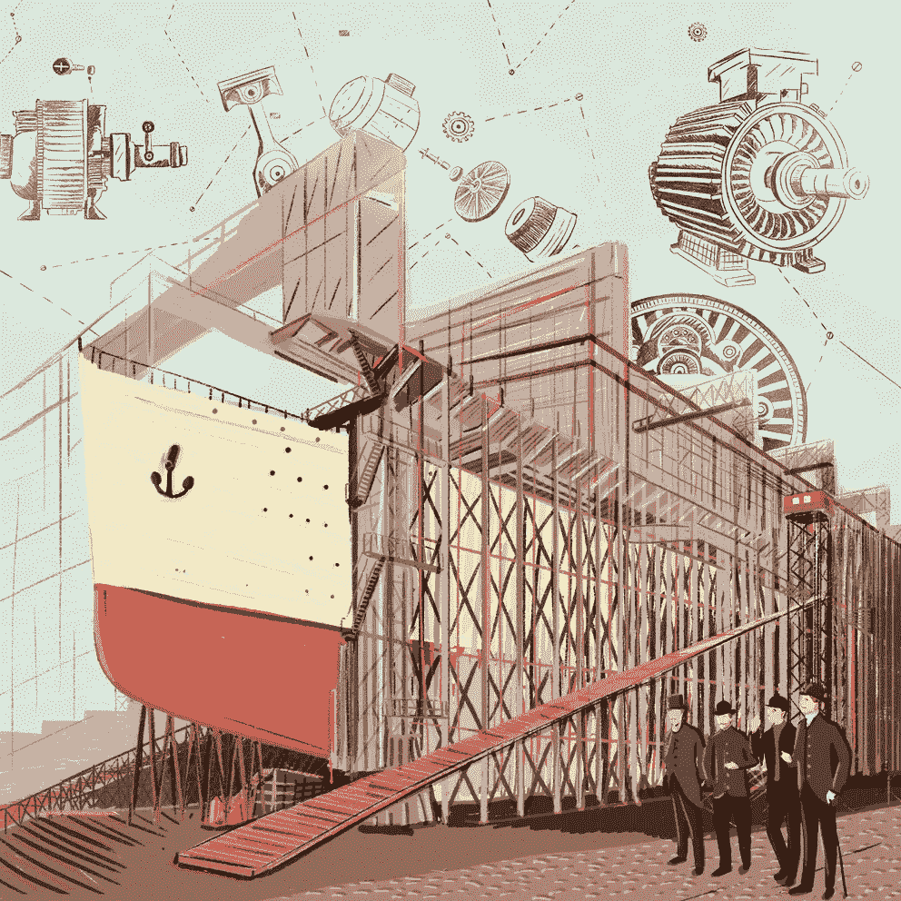

# 人工智能的采用和商业价值:来自 1908 年爱尔兰的教训

> 原文：<https://medium.com/nerd-for-tech/ai-adoption-business-value-a-lesson-from-the-ireland-of-1908-a9d7cb83bd4?source=collection_archive---------19----------------------->

作为 [Rigr AI](https://rigr.ai/) 的[创始人](https://twitter.com/EdwardDixon3)，我相当确信人工智能能够养活我的孩子。所以，你可能会认为我期待人工智能在大约，哦，5 分钟内出现在任何地方。我的实际观点要微妙得多，并受到早期通用技术的采用周期的严重影响。

来感受一下从“抓住了科学的要害！”为了“严肃的商业价值”，让我们来看看更早的技术革命——电动机。

一个来自伦敦的代表团在爱尔兰体验 1908 年的尖端技术

早在 1908 年，爱尔兰并不以计算机或制药而闻名，但它*站在造船业的最前沿:位于贝尔法斯特的哈兰和沃尔夫是世界上最大、最繁忙、最先进的造船厂，准备建造*泰坦尼克号*和她的姐妹船。它还接待了一群游客——一些来自伦敦劳埃德的人和英国《工程》杂志的编辑([创刊于 1865 年](https://en.wikipedia.org/wiki/Engineering_(magazine))，至今仍在继续！).编辑参观了巨大的 Arrol 门架，840 英尺(260 米)长的“造机器的机器”，造船厂安装了这个门架，这样他们就可以建造泰坦尼克号和姐妹号了。*

然而，编辑被一个小得多但非常普遍的创新分散了注意力:电动机在院子里无处不在——甚至像电钻这样的小工具也有自己的电动机！

即使在 1908 年，电动机也不是新东西——19 世纪 40 年代，托马斯·达文波特在佛蒙特州制造了一台可以驱动小型印刷机的电动机。然而，重工业中大规模的商业应用是足够新的，它分散了参观者对他来写的巨型龙门起重机的注意力。利用他对当时技术的百科知识，他认为他可以立即看到用电代替蒸汽在巨大的院子里移动能源的商业价值，他认为这样可以节约成本是正确的:

> 作为电力传输的结果，在某些情况下，电力传输优于约 1000 英尺长的蒸汽管道，煤费是以前总额的一半。

然而，对哈兰德和沃尔夫来说，将煤炭费用减半并不是一个大胜利:

> 但是机器的加速是更重要的经济来源。使用高速工具时，最好能为所有机器中的各种金属规定一个标准速度，电力驱动不仅能使机械师精确地调节转速，还能使速度计检查成为可能。因此，很容易获得 10%的产量增长，这比煤炭产量的减少更有价值。**这是一个不总是被忽视的收获。**

为什么电机花了这么长时间才成为尖端工程业务的重要组成部分？基础设施是问题的一部分——哈兰德和沃尔夫不得不建造自己的发电厂来供应电力，材料是另一个问题:他们不得不雇用“一个男人和一个男孩”来重绕故障电机的线圈(有机化学还没有生产出现代的塑料绝缘体。

工业采用的真正障碍不是材料或基础设施:而是商业价值(“产量增加 10%)非常不明显，以至于*不得不向一个毕生报道工程师及其业务的人解释这一点*。

人工智能是一种构建软件的新方式，具有*非常*不同的优点和缺点。许多最好的工具都是开源的，硬件可以通过云获得——所以与马达相比，基础设施和分发非常容易。然而，虽然马达在概念上非常简单——给它一些动力，它就会旋转，更多的动力=更快——但这对人工智能来说根本不正确。从电动机中获取商业价值需要对哈兰德和沃尔夫的商业问题有深刻的理解*和*蒸汽动力相对于电力的比较优势*和*获得管理层认同的能力。人工智能的采用并不简单，技术层面也不一定是最难的部分。

让人工智能模型工作从未如此简单，但是弄清楚在哪里使用它们却是另一回事。出于这个原因，我认为专注于非常明确的利基市场对我们的业务有巨大的价值。如果电动马达——或者手写软件——有任何指导意义的话，我们在很长很长一段时间内都不会用完利基市场。