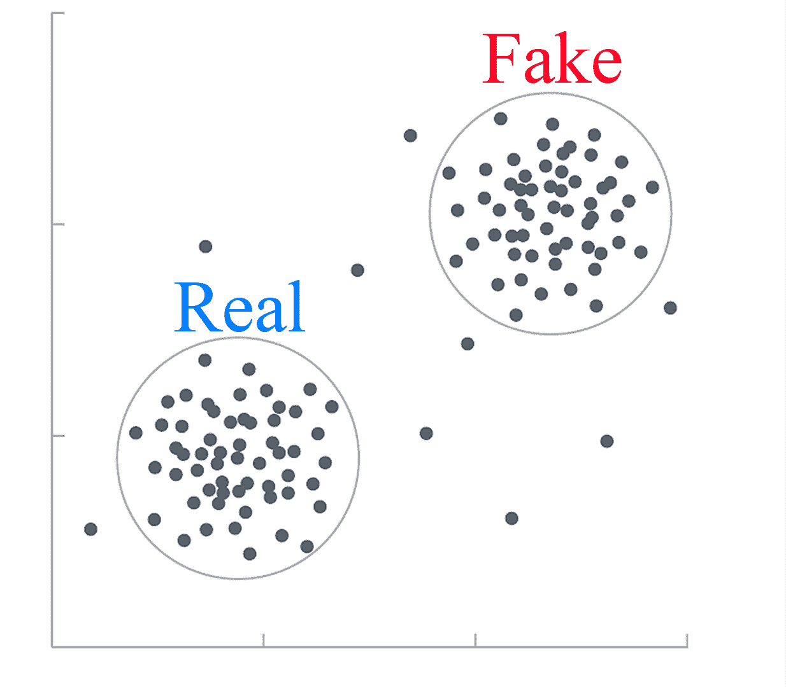
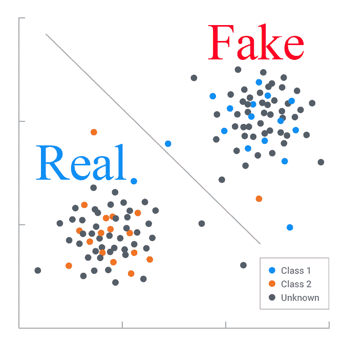

# 人工智能与社交媒体中的假新闻

> 原文：<https://medium.com/nerd-for-tech/ai-and-fake-news-in-social-media-88fedfc11ad?source=collection_archive---------8----------------------->

图片由 Ani Aggarwal 提供

最近，我的任务是为英语课写一篇演讲稿，并被允许选择任何主题；自然，我选择了 AI。更具体地说，我写了人工智能和社交媒体中的假新闻，以及监督与非监督训练的使用。这个演讲是一个类似辩论的形式，我和我的一个搭档会写一个三到五分钟的演讲来支持或反对一个决议。在做了一些研究后，我们被随机分配到支持监督和反对监督的辩论中，并独立撰写我们的演讲稿。我把这些附在这里供你阅读，还有我提供的一些背景，这样那些没有专业知识的人可以更好地理解这个主题。有三个部分，背景，共同监督，然后亲监督。每个部分都会列出作者，每个作者单独的作品被引用的页面会包含在最后。只有文中用到的资料来源才会被收录到引用的作品中，忽略了演讲中没有用到的背景研究。这是一个有点长的阅读，所以得到舒适和享受！非常感谢我的合作伙伴，Dhanin Wongpanich，让我把他的演讲贴在这里。

# 内容

1.  [语境](#122b)
2.  [进行无监督学习](#d503)
3.  [用于监督学习](#9d8c)
4.  [阿尼·阿格瓦尔的作品被引用](#34b1)
5.  [引用谢国民·王帕尼奇的作品](#2b03)

图片来自 [Instagram](https://about.instagram.com/blog/announcements/combatting-misinformation-on-instagram)

# 语境

作者:阿尼·阿格瓦尔

特朗普最近将 Twitter 作为他与美国人民沟通的主要形式，这标志着社交媒体的一个转折点。它变得越来越受欢迎，允许用户以前所未有的速度相互交流。然而，它交换图片、视频和故事的能力使得假新闻和虚假信息在这些平台上泛滥。假信息是虚假信息，其目的是误导或改变公众舆论(韦氏词典)。今天，虚假信息最明显的形式是假新闻，我敢肯定，你们都曾以 Instagram 帖子的形式与它互动过，这些帖子含有可疑的统计数据，如全球变暖否认者或其他现在被标记为“虚假信息”的帖子。不幸的是，“研究表明假新闻的传播速度比真新闻快六倍，持续时间也更长。”为了对抗这种快速传播，社交媒体平台越来越需要节制。然而，Instagram 和 Twitter 等平台如此庞大，以至于人类版主团队无法过滤几乎足够多的虚假信息。这就是这些公司转向人工智能(也称为 AI)的地方。人工智能是一种理念，即机器可以执行人类可以执行的特定任务，只要给予一些指导。有两种类型的人工智能与调节这些平台相关:受监督的和不受监督的人工智能。这是“教授”人工智能的两种不同方式，通常也被称为监督学习和非监督学习。为了更好地理解这些学习技术，考虑以下类比:人工智能系统是一个婴儿，例如，他的任务是识别狗和猫。在一个监督的模型中，你站在婴儿旁边，告诉它，“那边的那个东西是狗，那个是猫”，对数千只不同的猫和狗重复这个过程。通过听到和看到动物的正确名称，婴儿学会了将摇尾巴和狗以及其他各种属性和猫联系起来。另一方面，一个无人监管的模型，不需要你告诉宝宝任何事情，只是给它看各种各样的猫和狗。婴儿会自己学会根据相似的特征将动物分类。这个婴儿不知道什么是狗或猫，因为你从来没有告诉它那些标签。相反，它只会对动物进行分类，就像你小时候可能在不知道它们的专业名称的情况下对你的乐高积木进行分类一样。可以看出，每种技术都略有不同，用于训练它们的数据也不同。监督学习需要人类给动物贴标签，而非监督学习只需要动物自己。这些人工智能类型中的每一种也有独特的偏见。为什么考虑这些偏见很重要？嗯，人工智能已经在很多领域得到应用，而且这个数字还会继续增长。因此，由于偏见而不当使用人工智能的案例将会增加，导致对大量人的毁灭性影响。一个这样的例子是亚马逊的人工智能招聘工具，它过滤掉了申请人，并发现男性比女性更受青睐。幸运的是，这被发现了，亚马逊废弃了它(钢琴)，但在此之前，许多女性因为有偏见的人工智能而失去了她们梦想中的工作或生计。但 AI 的偏见并不仅限于性别歧视:美国法院系统使用的一种算法预测了被告成为累犯的可能性。然而，这种算法被发现错误地指控了两倍于白人罪犯(Shin)的黑人罪犯，阻止了数十人回家，并看到他们的家人仅仅成为他们的肤色。种族主义、性别歧视和普遍偏见的人工智能是一个巨大的问题，每种学习技术都将检查它如何控制偏见以及其他关键因素，以创造公平有效的人工智能。

图片由 [Lawtomated](https://lawtomated.com/supervised-vs-unsupervised-learning-which-is-better/) 提供；由 Ani Aggarwal 编辑

# 用于无监督学习

作者:Dhanin Wongpanich

虚假信息正迅速成为我们在这十年中面临的最大问题之一，在从政治选举到新冠肺炎疫情传播的所有事情中发挥着关键作用。在我们与这个问题的斗争中，人工智能(AI)已经成为一种强大的武器，可以检测虚假信息。目前，研究人员正在寻求依赖于人类注释数据集的监督学习算法。然而，更非传统的无监督学习方法有望吸取人工智能和人类的优势，最终导致更少的偏见，更好的性能和新的见解。

无监督模型的主要优势之一是它们的创建方式。数据是这个过程中最重要的部分之一。在监督学习中，人工智能通过查看人类标注的数据进行学习，这些数据通常由大量文本或新闻文章组成，并附有人类评论。在这个过程之后，人工智能可以学习对它从未见过的数据进行排序。无监督学习向我们展示了一种不同的方法。它不使用人工标注的数据，而是简单地接受原始数据——新闻文章和大段文字——并揭示数据中的自然模式。这有巨大的优势。它避免了昂贵和耗时的人工注释过程，也有助于减少人为错误。人类注释通常会有噪声和不正确的注释，这大大降低了监督学习的有效性和产生的 AI (Soni)。此外，通过放弃注释数据的昂贵过程，无监督数据集可以大得多。这种影响是双重的。专注于人工智能系统(Kahn)隐私和安全的初创公司 Text IQ 的联合创始人 Apoorv Agarwal 表示，更多的数据可以让模型更加一般化，数据集中的每个潜在错误都有较小的影响。或者，生成无监督数据集的较低成本也可以用于另一种方式，即创建更多最新的数据集。由于创建带注释的数据集需要很高的成本和时间投入，大多数带注释的数据集已经存在很多年了，可能无法代表当前的虚假信息。加上试图击败这些自动化系统的不良行为者，这些过时的带注释的数据集几乎不可能准确地代表当前的情况。学习数据和现实世界之间的这种脱节是基于人工智能的系统在实际应用中失败的主要原因之一(天堂)。可以通过多种方式弥合这一差距；然而，最简单和最有效的方法之一是创建一个新的数据集。当可以使用更便宜、更好的无监督数据集时，我们真的应该花费精力创建昂贵的监督数据集吗？

此外，困扰人工智能的最重要的问题之一是系统偏见。虽然很难想象人工智能会关心种族或性别，但人工智能已经被我们的系统偏见所污染。在一个案例中，自我识别的非裔美国人的推文被 Twitter 的自动检测算法标记为冒犯性的可能性是 1.5 倍。康奈尔大学的研究员托马斯·戴维森认为问题出在数据上。他评论说，“你可以拥有最复杂的神经网络模型，但数据是有偏差的，因为人类正在决定什么是仇恨言论，什么不是”(加夫里)。这凸显了基于监督学习的人工智能的内在缺陷，导致历史偏见的根深蒂固，进一步伤害了有色人种和其他边缘化群体。虽然不可能完全消除所有偏见，但无监督学习是朝着正确方向迈出的一步。无监督学习放弃了人类的注释，这意味着人类的偏见不太可能转移到人工智能中。享有盛誉的图灵奖(通常被称为诺贝尔计算奖)的获得者 Yann LeCun 同意这一观点。他评论说，“自我监督系统…比一些从有标签的例子中学习的人工智能软件更不可能有偏见…因为标签通常是由有偏见的人施加的，数据集更小，所以每个有偏见的例子都会产生更大的影响”(Kahn)。尽管如此，无监督模型也不是没有问题。无监督学习仍然受到数据组成偏差的影响，并且由于无监督数据集的巨大规模，审计通常是不切实际的。最终，无人监管的系统仍然会受到人类偏见的影响，但删除人类注释在减少偏见方面迈出了宝贵的一步。

无监督模型的另一个关键优势是它们能够创造自己的直觉。在不依赖人类注释的情况下，无监督模型被迫创建自己的数据排序方式，这种方式通常与人类不同。虽然这最初看起来像是一个缺点，但实际上是有益的，因为当与人类版主结合使用时，他们可以检测出可能被人类忽略的假新闻。这被认为是基于无监督学习的人工智能的共同优势，它经常被用于检测人类看不到的模式和趋势(Soni)。此外，由于无监督学习的成本较低，无监督模型往往更先进，可以引入新的想法，而不需要创建新的昂贵的数据集。在一项研究中，一个无监督的模型能够考虑“文本内容、图像、传播信息和发布新闻的用户信息”，这对于目前存在的有限监督数据集来说是极其困难的。这种更全面的方法提高了准确性，无监督模型发展后出现的新见解可以为人工智能的未来铺平道路。无监督学习快速发展的潜力和从人类引入的偏见中分离出来的能力使其成为战胜虚假信息的有力工具。

当我们考虑无监督学习的好处时，不可否认的是，它有助于减少偏差，并允许我们处理更强大的数据集。这不是我们是否应该转向监督学习的问题，而是什么时候的问题。虽然监督学习可能是今天的人工智能，但无监督学习将是明天的人工智能。

图片由 [Lawtomated](https://lawtomated.com/supervised-vs-unsupervised-learning-which-is-better/) 提供；由 Ani Aggarwal 编辑

# 用于监督学习

作者:阿尼·阿格瓦尔

随着假新闻的急剧增加，社交媒体平台应该继续投资于有监督的人工智能，以打击这种虚假信息，因为它具有可调节的偏见，低资源需求，以及优于无监督人工智能的性能。

在大型平台上使用人工智能进行调节的最大问题之一是它可能引入的偏见。用于训练人工智能模型的数据充满了偏见，这些偏见在算法本身中得到了复制。这方面的一个例子是一项研究，该研究训练了一个模型，将中文维基百科和百度百科上的单词相互关联起来。在这项研究中，在维基百科上训练的模型将“民主”与积极的词如“稳定”联系起来，而在百度百科上训练的同一模型将“民主”与“混乱”联系起来。这一结果可以归因于中国对其互联网的审查和亲共产主义的限制，在百度(骑士)引入了反民主的偏见。正如一位研究人员总结的那样，“重复存在的偏见嵌入在我们选择用来训练(这些)算法的数据中”(Gall)。因此，仔细控制用于创建这些算法的数据对于产生公平的人工智能是必要的。但是这个过程在监督学习和非监督学习之间有什么不同呢？好吧，给定一个特定的数据集，比如 Instagram 帖子的集合，无监督版本只包含帖子，而有监督版本包含帖子和标签。尽管底层帖子本身是相同的，但用于监督学习的数据集必须由人来注释。这可能最初看起来像是监督学习的一个缺点:人类有自己的偏见，这将反映在他们注释的数据中，而无监督数据集不需要人类注释。然而，这些人为偏差实际上已经*存在于两个数据集中*,因为它们是由人类创建的，因此容易受到采样和排除偏差(Gall)的影响。正如 Samuele Lo Piano 在他的关于人工智能伦理原则的同行评议论文中所说，“这些数据[……]不是客观事实[；相反，它们依赖于产生它们的环境。”因此，当无监督模型试图从这些天生有偏见的数据集学习时，它们会复制这种偏见，这是无监督学习的本质。也就是说，无监督的人工智能模型必须推断数据集(Soni)内自然出现的模式，当这些模式有偏差时，算法也会有偏差。另一方面，监督学习可以有更密切的偏差，因为它只学习给定数据和期望输出(Soni)之间的关系，这意味着有偏差的数据集可以被人类注释中的平衡偏差抵消，从而产生整体上更公平的人工智能。

监督学习还开放了各种各样的注释方法，每种方法都有自己的优点，可以增加人工智能模型的公平性。脸书目前正在 Instagram 上使用这样一种方法。脸书目前的人工智能系统使用监督模型，这些模型“从人工注释的例子中”学习，但仍然使用“人类版主[……]来标记有争议或主观的内容”(德马蒂尼)。这使得不够细致的人工智能可以过滤掉明显不受欢迎的内容，同时实时向脸书的人类版主学习。另一种可用于监督学习但不可用于非监督学习的技术是使用社交媒体帖子上的用户交互来创建数据。例如，一个称冠状病毒为骗局的帖子可能会有一些用户评论指出该信息是假的，但也可能有一些用户支持这一阴谋。最近，来自亚利桑那州立大学(Arizona State University)和微软(Microsoft)的八名博士研究人员发表了一篇同行评议论文，他们利用这些帖子和用户的互动来识别假新闻(Shu)。这个模型使用了许多人而不是少数人的意见，减少了偏见，同时也考虑了各种用户的可信度。这建立了基于社区的可靠的人工智能，并且具有低偏差。然而，这仍然留下了成本的问题:监督学习的优势偏差真的值得付出成本吗？

是啊！很明显，公正的人工智能是避免歧视的关键，但资源成本也不再是一个问题！与过去的非监督学习相比，监督学习对人类注释数据的需求*是*资源密集型的。然而，新的研究表明，少量的数据可以创造出令人难以置信的有效监督人工智能(Shu)，从而降低社交媒体公司的资源成本。此外，这些监督模型大大优于最先进的非监督模型(Shu)，在真实世界测试中平均高出 4%的分数(Shu，Gangireddy)。因此，毫不奇怪，像脸书这样的平台使用监督学习，有监督的人工智能(Kertysova)完成了高达 99.5%的删除。

由于监督学习的优越性能、较低的资源成本和公平性，它似乎是未来人工智能算法的明显选择。因此，当你在 Instagram 上滚动浏览你的“建议”订阅时，没有看到反 vaxers 或 QAnon 阴谋，感谢监督学习的辛勤工作。

# 引用的作品

作者:阿尼·阿格瓦尔

“虚假信息的定义。”www.merriam-webster.com/dictionary/disinformation.*、韦氏词典*

*詹卢卡·德马蒂尼。“用户(和他们的偏见)是打击脸书假新闻的关键——人工智能还不够聪明。”对话，2021 年 1 月 29 日，The Conversation . com/users-and-they-bias-is-key to-fight-foot-smart-yet-123767。*

*“社交媒体中的假新闻。”盖尔在线收集，盖尔，2019 年。背景中的大风:link.gale.com/apps/doc/MHTAOB948972284/SUIC?高中 u = los 42754 & sid = SUIC & xid = c 6803676。访问时间是 2021 年 3 月 12 日。*

*加尔，理查德。"机器学习伦理:你需要知道什么，你能做什么." *Packt Hub* ，2019 年 9 月 23 日，Hub . packtpub . com/machine-learning-ethics-what-you-need-to-know-and-what-you-can-do/。*

*南卡罗莱纳州甘吉雷迪、帕德马纳班、东卡罗莱纳州龙和北卡罗莱纳州查克拉博蒂(2020 年)。基于图的方法。在第 31 届 ACM 超文本和社会媒体会议:会议录(第 75-83 页)。计算机械协会。【https://doi.org/10.1145/3372923.3404783 *

*凯特索瓦，卡塔琳娜。“人工智能和虚假信息。”2018 年 12 月 12 日，brill.com/view/journals/shrs/29/1–4/article-p55_55.xml?布里尔尼霍夫语言=en。*

*骑士威尔。“审查制度如何影响人工智能。”*连线*，《连线》2021 年 2 月 4 日[www . Wired . com/story/how-censions-can-influence-artificial-intelligence/](http://www.wired.com/story/how-censorship-can-influence-artificial-intelligence/)。*

*机器学习和人工智能中的伦理原则:来自该领域的案例和可能的前进方向。人类社会科学通讯 7，9 (2020)。https://doi.org/10.1057/s41599-020-0501-9*

*申特伦斯。“辨别人工智能的真实例子。”中，走向数据科学，2020 年 6 月 4 日，走向数据科学. com/real-life-examples-discriminate-artificial-intelligence-CAE 395 a 90070。*

*舒，凯，等。〈利用多源弱社会监督及早发现假新闻〉。2020 年 4 月 3 日，arxiv.org/abs/2004.01732.，ArXiv.org*

*索尼，德文。“监督与非监督学习。”*中*，走向数据科学，2020 年 7 月 21 日，走向数据科学. com/supervised-vs-unsupervised-learning-14 f 68 e 32 ea 8d。*

# *引用的作品*

*作者:Dhanin Wongpanich*

*加法尔，希林。“检测网上仇恨言论的算法对黑人有偏见。”Vox，Vox，2019 年 8 月 15 日，[www . Vox . com/recode/2019/8/15/20806384/social-media-hate-speech-bias-black-African-American-Facebook-Twitter。](http://www.vox.com/recode/2019/8/15/20806384/social-media-hate-speech-bias-black-african-american-facebook-twitter.)*

*天啊，威尔·道格拉斯。“我们训练人工智能的方式从根本上来说是有缺陷的。”麻省理工科技评论，麻省理工科技评论，2020 年 11 月 18 日，[www . Technology Review . com/2020/11/18/1012234/training-machine-learning-broken-real-world-heath-NLP-computer-vision/。](http://www.technologyreview.com/2020/11/18/1012234/training-machine-learning-broken-real-world-heath-nlp-computer-vision/.)*

*卡恩杰里米。"经常被指责为隐藏偏见的人工智能也能帮助发现它吗？"Fortune，Fortune，2021 年 3 月 30 日，Fortune . com/2021/03/30/人类受到隐藏偏见的困扰。*

*卡恩杰里米。“脸书声称通过 Instagram 训练的人工智能实现了计算机视觉的突破。”Fortune，Fortune，2021 年 3 月 4 日，Fortune . com/2021/03/04/Facebook-says-its-new-a-I-that-learning-without-labelled-data-presented-a-big-forward-for Computer-Vision/。*

*基于自动编码器的无监督假新闻检测。2021 年 2 月 11 日，ieeexplore.ieee.org/abstract/document/9352726.*

*索尼，德文。“监督与非监督学习。”中，走向数据科学，2020 年 7 月 21 日，走向数据科学. com/supervised-vs-unsupervised-learning-14f 68 e 32 ea 8d。*