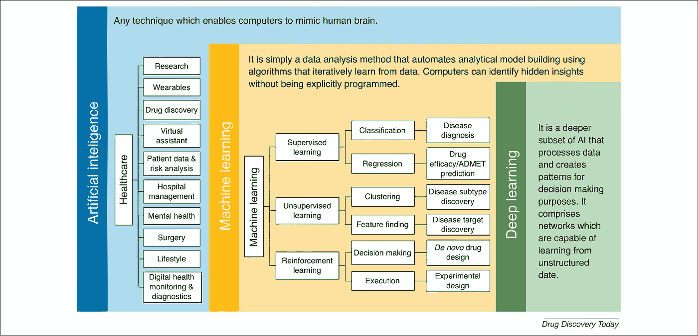
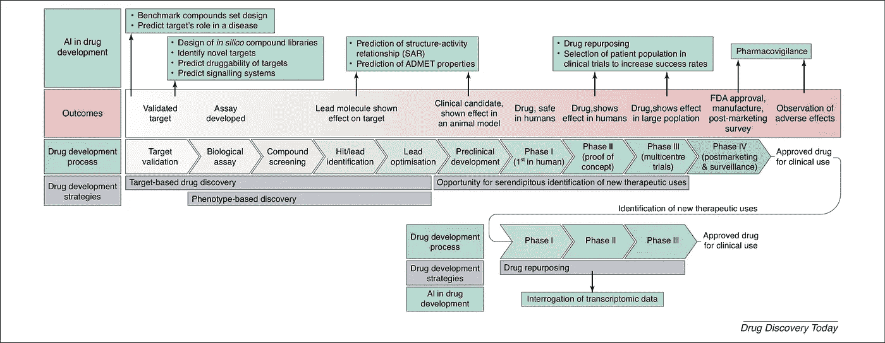
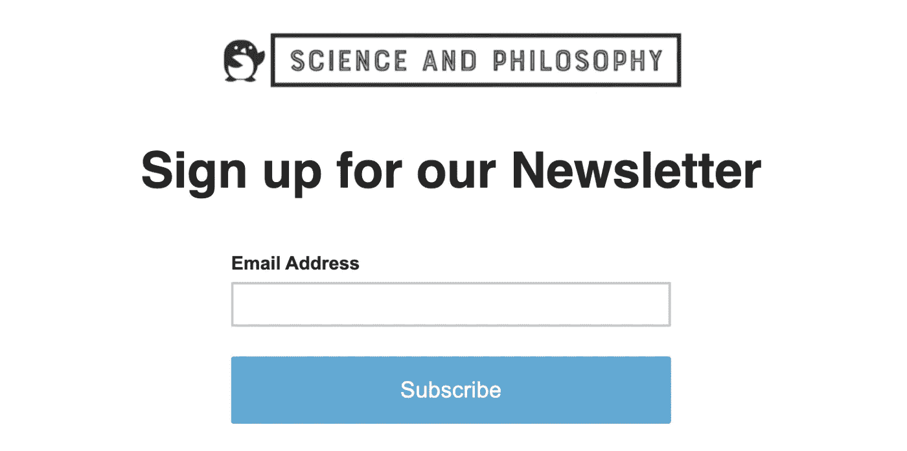

# 人工智能在药物发现中的应用

> 原文：<https://medium.com/nerd-for-tech/ai-in-drug-discovery-14516d3a10e7?source=collection_archive---------14----------------------->

资料来源:联合国人类住区规划署

一个 **人工智能** (AI)使用人格化的知识，并从它产生的解决方案中学习，不仅解决特定的问题，也解决复杂的问题。

目前，由于 R&D 成本增加和效率降低，制药行业在维持其药物开发计划方面面临挑战。

来源:今日药物发现

## 人工智能在药物开发中的应用；

寻找成功的新药是一项艰巨的任务，也是药物开发中最困难的部分。这是由被称为化学空间的巨大尺寸造成的，据估计其数量级为 **10⁶⁰分子**。

融入人工智能的技术已经成为通用工具，可以应用于药物开发的各个阶段，如识别和验证药物靶点、设计新药、改变药物用途、提高研发效率、汇总和分析生物医学信息，以及完善招募患者进行临床试验的决策过程。

**人工智能的这些潜在用途提供了应对传统药物开发方法中出现的低效率和不确定性的机会，同时最大限度地减少了过程中的偏见和人为干预。**

人工智能在药物开发中的其他用途包括**预测药物样分子的可行合成路线、药理学特性、蛋白质特征以及功效、药物组合和药物-靶标关联，以及药物再利用**。

DL 在提出有效的候选药物和准确预测其特性和可能的毒性风险方面取得了突出的成功。克服药物开发中过去的问题——例如分析大型数据集、费力地筛选化合物同时最小化标准误差、需要大量的 R&D 成本和超过**25 亿美元的时间**

**利用人工智能技术，可以进行新的研究，以帮助识别新的药物靶标、合理的药物设计和药物再利用。**

## 下面我们来详细了解一下如何在药物研发中利用 AI。

来源:今日药物发现

药物开发的第一步是识别具有生物活性的新化合物。这种生物活性可由化合物与特定酶或整个生物体的相互作用产生。第一个对给定生物靶标显示活性的化合物被称为“hit”。在筛选化学库、计算机模拟或筛选自然分离的材料(如植物、细菌和真菌)的过程中，经常会发现命中结果。

铅是一种化合物，显示出有希望的潜力，可以导致开发一种新的药物来治疗疾病。在预测疾病状态的基于细胞的试验中和在疾病的动物模型中筛选已鉴定的命中，以表征化合物的功效及其可能的安全性。一旦发现先导化合物，其化学结构被用作化学修饰的起点，目的是发现具有最大治疗益处和最小潜在危害的化合物。

在先导化合物生成的过程中，hit 分子被系统地修饰，以提高其对特定生物靶标的活性和选择性，同时降低毒性和不良反应。来自 hit 的化学相关化合物称为类似物，该过程称为 hit 膨胀。

药物化学家使用成熟的有机化学技术进行 hit 扩展。为了提高合成通量，化学家专注于一个特定的反应或一组反应，将构建模块组装在一起，快速制备一系列类似物。“构件”是一种化合物，其具有反应性官能团和与生物靶标的活性位点相互作用的原子。

该活性位点是生物靶标中的特定区域，化合物(或底物)通过相互作用力与该区域结合。底物与活性位点的结合可以被视为“锁和钥匙”或“诱导配合”模型。

