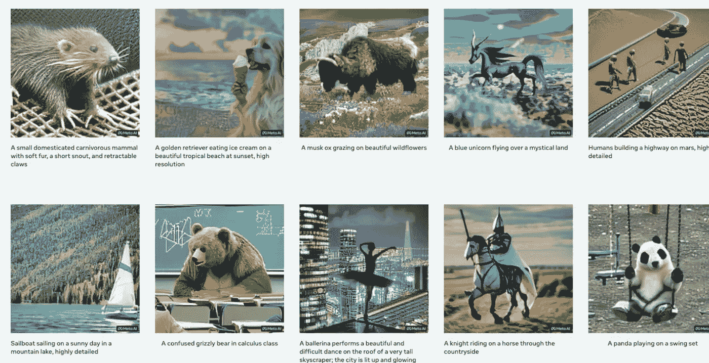

# 人工智能现在可以生成 2 分钟甚至更长的视频！

> 原文：<https://medium.com/nerd-for-tech/ai-now-generates-2min-videos-longer-f81890b8f074?source=collection_archive---------0----------------------->

通过 Meta 制作视频

在我们探索 AI 视频合成的当前更新之前，如果你想观看本文的视频版本，而不是更多的例子，你可以点击下面的链接。

在这篇文章中，我们将讨论几天前才出现的新的人工智能程序！这些模型可以在很长一段时间内生成高质量的视频，甚至持续几分钟！我们以前在这个频道上报道过人工智能视频生成模型，不久之后，我们现在有一些新的和令人兴奋的更新。这就是人工智能社区生产新技术的速度。在这一点上，AI 图像在最近一年左右已经成为一种现象，这已经不是什么秘密了。然而，文本转视频还没有类似的表现。主要缺点是由于高处理成本和高质量文本视频数据集不足。带文字字幕的视频数据只有几百万。另一方面，图像有数十亿个图像-文本对用于图像生成。我们今天讨论的人工智能模型找到了最小化这些挑战并实现最先进结果的方法。来说说他们吧。

Meta 发布了一个人工智能，他们称之为 Make-A-Video，这很好地概括了它的功能。该模型生成的视频只有几个词或几行文本描述，也称为提示。

它使用图像和视频数据来学习创建视频的重要特征。他们的指导原则很简单:从成对的文本-图像数据中，模型学习世界是如何看起来和被描述的，从视频片段中，模型学习世界如何在其中移动和互动。就像人类是如何通过观察学会快速注意到物体、人、位置、行为一样。如果能够模仿我们的学习方式，生成式人工智能系统将更具创造性和实用性。通过这种方式，研究人员避免了缺乏足够的视频数据进行训练的障碍。正因为如此，模型的训练速度更快，生成的视频在美学和精彩的描述方面更具多样性。该模型能够制作运动流畅的精彩视频，适用于各种逼真的视觉概念，并具有可行的摄像机运动。视频只是称为帧的静止图像的集合。一秒钟内生成的帧数越多，过渡就越无缝。该模型具有扩展输出视频中的帧数的能力，或者通过每秒帧数来获得更平滑的视频，或者通过帧扩展来获得更长的视频。Make-A-Video 与以前的模型之间的一个区别因素是视频质量和可以生成的视频范围的巨大改进。在之前的一篇文章中，我们讨论了 CogVideo，它只能生成 4 秒钟的低质量视频。我们还讨论了女娲-Infinity，它可以在特定的用例中制作视频，如 Peppa Pig 视频。本文(或其视频版本)的链接发布在下面。

 [## 新人工智能:文本到视频的下一个级别！超越文本到图像

### 在我们深入研究本文所有有趣的部分之前，如果你想看视频版本，你可以…

medium.com](/geekculture/new-ai-next-level-text-to-video-beyond-text-to-image-511bfd21d5ce) 

想听更多令人兴奋的东西吗？好吧，听听这个:制作视频可以把一个简单的静止图像转换成视频，就像这些例子一样。它知道海洋应该如何运动，以及船将如何在其中航行。如果你想探索相同的想法，但有不同的视觉效果，你也可以制作不同的视频。

为了确保该模型使用起来更安全，研究人员过滤掉了含有 NSFW 图像、文本中的有毒单词或带有水印的图像对。为了确保数据尽可能准确，不完整的单词或抽象的短语(如“气候变化”)会被删除，这些单词或短语不能彻底描述场景。视频中还有更多内容，描述良好的视频有助于理解上下文。

人工智能模型目前有一些局限性，比如识别文本和只能从视频中推断的现象之间的联系。例如，一个人从左到右或从右到左挥手的视频可能很难让 AI 准确地表现出来。研究人员打算解决这些问题，并通过改善讲述更深入故事的场景和事件来扩展这项工作。

另一个令人兴奋的人工智能模型是谷歌开发的 Phenaki。Phenaki 生成的视频可以长达几分钟，远远超过其他模型！正如我们所讨论的，大多数模型最多可以生成几秒钟的视频。这是人们正在谈论的模型中最令人印象深刻的部分，因为它使长格式视频的可能性现在变得可行。迈克尔·斯科特现在可以创造他荒谬的广告创意了。其他视频合成模型具有简短文本提示的限制，这不足以提供视频的全面解释。理想情况下，视频生成模型应该能够生成任意长度的视觉效果。早期的模型通常无法生成依赖于故事风格写作的真实视频，事件一个接一个地发生。然而，Phenaki 能够通过解释随时间变化的文本提示来做到这一点。例如，你的提示可以是一只*泰迪熊的描述，它会游泳并变形为一只熊猫*，它会做到这一点，而且非常顺利。目前的视频生成模型甚至在长时间内产生一致的视觉效果都有问题，所以这值得鼓掌。该模型还通过将视频数据压缩 40%以上并仅学习其中的重要位来处理更高的计算量。它使用一种流行的人工智能模型，称为变压器，这是一种类似的技术，用于其他人工智能生成任务的最新进展。生成的视频可以是任何长度，考虑到模型是在 **8 fps** 的 **1.4 秒**视频上训练的，这一点尤其令人印象深刻。作者指出，Phenaki 是第一种从包含一系列动作的叙事风格提示中生成引人入胜的高质量视频的模型。你可以在 Phenaki 主页上查看完整的 2 分钟视频，我在下面分享了它！文本提示非常具有描述性，生成的视频的整个流程都紧跟提示。你能想象一两年后视频一代会是什么样子吗？我们已经可以用 AI 生成脚本了。结合这项技术，电影、广告和其他形式的视觉媒体将会发生巨大的变化。唯一缺少的部分是与音频生成的合并，你可以相信这也正在进行中。我们将在另一篇文章中讨论当前的音频合成模型。这些模型同样令人印象深刻。

让我知道你对这些新的人工智能视频合成模型的看法。

感谢阅读！

**资源:**

*制作视频*

网址:【https://makeavideo.studio/ 

论文:[https://arxiv.org/pdf/2209.14792.pdf](https://arxiv.org/pdf/2209.14792.pdf)

*芬娜琪*

网址:[https://phenaki.video/index.html](https://phenaki.video/index.html)

论文:[https://openreview.net/pdf?id=vOEXS39nOF](https://openreview.net/pdf?id=vOEXS39nOF)