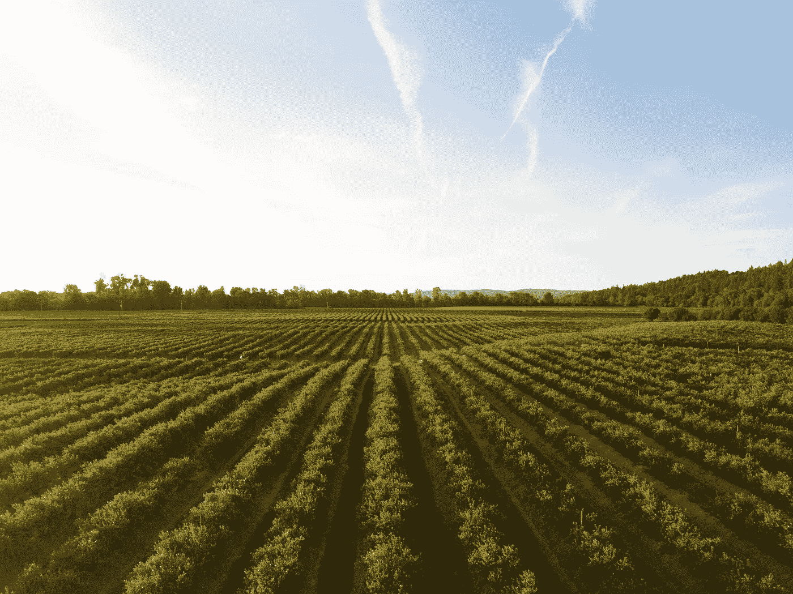

# 人工智能技术助力农业，未来可期——第一部分

> 原文：<https://medium.com/nerd-for-tech/ai-technology-to-help-agriculture-the-future-can-be-expected-part-1-bd598831b090?source=collection_archive---------3----------------------->

## 智能农业正在蓬勃发展

根据 BI Intelligence Research 发布的预测，到 2025 年，全球在互联智能农业技术和系统(包括人工智能和机器学习)上的支出预计将增加两倍，达到 153 亿美元。

根据 Markets & Markets 发布的数据，仅农业领域的人工智能技术和解决方案支出预计将从 2020 年的 10 亿美元增长到 2026 年的 40 亿美元，复合年增长率(CAGR)为 25.5%。

根据普华永道的数据，IOT 农业(IoTAg)监控已经成为互联智能农业中增长最快的技术领域，预计到 2025 年，总市场将增长到 45 亿美元。

## **AI+农业应用的技术难点**

贯穿农业生产的产前、产中、产后各个环节，有着完全不同的应用场景和专业方向。比如上游产前以生物技术为主，面向信息化种植、生物育种、农药、化肥。中游生产以数字农业为主，面向农业大数据、农田监控、农用无人机。而下游的后期则侧重于消费层面、农产品加工、冷链物流等方面的质检。

在长期对 AI +农业的跟踪报道和采访中，业内人士的技术难点不外乎以下两点:

1.收集农业数据很困难。

2.每个农业客户都有不同的场景，需要定制培训。同时，农业客户和 R&D 需要共同定义相应的行业标准。

当然，这只是大多数智能农业应用面临的挑战的概述。在实际的业务推广中，可能会出现急需解决的问题。此前，国内某植物厂在业务推广过程中，遇到了农业人才匮乏、人工检查生产条件效率低下、无法大规模推广应用等问题。

人工智能开发平台优化和升级植物工厂，并进行产品研发，如害虫监测模型和生长影响因素模型，将专家的经验数字化和商业化。

高效准确的机器识别提高了产品质量和产量。次品产量减少，而总产量提高 15%，生产资料(种子、基质、营养液)成本降低 15%。

## 需要更多的标记数据

从人工智能技术的研究方向来看，无论是在传统的机器学习领域还是深度学习领域，基于训练数据的监督学习仍然是一种主要的模型训练方法。尤其是在深度学习领域，需要更多的标记数据来提高模型的有效性。

尤其是智能转型的传统企业和科技企业，更需要有丰富项目经验的培训数据服务商的协助，帮助整理数据标注指令，获取更合适的数据。在特殊场景下使用高质量的数据，减少研发周期，加速实施过程，帮助企业更快更好地进行智能化转型。

## 结束

将你的数据标注任务外包给 [ByteBridge](https://tinyurl.com/mtt9drt9) ，你可以更便宜更快的获得高质量的 ML 训练数据集！

*   无需信用卡的免费试用:您可以快速获得样品结果，检查输出，并直接向我们的项目经理反馈。
*   100%人工验证
*   透明标准定价:[有明确的定价](https://www.bytebridge.io/#/?module=price)(含人工成本)

## 为什么不试一试？

来源:https://www . 163 . com/dy/article/gthk 2 djv 0552 ofb 6 . html